<div class="MCWHeader1">
App modernization
</div>

<div class="MCWHeader2">
Hands-on lab step-by-step
</div>

<div class="MCWHeader3">
February 2018
</div>

Information in this document, including URL and other Internet Web site references, is subject to change without notice. Unless otherwise noted, the example companies, organizations, products, domain names, e-mail addresses, logos, people, places, and events depicted herein are fictitious, and no association with any real company, organization, product, domain name, e-mail address, logo, person, place or event is intended or should be inferred. Complying with all applicable copyright laws is the responsibility of the user. Without limiting the rights under copyright, no part of this document may be reproduced, stored in or introduced into a retrieval system, or transmitted in any form or by any means (electronic, mechanical, photocopying, recording, or otherwise), or for any purpose, without the express written permission of Microsoft Corporation.

Microsoft may have patents, patent applications, trademarks, copyrights, or other intellectual property rights covering subject matter in this document. Except as expressly provided in any written license agreement from Microsoft, the furnishing of this document does not give you any license to these patents, trademarks, copyrights, or other intellectual property.

The names of manufacturers, products, or URLs are provided for informational purposes only and Microsoft makes no representations and warranties, either expressed, implied, or statutory, regarding these manufacturers or the use of the products with any Microsoft technologies. The inclusion of a manufacturer or product does not imply endorsement of Microsoft of the manufacturer or product. Links may be provided to third party sites. Such sites are not under the control of Microsoft and Microsoft is not responsible for the contents of any linked site or any link contained in a linked site, or any changes or updates to such sites. Microsoft is not responsible for webcasting or any other form of transmission received from any linked site. Microsoft is providing these links to you only as a convenience, and the inclusion of any link does not imply endorsement of Microsoft of the site or the products contained therein.
© 2018 Microsoft Corporation. All rights reserved.

Microsoft and the trademarks listed at https://www.microsoft.com/en-us/legal/intellectualproperty/Trademarks/Usage/General.aspx are trademarks of the Microsoft group of companies. All other trademarks are property of their respective owners.

**Contents**

<!-- TOC -->

- [Abstract and learning objectives](#abstract-and-learning-objectives)
- [Overview](#overview)
- [Solution architecture](#solution-architecture)
- [Requirements](#requirements)
- [Exercise 1: Azure data, storage, and app environment setup](#exercise-1-azure-data-storage-and-app-environment-setup)
    - [Help references](#help-references)
    - [Task 1: Create web app, SQL database, and storage instances and migrate SQL](#task-1-create-web-app-sql-database-and-storage-instances-and-migrate-sql)
    - [Subtask 1: Create the web app instance](#subtask-1-create-the-web-app-instance)
    - [Subtask 2: Create the SQL server instance](#subtask-2-create-the-sql-server-instance)
    - [Subtask 3: Provision the storage account](#subtask-3-provision-the-storage-account)
    - [Subtask 4: Provision the API App](#subtask-4-provision-the-api-app)
    - [Subtask 5: Migrate the on-premises SQL database to Azure](#subtask-5-migrate-the-on-premises-sql-database-to-azure)
- [Exercise 2: Identity and security](#exercise-2-identity-and-security)
    - [Help references](#help-references-1)
    - [Task 1: Create a new Contoso user](#task-1-create-a-new-contoso-user)
    - [Task 2: Add the Web API application](#task-2-add-the-web-api-application)
    - [Task 3: Expose Web API to other applications](#task-3-expose-web-api-to-other-applications)
    - [Task 4: Add the ContosoInsurance desktop (WinForms) application](#task-4-add-the-contosoinsurance-desktop-winforms-application)
    - [Task 5: Add the mobile application](#task-5-add-the-mobile-application)
    - [Task 6: Configure access control for the PolicyConnect web application](#task-6-configure-access-control-for-the-policyconnect-web-application)
    - [Task 7: Grant the ContosoInsurance Web app permissions to the Web API app](#task-7-grant-the-contosoinsurance-web-app-permissions-to-the-web-api-app)
- [Exercise 3: Configure blob storage and search indexing](#exercise-3-configure-blob-storage-and-search-indexing)
    - [Help references](#help-references-2)
    - [Task 1: Bulk upload PDFs to blob storage](#task-1-bulk-upload-pdfs-to-blob-storage)
    - [Task 2: Create an Azure search service](#task-2-create-an-azure-search-service)
    - [Task 3: Configure full-text search indexing](#task-3-configure-full-text-search-indexing)
- [Exercise 4: Configure Key Vault](#exercise-4-configure-key-vault)
    - [Help references](#help-references-3)
    - [Task 1: Create a new Key Vault](#task-1-create-a-new-key-vault)
    - [Task 2: Create a new secret to store the SQL connection string](#task-2-create-a-new-secret-to-store-the-sql-connection-string)
    - [Task 3: Add Client Id, Client Secret, and Secret URL to Web API's app settings](#task-3-add-client-id-client-secret-and-secret-url-to-web-apis-app-settings)
- [Exercise 5: Configure and deploy the Contoso Insurance apps](#exercise-5-configure-and-deploy-the-contoso-insurance-apps)
    - [Task 1: Deploy the Web API](#task-1-deploy-the-web-api)
    - [Subtask 1: Configure application settings in Azure](#subtask-1-configure-application-settings-in-azure)
    - [Subtask 2: Deploy the Web API app from Visual Studio](#subtask-2-deploy-the-web-api-app-from-visual-studio)
    - [Task 2: Deploy the Contoso Insurance web app](#task-2-deploy-the-contoso-insurance-web-app)
    - [Subtask 1: Configure application settings in Azure](#subtask-1-configure-application-settings-in-azure-1)
    - [Subtask 2: Deploy the Contoso Insurance web app from Visual Studio](#subtask-2-deploy-the-contoso-insurance-web-app-from-visual-studio)
    - [Task 3: Configure and run the legacy desktop (Windows Forms) application](#task-3-configure-and-run-the-legacy-desktop-windows-forms-application)
    - [Subtask 1: Configure application settings in App.config](#subtask-1-configure-application-settings-in-appconfig)
    - [Subtask 2: Running the desktop application](#subtask-2-running-the-desktop-application)
    - [Task 4: Configure and run the mobile application](#task-4-configure-and-run-the-mobile-application)
    - [Subtask 1: Configure application settings in ApplicationSettings.cs](#subtask-1-configure-application-settings-in-applicationsettingscs)
    - [Subtask 2: Running the mobile application](#subtask-2-running-the-mobile-application)
- [Exercise 6: Create a Flow app that sends push notifications when important emails arrive](#exercise-6-create-a-flow-app-that-sends-push-notifications-when-important-emails-arrive)
    - [Task 1: Sign up for a Flow account](#task-1-sign-up-for-a-flow-account)
    - [Task 2: Create new flow](#task-2-create-new-flow)
    - [Task 3: Test your flow](#task-3-test-your-flow)
- [Exercise 7: Create an app in PowerApps](#exercise-7-create-an-app-in-powerapps)
    - [Help references](#help-references-4)
    - [Task 1: Sign up for a PowerApps account](#task-1-sign-up-for-a-powerapps-account)
    - [Task 2: Create new SQL connection](#task-2-create-new-sql-connection)
    - [Task 3: Create a new app](#task-3-create-a-new-app)
    - [Task 4: Design app](#task-4-design-app)
    - [Task 5: Edit the app settings and run the app](#task-5-edit-the-app-settings-and-run-the-app)
- [After the hands-on lab](#after-the-hands-on-lab)
    - [Task 1: Delete the Resource group in which you placed your Azure resources.](#task-1-delete-the-resource-group-in-which-you-placed-your-azure-resources)
    - [Task 2: Delete the Azure Active Directory app registrations for Desktop and Mobile](#task-2-delete-the-azure-active-directory-app-registrations-for-desktop-and-mobile)

<!-- /TOC -->


## Abstract and learning objectives 

Modernize legacy on-premise applications and infrastructure by leveraging several cloud services, while adding a mix of web and mobile services, all secured using AAD.

Learning Objectives:

-   Use Azure App Services

-   Protect app secrets using Key Vault

-   Empower business users to create ad-hoc CRUD mobile apps with PowerApps

-   Centralize authorization across Azure services using AAD

-   Orchestrate between services such as Office 365 email and mobile using Flow

-   Use Search to make files full text searchable

## Overview

The App Modernization hands-on lab is an exercise that will challenge you to implement an end-to-end scenario using a supplied sample that is based on Microsoft Azure App Services and related services. The scenario will include implementing compute, storage, security, and search, using various components of Microsoft Azure. The hands-on lab can be implemented on your own, but it is highly recommended to pair up with other members at the lab to model a real-world experience and to allow each member to share their expertise for the overall solution.

## Solution architecture

After lawyers affirmed that Contoso Ltd. could legally store customer data in the cloud, Contoso created a strategy that capitalized on the capabilities of Microsoft Azure.


The solution begins with mobile apps (built for Android and iOS using **Xamarin**) and a website, both of which provide access to PolicyConnect. The website, hosted in a **Web App**, provides the user interface for browser-based clients, whereas the Xamarin Forms-based apps provide the UI to mobile devices. Both mobile app and website rely on web services hosted in an **API App**. Sensitive configuration data like connection strings are stored in **Key Vault** and accessed from the API App or Web App on demand so that these settings never live in their file system. Full-text search of policy documents is enabled by the Indexer for **Blob Storage** (which indexes text in the Word and PDF documents) and stores the results in an **Azure Search** index. **PowerApps** enable authorized business users to build mobile and web create, read, update, delete (CRUD) applications that interact with **SQL Database** and Azure Storage, while **Microsoft Flow** enables them to orchestrations between services such as Office 365 email and services for sending mobile notifications. These orchestrations can be used independently of PowerApps or invoked by PowerApps to provide additional logic. The solution uses user and application identities maintained in **Azure Active Directory**.

## Requirements

-   Microsoft Azure subscription (non-Microsoft subscription)

-   **Global Administrator role** for Azure AD within your subscription

-   Local machine or a virtual machine configured with (**complete the day before the lab!**):

    -   Visual Studio Community 2017 or greater

        -   (<https://www.visualstudio.com/downloads/>)

    -   Xamarin tools, specifically Xamarin.Android

        -   Install instructions <https://developer.xamarin.com/guides/android/getting_started/installation/windows/#download>

        -   Download and run the Xamarin Unified Installer

            <http://www.xamarin.com/Download>

    -   Azure development workload for Visual Studio 2017

        -   [https://docs.microsoft.com/azure/azure-functions/functions-develop-vs\#prerequisites](https://docs.microsoft.com/azure/azure-functions/functions-develop-vs%23prerequisites)

    -   SQL Server 2016 Express or greater

        -   <https://www.microsoft.com/en-us/download/details.aspx?id=54284>

    -   SQL Server Management Studio (SSMS)

        -   <https://msdn.microsoft.com/library/mt238290.aspx>

    -   (optional) Self-signed certificate for debugging the legacy app environment

    -   PowerShell 1.1.0 or higher


## Exercise 1: Azure data, storage, and app environment setup

Duration: 45 minutes

Contoso Insurance has asked you to provision the Web API, storage, and data services to Microsoft Azure, and then migrate their on-premises SQL database to Azure SQL Database. Ensure all resources use the same resource group that was created for the App Service Environment.

### Help references
|    |            |       
|----------|:-------------:|
| **Description** | **Links** |
| SQL firewall | <https://azure.microsoft.com/en-us/documentation/articles/sql-database-configure-firewall-settings/> |
|

### Task 1: Create web app, SQL database, and storage instances and migrate SQL

In this exercise, you will provision a website via the Azure Web App template using the Microsoft Azure Portal. You will then provision storage instances for storing the PDF files. Next, you will migrate the on-premises SQL database to new Azure SQL instance you created.

### Subtask 1: Create the web app instance

1.  From the Azure Management portal <http://portal.azure.com>, using a new tab or instance, navigate to create a new **Web App**

2.  Click **New**, and in the Marketplace search text box enter **Web App**. Click the **Web App** item in the search results.

    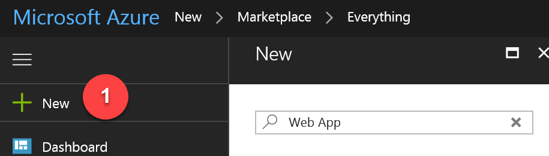

3.  On the **Everything** blade, select **Web App**

    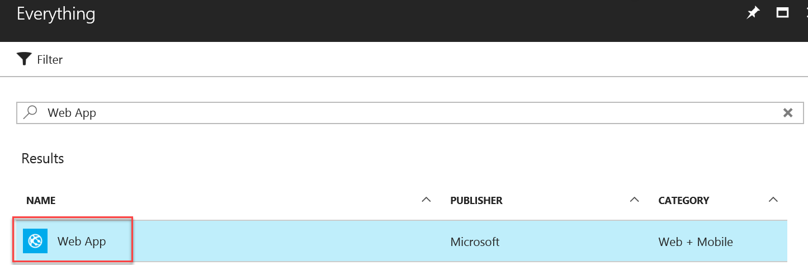

4.  Click **Create** on the Web App blade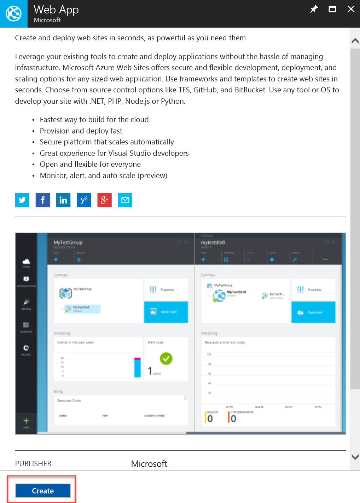

5.  On the **Web App** blade, specify the following configuration:

    -   Enter a unique and valid URL (until the green check mark appears) in the App Name field.

    -   Leave Subscription to the default value.

    -   Under Resource group, click the Use existing radio button, and select the **ContosoInsuranceHackathon** resource group.
        

    -   Click on the arrow in the App Service Plan/Location.

    -   On the App Service Plan blade, and click Create New.
        
        

        i.  Enter **ContosoInsurancePlan** into the App Service plan textbox.

        ii. For Location, select the same region as the **ContosoInsuranceHackathon** resource group.

        iii. Leave the Pricing tier as the default value, **S1 Standard**.
        
        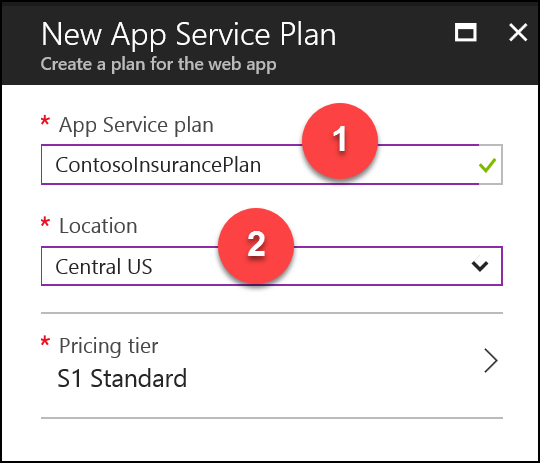

6.  Click **OK** to save the configuration.

    

7.  Click **Create** to finish the creation of the Web App.

    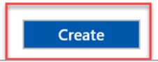

8.  Make a note of the Web Application name and save for later.

### Subtask 2: Create the SQL server instance

We will not create the databases at this time, since it will be created during the database migration step.

1.  From the Azure Management portal <http://portal.azure.com>, using a new tab or instance, navigate to create **SQL server (logical server)**.

2.  Click **New**, and in the Marketplace search text box enter **SQL server**. Click the **SQL server (logical server)** item in the search results.

    

3.  On the **Everything** blade, select **SQL server (logical server)**.

    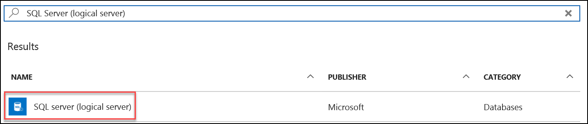

4.  Click **Create**

     blade")

5.  On the **SQL server (logical server)** blade, specify the following configuration:

    -   Server name: a unique value (ensure the green checkmark appears)

    -   Server admin login: **demouser**

    -   **Password** and **Confirm Password**: demo\@pass123

    -   Under Resource group, click the Use existing radio button, and specify the **ContosoInsuranceHackathon** resource group

    -   Ensure the **Location** is the same region as the web app

        

6.  Once the values are accepted in the **SQL Server (logical server)** blade, check the Pin to dashboard checkbox, and click **Create**

    

7.  After the SQL Server is provisioned, browse the list of services from the portal navigation pane, and select**SQL servers** underneath DATABASES. Click the name of the SQL Server you just created.

    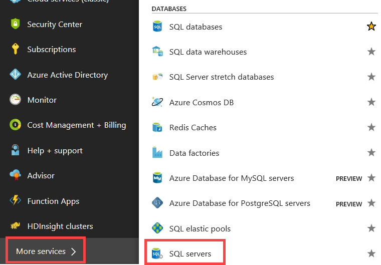

    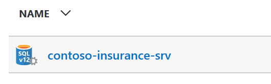

8.  On the **SQL Server** blade click **Firewall / Virtual Networks** under Settings

9.  On the **Firewall / Virtual Networks** blade, specify a new rule named **ALL**, with START IP **0.0.0.0**, and END IP **255.255.255.255**

    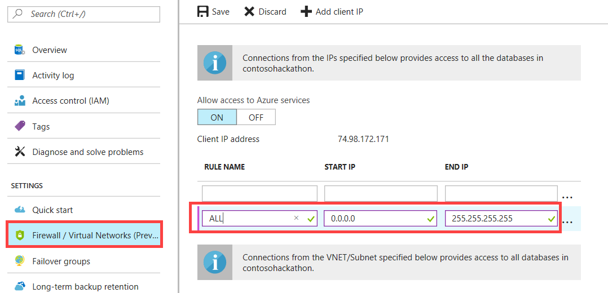
    
**Note**: Adding all IP address ranges as shown here is done for simplicity's sake for this hands-on lab, and is **not recommended** in other cases. The correct approach is to add only the necessary IPs and consider limiting access to Azure SQL through AAD ( <https://docs.microsoft.com/en-us/azure/sql-database/sql-database-aad-authentication> )

10. Click **Save**

    

11. On the **Success!** dialog box, click **OK**

    

12. Close all configuration blades

### Subtask 3: Provision the storage account

1.  Using a new tab or instance of your browser, navigate to the Azure Management portal, <http://portal.azure.com>

2.  Click **+New, Storage, Storage account -- blob, file, table, queue**

    

3.  On the Create storage account blade, specify the following configuration options:

    -   Name: enter a unique value for the storage account (ensure the green checkmark appears)

    -   For Resource group, click the Use existing radio button, and specify the **ContosoInsuranceHackathon** resource group.

    -   Ensure the **Location** is the same region as the resource group

        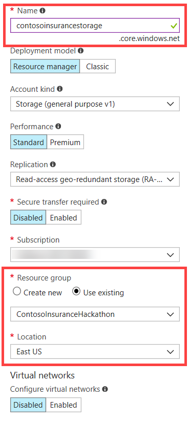

4.  Click **Create**

    

5.  After the storage account has completed provisioning, open the storage account by opening your ContosoInsuranceHackathon resource group followed by selecting the storage account name

    

6.  On the Storage account blade, select **Access Keys**, under Settings in the left-hand menu

    

7.  On the **Access keys** blade, click the Click to copy button for **key1 NOT the connection string**

    

8.  Paste the value into a text editor, such as Notepad, for later reference

### Subtask 4: Provision the API App

1.  Using a new tab or instance of your browser, navigate to the Azure Management portal, <http://portal.azure.com>

2.  Click **+New**, and in the Marketplace search text box enter **API App**. Select the **API App** item in the search results.

    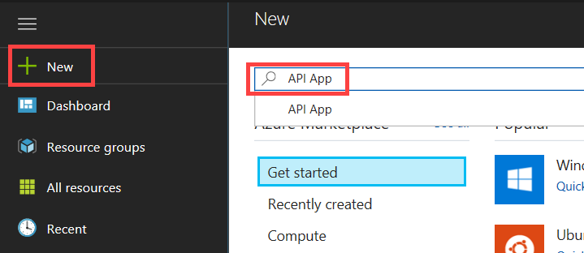

3.  On the API App blade, click **Create**

    

4.  On the Create API App blade, specify the following configuration options:

    -   Name: unique value for the App name (ensure the green check\
        mark appears)

    -   Specify the Resource Group **ContosoInsuranceHackathon**

    -   Select the **ContosoInsurancePlan** App Service plan, created previously

        

5.  Click **Create**.

    

6.  Make a note of the Web API name and save for later

### Subtask 5: Migrate the on-premises SQL database to Azure

1.  From your VM, click on Start and then type SQL Server to select **Microsoft SQL Server Management Studio** (SSMS)

1.  Once SSMS launches log in to your local SQL Express instance and expand the **Databases** node on the left-hand menu. Right-click on the **ContosoInsurance** database, and select **Tasks Deploy Database to Microsoft Azure SQL Database...**
    
    

3.  A dialog window named "Deploy Database 'ContosoInsurance'" will appear. Click **Next** to begin

4.  Within the Deployment Settings section, click on the **Connect** button next to the Server connection box\
    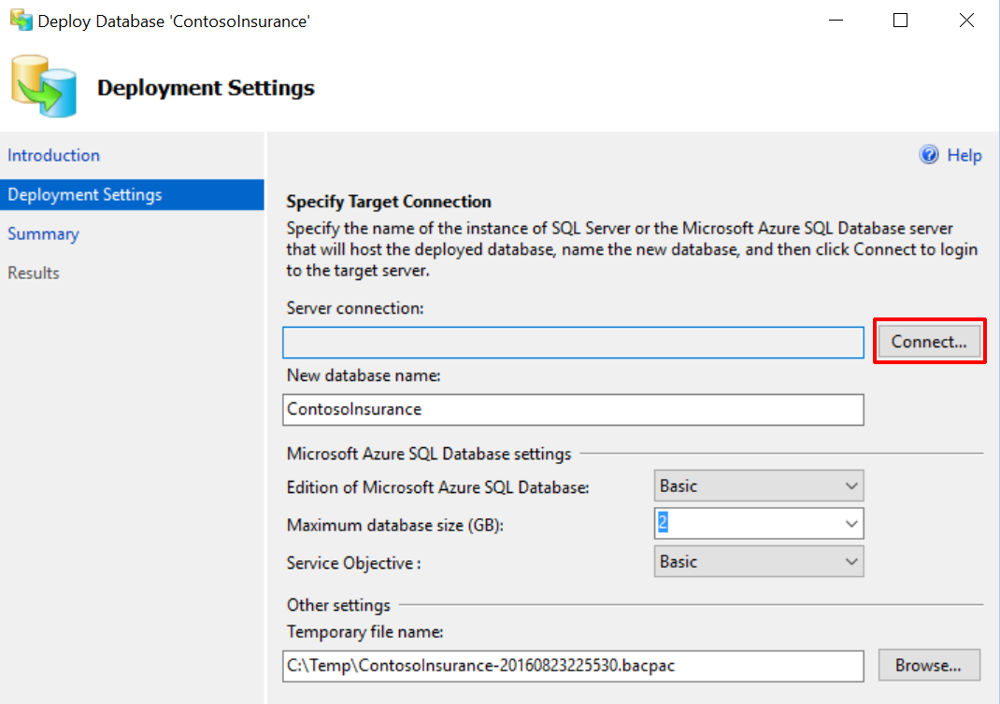

5.  In the SQL Server connection dialog box, enter the Azure SQL server name you created in while provisioning the server. If in doubt, you can refer to the server name from your resources list in Azure.

    -   Enter the username: **demouser**

    -   Enter the password you created: **demo\@pass123**

        

    -   Click **Connect**

6.  You should now see the Azure SQL server name in the Server connection box. Verify the new database name is **ContosoInsurance** and click **Next**
    
    

7.  Verify the specified settings are correct, and click **Finish**

8.  Once the operation has completed, close the database deployment dialog. You should see green checkmarks next to each completed step, along with a large checkmark next to "Operation Complete."

    
    
**Note**: If you receive an error during the import stage similar to the following, you need to make sure you are using the latest version of SQL Server Management Studio. This error can be caused by newer Azure SQL compatibility levels not being supported by older versions of SSMS, or if you did not set your SQL Server firewall settings:

    "Unable to connect to master or target server \'ContosoInsurance\'. You must have a user with the same password in master or target server \'ContosoInsurance\'."

9.  Verify that the database is operational, and its tables populated by connecting to it through SSMS, using the same credentials used in Step 5 above

10. Go back to the Azure Portal, and then find the ContosoInsurance database that was created during the migration, by going to **Browse, SQL databases.** Click on **ContosoInsurance** to open a blade for the database.
    \
    

11. Click on **Show database connection strings**, and click the **copy** button next to the ADO.NET connection string. Save the connection string for later.
    
    

12. Click the ADO.NET tab on the Database connection string blade. Select the connection string and press CTRL+C to copy it. Paste the connection string into a text editor, such as Notepad, for later use.

    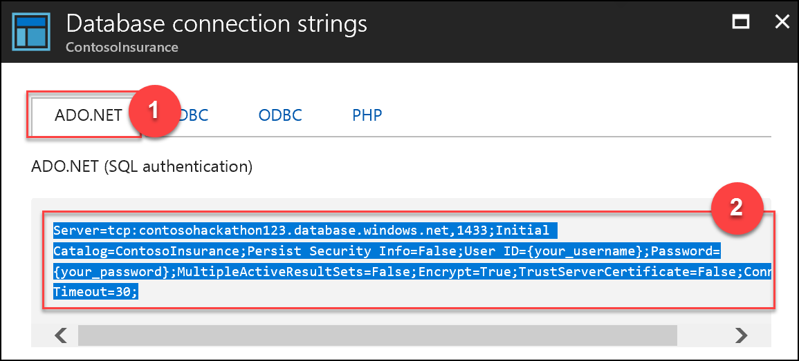

## Exercise 2: Identity and security

Duration: 30 minutes

Azure Active Directory will be used to allow users to authenticate to the web app, PolicyConnect desktop app, mobile apps, and PowerApps solutions. Azure AD will also be used to manage application access to Key Vault secrets. You have been asked to create a new Azure AD Tenant and secure the application so only users from the tenant can log on.

### Help references
|    |            |       
|----------|:-------------:|
| **Description** | **Links** |
| What is Azure AD? | <https://azure.microsoft.com/en-us/documentation/articles/active-directory-whatis/> |
| Azure Web Apps authentication | <http://azure.microsoft.com/blog/2014/11/13/azure-websites-authentication-authorization/> |
| View your access and usage reports | <https://msdn.microsoft.com/en-us/library/azure/dn283934.aspx/> |


**Note**: Tasks 1 and 2 require global admin permissions on the Azure AD Tenant. Task 3 requires the permission to create an app in the Azure AD tenant. Task 1 and 2 cannot be completed if you use Microsoft's Azure AD tenant.

### Task 1: Create a new Contoso user 

**Note**: This task is valid only if you are a global administrator on the Azure AD tenant associated with your subscription.

1.  Open the Azure Portal by launching a browser and navigating to https://portal.azure.com.

2.  Select Azure Active Directory from the left-hand menu.

    

3.  Ensure the correct Active Directory tenant is selected. You must be a Global Administrator for the selected tenant to complete the exercise. If you need to change it, click the **Switch directory** button. 

    

4.  Within the Azure Active Directory blade, select **Users and groups** under Manage.

    

5.  In the Users and Groups blade click on **All users** under Manage.

    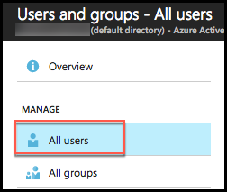

6.  Click **New User**.

    

7.  On the User blade, enter the following:

    -   Name: Contoso User

    -   User name: contosouser@\[your tenant\].onmicrosoft.com. Note this full user name for later use.

    -   Click Profile and enter the following:

        i.  First name: Contoso

        ii. Last name: User

        iii. Leave the Work info fields empty

    -   Click **OK** on the Profile blade

    -   Leave the remaining User fields as their defaults and click **Create**

        

8.  On the Contoso User blade displayed after the user is created, click on **Reset password** to generate a random password that will be used to access the account later

    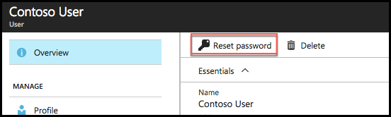

9.  In the Reset password blade, click the **Reset password** button

    

10. Click the Copy button, and paste the temporary password into a text editor, such as Notepad, for later use in accessing the account

    

### Task 2: Add the Web API application 

1.  Open Azure Active Directory from the left-hand menu, and select App registrations

    

2.  Click **New application registration** on the command bar

    

3.  In the **Create blade**, enter the following:

    -   Name: Contoso Insurance Web API

    -   Application Type: select Web app / API from the list

    -   Sign-on URL: http://\<your web api name\>.azurewebsites.net
        
        

    -   Click **Create** to register the Web API application.

4.  On the App registrations blade, select the newly created Web API application

    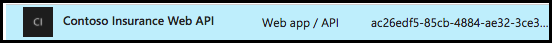

5.  On the Web API settings blade, click on **Keys**

    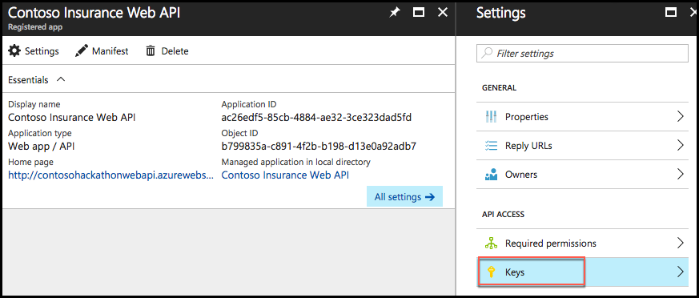

6.  In the **Keys** blade:

    -   Enter a description for the key.

    -   Select the duration from the list.

    -   Click **Save**. The blade with refresh and shows a key value. You must configure your application with this key value and the **CLIENT ID** value. (Instructions for this configuration will be application-specific.) 

    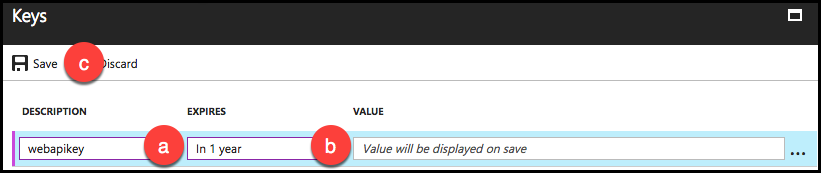

    -   DO NOT MISS THIS STEP: Copy the key value, and paste it into a text editor, for later reference. You will not be able to retrieve the value after you leave the blade. 

    

    -   Close the Keys blade.

7.  Back in the Settings blade, click on Reply URLs under General.
    
    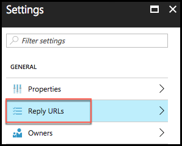

8.  In the Reply URLs blade, add another Reply URL, this time with **https** in front. This will allow access via https without throwing "*does not match the reply addresses configured for the application*" errors later. Click **Save**.
    
    

9.  Copy the Reply URL values and paste them into a text editor for later use.

10. Close the Reply URLs blade.

11. Back in the Settings blade, click on Properties under General. Copy the **Application ID** and **App ID URI** values and paste them into a text editor for later reference.

    

12. Bonus: From the Properties blade click the Upload new logo button. Browse to the Hackathon folder on your local drive (C:\\Hackathon). Find the Graphics folder and select the file named **CI-Icon-215x215.png**. You will now have the Contoso Insurance logo associated with the Web API application!

    

13. Click **Save**.

### Task 3: Expose Web API to other applications 

In order to make the Web API accessible to other applications added to Azure Active Directory, we must define the appropriate permissions. We will modify the manifest for the Web API to configure these settings, since, as of now, the Azure management portal does not provide an interface for this.

1.  Within the Azure Active Directory blade, click **App registrations**, and select your Web API application.

    

2.  In the Web API blade, click **Manifest**.
    
    

3.  In the Edit manifest blade, look for the **oauth2AllowImplicitFlow** setting. Change the value to **true**. This is required for our javascript Web API service calls from the web application. 

    

4.  Look for the **oauth2Permissions** setting. Either this will be pre-populated with a value, or it will be empty.

    Pre-populated:
    
    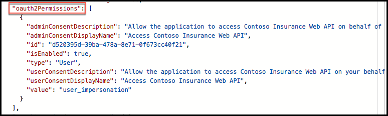\
    
    Empty:
    
    
    
    We need to add **one new permission** to this array (copy the text below and replace the id value):
    ```
    {

    "adminConsentDescription": "Allow read-write access to the Contoso Insurance Web API on behalf of the signed-in user",

    "adminConsentDisplayName": "Read-Write access to Contoso Insurance Web API",

    "id": "**494581dd-4bf5-451d-9bf8-487f4a43a09c**",

    "isEnabled": true,

    "type": "User",

    "userConsentDescription": "Allow read-write access to the Contoso Insurance Web API on your behalf",

    "userConsentDisplayName": "Read-Write access to Contoso Insurance Web API",

    "value": "Read_Write_ContosoInsurance_WebAPI"

    }
    ```

    Make sure that you enter a new, generated Guid into the **id** property (in bold above). You can generate a new Guid by opening PowerShell and running the following command:\
    ```
    [guid]::NewGuid()
    ```

    The final result should look like this: 
    
    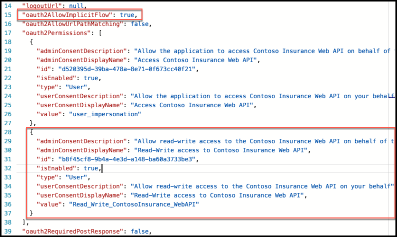

5.  Click **Save** to commit the changes

    

### Task 4: Add the ContosoInsurance desktop (WinForms) application 

1.  Open Azure Active Directory from the left-hand menu, and select **App registrations**.

    

2.  Click **New application registration** on the command bar.

    

3.  In the **Create blade**, enter the following:

    -   Name: Contoso Insurance Desktop

    -   Application Type: select Native from the list

    -   Redirect URI: <http://contosoinsurance.desktop.client> (It does not matter if this path is exact; what is important is that the URI for each application is valid and different for every application in your directory. The directory uses this string to identify your app.)

    -   Click **Create** to register the Desktop application.
        
        

4.  On the App registrations blade, select the newly created Desktop application.

    

5.  In the Settings blade, click on Redirect URLs under General.
    
    

6.  Copy the Redirect URI value, and paste it into a text editor for later use.

    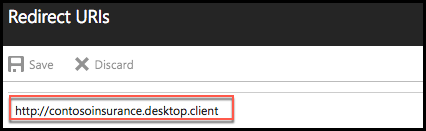

7.  Close the Reply URLs blade.

8.  Back in the Settings blade, click on **Required permissions** under API Access.

    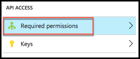

9.  On the Required permissions blade, click **Add**.

    

10. On the Add API access blade, click **Select an API**.
    
    

11. Enter "contoso" into the Search box on the Select an API blade, and select your Web API application, and click **Select**.
    
    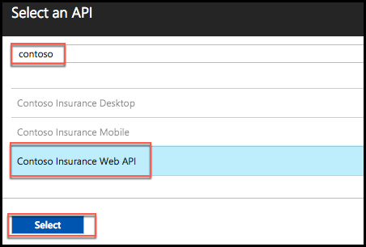

12. In the Enable Access blade, check the "Read-write access to Contoso Insurance Web API" permission that we added through the manifest, and click **Select**.

    

13. Click **Done** in the Add API access blade

14. Back in the Settings blade, click on Properties under General. Copy the **Application ID** value, and paste it into a text editor for later reference.

    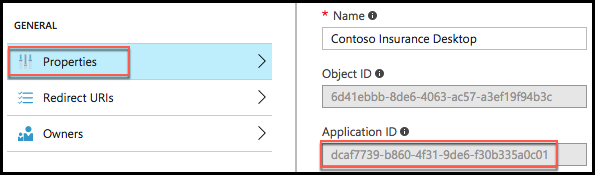

15. Bonus: From the Properties blade click the Upload new logo button. Browse to the Hackathon folder on your local drive (C:\\Hackathon). Find the Graphics folder and select the file named **CI-Icon-215x215.png**. You will now have the Contoso Insurance logo associated with the desktop application!

    

16. Click **Save**.

### Task 5: Add the mobile application 

1.  Open Azure Active Directory from the left-hand menu, and select **App registrations**.

    

2.  Click **New application registration** on the command bar.

    

3.  In the **Create blade**, enter the following:

    -   Name: Contoso Insurance Mobile

    -   Application Type: select Native from the list

    -   Redirect URI: http://contosoinsurance.mobile.client (It does not matter if this path is exact; what is important is that the URI for each application is valid and different for every application in your directory. The directory uses this string to identify your app.)

    -   Click **Create** to register the Mobile application\
        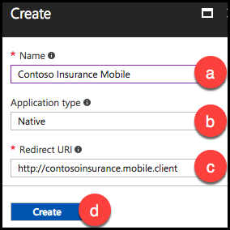

4.  On the App registrations blade, select the newly created Mobile application.

    

5.  In the Settings blade, click on **Redirect URLs** under General.
    
    

6.  Copy the Redirect URI value and paste it into a text editor for later use.

    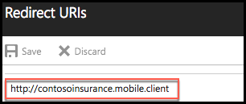

7.  Close the Reply URLs blade.

8.  Back in the Settings blade, click on **Required permissions** under API Access.

    

9.  On the Required permissions blade, click **Add**.

    

10. On the Add API access blade, click **Select an API**.
    
    

11. Enter "contoso" into the Search box on the Select an API blade, and select your Web API application, and click **Select**.
    
    

12. In the Enable Access blade, check the "Read-write access to Contoso Insurance Web API" permission that we added through the manifest, and click **Select**.

    

13. Click **Done** in the Add API access blade

14. Back in the Settings blade, click on Properties under General. Copy the **Application ID** value and paste it into a text editor for later reference.

    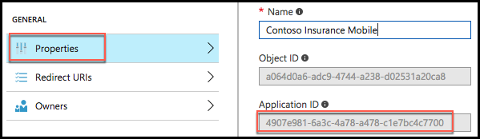

15. Bonus: From the Properties blade click the Upload new logo button. Browse to the Hackathon folder on your local drive (C:\\Hackathon). Find the Graphics folder and select the file named **CI-Icon-215x215.png**. You will now have the Contoso Insurance logo associated with the mobile application!

    

16. Click **Save**

### Task 6: Configure access control for the PolicyConnect web application

1.  Open the Azure Portal, <https://portal.azure.com>.

2.  On the left navigation, click **App Services** (or click Browse and click **App Services**).

    

3.  On the **web apps** page select the **ContosoInsurance web app**.

4.  Click the **Authentication / Authorization** tile underneath the list of settings.

    

5.  Change **App Service Authentication to On**, change the dropdown to **Log in with Azure Active Directory**, and click the **Azure Active Directory Authentication Provider**.

    

6.  Change **Management mode** to **Express**, and click **OK**.
    
    

7.  In the **Authentication / Authorization** blade click **Save**.

    

### Task 7: Grant the ContosoInsurance Web app permissions to the Web API app 

1.  Open Azure Active Directory from the left-hand menu, and select **App registrations**.

    

2.  On the App registrations blade, select your ContosoInsurance Web application, which was automatically added to AAD in the previous task.

    

3.  In the Web App blade, click **Manifest**.

    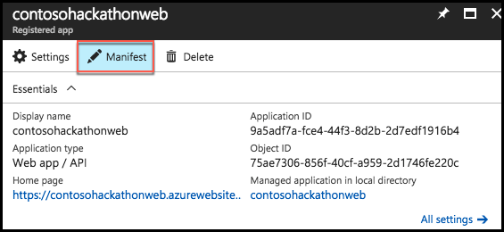

4.  In the Edit manifest blade, look for the **oauth2AllowImplicitFlow** setting. Change the value to **true**. This is required for our javascript Web API service calls from the web application.

    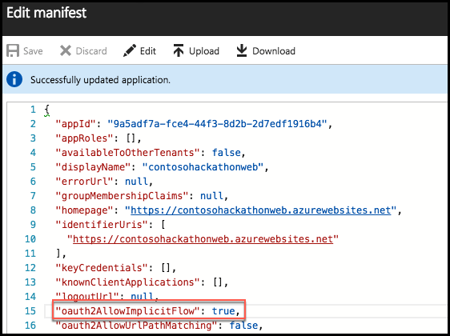

5.  Click **Save**, and close the Edit Manifest blade.

6.  Back in the Web App blade, click Settings.

    

7.  Click on **Reply URLs** under General.

    

8.  Two new reply URLs need to be added for our application to work correctly:

    -   Enter "https://\<your web app name\>.azurewebsites.net/"

    -   Enter "https://\<your web app name\>.azurewebsites.net/static"\
        
        

9.  Click Save.

10. Copy the Reply URL values and paste them into a text editor for later use.

11. Close the Reply URLs blade.

12. Back in the Settings blade, click on **Required permissions** under API Access. 

    

    

13. On the Required permissions blade, click **Add**

14. On the Add API access blade, click **Select an API**/
    
    

1. Enter "contoso" into the Search box on the Select an API blade, and select your Web API application, and click **Select**.
    
    

16. In the Enable Access blade, check the "Read-write access to Contoso Insurance Web API" permission that we added through the manifest, and click **Select**.

    

17. Click **Done** in the Add API access blade.

18. Back in the Settings blade, click on Properties under General. Copy the **Application ID** and App ID URI values and paste them into a text editor for later reference.

    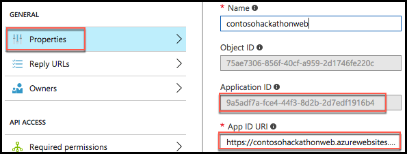

19. Bonus: From the Properties blade click the Upload new logo button. Browse to the Hackathon folder on your local drive (C:\\Hackathon). Find the Graphics folder and select the file named **CI-Icon-215x215.png**. You will now have the Contoso Insurance logo associated with the web application!

    

20. Click **Save**.

21. OPTIONAL: If you intend to debug the web app locally from within Visual Studio, you will need to add the **localhost** path (http://localhost:10421/static) to the list of Reply URLs under General, Reply URLs. Otherwise, your AAD auth to the Web API will fail.
    
    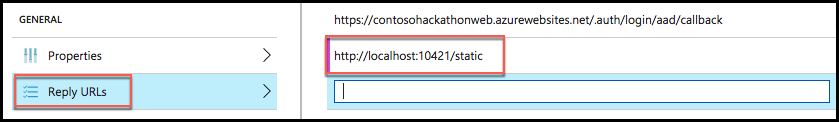

22. Click the **Save** button

## Exercise 3: Configure blob storage and search indexing

Duration: 30 minutes

Contoso Insurance is currently storing all of their scanned PDF documents on a local network share. They have asked to enable full-text searching on the documents, and to be able to store them automatically from a workflow. We have already provisioned a storage instance that we will use to store the files in a blob container. First, we need a way to bulk upload their existing PDFs, then configure search indexing on that container.

### Help references
|    |            |       
|----------|:-------------:|
| **Description** | **Links** |
| Transfer data with the AzCopy command-line utility | <https://azure.microsoft.com/en-us/documentation/articles/storage-use-azcopy/%23blob-upload/> |
| Download AzCopy | <http://aka.ms/downloadazcopy/> |
| Create an Azure Search service using the Azure Portal | <https://azure.microsoft.com/en-us/documentation/articles/search-create-service-portal/> |
| Indexing Documents in Blob Storage | https://azure.microsoft.com/en-us/documentation/articles/search-howto-indexing-azure-blob-storage/> |
| Portal support for Azure Search blob and table indexers | <https://azure.microsoft.com/en-us/blog/portal-support-for-azure-search-blob-and-table-indexers-now-in-preview/> |


### Task 1: Bulk upload PDFs to blob storage 

1.  Create a new container for the scanned PDF policy documents. From the new Azure portal, go to **All resources** and click on the Contoso Insurance storage account you created earlier. From the storage Overview page, click on **Blobs** under services.
    
    

2.  Click on the **+ Container** button to create a new container in the Blob service blade.

3.  In the New Container window, type **policies** as your container name, and select **Container** as the Public access level (set to Container for demo purposes; otherwise set to Private). Click **OK**.
    
    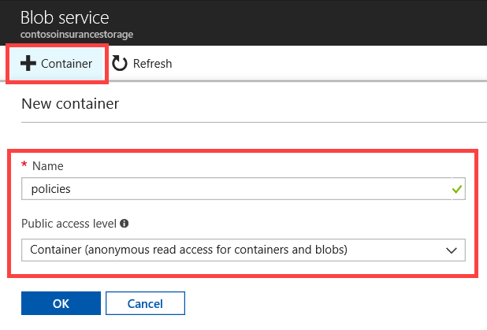

4.  After the container has been created, click on the container name.

5.  Click **Container properties**.
    
    

6.  Click on the **copy** button next to the URL. Click Allow Access if prompted by the browser. Save the copied value to a text editor, such as Notepad, for later use.
   
    

7.  Download the latest version of AzCopy from <http://aka.ms/downloadazcopy>.

8.  After installing, launch a new **command prompt** window (Click on Start, then type **cmd,** and hit enter).

9.  Browse to the AzCopy directory. By default, it is installed to %ProgramFiles(x86)%\\Microsoft SDKs\\Azure\\AzCopy (64-bit Windows) or %ProgramFiles%\\Microsoft SDKs\\Azure\\AzCopy (32-bit Windows).

10. Type in the following command, replacing the **bold** values with your own:\
    
    ```
    AzCopy /Source:**C:\\Hackathon\\Files** /Dest:**https://contosoinsurancestorage1.blob.core.windows.net/policies** /DestKey:**DaINeh6zmORuR+OOMDoG7SmtQSiJznk75hqFlB9b0kUVgyobb7y1Txzb1iQGjvdFDsgxLQtgVMBPy0h5ZEaHOw==** /S\
    ```

    The **Source** value is the current location of the PDF files. The **Dest** value is the URL for the blob container you copied on step 6. The **DestKey** is the blob storage Account Key you saved after creating the storage account. If you cannot find it, go to Access keys after opening your storage account on the new portal. Copy either key1 or key2.
    

### Task 2: Create an Azure search service 

1.  Using a new tab or instance of your browser, navigate to the Azure Management portal, <http://portal.azure.com>.

2.  Click **+New,** type **Azure Search** into the search box**, and select Azure Search** from the results.

    

3.  Click **Create**

    

4.  On the Create Azure Search blade, specify the following configuration options:

    -   Name: unique value for the URL (ensure the green check mark appears)

    -   Specify the Resource Group **ContosoInsuranceHackathon**

    -   Select the same location as your other services within the Resource Group.
        
        

5.  Click **Create**

### Task 3: Configure full-text search indexing 

1.  Select the newly created search service, and click on **Import data**.
    
    

2.  Within the Import data window, click on **Connect to your data**. Then, within the Data Source window, click on **Azure Blob Storage**. Now, within the New data source window, enter a unique, lowercased name, such as **scanned-policies**. Now, click on **Select an account and container**.
    
    

3.  Under Storage accounts, click on the storage account you created earlier. Now click on the **policies** container under the Containers blade, and then **Select**.
    
    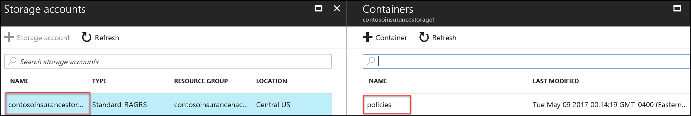

4.  Now click **OK**.
    
    

5.  After the data source has been sampled, you will be presented with a new Index blade. During the sampling process, many of our metadata fields were detected, and now the suggested indexes are displayed. The blob indexer has the ability to crack open your documents and extract all text into the content field as well.
    
    Within the Index blade, type in a name for the index, such as **policies**. Select **metadata\_storage\_path** for the Key, if not already selected.

    Set the following fields as Retrievable, Filterable, and Searchable.
    
    

6.  Click **OK**.

7.  Within the Create an Indexer blade, type in a lower-case name, such as **policy-indexer**. Select **Custom** under Schedule, and then enter **5** as the interval in minutes (this is the minimum number, and will make testing easier later on). Enter **today's date** as the Start date, and **12:00:00 AM** as the time. Click **OK**.
    
    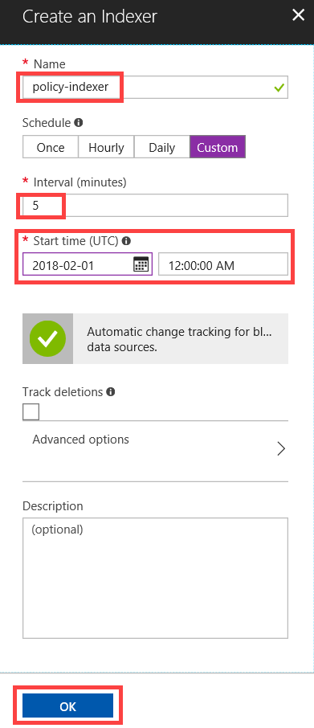

8.  Click **OK** once again to complete your changes.
    
    

9.  After a few minutes, you should see a document count matching the number of PDFs next to the **policies** index you created, on the Search service home screen. Click on this index.

    

10. Click on the **Edit CORS options** menu item.

    

11. Select the Allowed origin type to **All**, and click **Save**. This will allow external applications to perform searches against the index. *When running in production, it is strongly recommended to select Custom and manually specify allowed sources by URL*.
    
    

12. Back on the Search service home page, click the **policy** index once again, if all 600+ documents have been indexed. Now click on the **Search explorer** menu item on top.
    
    

13. In the **Query string** field within the Search explorer, type in the following policy number: **DOW586IJCG493F**, and click on **Search**. You should see a single search result for a PDF file containing the policy number within its content. A successful result indicates that the index is working as expected.
    
    

14. While in the Search explorer, copy the **Request URL** and save it for later.
    
    

15. Go back to the main search service page, and click on **Keys** on the left-hand menu pane, then **Manage query keys**. Copy the Key value within the Manage query keys blade. Save key for later.
    
    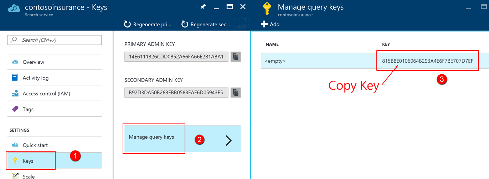

## Exercise 4: Configure Key Vault

Duration: 15 minutes

Key Vault will be used to protect sensitive information, such as database connection strings and storage account keys. Our application services that we have registered within Azure Active Directory will be granted access to the Key Vault secrets we create in this section. We have selected to use secrets instead of keys, due to the small size of the strings we are storing, as well as how often we need to retrieve the values. Retrieving secrets from Key Vault is a lower latency operation than retrieving keys, due to the real-time encryption and decryption involved.

### Help references
|    |            |       
|----------|:-------------:|
| **Description** | **Links** |
| What is Key Vault? | <https://azure.microsoft.com/en-us/documentation/articles/key-vault-whatis/> |
| About Keys and Secrets | <https://msdn.microsoft.com/library/dn903623.aspx/> |
| Get Started with Azure Key Vault | <https://azure.microsoft.com/en-us/documentation/articles/key-vault-get-started/> |
| Use Azure Key Vault from a Web Application | <https://azure.microsoft.com/en-us/documentation/articles/key-vault-use-from-web-application/> |


### Task 1: Create a new Key Vault 

1.  Launch **PowerShell** from the Start Menu

2.  Within PowerShell type in the login command for Azure:\
    Login-AzureRmAccount

3.  You will be prompted to log in with your Azure credentials. Be sure to sign in with the same Azure account you have been using throughout the hackathon.

4.  If you have multiple subscriptions and want to specify a specific one to use for Azure Key Vault, type the following to see the subscriptions for your account:

    ```
    Get-AzureRmSubscription
    ```

    Then to specify the correct subscription to use, type:
    
    ```
    Set-AzureRmContext -SubscriptionId <subscription Id>
    ```

5.  Use the New-AzureRmKeyVault cmdlet to create your key vault. Enter a name for your vault, such as **ContosoInsuranceKeyVault** (the name needs to be unique; you may need to try different values if the below script fails). Enter the Resource Group name you created earlier, such as **ContosoInsuranceHackathon**. Be sure to enter the same region as your other services, such as **westus**:\
    
    ```
    New-AzureRmKeyVault -VaultName 'ContosoInsuranceKeyVault' -ResourceGroupName 'ContosoInsuranceHackathon' -Location 'westus'
    ```

**Note**: Perform the following if you receive the following error when attempting to create the Key Vault:\
    New-AzureRmKeyVault : Could not load file or assembly \'Microsoft.Data.Services.Client, Version=5.6.4.0, Culture=neutral, PublicKeyToken=31bf3856ad364e35\' or one of its dependencies. The system cannot find the file specified.
    
    Open PowerShell as an Administrator, then execute the following:
    
    ```
    Install-Module AzureRM -AllowClobber
    ```

6.  After the vault has been created, make note of the **Vault URI** for later:
    
    

### Task 2: Create a new secret to store the SQL connection string 

1.  Now we will add a secret to the vault for our ContosoInsurance database connection string. Within the PowerShell window, convert the database connection string to a secure string by typing in the following ***(make sure to add in your SQL server username and password to the connection string first!):
    
    ```
    $secretvalue = ConvertTo-SecureString 'Server=tcp:**contoso-insurance-serv**.database.windows.net,1433;Initial Catalog=ContosoInsurance;Persist Security Info=False;User ID=**demouser**;Password=**demo@pass123**;MultipleActiveResultSets=False;Encrypt=True;TrustServerCertificate=False;Connection Timeout=30;' -AsPlainText -Force
    ```

    Now type in the following, ***making sure to use your correct Vault Name***:
    
    ```
    $secret = Set-AzureKeyVaultSecret -VaultName **'ContosoInsuranceKeyVault'** -Name **'SQLConnectionString'** -SecretValue $secretvalue
    ```

2.  Obtain the URI for your new secret, and save it for later. This will be used for the **SecretUri** application settings value:\
    \$secret.Id\
    \
    You can use this URI to reference your SQLConnectionString secret from your applications. Use the URI, omitting the version number after "SQLConnectionString/", in order to always obtain the latest version of the secret. Example: <https://contosoinsurancekeyvault.vault.azure.net:443/secrets/SQLConnectionString/>

3.  We need to grant the Web API application access to the secret we just created. Refer to the Client (Application) Id you saved when adding the Web API to Azure AD. If in doubt, you can find it by going to the Azure portal (https://portal.azure.com), selecting your Azure Active Directory instance, going to the App Registrations tab, selecting the Web API application entry, and clicking on Properties under General.
    \
    Within PowerShell, type in the following command, replacing the \<Client Id\> value with your own:\

    ```
    Set-AzureRmKeyVaultAccessPolicy -VaultName 'ContosoInsuranceKeyVault' -ServicePrincipalName **<Client Id>** -PermissionsToSecrets Get
    ```

    

### Task 3: Add Client Id, Client Secret, and Secret URL to Web API's app settings 

To allow the Web API to access the Key Vault secret, we must add the Azure AD Client Id for the Web API app, along with the Client Secret and the Secret URL to the application settings on its app service instance.

1.  Using a new tab or instance of your browser navigate to the Azure Management portal, <http://portal.azure.com>

1.  Click on **App Services** in the left-hand menu, and click on the **Contoso Insurance Web API** instance within the App Services list.
    
    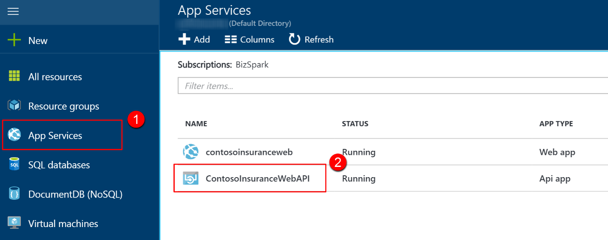

3.  Click on **Application Settings**.
    
    

4.  Scroll down to the **App settings** section, and create the following Key / Value pairs (the key names must exactly match those found in the Web.config file for the Contoso.Apps.Insurance.WebAPI project in Visual Studio):

    -   Key: **ClientId** Value: \<AAD web app Client Id for Web API\>

    -   Key: **ClientSecret** Value: \<AAD web app Key for Web API\>

    -   Key: **SecretUri** Value \<Key Vault Uri for the SQLConnectionString secret\>

        Make sure that you exactly match the Key names to the App Settings keys in the Web.config file, including proper casing.
        
        

5.  Click **Save**.

## Exercise 5: Configure and deploy the Contoso Insurance apps

Duration: 40 minutes

The developers at Contoso Insurance have been working toward migrating their apps to the cloud. As such, most of the pieces are already in place to deploy the apps to Azure, as well as configure them to communicate with the new app services, such as Web API. Since the required services have already been provisioned on Azure up to this point, what remains is applying application-level configuration settings, and then deploying any hosted apps and services from the Visual Studio Starter Project solution.

### Task 1: Deploy the Web API

In this exercise, the attendee will apply application settings using the Microsoft Azure Portal. The attendee will then deploy the Web API from the Starter Project.

### Subtask 1: Configure application settings in Azure 

1.  Navigate to the **Contoso.Apps.Insurance.WebAPI** project located in the **Web** folder using the **Solution Explorer** of Visual Studio.
    
    

2.  Open **Web.config** to use the **appSettings** keys as a reference. Instead of updating the application settings in the config file, we are setting them in the application service for Web API in the portal as an added security measure. If you would like to debug locally, you may place the values in the Web.config file as well.
    
    

3.  Using a new tab or instance of your browser navigate to the Azure Management portal, <http://portal.azure.com>

4.  Click on **App Services** in the left-hand menu, and click on the **Contoso Insurance Web API** instance within the App Services list.
    
    

5.  Click on **Application Settings**.
    
    

6.  Scroll down to the **App settings** section. You should already have the Key / Value pairs that were created in the previous exercise for ClientId, ClientSecret, and SecretUri. Create the following additional Key / Value pairs (the key names must exactly match those found in the Web.config file for the Contoso.Apps.Insurance.WebAPI project in Visual Studio):

    -   Key: **ida:Tenant** Value: \<AAD tenant name\>

    -   Key: **ida:Audience** Value: \<App ID URI within AAD application settings\>\
        
        The **ida:Tenant** value is your Azure Active Directory (AAD) tenant name (e.g. contoso.onmicrosoft.com), which can be found by selecting Custom Domain Names within Azure Active Directory on the portal.

    The **ida:Audience** value is the App ID URI from the Azure portal within the AAD application settings for this Web API.

7.  Make sure that you exactly match the Key names to the App Settings keys in the Web.config file, including proper casing.

8.  Click **Save**.

    

### Subtask 2: Deploy the Web API app from Visual Studio 

1.  Navigate to the **Contoso.Apps.Insurance.WebAPI** project located in the **Web** folder using the **Solution Explorer** of Visual Studio.

    

2.  Right-click the **Contoso.Apps.Insurance.WebAPI** project, and click **Publish**.

    

3.  Choose **Microsoft Azure App Service** as the publish target, and choose **Select Existing,** followed by **Publish**.

    

4.  Log on with your credentials and ensure the subscription you published earlier is selected.

    

5.  Select the Contoso Insurance Web API app.

    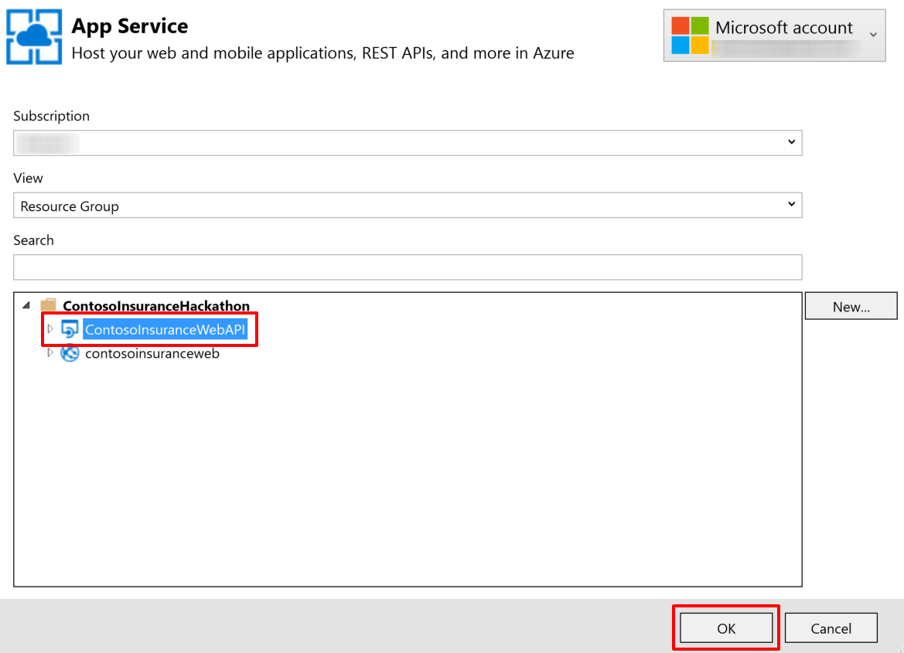

6.  Click **OK**, and  click **Publish** to publish the web application.

7.  In the Visual Studio **Output** view, you will see a status that indicates the web app was published successfully.

    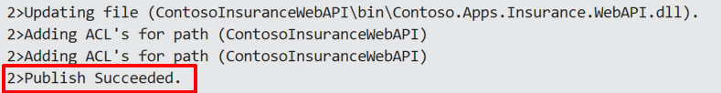

8.  Validate the Web API by typing in /swagger to the end of its URL in your browser (e.g. http://contosoinsurancewebapi.azurewebsites.net/swagger). You should see a list of the available REST APIs. However, you will not be able to execute them from here, as they are protected by AAD application permissions, accepting only token-based calls from registered apps.
    
    

### Task 2: Deploy the Contoso Insurance web app

In this exercise, the attendee will apply application settings using the Microsoft Azure Portal. The attendee will then edit a .js file in Visual Studio and deploy the Web API from the Starter Project.

###  Subtask 1: Configure application settings in Azure 

1.  Navigate to the **Contoso.Apps.Insurance.Web** project located in the **Web** folder using the **Solution Explorer** of Visual Studio.
    
    

2.  Open **Web.config** to use the **appSettings** keys as a reference. Instead of updating the application settings in the config file, we are setting them in the application service for Web API in the portal as an added security measure. If you would like to debug locally, you may place the values in the Web.config file as well.

3.  Using a new tab or instance of your browser navigate to the Azure Management portal, <http://portal.azure.com>.

4.  Click on **App Services** in the left-hand menu, and click on the **Contoso Insurance Web** instance within the App Services list.
    
    

5.  Click on **Application Settings**.
    
    

6.  Scroll down to the **App settings** section. Create the following additional Key / Value pairs (the key names must exactly match those found in the Web.config file for the Contoso.Apps.Insurance.Web project in Visual Studio):

    -   Key: **RootWebApiPath** Value: \<URL to published Web API\>

    -   Key: **Tenant** Value: \<AAD tenant name\>

    -   Key: **WebClientId** Value: \<App's AAD Client Id\>

    -   Key: **WebApiAppId** Value: \<Web API's APP ID URI from AAD\>\
        
    The **RootWebApiPath** value is the URL to the published Web API, such as <https://contosoinsurancewebapi.azurewebsites.net/>.

**Note**: It is important to make sure this link starts with **https** to ensure proper communication between the web app and the API. Otherwise, the requests to the API may be blocked.
        \
        The **Tenant** value is your Azure Active Directory (AAD) tenant name (e.g. contoso.onmicrosoft.com), which can be found by selecting your Azure AD (AAD) directory in the classic portal followed by clicking on the DOMAINS tab.
        \
        The **WebClientId** value is the Client Id in Guid format from the Azure Active Directory application settings for this web application.
        \
        The **WebApiAppId** value is from the AAD application settings for the Web API, under single sign-on, named APP ID URI.

7.  Make sure that you exactly match the Key names to the App Settings keys in the Web.config file, including proper casing.

8.  Click **Save**.

9.  Back in Visual Studio, open the **app.js file**, located within the Contoso.Apps.Insurance.Web project under the Scripts \> app folder.
    
    

10. Scroll down to the bottom of the file where you see the line (126) that begins with **var endpoints = {**. Change the URL in quotes to the same URL you entered for the RootWebApiPath application variable, which is the root location of your Web API, (e.g. <https://contosoinsurancewebapi.azurewebsites.net>).

**Note**: It is important to make sure this link starts with **https** to ensure proper communication between the web app and the API. Otherwise, the requests to the API may be blocked.
    


### Subtask 2: Deploy the Contoso Insurance web app from Visual Studio 

1.  Navigate to the **Contoso.Apps.Insurance.Web** project located in the **Web** folder using the **Solution Explorer** of Visual Studio

    

2.  Right-click the **Contoso.Apps.Insurance.Web** project and click **Publish**

3.  Choose **Microsoft Azure App Service** as the publish target. Choose **Select Existing**, and click **Publish**

    

4.  Log on with your credentials and ensure the subscription you published earlier is selected.

    

5.  Select the Contoso Insurance Web app

    

6.  Click **OK**, and click **Publish** to publish the web application

7.  In the Visual Studio **Output** view, you will see a status that indicates the web app was published successfully

    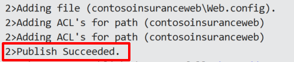

8.  Validate the website by browsing to it, if it did not automatically launch after publishing\
    

9.  Click on the **Policies** link. You will likely be prompted to log in to AAD if you do not already have a cached authentication token. When you log in, do so with the **Contoso User** account you created earlier. Username is **contosouser@\<your tenant\>.onmicrosoft.com** and the password is **demo\@pass123**. After authentication is complete, you should see a list of policies, and you should have a Logout link on the upper-left.

    

### Task 3: Configure and run the legacy desktop (Windows Forms) application

Contoso Insurance has created a web and mobile version of their desktop application, but they have opted to update it to communicate with the new Web API service for business and data functionality, doing away with their old WCF services (also included in the solution). They have also replaced their SQL membership-based user authentication with Azure Active Directory (AAD).

If you would like to run the desktop application in its original configuration, make sure you have set up your local self-signed certificates, as outlined in Exercise 1, Task 5. Also, make sure that you run both WCF services when debugging the desktop application by right clicking on the Solution, and clicking on Select StartUp Projects... From here, select the Multiple startup projects radio button, and selectthe Start action for the following projects, moving them from top to bottom in this order: PolicyConnectDataService, PolicyConnectManagementService, and PolicyConnectDesktop. Also, make sure that the UseWebApi app setting is set to false in App.config.

In this exercise, the attendee will update the application settings in the App.config file, allowing the desktop application's updated code to take advantage of the new Azure services.

### Subtask 1: Configure application settings in App.config 

1.  Navigate to the **PolicyConnectDesktop** project located in the **Desktop** folder using the **Solution Explorer** of Visual Studio, and open the **App.config** file.
    
    

2.  Scroll down to the **appSettings** section and modify the values for the following keys:\
    \
    The **PdfRootPath** is the root folder of the Pdf files. The path should point to the Files folder within the Hackathon directory you created at the beginning of this hackathon (e.g. C:\\Hackathon\\Files\\).
    \
    The **RootWebApiPath** value is the URL to the published Web API, such as http://contosoinsurancewebapi.azurewebsites.net/\
    \
    **UseWebApi** needs to be set to **true** in order to communicate with the new Web API, and authenticate through AAD instead of the old method.
    \
    The **DesktopClientId** value is the Application Id in Guid format from the Azure Active Directory application settings for this desktop application.
    \
    The **DesktopRedirectUri** value is also from the AAD application setting for this desktop application, named *Redirect URIs*.
    \
    The **WebApiAppId** value is from the Azure Active Directory application settings for the Web API, under Properties, named APP ID URI.

    The **AzureADLoginUrl** is the URL of your Azure Active Directory tenant, which should be: https://login.windows.net/\<tenantID\>. You can find your Tenant Id by opening Azure Active Directory in the portal followed by selecting Properties. The Tenant Id is the Directory ID value.
    \
    The **AzureADTenantId** is the Guid value of your tenant, which was applied to the AzureADLoginUrl key above.

### Subtask 2: Running the desktop application 

1.  Navigate to the **PolicyConnectDesktop** project located in the **Desktop** folder using the **Solution Explorer** of Visual Studio, and right-click on the project.

2.  Select Debug, and click on **Start new instance**.
    
    

3.  Click the **Log in...** button to begin

4.  You will be presented with an AAD login window. Enter the login credentials for the Contoso User account you created in your AAD directory. Username is **contosouser@\<your tenant\>.onmicrosoft.com** and the password is **demo\@pass123**. After authentication is complete, you should see a list of policyholders, and you should see a label on the upper-right saying you are logged in as your Contoso User account. Feel free to explore the different capabilities of the application. Some functionality is intentionally left out. To open a policyholder record, simply double-click on any of the rows.
    
    

### Task 4: Configure and run the mobile application

The mobile application was built using Xamarin Forms, capitalizing on the .NET expertise of the Contoso Insurance development team. As a bonus, they can easily add additional platforms, such as iOS and Windows phone, as well as target multi-platform desktop environments. For now, their focus has been on deploying to Android, since they can run the Android emulator right from their development machines, which are Windows-based. You will need to have completed the Xamarin installation steps outlined at the beginning of this hackathon guide.

In this exercise, the attendee will update the application settings in the ApplicationSettings.cs file, and then run the mobile application within the Android emulator.

### Subtask 1: Configure application settings in ApplicationSettings.cs 

1.  Navigate to the **CIMobile** project located in the **Mobile** folder using the **Solution Explorer** of Visual Studio, and open the **ApplicationSettings.cs** file\
    

2.  Modify the values for the following properties:\
    \
    The **RootWebApiPath** value is the URL to the published Web API, such as http://contosoinsurancewebapi.azurewebsites.net/\
    \
    For the **BlobContainerUrl**, enter the blob container Url where the policy PDF files are kept. You can find this by navigating to your Storage account in Azure, clicking on Blobs on the Overview blade followed by the container (such as \"policies\") within the Blob service blade, and finally clicking Properties, then the copy button next to the URL.
    \
    The **MobileClientId** value is the Client Id in Guid format from the Azure Active Directory application settings for this mobile application.
    \
    The **MobileRedirectUri** value is also from the AAD application setting for this mobile application, named *Redirect URIs*.
    \
    The **WebApiAppId** value is from the Azure Active Directory application settings for the Web API, under Properties, named APP ID URI.
    \
    The **WebApiReplyUrl** is retrieved from the AAD application settings for the Web API, under single sign-on. It is the REPLY URL.
    \
    The **AzureADLoginUrl** is the URL of your Azure Active Directory tenant, which should be: https://login.windows.net/\<tenantID\>. You can find your Tenant Id by opening Azure Active Directory in the portal followed by selecting Properties. The Tenant Id is the Directory ID value.
    \
    **GraphResourceUri** should be set to https://graph.windows.net.
    \
    The **AzureADTenantId** is the Guid value of your tenant, which was applied to the AzureADLoginUrl key above.
    \
    To find the **AzureSearchServiceUrl** value, go to Azure and select your search service, then the \"policies\" index, and then \"Search explorer." Copy the full URL within the URL field. Make sure to include the entire path, even the \"&search=\*\" at the end. For example: https://contosoinsurance.search.windows.net/indexes/policies/docs?api-version=2015-02-28&search=\*\
    \
    The **AzureSearchQueryApiKey** value can be found by selecting your search service in Azure, clicking on Keys, click on Manage query keys, and copy the displayed key (or create one if none exist).

### Subtask 2: Running the mobile application

1.  Navigate to the **CIMobile.Droid** project located in the **Mobile** folder using the **Solution Explorer** of Visual Studio, and click to select the project.

2.  On the top tool bar of Visual Studio, select Debug from the first dropdown, then Any CPU in the second, and select**CIMobile.Droid** as the application to be debugged. Click on the green play button next to the Android emulator name to launch the application.
    
    

3.  Alternately, right-click on the CIMobile.Droid project, select Debug, and click **Start new instance**

4.  The Android emulator should appear, and launch the PolicyConnect app within.
    
    

5.  Click the **Sign In...** button to begin.

6.  You will be presented with an AAD login window. Enter the login credentials for the Contoso User account you created in your AAD directory. Username is **contosouser@\<your tenant\>.onmicrosoft.com** and the password is **demo\@pass123**. After authentication is complete, you should see a list of policyholders. You cannot interact with the records in any way for this demo.

7.  Click on the menu button on the upper-left to explore other parts of the app.
    
    

8.  Click on the menu and choose **Search Policy #**.
    
    

9.  You can either enter a full policy \#, or perform a partial search of all content and metadata fields within the search field. Type in at least three characters to activate the search button. Try searching with the letters **MON**. The most relevant search results will appear first. Now try searching by an exact policy number, such as **DOW586IJCG493F**. You should see a single result matching that policy number.
    
    

10. Click on a search result to view the content that was extracted by the Azure Search indexer. There is a link to download the actual PDF at the bottom of the result page. This will display the file that is stored in blob storage.

    

    

## Exercise 6: Create a Flow app that sends push notifications when important emails arrive

Duration: 10 minutes

Contoso wants to receive push notifications when important emails arrive, since any newly scanned policies that are emailed to the data entry employees are marked as important. Since they use Office 365 for their email services, you can easily meet this requirement with Flow.

### Task 1: Sign up for a Flow account

1.  Go to <https://flow.microsoft.com> and sign up for a new account, using the same account you have been using in Azure.

1.  You may receive an email asking you to verify your account request with a link to continue the process.

3.  Download the Microsoft Flow mobile app to your phone or mobile device.

### Task 2: Create new flow

1.  With your Flow account created and logged into the Flow website, click on the **My flows** link on top of the page.
    
    

2.  Click on the **Create from blank** button.

3.  Select **Search hundreds of connectors and triggers**.
    
    

4.  Type **email** into the trigger search box to find the **Office 365 Outlook -- When a new email arrives** trigger. Click on it to continue.
    
    

5.  When prompted, sign in to create a connection to Office 365 Outlook.

6.  Within the When a new email arrives trigger configuration box, click on **Show advanced options**.

    

7.  Within the advanced options, set the **Importance** to High and set **Has Attachment** to Yes

    

8.  Click on **+ New step**, then on **Add an action** to continue.
    
    

9.  Type push into the action search box, and selectNotifications -- Send me a mobile notification\
    

10. Within the **Send me a mobile notification** action box, type in a notification in the **Text** field: Important email with attachment:

11. Click on the **Subject** tag to insert it after your notification text.

12. Type <https://outlook.office365.com/> into the **Link** field.

13. Type **Go to Outlook Office 365** as the **Link label**.
    
    

14. Click on the **Create flow** button, and type in **When a new email arrives -\> Send me a mobile notification** as the flow name, when prompted

### Task 3: Test your flow

1.  Send an email to your O365 account marked as **High Importance**, with a test Policy PDF file attached. You can find some test files that are not stored in Blob storage (for additional testing later) within the **C:\\Hackathon\\New Policies** folder.

2.  If you have the Flow app installed on your phone, you should receive a push notification (this could take up to five minutes the first time).

3.  You can check the status of the flow by clicking on **My flows** from the flow website. Click on the name of the flow **When a new email arrives -\> Send me a mobile notification** you created.
    
    

4.  You will see each time the flow was run, along with its status, under **Run History**.
    
    

5.  Click on the line item to view more details.
    
    

## Exercise 7: Create an app in PowerApps

Duration: 15 minutes

Since creating mobile apps is a long development cycle, Contoso is interested in using PowerApps to create mobile applications in order to add functionality not currently offered by their app rapidly. In this scenario, they want to be able to edit the Policy lookup values (Silver, Gold, Platinum, etc.), which they are unable to do in the current app.

Get them up and running with a new app created in PowerApps, which connects to the ContosoInsurance database and performs basic CRUD (Create, Read, Update, and Delete) operations against the Policies table.

### Help references
|    |            |       
|----------|:-------------:|
| **Description** | **Links** |
| PowerApps | <https://powerapps.microsoft.com/en-us/tutorials/getting-started/> |


### Task 1: Sign up for a PowerApps account

1.  Go to <https://web.powerapps.com> and sign up for a new account, using the same account you have been using in Azure.

2.  You may receive an email asking you to verify your account request, with a link to continue the process.

3.  Download and install PowerApps Studio from the Microsoft store:

    <https://www.microsoft.com/en-us/store/p/powerapps/9nblggh5z8f3>

### Task 2: Create new SQL connection

1.  With your PowerApps account created and logged into the PowerApps website, click on the **Connections** link on left menu of the page.

2.  Click on the **New connection** button on top of the page.

3.  Type **SQL** into the search box, and click on the **SQL Server** item in the list below.
    
    

4.  Within the SQL Server connection dialog, select the **Connect directly (cloud services)** radio button

5.  Consult your saved SQL Server connection string (or locate it in Azure) to fill in the **SQL server name**, **Username**, and **Password** values. The **SQL Database name** should be **ContosoInsurance**.
    
    

### Task 3: Create a new app

1.  Open PowerApps Studio and sign in with the same account.

2.  Click **New** on the left-hand menu, and then **click the right arrow** next to the list below the **Create an app from your data** heading.

    

3.  Click on the **SQL Server connection** you created in the previous task\
    
    

4.  Click **default** under Choose a dataset

5.  Click on **Policies** under Choose a table\
    
    

6.  Click **Connect**

### Task 4: Design app

1.  The new app will automatically be created and displayed within the designer. Click on the title for the first page (currently named \[dbo\].\[Policies\]) and edit the text in the formula field to read **Policies**.
    
    

2.  Select the **DetailScreen** screen on the left-hand side.
    
    

3.  Reorder the fields on the form by selecting them, then dragging them by the **Card: \<field name\>** tag to the desired location. The new order should be Name, Description, DefaultDeductible, then DefaultOutOfPocketMax.
    
    

4.  On the form, edit the **DefaultDeductible** and **DefaultOutOfPocketMax** labels to be **Default Deductible** and **Default Out of Pocket Max**, respectively.

5.  Rename the screen title to Policy by typing "Policy" in quotes within the formula field.
    
    

6.  Select **EditScreen** on the left-hand menu.

7.  Repeat steps 4-6 on the edit screen.

### Task 5: Edit the app settings and run the app

1.  Click on **File** on the top menu. Select **App settings**, then **App name + icon** and type in a new **App name**, such as PolicyConnect Plus\
    

2.  Click **Save** on the left-hand menu to save the app to the cloud, and click the **Save** button below.

3.  After saving, click the left arrow () on top of the left-hand menu.
    
    

4.  Click the **Run** button on the top menu to preview the app. You should be able to view the current policies, edit their values, and create new policies.
    
    

## After the hands-on lab 

Duration: 10 minutes

In this exercise, attendees will deprovision any Azure resources that were created in support of the lab.

### Task 1: Delete the Resource group in which you placed your Azure resources.

1.  From the Portal, navigate to the blade of your Resource Group and click Delete in the command bar at the top

2.  Confirm the deletion by re-typing the resource group name and clicking Delete

### Task 2: Delete the Azure Active Directory app registrations for Desktop and Mobile

1.  Open the manifest for each app registration and change the following setting to false:

    -   "availableToOtherTenants": false

2.  Save the manifest. Then, delete the app registrations.

You should follow all steps provided *after* attending the hands-on lab.

