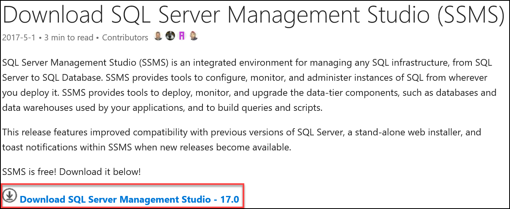

# App Modernization setup

## Requirements

-   Microsoft Azure subscription (non-Microsoft subscription)

-   **Global Administrator role** for Azure AD within your subscription

-   Local machine or a virtual machine configured with (**complete the day before the lab!**):

    -   Visual Studio Community 2017 or greater

        -   (<https://www.visualstudio.com/downloads/>)

    -   Xamarin tools, specifically Xamarin.Android

        -   Install instructions <https://developer.xamarin.com/guides/android/getting_started/installation/windows/#download>

        -   Download and run the Xamarin Unified Installer

            <http://www.xamarin.com/Download>

    -   Azure development workload for Visual Studio 2017

        -   [https://docs.microsoft.com/azure/azure-functions/functions-develop-vs\#prerequisites](https://docs.microsoft.com/azure/azure-functions/functions-develop-vs%23prerequisites)

    -   SQL Server 2016 Express or greater

        -   <https://www.microsoft.com/en-us/download/details.aspx?id=54284>

    -   SQL Server Management Studio (SSMS)

        -   <https://msdn.microsoft.com/library/mt238290.aspx>

    -   (optional) Self-signed certificate for debugging the legacy app environment

    -   PowerShell 1.1.0 or higher


## Before the hands-on lab

Duration: 45 minutes

In this exercise, you will set up your environment for use for the rest of the exercises. This will involve downloading the sample application and creating a Visual Studio Online Team Project.

### Task 1: Set up a development environment

If you do not have a machine with Visual Studio Community 2017 (or greater) with the Azure development workload, complete this task.

1.  Create a virtual machine (VM) in Azure using the Visual Studio Community 2017 on Windows Server 2016 (x64) image. A Windows 10 image will work as well

    

It is highly recommended to use a DS2 or D2 instance size for this VM. If you decide to use a VM, you will not be able to run the Android emulator in later steps of the lab.

### Task 2: Disable IE Enhanced Security

**Note**: Sometimes this image has IE ESC disabled. Sometimes it does not.

1.  On the new VM you just created, click the **Server Manager** icon

    

2.  Click **Local Server**

    

3.  On the right side of the pane, click **On** by IE Enhanced Security Configuration

    

4.  Change to **Off** for Administrators and click **OK**

    

### Task 3: Install Xamarin and Android SDK

1.  Launch **Visual Studio Installer**

2.  Select the **Mobile development with .NET** workload from the installation screen\
    
    

3.  While **Mobile development with .NET** is selected, look at the **Summary** panel to the right. Make sure you have the following options selected: Xamarin Workbooks, Xamarin Profiler, Xamarin Remoted Simulator, Xamarin SDK Manager, Android NDK, Android SDK setup, Java SE Development Kit, Google Android Emulator, and Intel Hardware Accelerated Execution Manager.
    
    

4.  Be sure to allot for extra time, since the Android SDK can be more than 3.0 GB.

### Task 4: Install SQL Server 2016 Express

1.  On the new VM, download and install SQL Server 2016 Express\
    <https://www.microsoft.com/en-us/download/details.aspx?id=54284>\
    \
    **If you are using a machine that already has SQL Server installed**, make sure Mixed Mode authentication is enabled

    <https://technet.microsoft.com/en-us/library/ms188670(v=sql.110).aspx>

2.  Choose **custom** installation once the install dialog box appears.

3.  Select **New SQL Server stand-alone installation**.
    
    

4.  Once installation starts, accept the default settings for each step until you reach the **Database Engine Configuration** section. At this step, select the **Mixed Mode** radio button under the Authentication Mode segment of the Server Configuration tab. Enter a password (such as P\@ssword) for the SA account, and make sure your username is listed under Specify SQL Server administrators. **Please make note of the password you entered in this step**. This will be used later when updating the connection strings in the project configuration files.
    
    

5.  Complete the installation, accepting defaults for the remaining steps.

### Task 5: Install SQL Server Management Studio

1.  On the new VM, click on **Start**, then run the **SQL Server 2016 Installation Center**. When it launches, click on **Installation** on the left-hand pane, then **Install SQL Server Management Tools**.
    
    

2.  This will launch a web browser window, prompting you to download the latest SQL Server Management Studio version. Click on the **Download** link, and then run the executable file on completion.
    
    

3.  Once the download is complete, the Microsoft SQL Server Management Studio installation window will open. Click **Install** to complete the installation. 

    

### Task 6: (optional) Create and configure self-signed certificate

Task 6 is **optional** for users who wish to run the PolicyConnect desktop application within its legacy configuration. SSL is used to encrypt communication between the desktop application and the WCF services, including SQL-based authentication. **This task is not required to complete the lab successfully.**

### Subtask 1: Create self-signed certificate

1.  On the new VM, run the **Developer Command Prompt** for the appropriate version of Visual Studio as an [administrator] from the Start menu

2.  Browse to a folder location you wish to store the certificate files, taking note of the path

3.  Run the following command to create the root CA, and execute:
    ```
    makecert -n "CN=RootCATest" -r -sv RootCATest.pvk RootCATest.cer
    ```

    By default, no **makecert** tool is installed on Windows 10 PC. To install, you need to download Windows 10 SDK from here: <https://developer.microsoft.com/en-us/windows/downloads/windows-10-sdk>
    

4.  In the **Create Private Key Password** dialog box, click **None** without entering the password. Normally this is not recommended for security reasons, but is acceptable for test purposes only.

5.  Now we will install the certificate in the Trusted Root Certification Authorities container

6.  Click **Start**, then type **MMC** and click **OK**. On Windows 10, you will need to type **mmc.exe** after clicking **Start**

7.  In the Microsoft Management Console (MMC), on the **File** menu, click **Add/Remove Snap-in**.

8.  In the **Add Standalone Snap-in** dialog box, select **Certificates** and click **Add**

    

9.  In the **Certificates snap-in** dialog box, select the **Computer account** radio button because the certificate needs to be made available to all users, and click **Next**

10. In the **Select Computer** dialog box, leave the default **Local computer** (the computer this console is running on) selected, and click **Finish**

11. In the **Add/Remove Snap-in** dialog box, click **OK**

12. In the left pane, expand the **Certificates (Local Computer)** node, and then expand the Trusted Root Certification Authorities folder

13. Under **Trusted Root Certification Authorities**, right-click the Certificates subfolder, select **All Tasks**, and click **Import**

14. On the **Certificate Import Wizard** welcome screen, click **Next**

15. On the **File to Import** screen, click **Browse**

16. Browse to the location of the signed Root Certificate Authority RootCATest.cer file copied in Step 3, select the file, and click **Open**

17. On the **File to Import** screen, click **Next**

18. On the **Certificate Store** screen, accept the default choice, and click **Next**

19. On the **Completing the Certificate Import Wizard** screen, click **Finish**.
    
    

20. Leave the MMC window open, as it will be required below

### Subtask 2: Create and install your temporary service certificate

1.  On the new VM, run the **Developer Command Prompt** for the appropriate version of Visual Studio as an [administrator] from the Start menu, or switch over to the command prompt if you had left it open from the previous steps

2.  Browse to the folder location you stored the certificate files

3.  Type in the following command, replacing the \<\<YOUR MACHINE NAME\>\> with your machine name, and execute:\

    ```
    makecert -sk ContosoInsurance -iv RootCATest.pvk -n "CN=<<YOUR MACHINE NAME>>" -ic RootCATest.cer -sr localmachine -ss my -sky exchange -pe
    ```
4.  Keep the command prompt open.

5.  We must now associate this certificate with all SSL transactions within IIS Express. To do this, **re-open the Certificates MMC snap-in** from the previous section.

6.  **Expand** the Personal certificates node on the Certificates tree to the left. You should see a certificate issued to your machine name, and issued by RootCATest. **Double-click your certificate**, and selectthe **Thumbprint** field under the Details tab. **Copy the Thumbprint value**.
    
    

7.  **Launch PowerShell** from the start menu. We will run a command to remove the spaces from the Thumbprint value we copied on the previous step. We will also execute a command to generate a new Guid value.

1.  From the PowerShell command prompt, **paste your certificate's thumbprint between double quotes**, executing the following command (replacing the thumbprint value with your own):
    ```
    "a1 b6 9e 7a be 27 fe 21 fa c7 21 f5 40 72 9f c1 f5 8c dc 4e" -replace " "
    ```

9.  **Copy the output value**, which is your thumbprint with the spaces removed.

10. Go back to the Visual Studio command prompt you left open on step 4. Type in the following command, but **do not execute yet**:
    ```
    netsh http add sslcert ipport=0.0.0.0:44321 appid={c19c7312-ffe4-48da-85e3-f302ad80a625} certhash=a1b69e7abe27fe21fac721f540729fc1f58cdc4e
    ```

    Replace the **certhash** value with the thumbprint you copied in the previous step. Replace the **appid** value with a newly generated Guid. To generate a Guid, switch pack to PowerShell and execute the following command:
    
    ```
    [guid]::NewGuid()
    ```

    Paste the output Guid value in between the curly braces next to **appid** in the Visual Studio command prompt.

11. Execute the netsh command. If you receive an error stating that the "SSL Certificate add failed," you may ignore it. The certificate is now associated with https communications over port 44321

### Subtask 3: Configure the IIS Express self-signed certificate
    
On the new VM, verify that the IIS Express developer certificate bound to localhost is present:

1.  Click **Start**, type **MMC,** and click **OK**

2.  In the Microsoft Management Console (MMC), on the **File** menu, click **Add/Remove Snap-in**

3.  In the **Add Remove Snap-in** dialog box, click **Add**

4.  In the **Add Standalone Snap-in** dialog box, select **Certificates,** and click **Add**

5.  In the **Certificates snap-in** dialog box, select the **Computer account** radio button because the certificate needs to be made available to all users, and click **Next**

6.  In the **Select Computer** dialog box, leave the default **Local computer** (the computer this console is running on) selected, and click **Finish**

7.  In the **Add Standalone Snap-in** dialog box, click **Close**

8.  In the **Add/Remove Snap-in** dialog box, click **OK**

9.  In the left pane, expand the **Certificates (Local Computer)** node, and then expand the **Personal** folder

10. You should see a certificate issued to and issued by "localhost".
    
    

11. If this certificate is not present, you will need to run a repair command for the IIS Express application. If it is present, continue to step 12.

    -   Click on **Start**, then type in **Programs and Features**. Click on the **Programs and Features** application link.

    -   Find and right-click on the IIS Express application listing, and select **Repair**.
        
        

    -   Once the repair has completed, go back to the Certificates MMC snap-in and verify that the localhost certificate is now present under the Personal folder

12. From the Certificates MMC snap-in, right-click on the localhost certificate within the Personal certificates container, then choose **All Tasks Export**...
    
    

13. When the Certificate Export Wizard dialog appears, click on **Next**. Under **Export Private Key**, select **Yes, export the private key**, and click **Next**.
    
    

14. Make sure the **Personal Information Exchange -- PKCS \#12 (.PFX)** file format is selected, and that the first checkbox (include all certificates in the certification path if possible) is checked, leaving the other three unchecked. Click **Next**.
    
    

15. Enter and confirm a password on the next step. **Make note of the password** for the certificate import process. Click **Next**.

16. Specify the name of your exported file by browsing to a folder and typing in the name of the file (such as localhost). Click **Next**.

17. Click **Finish** on the confirmation screen. You will receive a prompt stating that the export was successful. Click **OK** to close the dialog.

18. After the export is complete, expand the **Trusted Root Certification Authorities** folder, then right-click on the Certificates subfolder and select **All Tasks...** **Import**,

19. Click Next, and then browse to the exported certificate location. You may need to select **Personal Information Exchange (\*.pfx,\*.p12)** from the file types dropdown next to the filename field in order to see your certificate listed. Select the certificate, click **Open**, and then **Next**.

20. Type the password you entered while exporting the certificate in step 15, and click **Next**.

21. Make sure that the **Trusted Root Certification Authorities** certificate store is selected, and click Next, then Finish. You will receive a prompt stating that the import was successful. Click **OK** to close the dialog.

### Task 7: Validate connectivity to Azure

1.  From within the virtual machine, launch Visual Studio and validate that you can log in with your Microsoft Account when prompted.

2.  Validate connectivity to your Azure subscription. Launch Visual Studio, open Server Explorer from the View menu, and ensure that you can connect to your Azure subscription.

    

### Task 8: Download and explore the ContosoInsurance sample

1.  Create a new folder on your C: drive named **Hackathon**

2.  Download the sample application from here: <http://bit.ly/2tCZ2Og> and extract to the **Hackathon** folder.

**Note**: The link above is case sensitive.

3.  From the **Contoso.Apps.Insurance.Data** folder under **Hackathon**, open the Visual Studio Solution file: **Contoso.Apps.Insurance.Data.sln**.

4.  The solution contains the following projects:
|    |            |       
|----------|:-------------:|
| **PolicyConnectDesktop** | **Contoso Insurance PolicyConnect desktop application** |
| PolicyConnectDataService | Contoso Insurance data access WCF middle-tier service (legacy environment) |
| PolicyConnectManagementService | Contoso Insurance application management WCF middle-tier service (legacy) |
| Contoso.Apps.Insurance.Data | Data tier |
| Contoso.Apps.Common | Library containing methods common to the application tiers |
| CIMobile | Xamarin-based base mobile app (shared) |
| CIMobile.Droid | Xamarin-based Android app |
| Contoso.Apps.Insurance.Web | Modern PolicyConnect web application |
| Contoso.Apps.Insurance.WebAPI | Web API service |


### Task 9: Attach ContosoInsurance Database

1.  Go to the Start menu and launch **SQL Server Management Studio** (SSMS) as an Administrator (right-click, **Run as administrator**)

2.  Log in to the local SQLEXPRESS instance using default credentials

3.  Right-click on **Databases** on the left-hand menu, and select **Attach...**

1.  In the Attach Databases dialog, click the **Add...** button and browse to C:\\Hackathon\\Database and select ContosoInsurance.mdf. Click OK, then OK once again.
    
    

5.  You should now see the ContosoInsurance database listed underneath the Databases folder.

6.  Now we need to create the ContosoUser account. Click on the New Query button on the top tool bar, and paste the following command:
    ```
    USE [master]

    GO

    CREATE LOGIN [ContosoUser] WITH PASSWORD=N'P@ss4now', DEFAULT_DATABASE=[master], DEFAULT_LANGUAGE=[us_english], CHECK_EXPIRATION=OFF, CHECK_POLICY=OFF
    
    ```

    Click the Execute button, or hit F5

7.  You should now see a ContosoUser listed underneath the Security Logins section of the left-hand menu

1.  Run another query to re-associate the ContosoUser login with the existing database user:
    
    Use ContosoInsurance
    ```
    EXEC sp_change_users_login 'Report'

    EXEC sp_change_users_login 'Auto_Fix', 'ContosoUser'

    EXEC sp_change_users_login 'Report'
    ```

### Task 10: Create a new Azure Resource group

1.  Within the Azure Management Portal, open the **Resource groups** tile, and click **Add**.

    

2.  Specify the name of the resource group as **ContosoInsuranceHackathon**, and choose the Azure region you want to deploy the lab to. This resource group will be used throughout the rest of the lab. Click **Create** to create the resource group.

    

You should follow all steps provided *before* attending the Hands-on lab.
