# Appendix A: Lab environment setup

This appendix provides the steps to manually provision and configure the resources created by the ARM template used before the hands-on lab guide.

**Contents**:

- [Appendix A: Lab environment setup](#Appendix-A-Lab-environment-setup)
  - [Task 1: Create an Azure Storage account](#Task-1-Create-an-Azure-Storage-account)
  - [Task 2: Create the LabVM](#Task-2-Create-the-LabVM)
  - [Task 3: Create SQL Server 2008 R2 virtual machine](#Task-3-Create-SQL-Server-2008-R2-virtual-machine)
  - [Task 4: Provision an Azure SQL Database](#Task-4-Provision-an-Azure-SQL-Database)
  - [Task 5: Create Azure Database Migration Service](#Task-5-Create-Azure-Database-Migration-Service)
  - [Task 6: Provision a Web App](#Task-6-Provision-a-Web-App)
  - [Task 7: Provision an API App](#Task-7-Provision-an-API-App)
  - [Task 8: Provision a Function App](#Task-8-Provision-a-Function-App)
  - [Task 9: Provision API Management](#Task-9-Provision-API-Management)
  - [Task 10: Create Cognitive Services account](#Task-10-Create-Cognitive-Services-account)
  - [Task 11: Create an Azure Key Vault](#Task-11-Create-an-Azure-Key-Vault)
  - [Task 12: Connect to the Lab VM](#Task-12-Connect-to-the-Lab-VM)
  - [Task 13: Install required software on the LabVM](#Task-13-Install-required-software-on-the-LabVM)
  - [Task 14: Open port 1433 on SqlServer2008 VM network security group](#Task-14-Open-port-1433-on-SqlServer2008-VM-network-security-group)
  - [Task 15: Connect to SqlServer2008 VM](#Task-15-Connect-to-SqlServer2008-VM)

> **IMPORTANT**: Many Azure resources require globally unique names. Throughout these steps you will see the word "SUFFIX" as part of resource names. You should replace this with your Microsoft alias, initials, or another value to ensure resources are uniquely named.

## Task 1: Create an Azure Storage account

In this task, you will provision an Azure Storage account, which will be used for storing policy documents, as well as vulnerability assessments performed using SQL Advanced Data Security.

1. In the [Azure portal](https://portal.azure.com/), select **+Create a resource**, enter "storage account" into the Search the Marketplace box and select **Storage account** from the results, and then select **Create**.

    

2. On the Create storage account **Basics** tab, enter the following:

    - Project Details:

        - **Subscription**: Select the subscription you are using for this hands-on lab.
        - **Resource Group**: Select the hands-on-lab-SUFFIX resource group from the list of existing resource groups.

    - Instance Details:

        - **Storage account name**: Enter contosostoreSUFFIX.
        - **Location**: Select the location you are using for resources in this hands-on lab.
        - **Performance**: Choose **Standard**.
        - **Account kind**: Select **StorageV2 (general purpose v2)**.
        - **Replication**: Select **Locally-redundant storage (LRS)**.
        - **Access tier**: Choose **Hot**.

    

3. Select **Review + create**.

4. On the **Review + create** blade, ensure the Validation passed message is displayed and then select **Create**.

## Task 2: Create the LabVM

In this task, you will provision a virtual machine (VM) in Azure. The VM image used will have Visual Studio Community 2019 installed.

1. In the [Azure portal](https://portal.azure.com/), select **+Create a resource**, enter "visual studio 2019" into the Search the Marketplace box, expand the **Visual Studio 2019 Latest** group, and then select **Visual Studio 2019 Community (latest release) on Windows Server 2016 (x64)** from the results.

    

2. Select **Create** on the Visual Studio 2019 Latest blade.

    

3. On the Create a virtual machine **Basics** tab, set the following configuration:

    - Project Details:

        - **Subscription**: Select the subscription you are using for this hands-on lab.
        - **Resource Group**: Select the **hands-on-lab-SUFFIX** resource group from the list of existing resource groups.

    - Instance Details:

        - **Virtual machine name**: Enter LabVM.
        - **Region**: Select the region you are using for resources in this hands-on lab.
        - **Availability options**: Select no infrastructure redundancy required.
        - **Image**: Leave Visual Studio 2019 Community (latest release) on Windows Server 2016 (x64) selected.
        - **Size**: Select **Change size**, and select Standard D2s v3 from the list and then select **Accept**.

    - Administrator Account:

        - **Username**: Enter **demouser**
        - **Password**: Enter **Password.1!!**

    - Inbound Port Rules:

        - **Public inbound ports**: Choose Allow selected ports.
        - **Select inbound ports**: Select RDP (3389) in the list.

    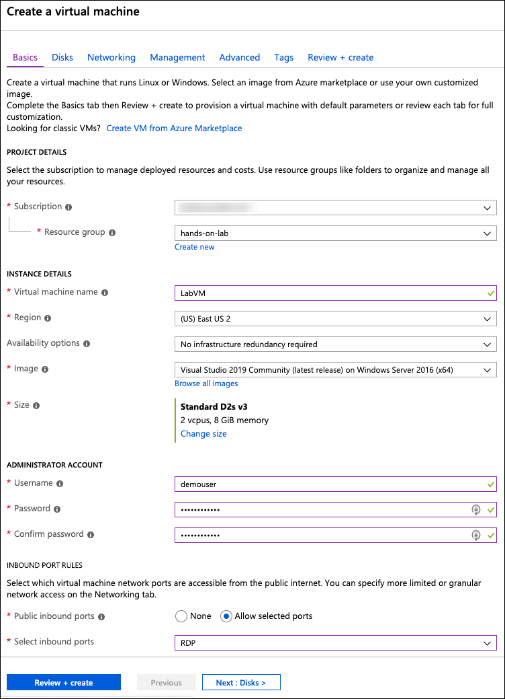

    > **Note**: The remaining tabs can be skipped, and default values will be used.

4. Select **Review + create** to validate the configuration.

5. On the **Review + create** tab, ensure the Validation passed message is displayed, and then select **Create** to provision the virtual machine.

    

6. It will take approximately 10 minutes for the VM to finish provisioning. You can move on to the next task while you wait.

## Task 3: Create SQL Server 2008 R2 virtual machine

In this task, you will provision another virtual machine (VM) in Azure which will host your "on-premises" instance of SQL Server 2008 R2. The VM will use the SQL Server 2008 R2 SP3 Standard on Windows Server 2008 R2 image.

> **Note**: An older version of Windows Server is being used because SQL Server 2008 R2 is not supported on Windows Server 2016.

1. In the [Azure portal](https://portal.azure.com/), select **+Create a resource**, and enter "SQL Server 2008R2SP3 on Windows Server 2008R2" into the Search the Marketplace box.

2. On the **SQL Server 2008 R2 SP3 on Windows Server 2008 R2** blade, select **SQL Server R2 SP3 Standard on Windows Server 2008 R2** for the software plan and then select **Create**.

    

3. On the Create a virtual machine **Basics** tab, set the following configuration:

    - Project Details:

        - **Subscription**: Select the subscription you are using for this hands-on lab.
        - **Resource Group**: Select the hands-on-lab-SUFFIX resource group from the list of existing resource groups.

    - Instance Details:

        - **Virtual machine name**: Enter SqlServer2008.
        - **Region**: Select the region you are using for resources in this hands-on lab.
        - **Availability options**: Select no infrastructure redundancy required.
        - **Image**: Leave SQL Server 2008 R2 SP3 Standard on Windows Server 2008 R2 selected.
        - **Size**: Select **Change size**, and select Standard D2s v3 from the list and then select **Accept**.

    - Administrator Account:

        - **Username**: Enter **demouser**
        - **Password**: Enter **Password.1!!**

    - Inbound Port Rules:

        - **Public inbound ports**: Choose Allow selected ports.
        - **Select inbound ports**: Select RDP (3389) in the list.

    

    > **Note**: The remaining tabs can be skipped, and default values will be used.

4. Select **Review + create** to validate the configuration.

5. On the **Review + create** tab, ensure the Validation passed message is displayed, and then select **Create** to provision the virtual machine.

6. It will take approximately 10 minutes for the SQL VM to finish provisioning. You can move on to the next task while you wait.

## Task 4: Provision an Azure SQL Database

In this task, you will provision an Azure SQL Database (Azure SQL DB).

1. In the [Azure portal](https://portal.azure.com/), select **+Create a resource**, enter "sql database" into the Search the Marketplace box, select **SQL Database** from the results, and then select **Create**.

    

2. On the Create SQL Database **Basics** tab, enter the following:

    - Project Details:

        - **Subscription**: Select the subscription you are using for this hands-on lab.
        - **Resource Group**: Select the hands-on-lab-SUFFIX resource group from the list of existing resource groups.

    - Database Details:

        - **Database name**: Enter ContosoInsurance.
        - **Server**: Select **Create new**, and on the New server blade enter the following:
          - **Server name**: Enter contosoinsuranceSUFFIX.
          - **Server admin login**: Enter demouser.
          - **Password**: Enter Password.1!!
          - **Location**: Select the region you are using for resources in this hands-on lab.
          - **Allow Azure services to access server**: Check this box.
          - Select **Select**.
        - **Want to use SQL elastic pool**: Choose No.
        - **Compute + storage**: Accept the default, SO with 10 DTUs and 250 GB storage.

    

3. Select **Next: Additional settings**.

4. On the **Additional settings** tab, **Enable Advanced Data Security** by selecting **Start free trial**.

    

5. Select **Review + create**

6. On the **Review + create** tab, select **Create** to provision the SQL Database.

## Task 5: Create Azure Database Migration Service

In this task, you will provision an instance of the Azure Database Migration Service (DMS).

1. In the [Azure portal](https://portal.azure.com/), select **+Create a resource**, enter "database migration" into the Search the Marketplace box, select **Azure Database Migration Service** from the results, and select **Create**.

    

2. On the Create Migration Service blade, enter the following:

    - **Service Name**: Enter contoso-dms.
    - **Subscription**: Select the subscription you are using for this hands-on lab.
    - **Resource Group**: Select the hands-on-lab-SUFFIX resource group from the list of existing resource groups.
    - **Location**: Select the location you are using for resources in this hands-on lab.
    - **Virtual network**: Select the **hands-on-lab-SUFFIX-vnet/default** virtual network, and then select **OK**. This will place the DMS instance into the same VNet as your LabVM and SqlServer2008 virtual machines.
    - **Pricing tier**: Select Premium: 4 vCores.

    

    > **Note**: If you see the message `Your subscription doesn't have proper access to Microsoft.DataMigration`, refresh the browser window before proceeding. If the message persists, verify you successfully registered the resource provider, and then you can safely ignore this message.

3. Select **Create**.

4. It can take 15 minutes to deploy the Azure Data Migration Service. You can move on to the next task while you wait.

## Task 6: Provision a Web App

In this task, you will provision an App Service (Web app), which will be used for hosting the Contoso Insurance web application.

1. In the [Azure portal](https://portal.azure.com/), select **+Create a resource**, enter "web app" into the Search the Marketplace box, select **Web App** from the results.

    

2. On the Web App blade, select **Create**.

    

3. On the Create Web App **Basics** tab, set the following configuration:

    - Project Details:

        - **Subscription**: Select the subscription you are using for this hands-on lab.
        - **Resource Group**: Select the hands-on-lab-SUFFIX resource group from the list of existing resource groups.

    - Instance Details:

        - **Name**: Enter contosoinswebSUFFIX.
        - **Publish**: Select Code.
        - **Runtime stack**: Select .NET Core 2.2.
        - **Operating System**: Select Windows.
        - **Location**: Select the location you are using for resources in this hands-on lab.

    - App Service Plan:

        - **Plan**: Select **Create new** and enter **hands-on-lab-asp** for the name.
        - **Sku and size**: Accept the default value of Standard S1.

    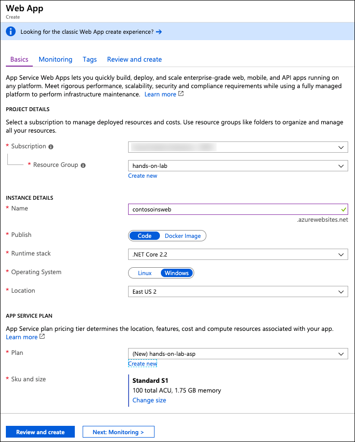

4. Select **Next: Monitoring**.

5. On the **Monitoring** tab, select **No** next to Enable Application Insights.

    

6. Select **Review and create**.

7. On the **Review and create** tab, select **Create**.

8. It will take a few minutes for the Wep App creation to complete. You can move on to the next task while you wait.

## Task 7: Provision an API App

In this task, you will provision an App Service (API App), which will be used for hosting the Contoso Insurance APIs.

1. In the [Azure portal](https://portal.azure.com/), select **+Create a resource**, enter "api app" into the Search the Marketplace box, select **API App** from the results.

    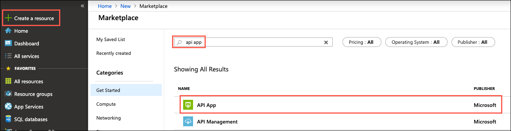

2. On the API App blade, select **Create**.

3. On the API App Create blade, enter the following:

    - **App name**: Enter contosoinsapiSUFFIX.
    - **Subscription**: Select the subscription you are using for this hands-on lab.
    - **Resource Group**: Choose Use exiting and select the hands-on-lab-SUFFIX resource group from the list of existing resource groups.
    - **App Service plan/Location**: Select the hands-on-lab-asp App Service plan.
    - **Application Insights**: Select **Disabled**.

    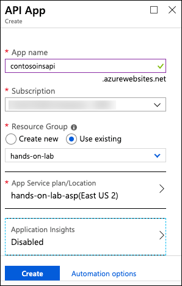

4. Select **Create**.

## Task 8: Provision a Function App

In this task, you will provision Function App, which will be used for retrieving PDF documents from Azure Storage.

1. In the [Azure portal](https://portal.azure.com/), select **+Create a resource**, enter "function app" into the Search the Marketplace box, select **Function App** from the results.

    

2. On the Function App blade, select **Create**.

3. On the Function App Create blade, enter the following:

    - **App name**: Enter contosoinsfuncSUFFIX.
    - **Subscription**: Select the subscription you are using for this hands-on lab.
    - **Resource Group**: Choose Use exiting and select the hands-on-lab-SUFFIX resource group from the list of existing resource groups.
    - **OS**: Select Windows.
    - **Hosting Plan**: Select Consumption Plan.
    - **Location**: Select the location you are using for resources in this hands-on lab.
    - **Runtime Stack**: Select .NET.
    - **Storage**: Choose Create new and accept the default name.
    - **Application Insights**: Select **Disabled**.

    

4. Select **Create**.

## Task 9: Provision API Management

In this task, you will provision API Management, which will be used for managing the Contoso APIs.

1. In the [Azure portal](https://portal.azure.com/), select **+Create a resource**, enter "api management" into the Search the Marketplace box, select **API Management** from the results.

    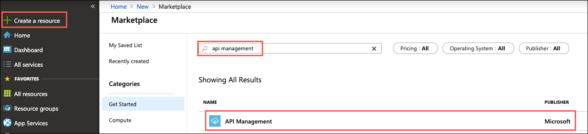

2. On the API Management blade, select **Create**.

3. On the API Management service blade, enter the following:

    - **Name**: Enter contosoinsapimSUFFIX.
    - **Subscription**: Select the subscription you are using for this hands-on lab.
    - **Resource Group**: Select the hands-on-lab-SUFFIX resource group from the list of existing resource groups.
    - **Location**: Select the location you are using for resources in this hands-on lab.
    - **Organization name**: Enter Contoso Insurance.
    - **Administrator email**: Enter an email add that can receive API Management admin notifications.
    - **Pricing tier**: Select Developer (No SLA).
    - **Enable Application Insights**: Uncheck this box.

    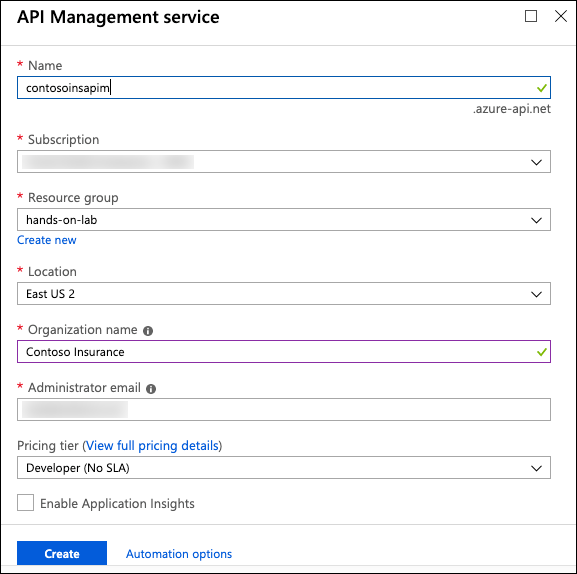

4. Select **Create**.

5. It will take around 30 minutes for API Management to finish provisioning. You can move on to the next task while you wait.

## Task 10: Create Cognitive Services account

In this task, you will create a Cognitive Services account.

1. In the [Azure portal](https://portal.azure.com/), select **+Create a resource**, enter "cognitive services" into the Search the Marketplace box, select **Cognitive Services** from the results.

    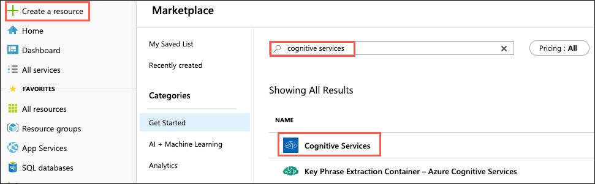

2. On the Cognitive Services blade, select **Create**.

3. On the Cognitive Services Create blade, enter the following:

    - **Name**: Enter contoso-cog-services.
    - **Subscription**: Select the subscription you are using for this hands-on lab.
    - **Location**: Select the region you are using for resources in this hands-on lab.
    - **Pricing tier**: Select S0.
    - **Resource Group**: Select the hands-on-lab-SUFFIX resource group from the list of existing resource groups.
    - Check the box to confirm you have read and understood the notice.

    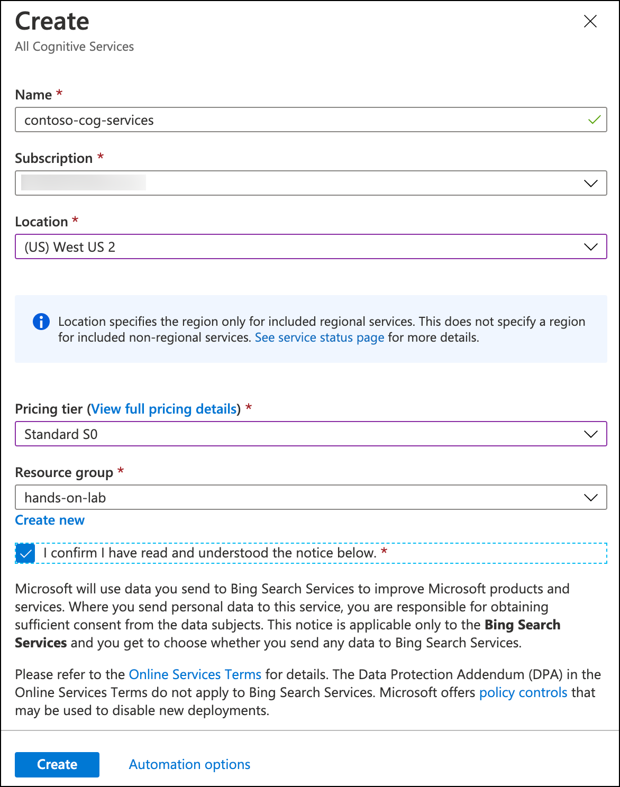

4. Select **Create**.

## Task 11: Create an Azure Key Vault

In this task, you will provision an Azure Key Vault, which will be used for securing application secrets.

1. In the [Azure portal](https://portal.azure.com/), select **+Create a resource**, enter "key vault" into the Search the Marketplace box, select **Key Vault** from the results.

    

2. On the Key Vault blade, select **Create**.

3. On the Create Key Vault blade, enter the following:

    - **Name**: Enter contosoinskv.
    - **Subscription**: Select the subscription you are using for this hands-on lab.
    - **Resource Group**: Select the hands-on-lab-SUFFIX resource group from the list of existing resource groups.
    - **Location**: Select the location you are using for resources in this hands-on lab.
    - **Pricing tier**: Select Standard.
    - **Access policies**: Accept the default value, 1 principal selected. You will configure this later as part of the hands-on lab exercises.
    - **Virtual networks**: Accept the default value, All networks can access.

    

4. Select **Create**.

## Task 12: Connect to the Lab VM

In this task, you will create an RDP connection to your Lab virtual machine (VM), and disable Internet Explorer Enhanced Security Configuration.

1. In the [Azure portal](https://portal.azure.com), select **Resource groups** in the Azure navigation pane, and select the hands-on-lab-SUFFIX resource group from the list.

    

2. In the list of resources for your resource group, select LabVM.

    

3. On your LabVM blade, select **Connect** from the top menu.

    

4. On the Connect to virtual machine blade, select **Download RDP File**, then open the downloaded RDP file.

    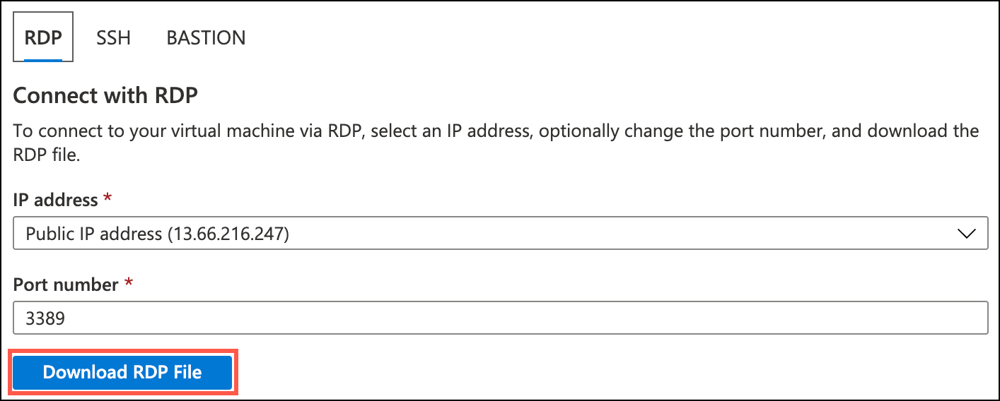

5. Select **Connect** on the Remote Desktop Connection dialog.

    

6. Enter the following credentials when prompted, and then select **OK**:

    - **User name**: demouser
    - **Password**: Password.1!!

    

7. Select **Yes** to connect, if prompted that the identity of the remote computer cannot be verified.

    

8. Once logged in, launch the **Server Manager**. This should start automatically, but you can access it via the Start menu if it does not.

9. Select **Local Server**, then select **On** next to **IE Enhanced Security Configuration**.

    

10. In the Internet Explorer Enhanced Security Configuration dialog, select **Off** under both Administrators and Users, and then select **OK**.

    

11. Close the Server Manager, but leave the connection to the LabVM open for the next task.

## Task 13: Install required software on the LabVM

In this task, you will install SQL Server Management Studio (SSMS) on the LabVM.

1. First, you will install SSMS on the LabVM. Open a web browser on your LabVM, navigate to <https://docs.microsoft.com/en-us/sql/ssms/download-sql-server-management-studio-ssms> and then select the **Download SQL Server Management Studio 18.x** link to download the latest version of SSMS.

    

    > **Note**: Versions change frequently, so if the version number you see does not match the screenshot, just download and install the most recent version.

2. Run the downloaded installer.

3. On the Welcome screen, select **Install** to begin the installation.

    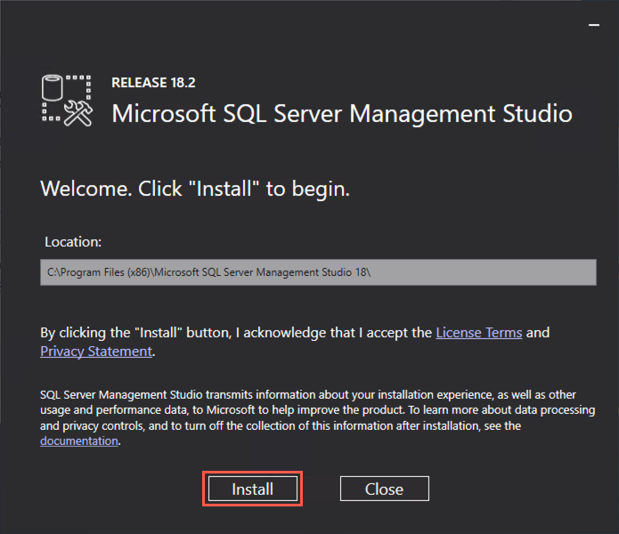

4. Select **Close** when the installation completes.

    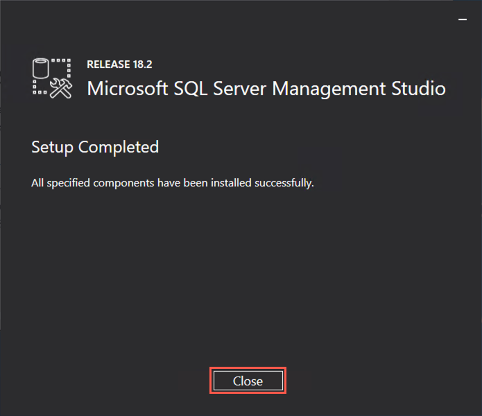

## Task 14: Open port 1433 on SqlServer2008 VM network security group

In this task, you will open port 1433 on the network security group associated with the SqlServer2008 VM to allow external communication with SQL Server.

1. In the [Azure portal](https://portal.azure.com), select **Resource groups** in the Azure navigation pane, enter your resource group name (hands-on-lab-SUFFIX) into the filter box, and select it from the list.

    

2. In the list of resources for your resource group, select the SqlServer2008 VM.

    

3. On the SqlServer2008 blade, select **Networking** under Settings in the left-hand menu, and then select **Add inbound port rule**.

    

4. On the **Add inbound security rule blade**, enter the following:

    - Select **Basic** on the toolbar to switch to the basic view.
    - **Service**: Select MS SQL.
    - **Port ranges**: Value will be set to 1433.
    - **Priority**: Accept the default priority value.
    - **Name**: Enter SqlServer.

    

5. Select **Add**. Remain on the SqlServer2008 VM blade for the next step.

## Task 15: Connect to SqlServer2008 VM

In this task, you will open an RDP connection to the SqlServer2008 VM, disable Internet Explorer Enhanced Security Configuration, and add a firewall rule to open port 1433 to inbound TCP traffic. You will also install Data Migration Assistant (DMA).

1. As you did for the LabVM, navigate to the SqlServer2008 VM blade in the Azure portal, select **Overview** from the left-hand menu, and then select **Connect** on the top menu.

    

2. On the Connect to virtual machine blade, select **Download RDP File**, then open the downloaded RDP file.

3. Select **Connect** on the Remote Desktop Connection dialog.

    

4. Enter the following credentials when prompted, and then select **OK**:

    - **User name**: demouser
    - **Password**: Password.1!!

    

5. Select **Yes** to connect, if prompted that the identity of the remote computer cannot be verified.

    

6. Once logged in, launch the **Server Manager**. This should start automatically, but you can access it via the Start menu if it does not.

7. On the **Server Manager** view, select **Configure IE ESC** under Security Information.

    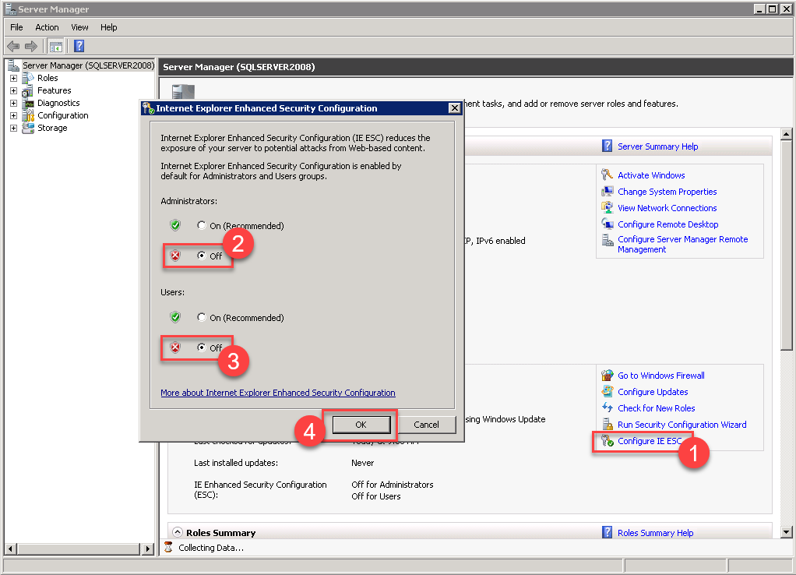

8. In the Internet Explorer Enhanced Security Configuration dialog, select **Off** under both Administrators and Users, and then select **OK**.

    

9. Back in the Server Manager, expand **Configuration** and **Windows Firewall with Advanced Security**.

    

10. Right-click on **Inbound Rules** and then select **New Rule** from the context menu.

    

11. In the New Inbound Rule Wizard, under Rule Type, select **Port**, then select **Next**.

    

12. In the Protocol and Ports dialog, use the default **TCP**, and enter **1433** in the Specific local ports text box, and then select **Next**.

    

13. In the Action dialog, select **Allow the connection**, and then select **Next**.

    

14. In the Profile step, check **Domain**, **Private**, and **Public**, then select **Next**.

    

15. On the Name screen, enter **SqlServer** for the name, and select **Finish**.

    

16. Close the Server Manager.

17. Next, you will install DMA by navigating to <https://www.microsoft.com/en-us/download/details.aspx?id=53595> in a web browser on the SqlServer2008 VM, and then selecting the **Download** button.

    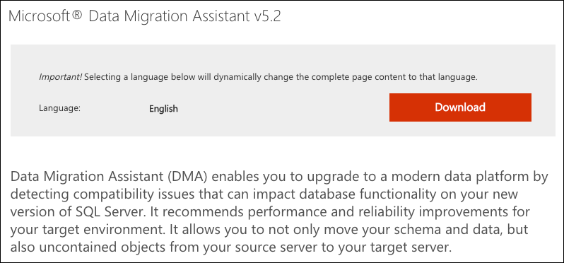

18. Run the downloaded installer.

19. Select **Next** on each of the screens, accepting to the license terms and privacy policy in the process.

20. Select **Install** on the Privacy Policy screen to begin the installation.

21. On the final screen, select **Finish** to close the installer.

    
