<div class="MCWHeader1">
App modernization
</div>

<div class="MCWHeader2">
Hands-on lab step-by-step guide
</div>

<div class="MCWHeader3">
June 2019
</div>

Information in this document, including URL and other Internet Web site references, is subject to change without notice. Unless otherwise noted, the example companies, organizations, products, domain names, e-mail addresses, logos, people, places, and events depicted herein are fictitious, and no association with any real company, organization, product, domain name, e-mail address, logo, person, place or event is intended or should be inferred. Complying with all applicable copyright laws is the responsibility of the user. Without limiting the rights under copyright, no part of this document may be reproduced, stored in or introduced into a retrieval system, or transmitted in any form or by any means (electronic, mechanical, photocopying, recording, or otherwise), or for any purpose, without the express written permission of Microsoft Corporation.

Microsoft may have patents, patent applications, trademarks, copyrights, or other intellectual property rights covering subject matter in this document. Except as expressly provided in any written license agreement from Microsoft, the furnishing of this document does not give you any license to these patents, trademarks, copyrights, or other intellectual property.

The names of manufacturers, products, or URLs are provided for informational purposes only and Microsoft makes no representations and warranties, either expressed, implied, or statutory, regarding these manufacturers or the use of the products with any Microsoft technologies. The inclusion of a manufacturer or product does not imply endorsement of Microsoft of the manufacturer or product. Links may be provided to third party sites. Such sites are not under the control of Microsoft and Microsoft is not responsible for the contents of any linked site or any link contained in a linked site, or any changes or updates to such sites. Microsoft is not responsible for webcasting or any other form of transmission received from any linked site. Microsoft is providing these links to you only as a convenience, and the inclusion of any link does not imply endorsement of Microsoft of the site or the products contained therein.

© 2019 Microsoft Corporation. All rights reserved.

Microsoft and the trademarks listed at <https://www.microsoft.com/en-us/legal/intellectualproperty/Trademarks/Usage/General.aspx> are trademarks of the Microsoft group of companies. All other trademarks are property of their respective owners.

**Contents**

<!-- TOC -->

- [App modernization hands-on lab step-by-step](#App-modernization-hands-on-lab-step-by-step)
  - [Abstract and learning objectives](#Abstract-and-learning-objectives)
  - [Overview](#Overview)
  - [Solution architecture](#Solution-architecture)
  - [Requirements](#Requirements)
  - [Exercise 1: Migrate the on-premises database to Azure SQL Database](#Exercise-1-Migrate-the-on-premises-database-to-Azure-SQL-Database)
    - [Task 1: Restore and configure the ContosoInsurance database on the SqlServer2008 VM](#Task-1-Restore-and-configure-the-ContosoInsurance-database-on-the-SqlServer2008-VM)
    - [Task 2: Perform assessment for migration to Azure SQL Database](#Task-2-Perform-assessment-for-migration-to-Azure-SQL-Database)
    - [Task 3: Migrate the database schema using the Data Migration Assistant](#Task-3-Migrate-the-database-schema-using-the-Data-Migration-Assistant)
    - [Task 4: Retrieve SQL Server 2008 VM IP address](#Task-4-Retrieve-SQL-Server-2008-VM-IP-address)
    - [Task 5: Migrate the data using the Azure Database Migration Service](#Task-5-Migrate-the-data-using-the-Azure-Database-Migration-Service)
  - [Exercise 2: Post upgrade database enhancements](#Exercise-2-Post-upgrade-database-enhancements)
    - [Task 1: Configure SQL Data Discovery and Classification](#Task-1-Configure-SQL-Data-Discovery-and-Classification)
    - [Task 2: Review Advanced Data Security Vulnerability Assessment](#Task-2-Review-Advanced-Data-Security-Vulnerability-Assessment)
    - [Task 3: Enable Dynamic Data Masking](#Task-3-Enable-Dynamic-Data-Masking)
  - [Exercise 3: Configure Key Vault](#Exercise-3-Configure-Key-Vault)
    - [Task 1: Set Key Vault access policies](#Task-1-Set-Key-Vault-access-policies)
    - [Task 2: Create a new secret to store the SQL connection string](#Task-2-Create-a-new-secret-to-store-the-SQL-connection-string)
    - [Task 3: Create service principal for the web app using Azure CLI and grant access to Key Vault](#Task-3-Create-service-principal-for-the-web-app-using-Azure-CLI-and-grant-access-to-Key-Vault)
  - [Exercise 4: Migrate web and API apps into App Services](#Exercise-4-Migrate-web-and-API-apps-into-App-Services)
    - [Task 1: Deploy to Azure with Visual Studio](#Task-1-Deploy-to-Azure-with-Visual-Studio)
    - [Task 2: Define server size and rules for auto-scaling](#Task-2-Define-server-size-and-rules-for-auto-scaling)
    - [Task 3: Visual Studio IDE integration](#Task-3-Visual-Studio-IDE-integration)
    - [Task 4: Configure backups](#Task-4-Configure-backups)
  - [Exercise 5: Upload policy documents into blob storage](#Exercise-5-Upload-policy-documents-into-blob-storage)
    - [Task 1: Create container for storing PDFs in Azure storage](#Task-1-Create-container-for-storing-PDFs-in-Azure-storage)
    - [Task 2: Bulk upload PDFs to blob storage using AzCopy](#Task-2-Bulk-upload-PDFs-to-blob-storage-using-AzCopy)
  - [Exercise 6: Create serverless API for accessing PDFs](#Exercise-6-Create-serverless-API-for-accessing-PDFs)
    - [Task 1: Retrieve URL for a policy document in Azure storage](#Task-1-Retrieve-URL-for-a-policy-document-in-Azure-storage)
    - [Task 2: Create an Azure Functions Proxy](#Task-2-Create-an-Azure-Functions-Proxy)
    - [Task 3: Parameterize Azure Functions Proxy](#Task-3-Parameterize-Azure-Functions-Proxy)
  - [Exercise 7: Add Cognitive Search for policy documents](#Exercise-7-Add-Cognitive-Search-for-policy-documents)
    - [Task 1: Add Azure Search to Blob Storage account](#Task-1-Add-Azure-Search-to-Blob-Storage-account)
    - [Task 2: Review search results](#Task-2-Review-search-results)
  - [Exercise 8: Import and publish APIs into APIM](#Exercise-8-Import-and-publish-APIs-into-APIM)
    - [Task 1: Import Web Api](#Task-1-Import-Web-Api)
  - [Exercise 9: Create and configure SignalR service](#Exercise-9-Create-and-configure-SignalR-service)
  - [Exercise 10: Update web app](#Exercise-10-Update-web-app)
    - [Task 1: Update to use Key Vault](#Task-1-Update-to-use-Key-Vault)
    - [Task 2: Update to use APIs](#Task-2-Update-to-use-APIs)
    - [Task 3: Add Application Insights](#Task-3-Add-Application-Insights)
    - [Task 4: Create a deployment slot.](#Task-4-Create-a-deployment-slot)
    - [Task 5: Deploy updated web app to new deployment slot via VS](#Task-5-Deploy-updated-web-app-to-new-deployment-slot-via-VS)
    - [Task 6: View Live Metrics in App Insights in the Azure portal](#Task-6-View-Live-Metrics-in-App-Insights-in-the-Azure-portal)
  - [Exercise 11: Configure and run the Xamarin mobile app](#Exercise-11-Configure-and-run-the-Xamarin-mobile-app)
    - [Task 1: Run the Xamarin Mobile App](#Task-1-Run-the-Xamarin-Mobile-App)
    - [Task 2: Update Xamarin mobile app to use new APIs through APIM](#Task-2-Update-Xamarin-mobile-app-to-use-new-APIs-through-APIM)
  - [Exercise 12: Configure and run the legacy desktop (Windows Forms) application](#Exercise-12-Configure-and-run-the-legacy-desktop-Windows-Forms-application)
    - [Task 1: Configure application settings in App.config](#Task-1-Configure-application-settings-in-Appconfig)
    - [Task 2: Run the desktop application](#Task-2-Run-the-desktop-application)
  - [Exercise 13: Create an app in PowerApps](#Exercise-13-Create-an-app-in-PowerApps)
    - [Task 1: Sign up for a PowerApps account](#Task-1-Sign-up-for-a-PowerApps-account)
    - [Task 2: Create new SQL connection](#Task-2-Create-new-SQL-connection)
    - [Task 3: Create a new app](#Task-3-Create-a-new-app)
    - [Task 4: Design app](#Task-4-Design-app)
    - [Task 5: Edit the app settings and run the app](#Task-5-Edit-the-app-settings-and-run-the-app)
  - [After the hands-on lab](#After-the-hands-on-lab)
    - [Task 1: Delete Azure resource groups](#Task-1-Delete-Azure-resource-groups)
    - [Task 2: Delete the contoso-insurance service principal](#Task-2-Delete-the-contoso-insurance-service-principal)

<!-- /TOC -->

# App modernization hands-on lab step-by-step

## Abstract and learning objectives

In this hands-on lab, you will implement the steps to modernize a legacy on-premises application, including upgrading and migrating the database to Azure and updating the application to take advantage of serverless and cloud services.

At the end of this hands-on lab, you will be better able to build solutions for modernizing legacy on-premises applications and infrastructure using cloud services.

## Overview

Contoso, Ltd. (Contoso) is a new company in an old business. Founded in Auckland, NZ, in 2014, they provide a full range of long-term insurance services to help individuals who are under-insured, filling a void their founders saw in the market. From the beginning, they grew faster than anticipated and have struggled to cope with rapid growth. During their first year alone, they added over 100 new employees to keep up with the demand for their services. To manage policies and associated documentation, they use a custom developed Windows Forms application, called PolicyConnect. PolicyConnect uses an on-premises SQL Server 2008 R2 database as its data store, along with a file server on their local area network for storing policy documents. That application and its underlying processes for managing policies have become increasingly overloaded.

To allow policyholders, brokers and employees to access policy information without requiring them to VPN into the Contoso network, they recently launched projects to create new web and mobile applications. For the web application, they have created a new .NET Core 2.2 MVC web application, which accesses the PolicyConnect database using REST APIs. They eventually intend to have the REST APIs be shared across all of their applications, including the mobile application and WinForms version of PolicyConnect. They have a prototype of the web application running on-premises, and are interested in taking their modernization efforts a step further by hosting the application in the cloud. However, they don't know how to really take advantage of all the managed services of the cloud since they have no experience with it and would like to know how to take what they've created so far and make it more cloud-native.

They have not started development of a mobile app yet, and are looking for guidance on how they can take a .NET developer-friendly approach to implement the PolicyConnect mobile app on Android and iOS.

To prepare for hosting their applications in the cloud, they would like to migrate their SQL Server database to a PaaS SQL service in Azure. Contoso would like to migrate their new web application to the cloud,and optimize that application to run in the cloud, including taking advantage of serverless technologies and advanced security features available in a fully-managed SQL service in the Azure. By migrating to the cloud, they hope to improve their technological capabilities and take advantage of enhancements and services that are enabled by moving to the cloud, including adding automated document forwarding from brokers, securing access for brokers to Contoso, allowing access to policy information, and providing easy policy retrieval for a dispersed workforce. They have been clear that they will continue using the PolicyConnect WinForms application on-premises, but want to update the application to use cloud-based APIs and services. Additionally, they want to store policy documents in cloud storage for retrieval via the web and mobile applications.

## Solution architecture

Below is a diagram of the solution architecture you will build in this lab. Please study this carefully, so you understand the whole of the solution as you are working on the various components.

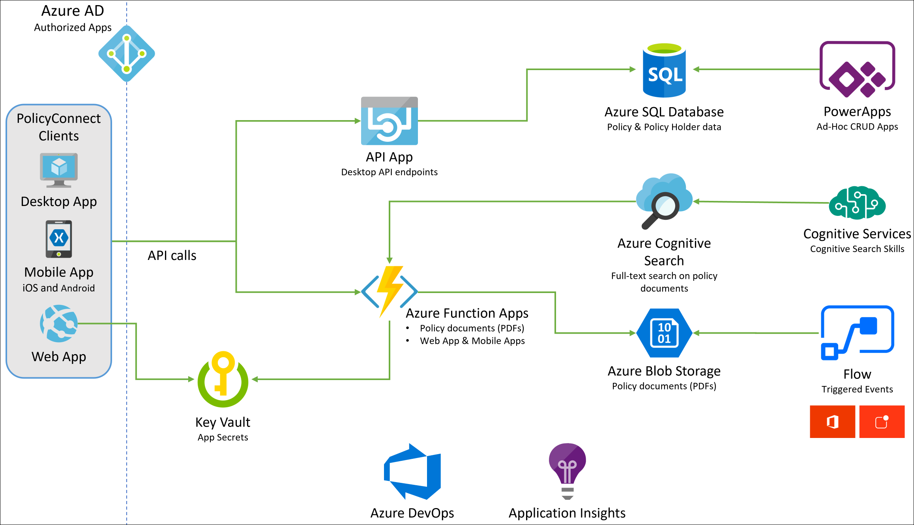

The solution begins with migrating Contoso's SQL Server 2008 R2 database to Azure SQL Database using the Azure Database Migration Service. After performing an assessment using the Data Migration Assistant, Contoso was able to determine that there were no compatibility issues or unsupported features to prevent them from migrating into a fully-managed SQL database service in Azure. Next, the web and API apps are migrated into Azure App Services. In addition, mobile apps, built for Android and iOS using Xamarin, are created to provide access to PolicyConnect. The website, hosted in a Web App, provides the user interface for browser-based clients, whereas the Xamarin Forms-based apps provide the UI to mobile devices. Both the mobile app and website rely on web services hosted in an a Function App, which sits behind API Management. An API App is also deployed to host APIs for the legacy Windows Forms desktop application. Light-weight, serverless APIs are provided by Azure Functions and Azure Functions Proxies to provide access to the database and policy documents stored in Blob Storage. Azure API Management is used to create an API Store for development teams and affiliated partners. Sensitive configuration data, like connection strings, are stored in Key Vault and accessed from the APIs or Web App on demand so that these settings never live in their file system. The API App uses the Azure Redis Cache to implement the cache aside pattern, caching data as it is retrieved from SQL Database. A full-text cognitive search pipeline is used to index policy documents in Blob Storage. Cognitive Services are used to enable search index enrichment using cognitive skills in Azure Search. PowerApps enable authorized business users to build mobile and web create, read, update, delete (CRUD) applications that interact with SQL Database and Azure Storage, while Microsoft Flow enables them to orchestrations between services such as Office 365 email and services for sending mobile notifications. These orchestrations can be used independently of PowerApps or invoked by PowerApps to provide additional logic. The solution uses user and application identities maintained in Azure AD.

## Requirements

- Microsoft Azure subscription must be pay-as-you-go or MSDN.
  - Trial subscriptions will not work.
  - Rights to create an Azure Active Directory application and service principal and assign roles on your subscription.
- A virtual machine configured with Visual Studio Community 2019 or higher (setup in the Before the hands-on lab exercises)

## Exercise 1: Migrate the on-premises database to Azure SQL Database

Duration: 40 minutes

In this exercise, you will use the Microsoft Data Migration Assistant (DMA) to perform an assessment on the `ContosoInsurance` database for a migration to Azure SQL Database. The assessment will provide a report about any feature parity and compatibility issues between the on-premises database and the Azure SQL DB.

> DMA helps you upgrade to a modern data platform by detecting compatibility issues that can impact database functionality in your new version of SQL Server or Azure SQL Database. DMA recommends performance and reliability improvements for your target environment and allows you to move your schema, data, and uncontained objects from your source server to your target server. To learn more, read the [Data Migration Assistant documentation](https://docs.microsoft.com/sql/dma/dma-overview?view=azuresqldb-mi-current).

### Task 1: Restore and configure the ContosoInsurance database on the SqlServer2008 VM

Before you begin the assessment, you need to restore a copy of the `ContosoInsurance` database in your SQL Server 2008 R2 instance. In this task, you will create an RDP connection to the SqlServer2008 VM and then restore the `ContosoInsurance` database onto the SQL Server 2008 R2 instance using a backup provided by Contoso, Ltd.

1. In the [Azure portal](https://portal.azure.com), navigate to your **SqlServer2008** VM by selecting **Resource groups** from the left-hand navigation menu, selecting the **hands-on-lab-SUFFIX** resource group, and selecting the **SqlServer2008** VM from the list of resources.

   

2. On the SqlServer2008 Virtual Machine's **Overview** blade, select **Connect** on the top menu.

   

3. On the Connect to virtual machine blade, select **Download RDP File**, then open the downloaded RDP file.

4. Select **Connect** on the Remote Desktop Connection dialog.

   

5. Enter the following credentials when prompted, and then select **OK**:

   - **Username**: demouser
   - **Password**: Password.1!!

   

6. Select **Yes** to connect, if prompted that the identity of the remote computer cannot be verified.

   

7. Once logged into the SqlServer2008 VM, download a [backup of the ContosoInsurance database](https://raw.githubusercontent.com/kylebunting/MCW-App-modernization/master/Hands-on%20lab/lab-files/Database/ContosoInsurance.zip), and extract the zipped files into `C:\ContosoInsurance` on the VM.

   > TODO: Update above link to MS repo.

8. Next, open **Microsoft SQL Server Management Studio 17** by entering "sql server" into the search bar in the Windows Start menu.

   

9. In the SSMS **Connect to Server** dialog, enter **SQLSERVER2008** into the Server name box, ensure **Windows Authentication** is selected, and then select **Connect**.

   

10. Once connected, right-click **Databases** under SQLSERVER2008 in the Object Explorer, and then select **Attach...** from the context menu.

    

11. You will now attach the `ContosoInsurance` database using the downloaded `ContosoInsurance.mdf` and `ContosoInsurance_log.ldf` files. On the **General** page of the Attach Databases dialog, select the **Add** button, and in the Locate Database Files dialog, expand the ContosoInsurance folder, select `ContosoInsurance.mdf`, and then select **OK**.

    

12. Back on the Attach Databases dialog, verify you see the ContosoInsurance Data and Log files under database details, and then select **OK**.

    

13. You should now see the `ContosoInsurance` database listed under Databases.

    

14. Next, you will execute a script in SSMS, which will reset the `sa` password, enable mixed mode authentication, create the `WorkshopUser` account, and change the database recovery model to FULL. To create the script, open a new query window in SSMS by selecting **New Query** in the SSMS toolbar.

    

15. Copy and paste the SQL script below into the new query window:

    ```sql
    USE master;
    GO

    -- SET the sa password
    ALTER LOGIN [sa] WITH PASSWORD=N'Password.1!!';
    GO

    -- Enable Mixed Mode Authentication
    EXEC xp_instance_regwrite N'HKEY_LOCAL_MACHINE',
    N'Software\Microsoft\MSSQLServer\MSSQLServer', N'LoginMode', REG_DWORD, 2;
    GO

    -- Create a login and user named WorkshopUser
    CREATE LOGIN WorkshopUser WITH PASSWORD = N'Password.1!!';
    GO

    EXEC sp_addsrvrolemember
        @loginame = N'WorkshopUser',
        @rolename = N'sysadmin';
    GO

    USE ContosoInsurance;
    GO

    IF NOT EXISTS (SELECT * FROM sys.database_principals WHERE name = N'WorkshopUser')
    BEGIN
        CREATE USER [WorkshopUser] FOR LOGIN [WorkshopUser]
        EXEC sp_addrolemember N'db_datareader', N'WorkshopUser'
    END;
    GO

    -- Update the recovery model of the database to FULL
    ALTER DATABASE ContosoInsurance SET RECOVERY FULL;
    GO
    ```

16. To run the script, select **Execute** from the SSMS toolbar.

    

17. For Mixed Mode Authentication and the new `sa` password to take effect, you must restart the SQL Server (MSSQLSERVER) Service on the SqlServer2008 VM. To do this, you can use SSMS. Right-click the SQLSERVER2008 instance in the SSMS Object Explorer, and then select **Restart** from the context menu.

    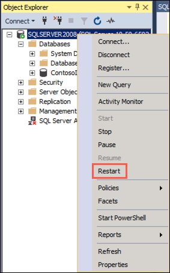

18. When prompted about restarting the MSSQLSERVER service, select **Yes**. The service will take a few seconds to restart.

    

### Task 2: Perform assessment for migration to Azure SQL Database

Contoso, Ltd. would like an assessment to see what potential issue they would have to address in moving their database to Azure SQL Database. In this task, you will use the Microsoft Data Migration Assistant (DMA) to perform an assessment of the `ContosoInsurance` database against Azure SQL Database (Azure SQL DB). The assessment will provide a report about any feature parity and compatibility issues between the on-premises database and the Azure SQL DB service.

1. On the SqlServer2008 VM, launch DMA from the Windows Start menu by typing "data migration" into the search bar, and then selecting **Microsoft Data Migration Assistant** in the search results.

   

2. In the DMA dialog, select **+** from the left-hand menu to create a new project.

   

3. In the New project pane, set the following:

   - **Project type**: Select Assessment.
   - **Project name**: Enter Assessment.
   - **Source server type**: Select SQL Server.
   - **Target server type**: Select Azure SQL Database.

   

4. Select **Create**.

5. On the **Options** screen, ensure **Check database compatibility** and **Check feature parity** are both checked, and then select **Next**.

    

6. On the **Sources** screen, enter the following into the **Connect to a server** dialog that appears on the right-hand side:

   - **Server name**: Enter **SQLSERVER2008**.
   - **Authentication type**: Select **SQL Server Authentication**.
   - **Username**: Enter **WorkshopUser**
   - **Password**: Enter **Password.1!!**
   - **Encrypt connection**: Check this box.
   - **Trust server certificate**: Check this box.

   

7. Select **Connect**.

8. On the **Add sources** dialog that appears next, check the box for `ContosoInsurance` and select **Add**.

   

9. Select **Start Assessment**.

   

10. Take a moment to review the assessment for migrating to Azure SQL DB. The SQL Server feature parity report shows that Analysis Services and SQL Server Reporting Services are unsupported, but these are not affecting any objects in the `ContosoInsurance` database, so won't block a migration.

    

11. Now, select **Compatibility issues** so you can review that report as well.

    

> The DMA assessment for a migrating the `ContosoInsurance` database to a target platform of Azure SQL DB reveals that there are no issues or features that will prevent Contoso, Ltd. from migrating their database to Azure SQL DB. You can select **Export report** to save the report as a JSON file, if desired.

### Task 3: Migrate the database schema using the Data Migration Assistant

After you have reviewed the assessment results and you have ensured the database is a candidate for migration to Azure SQL Database, use the Data Migration Assistant to migrate the schema to Azure SQL Database.

1. On the SqlServer2008 VM, return to the Data Migration Assistant, and select the New **(+)** icon in the left-hand menu.

2. In the New project dialog, enter the following:

   - **Project type**: Select Migration.
   - **Project name**: Enter Migration.
   - **Source server type**: Select SQL Server.
   - **Target server type**: Select Azure SQL Database.
   - **Migration scope**: Select Schema only.

   

3. Select **Create**.

4. On the **Select source** tab, enter the following:

   - **Server name**: Enter **SQLSERVER2008**.
   - **Authentication type**: Select **SQL Server Authentication**.
   - **Username**: Enter **WorkshopUser**
   - **Password**: Enter **Password.1!!**
   - **Encrypt connection**: Check this box.
   - **Trust server certificate**: Check this box.
   - Select **Connect**, and then ensure the `ContosoInsurance` database is selected from the list of databases.

   

5. Select **Next**.

6. For the **Select target** tab, you will need to retrieve the server associated with your Azure SQL Database. In the [Azure portal](https://portal.azure.com), navigate to your **SQL database** resource by selecting **Resource groups** from the left-hand navigation menu, selecting the **hands-on-lab-SUFFIX** resource group, and then selecting the **ContosoInsurance** SQL database resource from the list of resources.

   

7. On the Overview blade of your SQL database, copy the **Server name**.

   

8. Return to DMA, and on the **Select target** tab, enter the following:

   - **Server name**: Paste the server name of your Azure SQL Database you copied above.
   - **Authentication type**: Select SQL Server Authentication.
   - **Username**: Enter **demouser**
   - **Password**: Enter **Password.1!!**
   - **Encrypt connection**: Check this box.
   - **Trust server certificate**: Check this box.
   - Select **Connect**, and then ensure the `ContosoInsurance` database is selected from the list of databases.

   

9. Select **Next**.

10. On the **Select objects** tab, leave all the objects checked, and select **Generate SQL script**.

    

11. On the **Script & deploy schema** tab, review the script. Notice the view also provides a note that there are not blocking issues.

    

12. Select **Deploy schema**.

13. After the schema is deployed, review the deployment results, and ensure there were no errors.

    

14. Next, open SSMS on the SqlServer2008 VM, and connect to your Azure SQL Database, by selecting **Connect->Database Engine** in the Object Explorer, and then entering the following into the Connect to server dialog:

    - **Server name**: Paste the server name of your Azure SQL Database you copied above.
    - **Authentication type**: Select SQL Server Authentication.
    - **Username**: Enter **demouser**
    - **Password**: Enter **Password.1!!**
    - **Remember password**: Check this box.

    

15. Select **Connect**.

16. Once connected, expand **Databases**, and expand **ContosoInsurance**, then expand **Tables**, and observe the schema has been created.

    

### Task 4: Retrieve SQL Server 2008 VM IP address

In this task, you will use the Azure Cloud shell to retrieve the IP address of the SqlServer2008 VM, which is needed to connect to your SqlServer2008 VM from DMS.

1. In the [Azure portal](https://portal.azure.com), select the Azure Cloud Shell icon from the top menu.

    

2. In the Cloud Shell window that opens at the bottom of your browser window, select **PowerShell**.

    

3. If prompted that you have no storage mounted, select the subscription you are using for this hands-on lab and select **Create storage**.

    

    > **Note**: If creation fails, you may need to select **Advanced settings** and specify the subscription, region and resource group for the new storage account.

4. After a moment, you will receive a message that you have successfully requested a Cloud Shell, and be presented with a PS Azure prompt.

    

5. At the prompt, you will retrieve the public IP address of the SqlServer2008 VM, which you will use to connect to the database on that server. Enter the following PowerShell command, **replacing SUFFIX** with your unique identifier:

    ```powershell
    az vm list-ip-addresses -g hands-on-lab-SUFFIX -n SqlServer2008
    ```

6. Within the output of the command above, locate and copy the value of the `ipAddress` property within the `publicIpAddresses` object. Paste the value into a text editor, such as Notepad.exe, for later reference.

    

### Task 5: Migrate the data using the Azure Database Migration Service

At this point, you have migrated the database schema using DMA. In this task, you will migrate the data from the `ContosoInsurance` database into the new Azure SQL Database using the Azure Database Migration Service.

1. In the [Azure portal](https://portal.azure.com), navigate to your Azure Database Migration Service by selecting **Resource groups** from the left-hand navigation menu, selecting the **hands-on-lab-SUFFIX** resource group, and then selecting the **contoso-dms** Azure Database Migration Service in the list of resources.

   

2. On the Azure Database Migration Service blade, select **+New Migration Project**.

   

3. On the New migration project blade, enter the following:

    - **Project name**: Enter DataMigration.
    - **Source server type**: Select SQL Server.
    - **Target server type**: Select Azure SQL Database.
    - **Choose type of activity**: Select **Offline data migration** and select **Save**.

    

4. Select **Create and run activity**.

5. On the Migration Wizard **Select source** blade, enter the following:

    - **Source SQL Server instance name**: Enter the IP address of your SqlServer2008 VM that you copied into a text editor in the previous task. For example, `13.66.228.107`.
    - **Authentication type**: Select SQL Authentication.
    - **Username**: Enter **WorkshopUser**
    - **Password**: Enter **Password.1!!**
    - **Connection properties**: Check both Encrypt connection and Trust server certificate.

    

6. Select **Save**.

7. On the Migration Wizard **Select target** blade, enter the following:

    - **Target server name**: Enter the server name associated with your Azure SQL Database (e.g., contosoinsurance-jt7yc3zphxfda.database.windows.net).
    - **Authentication type**: Select SQL Authentication.
    - **Username**: Enter **demouser**
    - **Password**: Enter **Password.1!!**
    - **Connection properties**: Check Encrypt connection.

    

8. Select **Save**.

9. On the Migration Wizard **Map to target databases** blade, confirm that **ContosoInsurance** is checked as the source database, and that it is also the target database on the same line, then select **Save**.

    

10. Select **Save**.

11. On the Migration Wizard **Configure migration settings** blade, expand the **ContosoInsurance** database and verify all the tables are selected.

    

12. Select **Save**.

13. On the Migration Wizard **Summary** blade, enter the following:

    - **Activity name**: Enter ContosoDataMigration.
    - **Validation option**: Select Validate my database(s), check all three Validation options, and then select **Save**.

    

14. Select **Run migration**.

15. Monitor the migration on the status screen that appears. Select the refresh icon in the toolbar to retrieve the latest status.

    

    > The migration will take 2 - 3 minutes to complete.

16. When the migration is complete, you will see the status as **Completed**.

    

## Exercise 2: Post upgrade database enhancements

Duration: 20 minutes

In this exercise you will explore some of the security features of Azure SQL Database, and review some of the security benefits that come with running your database in Azure. [SQL Database Advance Data Security](https://docs.microsoft.com/azure/sql-database/sql-database-advanced-data-security) (ADS) provides advanced SQL security capabilities, including functionality for discovering and classifying sensitive data, surfacing and mitigating potential database vulnerabilities, and detecting anomalous activities that could indicate a threat to your database.

> **NOTE**: Advanced Data Security was enabled on the database with the ARM template.

### Task 1: Configure SQL Data Discovery and Classification

In this task, you will look at the [SQL Data Discovery and Classification](https://docs.microsoft.com/sql/relational-databases/security/sql-data-discovery-and-classification?view=sql-server-2017) feature of Advanced Data Security. Data Discovery & Classification introduces a new tool for discovering, classifying, labeling & reporting the sensitive data in your databases. It introduces a set of advanced services, forming a new SQL Information Protection paradigm aimed at protecting the data in your database, not just the database. Discovering and classifying your most sensitive data (business, financial, healthcare, etc.) can play a pivotal role in your organizational information protection stature.

> **Note**: This functionality is currently available in _Preview_ through the Azure portal.

1. In the [Azure portal](https://portal.azure.com), navigate to your **SQL database** resource by selecting **Resource groups** from the left-hand navigation menu, selecting the **hands-on-lab-SUFFIX** resource group, and then selecting the **ContosoInsurance** SQL database resource from the list of resources.

   

2. On the SQL database blade, select **Advance Data Security** from the left-hand menu, and then select the **Data Discovery & Classification** tile.

    

3. On the **Data Discovery & Classification** blade, select the info link with the message **We have found 7 columns with classification recommendations**.

    

4. The classification engine scans the database and provides a list of recommended column classifications. Look over the list of recommendations to get a better understanding of the types of data and classifications are assigned, based on the built-in classification settings. In the list of classification recommendations, note the recommended classification for the **dbo - people - DOB** field (Confidential - GDPR).

    

5. ContosoInsurance is very concerned about the potential cost of any GDPR violations, and would like to label any GDPR fields as _Highly Confidential - GDPR_. To update this, select **+ Add classification** in the Data Discovery & Classification toolbar.

   

6. In the Add classification dialog, quickly expand the **Sensitivity label** field, and review the various built-in labels you can choose from. You can also add your own labels, should you desire.

    

7. In the Add classification dialog, enter the following:

    - **Schema name**: Select dbo.
    - **Table name**: Select people.
    - **Column name**: Select DOB (date).
    - **Information type**: Select Date Of Birth.
    - **Sensitivity level**: Select Highly Confidential - GDPR.

    

8. Select **Add classification**.

9. You will see the **dbo - people - DOB** field disappear from the recommendations list, and the number of recommendations drop by 1.

10. To accept the remaining recommendations, you can check the **Select all** option and then select **Accept selected recommendations**.

    

11. Select **Save** on the toolbar to save the changes.

    

12. When the save completes, select the **Overview** tab on the Data Discovery & Classification blade to view a report with a full summary of the database classification state.

    

### Task 2: Review Advanced Data Security Vulnerability Assessment

In this task, you will review an assessment report generated by ADS for the `ContosoInsurance` database. The [SQL Vulnerability Assessment service](https://docs.microsoft.com/azure/sql-database/sql-vulnerability-assessment) is a service that provides visibility into your security state, and includes actionable steps to resolve security issues, and enhance your database security.

1. Return to the **Advanced Data Security** blade for the `ContosoInsurance` SQL database and then select the **Vulnerability Assessment** tile.

2. Navigate to **Advance Data Security** on the **Security** section of your Azure SQL Database

3. Select **Vulnerability Assessment**

    

4. On the Vulnerability Assessment blade, select **Scan** on the toolbar.

    

5. When the scan completes, you will see a dashboard, displaying the number of failing checks, passing checks, and a breakdown of the risk summary by severity level.

    

6. In the scan results, take a few minutes to browse both the Failed and Passed checks, and review the types of checks that are performed. In the **Failed** the list, locate the security check for **'dbo' user should not be used for normal service operation**. This check has an ID of **VA1143**.

    

7. Select the **VA1143** finding to view the detailed description.

    

    > The details for each finding provide more insight into the reason for the finding. Of note are the fields describing the finding, the impact of the recommended settings, and details on how to remediate the finding.

### Task 3: Enable Dynamic Data Masking

In this task, you will enable [Dynamic Data Masking](https://docs.microsoft.com/sql/relational-databases/security/dynamic-data-masking?view=sql-server-ver15) (DDM) into your Azure SQL Database to limit access to sensitive data in the database through query results. This feature helps prevent unauthorized access to sensitive data by enabling customers to designate how much of the sensitive data to reveal with minimal impact on the application layer. It’s a policy-based security feature that hides the sensitive data in the result set of a query over designated database fields, while the data in the database is not changed.

> For example, a service representative at a call center may identify callers by several digits of their credit card number, but those data items should not be fully exposed to the service representative. A masking rule can be defined that masks all but the last four digits of any credit card number in the result set of any query. As another example, an appropriate data mask can be defined to protect personally identifiable information (PII) data, so that a developer can query production environments for troubleshooting purposes without violating compliance regulations.

1. Return to the Overview blade of your SQL database in the [Azure portal](https://portal.azure.com), and select **Dynamic Data Masking** from the left-hand menu.

    

2. On the Dynamic Data Masking blade, you can see a few recommended fields to mask that have been flagged as they may contain sensitive data. For our case, we want to apply a mask to the `DOB` field on the `people` table to provide more protection to GDPR data. To do this, select **+ Add mask** in the Dynamic Data Masking toolbar.

    

3. On the Add masking rule blade, enter the following:

   - **Schema**: Select dbo.
   - **Table**: Select people.
   - **Column**: Select DOB (date).
   - **Masking field format**: Select Default value (0, xxx, 01-01-1900)
   - Select **Add**.

   

4. Select **Save**.

   

5. To view the impact of the Dynamic Data Masking, you will return to SSMS on your SqlServer2008 VM and run a few queries against the `people` table. On your SqlServer2008 VM, open SSMS and connect to the Azure SQL Database, by selecting **Connect->Database Engine** in the Object Explorer, and then entering the following into the Connect to server dialog:

    - **Server name**: Paste the server name of your Azure SQL Database, as you've done previously.
    - **Authentication type**: Select SQL Server Authentication.
    - **Username**: Enter **demouser**
    - **Password**: Enter **Password.1!!**
    - **Remember password**: Check this box.

    

6. Select **Connect**.

7. Once connected, expand Databases, right-click the `ContosoInsurance` database and select **New Query**.

   

8. To be able to test the mask applied to the `people.DOB` field, you will need to create a user in the database that will be used for testing the masked field. This is because the `demouser` account you used to log in is a privileged user, so the mask will not be applied. In the new query window, paste the following SQL script into the new query window:

   ```sql
   USE [ContosoInsurance];
   GO

   CREATE USER DDMUser WITHOUT LOGIN;
   GRANT SELECT ON [dbo].[people] TO DDMUser;
   ```

   > The SQL script above creates a new user in the database named `DDMUser`, and grants that user `SELECT` rights on the `dbo.people` table.

9. Select **Execute** from the SSMS toolbar to run the query. You will get a message that the commands completed successfully in the Messages pane.

   

10. With the new user created, run a quick query to observe the results. Select **New Query** again, and paste the following into the new query window.

    ```sql
    USE [ContosoInsurance];
    GO

    EXECUTE AS USER = 'DDMUser';
    SELECT * FROM [dbo].[people];
    REVERT;
    ```

11. Select **Execute** from the toolbar, and examine the Results pane. Notice the `DOB` field is masked as `1900-01-01`, as defined by the mask format applied in the Azure portal.

    

12. For comparison, run the following query in a new query window to see how the data looks when running as a privileged user.

    ```sql
    SELECT TOP 100 * FROM [dbo].[people]
    ```

    

## Exercise 3: Configure Key Vault

Duration: 10 minutes

As part of their efforts to put tighter security controls in place, Contoso, Ltd. has asked for the application secrets to be stored in a secure manner, so they aren't visible in plain text in application configuration files. In this exercise, you will configure Azure Key Vault, which will be used to store application secrets for the Contoso web and API applications, once migrated to Azure.

### Task 1: Set Key Vault access policies

In this task, you will add an access policy to Key Vault to allow secrets to be created with your account.

1. In the [Azure portal](https://portal.azure.com), navigate to your **Key Vault** resource by selecting **Resource groups** from the left-hand navigation menu, selecting the **hands-on-lab-SUFFIX** resource group, and then selecting the **contosokvUNIQUE-IDENTIFIER** Key vault resource from the list of resources.

   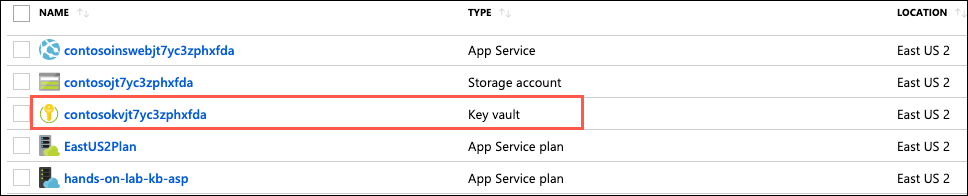

2. On the Key Vault blade, select **Access policies** under Settings in the left-hand menu, and then select **+ Add new**.

   

3. In the Add access policy dialog, enter the following:

   - **Configure from template (optional)**: Leave blank.
   - **Select principal**: Enter the email address of the account you are logged into the Azure portal with, select the user object that appears, and then click **Select**.
   - **Key permissions**: Leave set to 0 selected.
   - **Secret permissions**: Select this, and then select **Select All**, to give yourself full rights to manage secrets.
   - **Certificate permissions**: Leave set to 0 selected.
   - **Authorized application**: Leave set to None selected.

   

4. Select **OK**.

5. Select **Save** on the Access policies toolbar.

   

### Task 2: Create a new secret to store the SQL connection string

In this task, you will add a secret to Key Vault containing the connection string for the `ContosoInsurance` Azure SQL database.

1. First, you need to retrieve the connection string to your Azure SQL Database. In the [Azure portal](https://portal.azure.com), navigate to your **SQL database** resource by selecting **Resource groups** from the left-hand navigation menu, selecting the **hands-on-lab-SUFFIX** resource group, and then selecting the **ContosoInsurance** SQL database resource from the list of resources.

   

2. On the SQL database blade, select **Connection strings** from the left-hand menu, and then copy the ADO.NET connection string.

   

3. Paste the copied connection string into a text editor, such as Notepad.exe. This is necessary because you will need to replace the tokenized username and password values before adding the connection string as a Secret in Key Vault.

4. In the text editor, find and replace the tokenized values as follows:

    - Replace `{your_username}` with **demouser**
    - Replace `{your_password}` with **Password.1!!**

5. Your connection string should now resemble the following:

    ```csharp
    Server=tcp:contosoinsurance-jt7yc3zphxfda.database.windows.net,1433;Initial Catalog=ContosoInsurance;Persist Security Info=False;User ID=demouser;Password=Password.1!!;MultipleActiveResultSets=False;Encrypt=True;TrustServerCertificate=False;Connection Timeout=30;
    ```

6. Copy your updated connection string from the text editor.

7. In the [Azure portal](https://portal.azure.com), navigate to your **Key Vault** resource by selecting **Resource groups** from the left-hand navigation menu, selecting the **hands-on-lab-SUFFIX** resource group, and then selecting the **contosokvUNIQUE-IDENTIFIER** Key vault resource from the list of resources.

   

8. On the Key Vault blade, select **Secrets** under Settings in the left-hand menu, and then select **+ Generate/Import**.

    

9. On the Create a secret blade, enter the following:

    - **Upload options**: Select Manual.
    - **Name**: Enter **SqlConnectionString**
    - **Value**: Paste the updated SQL connection string you copied from the text editor.

    

10. Select **Create**.

11. When the secret has been created successfully, select it from the list of secrets on the Secrets blade.

    

12. On the SqlConnectionString secret blade, select the Current Version, copy the Secret Identifier from the Secret Version blade, and paste it into a text editor for later reference.

    

13. The Secret Identifier will look like:

    ```http
    https://contosokvjt7yc3zphxfda.vault.azure.net/secrets/SqlConnectionString/55b88481a2ba4b03bb1c9f0f09b3f55be
    ```

14. This is the version specific identifier. You can omit the version number to always obtain the latest version of the secret. For example:

    ```http
    https://contosoinsurancekeyvault.vault.azure.net/secrets/SqlConnectionString/
    ```

### Task 3: Create service principal for the web app using Azure CLI and grant access to Key Vault

> TODO: Reword the below, and possibly change the task title. Not sure what exactly this is supposed to be doing, but instructions need to be made much more clear.

In this task you will provide the managed identity of your API App in order to use this identity to authenticate any service that can use Azure AD without having any credentials on the code.

> TODO: Come back to this once the apps are set up, and I can figure out what the hell they were trying to do here. In order for the below `az` commands to work, you would first need to enable managed identities on the API app by selecting **Identity** on the left-hand menu, and then switching the Status to On. Question is whether it would be easier to just create a Service Principal that could be shared by the various apps.

1. In the [Azure portal](https://portal.azure.com), select the Azure Cloud Shell icon from the top menu.

    

2. In the Cloud Shell window that opens at the bottom of your browser window, select **PowerShell**.

    

3. After a moment, you will receive a message that you have successfully requested a Cloud Shell, and be presented with a PS Azure prompt.

    

4. At the prompt, run the following command to create the identity for your Web Api Application. Replace your Web Api Name and Resource Group. **IMPORTANT**: Replace 

   ```powershell
   az webapp identity assign --name "<your-api-resource-name>" --resource-group "hands-on-lab-SUFFIX"
   ```

4. Copy the `PrincipalId` that you will get as output from the CLI, you will need it in the next step.

    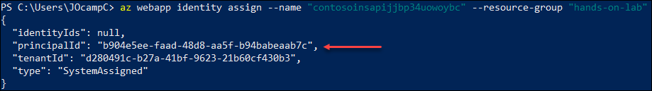

4. Run the following command to assign permissions to your application to read Secrets from the Key Vault. Replace your Key Vault Service name and principalId from the last step.

```Azure CLI
az keyvault set-policy --name "ContosoInsuranceKeyVaultSUFFIX" --object-id "PrincipalId" --secret-permissions get list
```
> Replace <PrincipalId> with the identifier you copied in the previous step.

5. You can check the permissions you assigned to the Key Vault by selecting the **Access policies** option under the **Settings** section.

    

## Exercise 4: Migrate web and API apps into App Services

Duration: 30 minutes

The developers at Contoso, Ltd. have been working toward migrating their apps to the cloud. As such, most of the pieces are already in place to deploy the apps to Azure, as well as configure them to communicate with the new app services, such as Web API. Since the required services have already been provisioned in, what remains is applying application-level configuration settings, and then deploying any hosted apps and services from the Visual Studio starter project solution. In this task, you will apply application settings to the Web API using the Azure Portal. Once the application settings have been set, you will deploy the Web API from the Visual Studio.

### Task 1: Deploy to Azure with Visual Studio

In this task you will deploy the web and API apps into App Services in Azure.

1. In the [Azure portal](https://portal.azure.com), navigate to your **LabVM** virtual machine by selecting **Resource groups** from the left-hand navigation menu, selecting the **hands-on-lab-SUFFIX** resource group, and selecting the **LabVM** virtual machine from the list of resources.

   

2. On the LabVM's **Overview** blade, select **Connect** on the top menu.

   

3. On the Connect to virtual machine blade, select **Download RDP File**, then open the downloaded RDP file.

4. Select **Connect** on the Remote Desktop Connection dialog.

5. Enter the following credentials when prompted, and then select **OK**:

   - **Username**: demouser
   - **Password**: Password.1!!

   

6. Select **Yes** to connect, if prompted that the identity of the remote computer cannot be verified.

   

7. Once logged into the LabVM, [download a copy of the GitHub repo for the App modernization MCW](https://github.com/microsoft/MCW-App-modernization/archive/master.zip).

8. Extract the download ZIP file to `C:\MCW`.

   

9. Open the extracted folders, and navigate to `C:\MCW\MCW-App-modernization-master\Hands-on lab\lab-files\src` and double-click the `Contoso.Apps.Insurance.Data.sln` file to open the solution in Visual Studio.

   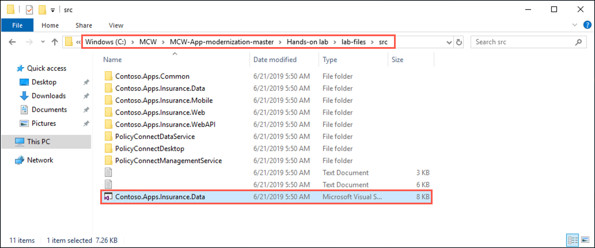

10. If prompted about how to open the file, select **Visual Studio 2019** and then select **OK**.

    

11. Sign in to Visual Studio using your Azure account credentials.

    

12. When prompted with a security warning, uncheck **Ask me for every project in this solution**, and then select **OK**.

    

> TODO: Add steps to address .NET Core 2.2 not being installed

If you see errors in the Error list pertaining to a version conflict, you will need to install the .NET CORE 2.2 framework, using the steps below. If you don't see any errors, you can skip to step...


In the Visual Studio Solution Explorer, expand the Web folder and right-click on the `Contoso.Apps.Insurance.WebAPI` project, and select **Properties** from the context menu.

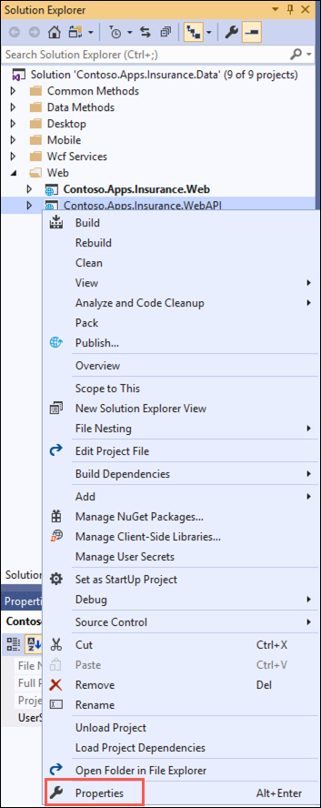

In the project properties window, select the **Target frawemwork** drop down, and select **Install other frameworks...**

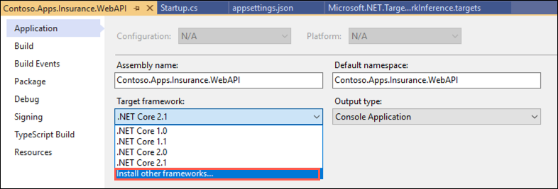

On the Download .NET SDKs for Visual Studio page web page that opens, select the .NET CORE 2.2 x64 SDK under Visual Studio 2019 SDK.


Run the downloaded installer, selecting **Install** in the .NET Core SDK installer dialog.


Select **Close** when the installation finishes. You will then need to close and reopen Visual Studio and the `Contoso.Apps.Insurance.Data` solution.

1.  In Visual Studio, locate the **Contoso.Apps.Insurance.WebAPI** project in the Web folder in the Solution Explorer.

    

2.  Right click on the **Contoso.Apps.Insurance.WebAPI** project and select *Publish*.

    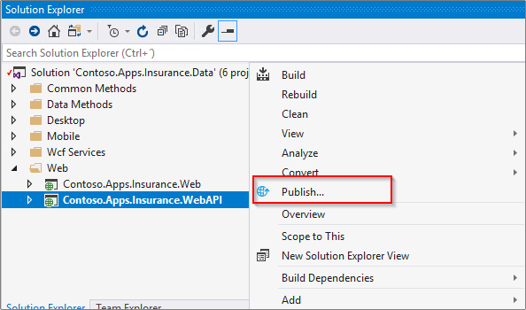

3.  click **Start** button.

    

4.  On the **Pick a publish target** dialog, select **App Service** as the publish target, and select **Select Existing**, then click **Publish**. If the *Pick a publish target* dialog is not present, select **New Profile** in the Publish Screen.

    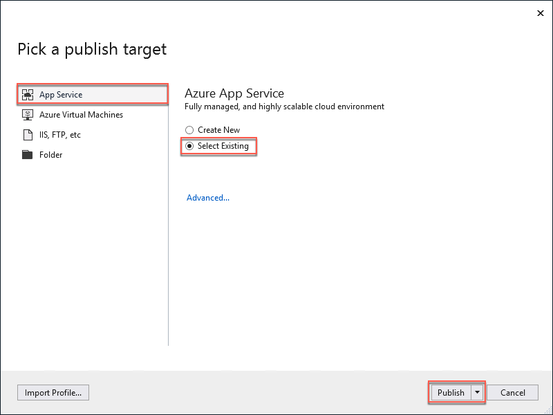

5.  Log on with your credentials and ensure the subscription you published earlier is selected.

6.  Select the **Contoso Insurance Web API** app.

    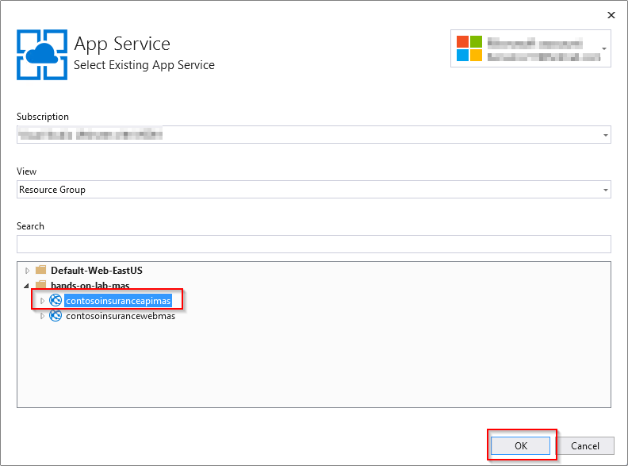

7.  In the Visual Studio **Web Publish Activity** view, you will see a status that indicates the Web API was published successfully, along with the URL to the site. 
   
   
   > If you don't see the **Web Publish Activity** view, you can find it on View menu-> Other Windows -> Microsoft Azure Activity Log

16. Open the URL of the published Web API in a browser window. Validate the Web API by adding "/swagger" at the end of the URL in your browser (e.g., http://contosoinsapijjbp34uowoybc.azurewebsites.net/swagger/). You should see a list of the available REST APIs.

    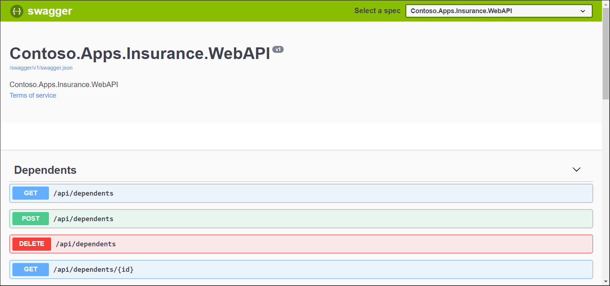

17. In Visual Studio, locate the **Contoso.Apps.Insurance.Web** project in the Web folder in the Solution Explorer.

    

18. Right click on the **Contoso.Apps.Insurance.Web** project and select *Publish*.

    

19. click **Start** button.

    

20. On the **Pick a publish target** dialog, select **App Service** as the publish target, and select **Select Existing**, then click **Publish**. If the **Pick a publish target** dialog is not present, select **New Profile** in the Publish Screen.

    

21. Log on with your credentials and ensure the subscription you published earlier is selected.

22. Select the **Contoso Insurance Web** app.

    

23. In the Visual Studio **Web Publish Activity** view, you will see a status that indicates the Web App was published successfully, along with the URL to the site. 
   
    
   
    > If you don't see the *Web Publish Activity* view, you can find it on View menu-> Other Windows -> Microsoft Azure Activity Log

24. Open the URL of the published Web App in a browser window to validate the Web App. PolicyConnect web site should appear.

    

### Task 2: Define server size and rules for auto-scaling

In this task you will check the options that you have to scale resources of your web apps.

1. In the Azure Portal, select **App Service Plans** in the left-hand menu. You will see a list of your App Service plans. Click to select the App Services Plan.

    

2. On the App Service plan screen, select **Scale up (App Service plan)** option under **Settings** menu.
   
    

3. In the **Scale up (App Service plan)** window you can select the size of your app plan. In the upper part you can choose between different recommended workloads like **Dev/Test** and **Production**. You can also see some recommended pricing tiers, with their characteristics and estimated price.

    

4. You can select a different workload and resources for your applications according to what you need.

5. In order to define rules for autoscale, select the **Scale out (App Service plan)** option under the **Settings** menu in the App Service plan screen. If the autoscale is not enabled then select **Enable autoscale**.

    

6. Provide a name for the scale setting, and then click **Add a rule**. 
   
   

7. Notice the scale rule options that open as a context pane on the right side. By default, this sets the option to scale your instance count by 1 if the CPU percentage of the resource exceeds 70 percent. Leave it at its default values and click **Add**. 

    

8. Note the recommendation in the Azure Portal that says: "It is recommended to have at least one scale in rule." To do so, select **Add a rule** and set the following information:

    - **Operator**: Select Less than.
    - **Threshold**: 20.
    - **Operation** Select Decrease count by.

    

9. Click **Add**.

10. Now you can verify that there is a scale setting that scales out/scales in based on CPU usage.

    

11. Click **Save**.

### Task 3: Visual Studio IDE integration

In this task you will learn how Cloud Explorer lets you view your Azure resources, check their properties and perform actions from within Visual Studio.

1. To view the resources associated with your Azure account, you must add them to the Cloud Explorer. You can find this under the menu *View* -> *Cloud Explorer*.

2. In **Cloud Explorer**, choose the **Account Management** button.

    

3. Select **Manage accounts**.

    

4. Log in to the Azure account whose resources you want to browse.
   
5. Once logged in to an Azure account, the subscriptions associated with that account are displayed. Select the check boxes for the account subscriptions you want to browse and then click **Apply**.

    

6. After selecting the subscriptions whose resources you want to browse, those subscriptions and resources will be displayed in the **Cloud Explorer**.

    

7. In the **Cloud Explorer**, you can choose how you want to view your Azure Resources.

   - **Resource Types view**: The common view used on the Azure portal. It shows your Azure resources categorized by their type, such as web apps, storage accounts, and virtual machines.
   - **Resource Groups view**: Categorizes Azure resources by the Azure resource group with which they're associated.

    

8. To navigate to an Azure resource and view its information in **Cloud Explorer**, expand the item's type or associated resource group and then select the resource. When you select a resource, information appears in two tabs (**Actions** and **Properties**) at the bottom of **Cloud Explorer**.

    In the next image you can see some of the options exist for a web app selected in the **Cloud Explorer**.

    

9. You can also find resources using the **Search box** in the **Cloud Explorer**.

    

### Task 4: Configure backups

1. In the [Azure portal](https://portal.azure.com), navigate to the *contosoinsuranceweb* app you deployed on Task 1.

2. Select **Backups** under **Settings** menu.

    

3. Click on the **Backup** section to start configuring the backup for the web app.

    

4. You need to configure a storage where the backups will be stored. To do so, select **Storage Settings** on the **Backup Storage** section.

    

5. Select a Storage account and the **Containers** screen will be displayed.

6. Select the **+ Container** option to add a Container.

    

7. Enter the following data for the container.

    - **Name**: backups.
    - **Public access level**: Select Private (no anonymous access).

    

8. Click **Ok**.

9. Select the created container and click on **Select**.

    

10. Now you can see the **Backup Storage** configured.

    

11. At this point you can enable the scheduled backups option to start making backups of the web app. To do so, select **On** into **Scheduled backup** under **Backup Schedule** section.

    

12. You can check the Backup Schedule settings. The backup is configured by default to be done once a day and be retained for 30 days.

13. In the Backup Configuration page, you can also configure **Backup Database**, then select the databases you want to include in the backups.

    

14. Click **Save** to finish the backup configuration.

    

15. Now you can see that the backup is configured. You can also see a list with the recent backups, a button **Backup** to start the process manually as well as the **Restore** button if you want to restore one of the existing backups.

    

## Exercise 5: Upload policy documents into blob storage

Duration: 10 minutes.

Contoso, Ltd. is currently storing all of their scanned PDF documents on a shared local network. They have asked to be able to store them in the cloud automatically from a workflow. In this exercise, you will provide a storage account that will be used to store the files in a blob container. Then, you will provide a way to bulk upload their existing PDFs.

### Task 1: Create container for storing PDFs in Azure storage

In this task, you will create a new container in your storage account for the scanned PDF policy documents.

1. In the [Azure portal](https://portal.azure.com), navigate to your **Storage account** resource by selecting **Resource groups** from the left-hand navigation menu, selecting the **hands-on-lab-SUFFIX** resource group, and then selecting the **contosoUNIQUE-IDENTIFIER** Storage account resource from the list of resources.

    

2. From the Storage account Overview blade, select **Blobs** under services.

    

3. On the Blob service blade, select **+ Container** to create a new container.

4. In the New container dialog, enter "policies" as the container name, set the Public access level to **Container**, and then select **OK**.

    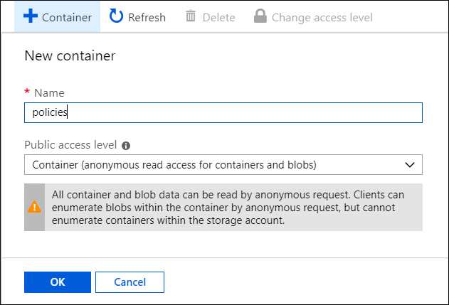

    > **IMPORTANT** Setting the Public access level to Container is for demo purposes. Otherwise, you should set this to Private.

5. After the container has been created, select its name on the Blob service blade, select Properties, and copy the URL from the policies -- Properties blade. Paste it into a text editor for later reference.

    

### Task 2: Bulk upload PDFs to blob storage using AzCopy

In this task, you will download and install [AzCopy](https://docs.microsoft.com/en-us/azure/storage/common/storage-use-azcopy). You will then use AzCopy to copy the PDF files from the "on-premises" location into the policies container in Azure storage.

1. On your LabVM, open a web browser and download the latest version of AzCopy from <https://aka.ms/downloadazcopy>.

2. Run the downloaded installer, accepting the license agreement and all the defaults, to complete the AzCopy install.

3. Next you will retrieve the access key for your storage account, which you will need to provide to AzCopy to connect to your storage container. On your Storage account blade in the Azure portal, select **Access keys** from the left-hand menu,and copy the **key1 Key** value to a text editor for use below.

    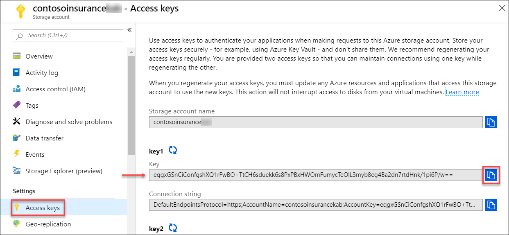

4. Back on the LabVM, launch a Command Prompt window (Select search on the task bar, type **cmd**, and select Enter).

5. At the Command prompt, change the directory to the AzCopy directory. By default, it is installed to `C:\Program Files (x86)\Microsoft SDKs\Azure\AzCopy` (On a 32-bit machine, change `Program Files (x86)` to `Program Files` ). You can do this by running the command:

   ```bash
   cd C:\Program Files (x86)\Microsoft SDKs\Azure\AzCopy
   ```

6. Type the following command in the command prompt, replacing the tokenized values with your own:

   ```bash
   AzCopy /Source:"[FILE-SOURCE]" /Dest:"[STORAGE-CONTAINER-URL]" /DestKey:"[STORAGE-ACCOUNT-KEY]" /S
   ```

7. The values in the above command should be replaced as follows:

   - `[FILE-SOURCE]`: This is the path to the `policy-documents` folder your downloaded copy of the GitHub repo. If you used the extraction path of `C:\MCW`, the path will be `C:\MCW\MCW-App-modernization-master\Hands-on lab\lab-files\policy-documents`.
   - `[STORAGE-CONTAINER-URL]`: This is the URL to your storage account's policies container, which you copied in the last step of the previous task. (e.g., <https://contosojt7yc3zphxfda.blob.core.windows.net/policies>)
   - `[STORAGE-ACCOUNT-KEY]`: This is the blob storage account key you copied previously in this task. (e.g., `eqgxGSnCiConfgshXQ1rFwBO+TtCH6sduekk6s8PxPBxHWOmFumycTeOlL3myb8eg4Ba2dn7rtdHnk/1pi6P/w==`)

8. The final command should resemble the following:

    ```bash
    AzCopy /Source:"C:\MCW\MCW-App-modernization-master\Hands-on lab\lab-files\policy-documents" /Dest:"https://contosojt7yc3zphxfda.blob.core.windows.net/policies" /DestKey:"XJT3us2KT1WQHAQBbeotrRCWQLZayFDNmhLHt3vl2miKOHeXasB7IUlw2+y4afH6R/03wbTiRK9SRqGXt9JVqQ==" /S
    ```

9. In the output of the command, you should see that 650 files were transferred successfully.

    

10. You can verify the upload by navigating to the policies container in your Azure Storage account.

    

## Exercise 6: Create serverless API for accessing PDFs

Duration: 15 minutes

Contoso, Ltd. has made some updates to prepare their applications, but there are some features that they have not been able to build into the API yet. They have requested that you assist them in setting up a proof-of-concept (POC) API solution to enable users of their application to retrieve their policy documents directly from their Azure Storage account. In this exercise, you will create an Azure Functions Proxy within your Function App to enable this functionality using serverless technologies.

### Task 1: Retrieve URL for a policy document in Azure storage

In this task, you will retrieve the URL associated with one of the PDF policy documents you uploaded into Azure storage in the previous exercise.

1. In the [Azure portal](https://portal.azure.com), navigate to your **Storage account** resource by selecting **Resource groups** from the left-hand navigation menu, selecting the **hands-on-lab-SUFFIX** resource group, and then selecting the **contosoUNIQUE-IDENTIFIER** Storage account resource from the list of resources.

   

2. From the Storage account Overview blade, select **Blobs** under services.

   

3. On the Blobs blade, select the **policies** container.

   

4. On the Overview page of the policies blade, select the first document in the list.

   

5. On the selected blob, select the **Click to copy** button next to the **URL** to copy the URL for the blob, and paste it into a text editor for use below.

   

### Task 2: Create an Azure Functions Proxy

In this task, you will create an Azure Function Proxy, which is a simple way to provide a clean API endpoint. To learn more, check out [Working with Azure Functions Proxies](https://docs.microsoft.com/en-us/azure/azure-functions/functions-proxies).

1. Navigate to your Function App in the [Azure portal](https://portal.azure.com) by selecting **Resource groups** from the left-hand navigation menu, selecting the **hands-on-lab-SUFFIX** resource group, and then selecting the **contosoinsfuncUNIQUE-IDENTIFIER** App Service resource from the list of resources.

    

2. On the Function Apps blade, select **+** next to **Proxies** under the contosoinsfuncUNIQUE-IDENTIFIER Function App.

    

3. In the New proxy form, enter the following values:

    - **Name**: PolicyDocs
    - **Route template**: Enter "/"
    - **Allowed HTTP methods**: Choose Selected Methods and check *GET*.
    - **Backend URL**: Paste the policy document URL you copied in the previous task.

    

4. Select **Create**.

5. When it is done creating the Proxy, copy the Proxy URL, and paste it into a new browser tab or window.

    

6. This will result in the policy document being downloaded. You can open the downloaded file and inspect the policy document.

### Task 3: Parameterize Azure Functions Proxy

In the previous task, you created an Azure Functions Proxy to download a specific policy document from Azure storage. In this task, you will update the Proxy to parameterize the URL, so you can retrieve any policy document using the policy holder's last name and their policy number.

1. Return to the PolicyDocs Proxy in your Function App in the Azure portal.

2. Update the Route template and Backend URL fields with the following values:

   - **Route template**: Change to "/{policyHolder}/{policyNumber}".
   - **Backend URL**: Change to "`https://\<YOUR-STORAGE-ACCOUNT-NAME\>.blob.core.windows.net/policies/{policyHolder}-{policyNumber}.pdf`.

   

3. Select **Save** on the Proxy toolbar.

   

4. Copy the new Proxy URL and paste it into a new browser tab or window and replace the parameters in the URL with a policy holder's last name and policy number. For example:

   - {policyHolder}: Acevedo
   - {policyNumber}: ACE5605VZZ2ACQ
   - <https://[your-function-app-name].azurewebsites.net/Acevedo/ACE5605VZZ2ACQ>

   > You can try this out with other policy holder names and numbers, such as setting policyHolder to "Barker" and policyNumber to "BAR3840E87YCGX", to see how the parameterized URL allows you to target specific policy documents.

5. The Azure Functions Proxy is now ready for use within the Contoso, Ltd. applications.

## Exercise 7: Add Cognitive Search for policy documents

Duration: 15 minutes

Contoso, Ltd. has asked for the ability to conduct full-text searching on their policy documents. Previously, they have not been able to extract information from the documents in a usable way, but they have read about about [cognitive search with Azure Search Service](https://docs.microsoft.com/en-us/azure/search/cognitive-search-concept-intro), and are interested to learn if they can be used to make the data in their search index more useful. In this exercise, you will provision an Azure Search service, then configure search indexing on the policies blob storage container.

### Task 1: Add Azure Search to Blob Storage account

1. In the [Azure portal](https://portal.azure.com), navigate to your **Storage account** resource by selecting **Resource groups** from the left-hand navigation menu, selecting the **hands-on-lab-SUFFIX** resource group, and then selecting the **contosoUNIQUE-IDENTIFIER** Storage account resource from the list of resources.

   

2. On the Storage account blade, select **Add Azure Search** from the left-hand menu, and then on the **Select a search service** tab, select your search service.

   

3. Select **Next: Connect to your data**.

4. On the **Connect to your data** tab, enter the following:

   - **Data Source**: Leave the value of **Azure Blob Storage** selected.
   - **Name**: Enter **policy-docs**.
   - **Data to extract**: Select **Content and metadata**.
   - **Parsing mode**: Leave set to **Default**.
   - **Connection string**: Leave this set to the pre-populated connection string for your Storage account.
   - **Container name**: Enter **policies**.

   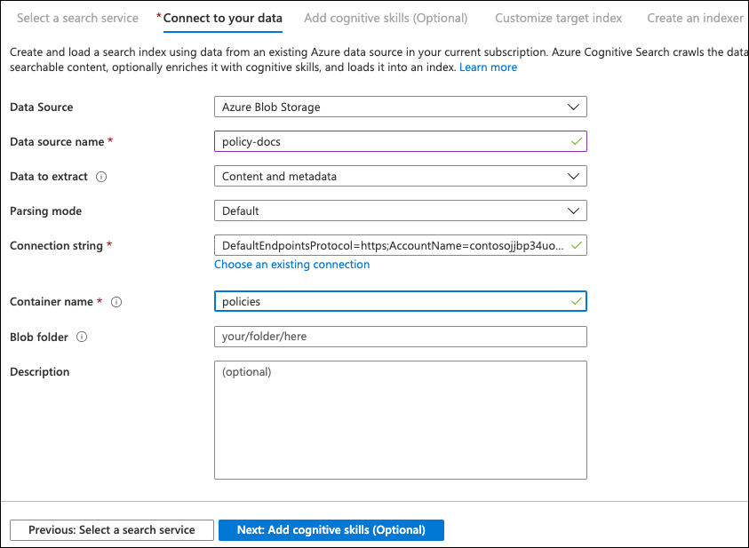

5. Select **Next: Add cognitive search (Optional)**.

6. On the **Add cognitive search** tab, set the following configuration:

   - Expand Attach Cognitive Services, and select your Cognitive Services account.
   - Expand Add enrichments
     - **Skillset name**: Enter **policy-docs-skillset**.
     - **Text cognitive skills**: Check this box to select all the skills.

   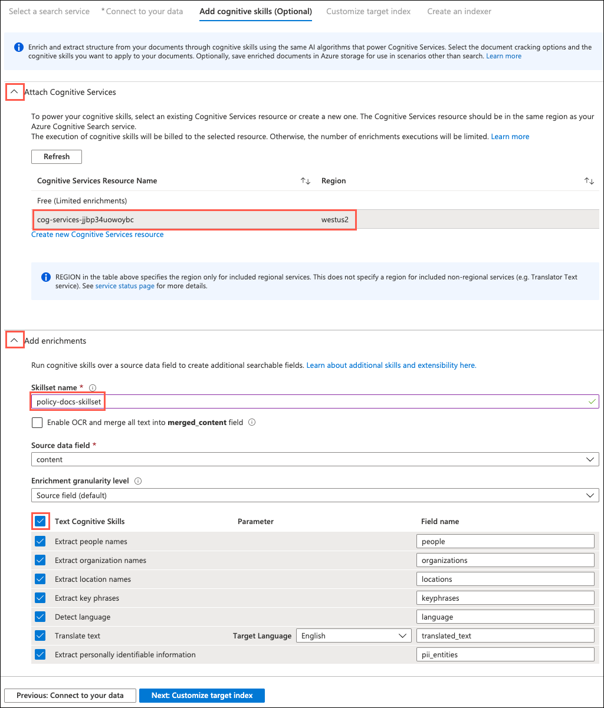

7. Select **Next: Customize target index**.

8. On the **Customize target index tab**, do the following:

   - **Index name**: Enter **policy-docs-index**.
   - Check the top Retrievable box, to check all items underneath it.
   - Check the top Searchable box, to check all items underneath it.

   

9. Select **Next: Create an indexer**.

10. On the **Create an indexer** tab, enter **policy-docs-indexer** as the name, and then select **Submit**.

    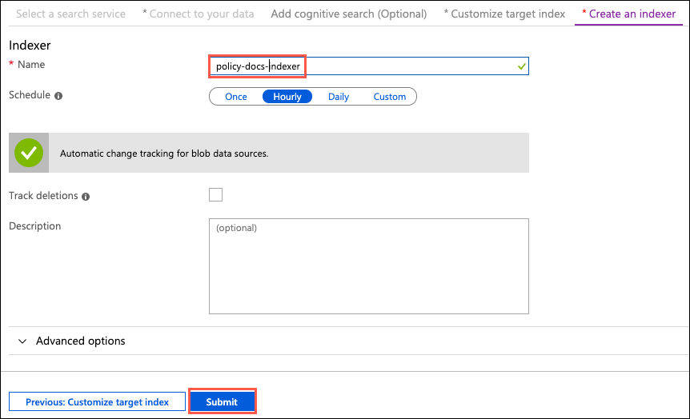

11. Within a few seconds, you will receive a notification in the Azure portal that the import was successfully configured.

### Task 2: Review search results

In this task, you will run a search query against your search index to see how the addition of cognitive search skills enriches the data extracted from policy documents.

1. In the [Azure portal](https://portal.azure.com), navigate to your **Search service** resource by selecting **Resource groups** from the left-hand navigation menu, selecting the **hands-on-lab-SUFFIX** resource group, and then selecting the **contosoinssearchUNIQUE-IDENTIFIER** Search service resource from the list of resources.

   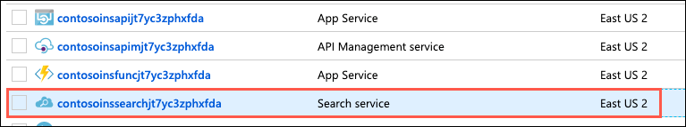

2. On the Search service blade, select **Indexers**.

    

3. Note the status of the policy-docs-indexer. Once the indexer has run, it should display a status of **Success**.

   > If you see a status of **No history**, select the policy-docs-indexer, and select **Run** on the Indexer blade.

4. Now select **Search explorer** in the Search service blade toolbar.

   

5. On the **Search explorer** blade, select **Search**.

6. In the search results, inspect the returned documents, paying special attention to the fields added by the cognitive skills you added when creating the search index. These fields are `people`, `organizations`, `locations`, `keyphrases`, and `language`.

   ```json
   {
      "@search.score": 1,
      "content": "\nContoso Insurance - Your Gold Policy\n\nPolicy Holder: Christen Cohen\nPolicy #: COH291A8F5SMX8\nEffective Coverage Dates: 25 August 2015 - 26 July 2024\nAddress: 8721 Augue Av.New Plymouth, North Island 4889\nPolicy Amount: $22,336.00\nDeductible: $500.00\nOut of Pocket Max: $2,000.00\n\nDEPENDENTS\nYou have no dependents to list.\n\n1 / 0 25 August 2015\n\n\n",
      "metadata_storage_content_type": "application/octet-stream",
      "metadata_storage_size": 134504,
      "metadata_storage_last_modified": "2019-06-21T15:34:51Z",
      "metadata_storage_content_md5": "6eJPF2YolzovSeb2++LY1w==",
      "metadata_storage_name": "Cohen-COH291A8F5SMX8.pdf",
      "metadata_storage_path": "aHR0cHM6Ly9jb250b3NvanQ3eWMzenBoeGZkYS5ibG9iLmNvcmUud2luZG93cy5uZXQvcG9saWNpZXMvQ29oZW4tQ09IMjkxQThGNVNNWDgucGRm0",
      "metadata_content_type": "application/pdf",
      "metadata_language": "en",
      "metadata_author": "Contoso Insurance",
      "metadata_title": "Your Policy",
      "people": [
          "Christen Cohen",
          "Max"
      ],
      "organizations": [
          "Contoso Insurance - Your Gold Policy",
          "Contoso",
          "Av.New Plymouth",
          "Plymouth, North"
      ],
      "locations": [
          "North Island"
      ],
      "keyphrases": [
          "Gold Policy",
          "Policy Holder",
          "DEPENDENTS",
          "Augue Av",
          "New Plymouth",
          "North Island",
          "Address",
          "Contoso Insurance",
          "Effective Coverage Dates",
          "Cohen",
          "Pocket Max",
          "list",
          "COH291A8F5SMX8"
      ],
      "language": "en"
   }
   ```

7. For comparison, the same document without cognitive search skills enabled would look similar to the following:

   ```json
   {
      "@search.score": 1,
      "content": "\nContoso Insurance - Your Bronze Policy\n\nPolicy Holder: Leo Burch\nPolicy #: BUR124DY7VNUTM\nEffective Coverage Dates: 28 May 2013 - 14 February 2021\nAddress: P.O. Box 203, 9529 Dolor. Av.Waitara, North Island 6175\nPolicy Amount: $63,424.00\nDeductible: $1,000.00\nOut of Pocket Max: $3,000.00\n\nDEPENDENTS\nYou have no dependents to list.\n\n1 / 0 28 May 2013\n\n\n",
      "metadata_storage_content_type": "application/octet-stream",
      "metadata_storage_size": 135907,
      "metadata_storage_last_modified": "2019-06-04T02:57:06Z",
      "metadata_storage_name": "Burch-BUR124DY7VNUTM.pdf",
      "metadata_storage_path": "aHR0cHM6Ly9jb250b3NvaW5zdXJhbmNla2FiLmJsb2IuY29yZS53aW5kb3dzLm5ldC9wb2xpY2llcy9CdXJjaC1CVVIxMjREWTdWTlVUTS5wZGY1",
      "metadata_title": "Your Policy"
   }
   ```

8. As you can see from the search results, the addition of cognitive skills adds valuable metadata to your search index, and will help to make documents and their contents more usable by Contoso, Ltd..

## Exercise 8: Import and publish APIs into APIM

Duration: 30 minutes

### Task 1: Import Web Api

1. On the hands-on-lab resource group overview blade, filter the resources by API Management Services and select the Contoso Insurance Management Service.

    

2. On the API Management service select the **APIs** blade then click on **+ Add API** and select **API App**.

    

3. A dialog to Create from API App will appear.

    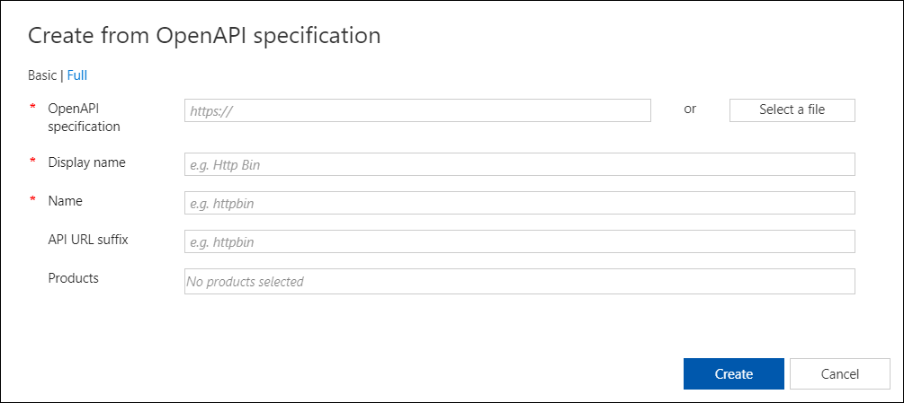

4. On the API App field, place the url for the API specification that you can find on the swagger of the API by clicking the swagger.json link.

    

5. In the Products field add the **Unlimited** tag by clicking the field and selecting it from the dropdown list.

6. The dialog should finally look as follows, then click the **Create** button.

    

7. You can see the API on the developer portal by clicking the button on the API Managment Service Overview blade.

    

8. In the portal you can check the list of APIs and endpoints as well as useful information to use them. 

    

9. In the Azure API Management portal, select **APIs**, choose the Contoso API.

10. Select the **Settings** option, look for the field *Web Service Url* and enter the URL of the Web API Service:


## Exercise 9: Create and configure SignalR service

Duration: 15 minutes

1. In the [Azure Portal](https://portal.azure.com/), select **+Create a resource**, enter "SignalR Service" into the search box, select **SignalR Service** in the results.

    

2. Click **Create**.

    

3. On the SignalR Service Create blade, enter the following data and select **Review + Create**:

    - **Subscription**: Select the subscription you are using for this hands-on lab.
    - **Resource group**: Choose Use existing and select the hands-on-lab-SUFFIX resource group.
    - **Resource Name**: contosoinsuranceSUFFIX
    - **Region**: Select the region you are using for this hands-on lab.
    - **Pricing tier**: Free.
    - **Service mode**: Default.

    

4. Click **Create** to start deploying the SignalR Service instance.

    

5. After the deployment is complete, go to the Signal R Service screen. 
   
6. Select **Keys** under **Settings**. Copy your connection string for the primary key. You will use it later to configure your app to use the Azure SignalR Service resource.

    

    The connection string has the following form:

    `Endpoint=<service_endpoint>;AccessKey=<access_key>;`

## Exercise 10: Update web app

Duration: 30 minutes

### Task 1: Update to use Key Vault

1. Open the **Contoso.Apps.Insurance.Data.sln** solution. 

2. Install the following NuGet Packages to the **WebApi** project.

    - [Microsoft.Azure.Services.AppAuthentication](https://www.nuget.org/packages/Microsoft.Azure.Services.AppAuthentication)
    - [Microsoft.Azure.KeyVault](https://www.nuget.org/packages/Microsoft.Azure.KeyVault)

3. Edit the class **EncryptionHelper.cs** located at **Web** > **Contoso.Apps.Insurance.WebApi**. Add the following snippet of code to the **SetConnectionString** method so it will fetch secrets from **Azure Key Vault**.

    ```var azureServiceTokenProvider = new AzureServiceTokenProvider();
    var keyVaultClient = new KeyVaultClient(new KeyVaultClient.AuthenticationCallback(azureServiceTokenProvider.KeyVaultTokenCallback));
    var secret = await keyVaultClient
        .GetSecretAsync(azureKeyVaultConnectionString)
        .ConfigureAwait(false);
    ```

4. Edit the **appsettings.json** file by adding the following property:
```
"AzureKeyVaultConnectionString": "https://<YOUR_KEY_VAULT>.vault.azure.net/secrets/<SECRET_NAME>"
```

### Task 2: Update to use APIs

1. Open the **app.js** file, located within the **Contoso.Apps.Insurance.Web** project in the **wwwroot** > **js** > **app** folder.


2. Scroll down to the bottom of the file where you see the line (126) that begins with var **endpoints = {...}**. Change the URL in quotes to the same URL you entered for the RootWebApiPath application variable, which is the root location of your Web API, (e.g. https://<WEBAPI_URL>.azurewebsites.net).


3. Save **app.js**.

### Task 3: Add Application Insights

1. Right click the web **Contoso.Apps.Insurance.Web** project, then click on **Add** > **Application Insights Telemetry**.


2. Once prompted with the Application Insights tab inside Visual Studio, click on **Get Started**.


3. Select or add the Azure account you have been using.

4. Select the subscription you have been using.

5. Select the existing **application insights** resource.

6. Click on **Register**. Visual Studio will kick off the process of provisioning the web app project with all the resources needed for Application Insights. Once it finishes, it will display a "Configured 100%" success message.


7. Make sure you have installed Application Insights version 2.2.0 (or later) so we can use Live Metrics Stream later on in the lab. To do so, right click the **Web** project, then click on **Manage NuGet Packages...**. Search for **Microsoft.ApplicationInsights.AspNetCore** and update it if necessary.

### Task 4: Create a deployment slot.

1. Navigate to the Azure Portal, and locate the app service that has been used for the deployment of the WebApp.

2. Click on the **Deployment Slots** option from the left-hand side menu.

3. Click on **Add Slot**.


4. Provide a name for the brand-new deployment slot.

5. Clone settings from existing Deployment Slot.

6. Click on **Add**.


### Task 5: Deploy updated web app to new deployment slot via VS

1. Head back to Visual Studio and right click on the web **Contoso.Apps.Insurance.Web** project, then click on **Publish...**

2. Select the **Select Existing** radio button in the "App Service" option.

3. Click on **Publish**.

4. In the **App Service** screen prompted, make sure the account that has been used is the one selected. Select the subscription you have been using.

5. In **View** select the **Resource Group** option.

6. Select the Deployment Slot created in the previous steps.

7. Click **Ok**.


### Task 6: View Live Metrics in App Insights in the Azure portal

In order to enable Live Metrics stream for your web app, it is required to install an additional NuGet Package.

1. Install the following NuGet Package to the **Web App** project.

    - [Microsoft.ApplicationInsights.PerfCounterCollector](https://www.nuget.org/packages/Microsoft.ApplicationInsights.PerfCounterCollector/)

2. Redeploy your app.

3. Head back to Azure Portal and open the Application Insights resource for your app, and then open **Live Metrics Stream**.


4. You will see real-time data fetched from your app using **Application Insights**.

## Exercise 11: Configure and run the Xamarin mobile app

Duration: 15 minutes

The mobile application was built using Xamarin Forms, capitalizing on the .NET expertise of the Contoso, Ltd. development team. As a bonus, they can easily add additional platforms, such as iOS and UWP (Universal Windows Platform), as well as target multi-platform desktop environments. For now, their focus has been on deploying to Android, since they can run the Android emulator right from their development machines, which are Windows-based. You will need to have completed the Xamarin installation steps outlined at the beginning of this hands-on lab guide.

In this exercise, you will update the application settings in the ApplicationSettings.cs file, and then run the mobile application within the Android emulator.

### Task 1: Run the Xamarin Mobile App

1. On your Lab VM, expand the **CIMobile** project located in the **Mobile** folder in the Visual Studio Solution Explorer, and open ApplicationSettings.cs.

    

2.  Modify the values for the following properties:

    a.  **RootWebApiPath**: Insert the value of the URL to your published Web API (e.g., <https://contosoinsuranceapi.azurewebsites.net>).

    b.  **BlobContainerUrl**: Enter the URL property of your blob storage account **policies** container where the policy PDF files are kept (e.g., <https://contosoinsurancekb.blob.core.windows.net/policies>). You can find this by navigating to your Storage account in Azure, selecting Blobs on the Overview blade, then selecting the policies container, and selecting Properties.

    c.  **MobileClientId**: Insert the Application ID, in Guid format, from the Azure AD application settings for your mobile application (e.g., 06e8576a-566d-4582-884f-ce2f99a729bb).

    d.  **AzureSearchServiceUrl**: To get this value, go into the Azure portal, select your search service, then the \"policies\" index, and then \"Search explorer." Copy the full URL within the URL field. Make sure to include the entire path, even the \"&search=\*\" at the end (e.g., <https://contosoinsurance.search.windows.net/indexes/policies/docs?api-version=2015-02-28&search=*>)

    e.  **AzureSearchQueryApiKey**: Insert the query key value from your Azure Search service, which can be found by selecting your search service in Azure, selecting Keys, then selecting Manage query keys, and copying the displayed key (or create one if none exist) (e.g., 1A80181B30F975CFE252E4FDDAA657DC).

3.  Select the **CIMobile.Droid** project in the **Mobile** folder using the **Solution Explorer** of Visual Studio. Next, right-click and select **Set as StartUp Project**

> Note: Open the references folder on the **CIMobile.Droid** project, and if you see a yellow icon near each reference, go to menu *Tools > Nuget Package Manager -> Package Manager Console*, on the Package Manager Console choose Mobile\CIMobile.Droid from the Default Project select box, pn the console type the following command and press Enter:

```
update-package -reinstall
```


4.  On the top tool bar of Visual Studio, select **Debug** from the first dropdown, **Any CPU** in the second, and **CIMobile.Droid** as the application to be debugged. Select the green play button next to the Android emulator name to launch the application.

    

    a.  Alternately, you can right-click on the CIMobile.Droid project, select Debug, then select **Start new instance**.

5.  The Android emulator should appear, and then launch the PolicyConnect app within.

    

6.  Select the menu and select **Search Policy \#**. 

    

7.  You can either enter a full policy \# or perform a partial search of all content and metadata fields within the search field. Type in at least three characters to activate the search button. Try searching with the letters **MON**. The most relevant search results will appear first. Now try searching by an exact policy number, such as **DOW586IJCG493F**. You should see a single result matching that policy number. 

    

8.  Select a search result to view the content that was extracted by the Azure Search indexer. There is a link to download the actual PDF at the bottom of the result page. This will display the file that is stored in blob storage.


### Task 2: Update Xamarin mobile app to use new APIs through APIM

In this task, we are going to add a new secret value on the Azure Key Vault services on Azur and consume this from the mobile application.

1. In the Azure portal, go to the Azure API Management service and open the Developer Portal:


2. In the developer portal, on the right side, under *Administration* option, choose the *Profile* option:


3. On the profile page, under *your subscriptions* panel, copy the primary key for the Unlimited subscription starter. If you can not see this, click on *Show*:

    

4. On the mobile application, search for the **ApplicationSettings.cs** class and put the primary key value on the **AzureApiManagementKey** field:


5. Also, copy the URl of the API management service and replace it on the field **RootWebApiPath** on the same **ApplicationSettings.cs**:


6. To consume the API Management service, the HTTP request needs to include a header with the primary key. To do that, search the **WebApiCalls.cs** class on the **CIMobile.Droid** project, folder *Services* and uncomment all the ocurrence of the following line:

```csharp
client.DefaultRequestHeaders.Add("Ocp-Apim-Subscription-Key", AzureApiManagementKey);
```

7. Run the application and validate that the application runs without issues.

## Exercise 12: Configure and run the legacy desktop (Windows Forms) application

Duration: 15 minutes

Contoso, Ltd. has created a web and mobile version of their desktop application, but they have opted to update it to communicate with the new Web API service for business and data functionality.

### Task 1: Configure application settings in App.config 

In this task, you will update the application settings in the App.config file, allowing the desktop application's updated code to take advantage of the new Azure services.

1.  On your Lab VM, expand to the **PolicyConnectDesktop** project located in the **Desktop** folder using the **Solution Explorer** of Visual Studio and open the **App.config** file.

    

2.  Modify the values for the following keys under **appSettings**:

    - **PdfRootPath**: This is the root folder of the PDF files. This path should point to the folder: C:\\ContosoInsurance\\Hackathon\\Files\\.

    -  **RootWebApiPath**: Insert the value of the URL to your published Web API (e.g., <https://contosoinsuranceapi.azurewebsites.net>).

    -  **UseWebApi**: Set to **true**. This allows the desktop app to communicate with the new Web API.

3.  **Save** App.config. The updated App.config file should look like: 

    

### Task 2: Run the desktop application 

1.  In the Solution Explorer in Visual Studio, right-click the **PolicyConnectDesktop** project located in the **Desktop** folder.

2.  Select **Debug**, and then select **Start new instance**.

    

3.  When the application is opened you should see a list of policyholders. Some functionality is intentionally left out. To open a policyholder record, simply double-click on any of the rows.

    

## Exercise 13: Create an app in PowerApps

Duration: 15 minutes

Since creating mobile apps is a long development cycle, Contoso is interested in using PowerApps to create mobile applications to add functionality not currently offered by their app rapidly. In this scenario, they want to be able to edit the Policy lookup values (Silver, Gold, Platinum, etc.), which they are unable to do in the current app.

Get them up and running with a new app created in PowerApps, which connects to the ContosoInsurance database and performs basic CRUD (Create, Read, Update, and Delete) operations against the Policies table.
Task 1: Sign up for a PowerApps account

### Task 1: Sign up for a PowerApps account

1. Go to https://web.powerapps.com and sign up for a new account, using the same account you have been using in Azure.

2. You may receive an email asking you to verify your account request, with a link to continue the process.

3. Download and install PowerApps Studio from the Microsoft store: https://www.microsoft.com/en-us/store/p/powerapps/9nblggh5z8f3.


### Task 2: Create new SQL connection

1. With your PowerApps account created and logged into the PowerApps website, expand the **Data** option from the left-hand navigation menu, then click on the **Connections** option.

2. Click on the **Create a connection** button.


3. Type **SQL** into the search box, and then select the SQL Server item in the list below.


4. Within the SQL Server connection dialog, select the **Connect directly (cloud services)** radio button.

5. Consult your saved SQL Server connection string (or locate it in Azure) to fill in the **SQL server name**, **Username**, and **Password** values. The **SQL Database name** should be **ContosoInsurance**.


### Task 3: Create a new app

1. Open PowerApps Studio and sign in with the same account.

2. Select **New** on the left-hand side, and then **select the right arrow** next to the list.


3. Select the **SQL Server connection** you created in the previous task.


4. If not selected already, select **default** under the **Choose a dataset** title.

5. Select the **Policies** table from the list.


6. Click **Connect**.

### Task 4: Design app

1. The new app will automatically be created and displayed within the designer. Select the title for the first page (currently named [dbo].[Policies]) and edit the text in the formula field to read **Policies**.


2. Select the **DetailScreen** screen on the left-hand side.


3. Reorder the fields on the form by selecting them, then dragging them by the **Card: <field_name>** tag to the desired location. The new order should be **Name**, **Description**, **DefaultDeductible**, then **DefaultOutOfPocketMax**.


4. On the form, edit the **DefaultDeductible** and **DefaultOutOfPocketMax** labels to be **Default Deductible** and **Default Out of Pocket Max**, respectively. To do so, select the field and type the new title in quotes within the formula field.

5. Rename the screen title to Policy by typing "Policy" in quotation marks within the formula field.


6. Select EditScreen on the left-hand menu.

7. Repeat steps 4-6 on the edit screen.

### Task 5: Edit the app settings and run the app

1. Select **File** on the top menu. Select **App settings**, then **App name + icon** and type in a new **App name**, such as PolicyConnect Plus.


2. Select **Save** on the left-hand menu to save the app to the cloud, then select the **Save** button below.

3. After saving, select the left arrow on top of the left-hand menu.

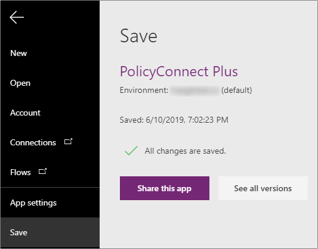

4. Select the **Run** button on the top menu to preview the app. You should be able to view the current policies, edit their values, and create new policies.

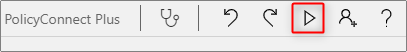

## After the hands-on lab

Duration: 10 minutes

In this exercise, you will de-provision all Azure resources that were created in support of this hands-on lab.

### Task 1: Delete Azure resource groups

1. In the Azure portal, select **Resource groups** from the left-hand menu, and locate and delete the **hands-on-lab-SUFFIX** following resource group.

### Task 2: Delete the contoso-insurance service principal

1. In the Azure portal, select **Azure Active Directory** and then select **App registrations**.
2. Select the **contoso-insurance** application, and select **Delete** on the application blade.

You should follow all steps provided *after* attending the Hands-on lab.
