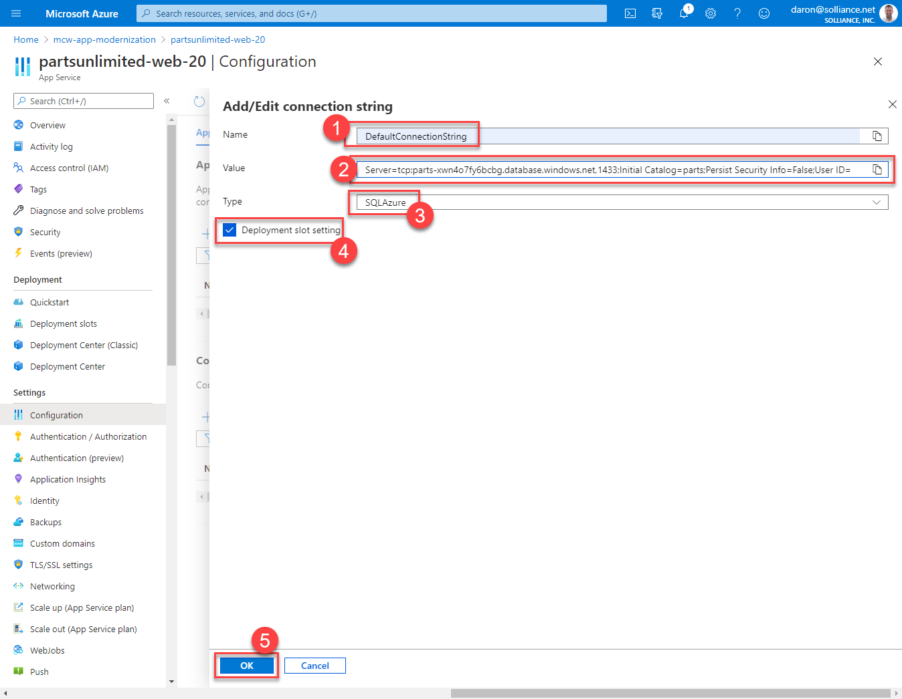

<div class="MCWHeader1">
App modernization
</div>

<div class="MCWHeader2">
Hands-on lab step-by-step guide
</div>

<div class="MCWHeader3">
June 2020
</div>

Information in this document, including URL and other Internet Web site references, is subject to change without notice. Unless otherwise noted, the example companies, organizations, products, domain names, e-mail addresses, logos, people, places, and events depicted herein are fictitious, and no association with any real company, organization, product, domain name, e-mail address, logo, person, place or event is intended or should be inferred. Complying with all applicable copyright laws is the responsibility of the user. Without limiting the rights under copyright, no part of this document may be reproduced, stored in or introduced into a retrieval system, or transmitted in any form or by any means (electronic, mechanical, photocopying, recording, or otherwise), or for any purpose, without the express written permission of Microsoft Corporation.

Microsoft may have patents, patent applications, trademarks, copyrights, or other intellectual property rights covering subject matter in this document. Except as expressly provided in any written license agreement from Microsoft, the furnishing of this document does not give you any license to these patents, trademarks, copyrights, or other intellectual property.

The names of manufacturers, products, or URLs are provided for informational purposes only and Microsoft makes no representations and warranties, either expressed, implied, or statutory, regarding these manufacturers or the use of the products with any Microsoft technologies. The inclusion of a manufacturer or product does not imply endorsement of Microsoft of the manufacturer or product. Links may be provided to third party sites. Such sites are not under the control of Microsoft and Microsoft is not responsible for the contents of any linked site or any link contained in a linked site, or any changes or updates to such sites. Microsoft is not responsible for webcasting or any other form of transmission received from any linked site. Microsoft is providing these links to you only as a convenience, and the inclusion of any link does not imply endorsement of Microsoft of the site or the products contained therein.

© 2020 Microsoft Corporation. All rights reserved.

Microsoft and the trademarks listed at <https://www.microsoft.com/en-us/legal/intellectualproperty/Trademarks/Usage/General.aspx> are trademarks of the Microsoft group of companies. All other trademarks are property of their respective owners.

**Contents**

<!-- TOC -->

- [App modernization hands-on lab step-by-step](#app-modernization-hands-on-lab-step-by-step)
  - [Abstract and learning objectives](#abstract-and-learning-objectives)
  - [Overview](#overview)
  - [Requirements](#requirements)
  - [Exercise 1: Setting Up Azure Migrate](#exercise-1-setting-up-azure-migrate)
  - [Exercise 2: Migrate Your Application With App Service Migration Assistant](#exercise-2-migrate-your-application-with-app-service-migration-assistant)
    - [Task 1: Perform Assessment for Migration to Azure App Service](#task-1-perform-assessment-for-migration-to-azure-app-service)
    - [Task 2: Migrate the Web Application to Azure App Service](#task-2-migrate-the-web-application-to-azure-app-service)
  - [Exercise 3: Migrate the On-Premises Database to Azure SQL Database](#exercise-3-migrate-the-on-premises-database-to-azure-sql-database)
    - [Task 1: Perform Assessment for Migration to Azure SQL Database](#task-1-perform-assessment-for-migration-to-azure-sql-database)
    - [Task 2: Retrieve Connection Information for SQL Databases](#task-2-retrieve-connection-information-for-sql-databases)
    - [Task 3: Migrate the Database Schema Using the Data Migration Assistant](#task-3-migrate-the-database-schema-using-the-data-migration-assistant)
    - [Task 4: Migrate the Database Using the Azure Database Migration Service](#task-4-migrate-the-database-using-the-azure-database-migration-service)
    - [Task 5: Configure the Application Connection to SQL Azure Database](#task-5-configure-the-application-connection-to-sql-azure-database)
  - [After the hands-on lab](#after-the-hands-on-lab)
    - [Task 1: Delete Azure resource groups](#task-1-delete-azure-resource-groups)

<!-- /TOC -->

# App modernization hands-on lab step-by-step

## Abstract and learning objectives

In this hands-on lab, you implement the steps to modernize a legacy on-premises application, including upgrading and migrating the application and the database to Azure and updating the application to take advantage of serverless and cloud services.

At the end of this hands-on lab, your ability to build solutions for modernizing legacy on-premises applications and infrastructure using cloud services will be improved.

## Overview

Parts Unlimited has a hosted web application on its internal infrastructure by using a serves running Windows Server, Internet Information Services (IIS), and Microsoft SQL Server. Beyond the initial effort and costs, these applications incur ongoing maintenance costs in hardware, operating system updates, and licensing fees. These maintenance costs make Microsoft Azure App Service an attractive alternative. Parts Unlimited is looking for migrating Microsoft ASP.NET applications and any associated SQL Server database to Azure App Service and Azure SQL Database. 

> **Note:** The solution provided is only one of many possible, viable approaches.

## Requirements

- Microsoft Azure subscription
- Github account.
- A virtual machine configured with Visual Studio Community 2019 or higher (setup in the Before the hands-on lab exercises)
- **IMPORTANT**: To complete this lab, you must have sufficient rights within your Azure AD tenant to:
  - Create an Azure Active Directory application and service principal
  - Assign roles on your subscription
  - Register resource providers
  
## Exercise 1: Setting Up Azure Migrate

Duration: 10 minutes

Azure Migrate provides a centralized hub to assess and migrate on-premises servers, infrastructure, applications, and data to Azure . It provides a single portal to start, run, and track your migration to Azure. Azure Migrate comes with a range of tools for assessment and migration that we will use during our lab. We will use Azure Migrate as the central location for our assessment and migration efforts.

1. In the [Azure portal](https://portal.azure.com), navigate to your lab resource group. Select **Add** to add a new resource.


2. Type **Azure Migrate** into the search box and hit **Enter** to start the search.


3. Select **Create** to continue.


4. As part of our migration project for Parts Unlimited, we will first assess and migrate their Web Application living on IIS, on a VM. Select **Web Apps** to continue.


5. Select **Create project**.


6. Type **partsunlimitedweb** as your project name. Select **Create** to continue.


7. Once your project is created **Azure Migrate** will show you default **Web App Assessment (1)** and **Web App Migration (2)** tools (You might need to refresh your browser). For Parts Unlimited web site, **App Service Migration Assistant** is the one we have to use. Download links are presented in Azure Migrate's Web Apps page. In our case, our lab environment comes with App Service Migration Assistant pre-installed on Parts Unlimited's web server. 


8. Another aspect of our migration project will be the database for Parts Unlimited's web site. We will have to assess the database's compatibility and migrate to Azure SQL Database. Let's switch to the **Databases (1)** section in Azure Migrate. Select **Click here (2)** hyperlink for Assessment tools.


9. We will use **Azure Migrate: Database Assessment** to assess Parts Unlimited's database hosted on a SQL Server 2008 R2 server. Pick **Azure Migrate: Database Assessment (1)** and select **Add tool (2)**.


10. Now, we can see a download link for the **Data Migration Assessment (1)** tool under assessment tools in Azure Migrate. In our case, our lab environment comes with the Data Migration Assessment pre-installed on Parts Unlimited's database server. Select **Click here (2)** under the **Migration Tools** section to continue.


11. We will use **Azure Migrate: Database Migration** to migrate Parts Unlimited's database to an Azure SQL Database. Pick **Azure Migrate: Database Assessment (1)** and select **Add tool (2)**.


12. Now we have all the assessment and migration tools/services we need for Parts Unlimited ready to go under the Azure Migrate umbrella. 


## Exercise 2: Migrate Your Application With App Service Migration Assistant

Duration: 15 minutes

The first step for Parts Unlimited is to assess whether their apps have dependencies on unsupported features on Azure App Service. In this exercise, you use an **Azure Migrate** tool called the [App Service migration assistant](https://appmigration.microsoft.com/) to evaluate Parts Unlimited's web site for a migration to Azure App Service. The assessment runs readiness checks and provides potential remediation steps for common issues. Once the assessment succeeds, we will proceed with the migration as well. You will use a simulated on-premises environment hosted in virtual machines running on Azure.

### Task 1: Perform Assessment for Migration to Azure App Service

Parts Unlimited would like an assessment to see what potential issues they might need to address in moving their application to Azure App Service. You will use the [App Service migration assistant](https://appmigration.microsoft.com/) to assess the application and run various readiness checks.

1. In the [Azure portal](https://portal.azure.com), navigate to your **WebVM** VM by selecting **Resource groups** from Azure services list, selecting the **hands-on-lab-SUFFIX** resource group, and selecting the **WebVM** VM from the list of resources.


2. On the WebVM Virtual Machine's **Overview** blade, select **Connect (1)** and **RDP (2)** on the top menu. 

   

3. Select **Download RDP File** on the next page, and open the downloaded file.


3. Select **Connect** on the Remote Desktop Connection dialog.

   

5. Enter the following credentials with your password when prompted, and then select **OK**:

   - **Username**: demouser
   - **Password**: {YOUR-ADMIN-PASSWORD}

   

6. Select **Yes** to connect, if prompted that the identity of the remote computer cannot be verified.

   

7. Once logged into the WebVM VM, open **AppServiceMigrationAssistant** that is located on the Desktop. 

   

8. Once App Service Migration Assistant discovers the web sites availabie on the server choose **Default Web Site (1)** for migration and select **Next (2)** to start assessment.

   

9. Observe the result of the assessment report. In our case, our application has successfully passed 13 tests **(1)** with no additional actions needed. Now that our assessment is complete, select **Next (2)** to proceed to the migration.

   
   
### Task 2: Migrate the Web Application to Azure App Service

After reviewing the assessment results, you have ensured the web application is a good candidate for migration to Azure App Service. Now, we will continue the process with the migration of the application.

1. In order to continue with the migration of our web site Azure App Service Migration Assistant needs access to our Azure Subscription. Select **Copy Code & Open Browser** button to be redirected to the Azure Portal.

   
   
2. At its first launch, you will be asked to choose a browser. Select **Microsoft Edge (1)**  and check **Always use this app (2)** checkbox. Select ** OK (2)** to move to the next step.

    

3. Right-click the text box and select **Paste (1)** to paste your login code. Select **Next** to give subscription access to App Service Migration Assistant.


4 Continue the login process with your Azure Subscription credentials. When you see the message that says **You have signed in to the Azure App Service Migration Assistant application on your device** close the browser window and return to the App Service Migration Assistant.


5. Select the Azure Migrate project we created **(1)** in the previous exercise to submit the results of our migration. Select **Next** to continue.


6. In order to migrate Parts Unlimited web site we have to create an App Service Plan and an App Service. The Azure App Service Migration Assistant will take care of all the requirements needed. Select **Use existing (1)** and select the lab resource group as your deployment target. For the App Service in Azure we have to provude a site name that is globally unique. We suggest using a pattern that matches `partsunlimited-web-{uniquesuffix}` **(2)**. Select **Migrate** to start the migration process.


7. We have just completed the migration of Parts Unlimited web site from IIS on a Virtual Machine to Azure App Service. Congratulations. Let's go back to the Azure Portal and look into Azure Migrate. Search for `migrate` **(1)** on the Azure Portal and select **Azure Migrate (2)**.


8. Switch to the **Web Apps (1)** section. See the number of discovered web servers, assessed websites **(2)** and migrated websites change **(3)**. Keep in mind that you might need to wait for 5 to 10 minutes for results to show up. You can use the **Refresh** button on the page to see the latest status.


## Exercise 3: Migrate the On-Premises Database to Azure SQL Database

Duration: 50 minutes

The next step of Part Unlimited's migration project is the assessment and migration of its database. Currently, the database lives on a SQL Server 2008 R2 on a virtual machine. You will use an **Azure Migrate: Database Assessment** tool called **Microsoft Data Migration Assistant (DMA)** to assess the `PartsUnlimited` database for a migration to Azure SQL Database. The assessment generates a report detailing any feature parity and compatibility issues between the on-premises database and Azure SQL Database. After the assessment, you will use an **Azure Migrate: Database Migration** service called **Azure Database Migration Service (DMS)**. During the exercise, you will use a simulated on-premises environment hosted in virtual machines running on Azure.

### Task 1: Perform Assessment for Migration to Azure SQL Database

Parts Unlimited would like an assessment to see what potential issues they might need to address in moving their database to Azure SQL Database. In this task, you will use the [Microsoft Data Migration Assistant](https://docs.microsoft.com/sql/dma/dma-overview?view=sql-server-2017) (DMA) to assess the `PartsUnlimited` database against Azure SQL Database (Azure SQL DB). Data Migration Assistant (DMA) enables you to upgrade to a modern data platform by detecting compatibility issues that can impact database functionality on your new version of SQL Server or Azure SQL Database. It recommends performance and reliability improvements for your target environment. The assessment generates a report detailing any feature parity and compatibility issues between the on-premises database and the Azure SQL DB service.

> **Note**: The Database Migration Assistant is already installed on your SqlServer2008 VM. It can be downloaded through Azure Migrate or from the [Microsoft Download Center](https://go.microsoft.com/fwlink/?linkid=2090807) as well.

1. Connect to your SqlServer2008 VM with RDP. Your credentials are the same as the WebVM.

   


2. Launch DMA from the Windows Start menu by typing "data migration" into the search bar, and then selecting **Microsoft Data Migration Assistant** in the search results.

> **Note**: There is a known issue with screen resolution when using an RDP connection to Windows Server 2008 R2, which may affect some users. This issue presents itself as very small, hard to read text on the screen. The workaround for this is to use a second monitor for the RDP display, which should allow you to scale up the resolution to make the text larger.

   

2. In the DMA dialog, select **+** from the left-hand menu to create a new project.

   

3. In the New project pane, set the name of the project **(1)** and make sure the following value are selected:

   - **Project type**: Select Assessment.
   - **Assessment type**: Select Database Engine.
   - **Source server type**: Select SQL Server.
   - **Target server type**: Select Azure SQL Database.

   

4. Select **Create (2)**.

5. On the **Options** screen, ensure **Check database compatibility (1)** and **Check feature parity (1)** are both checked, and then select **Next (2)**.

   

6. On the **Sources** screen, enter the following into the **Connect to a server** dialog that appears on the right-hand side:

   - **Server name (1)**: Enter **SQLSERVER2008**.
   - **Authentication type (2)**: Select **SQL Server Authentication**.
   - **Username (3)**: Enter **PUWebSite**
   - **Password (4)**: Enter **{YOUR-ADMIN-PASSWORD}**
   - **Encrypt connection**: Check this box if not checked.
   - **Trust server certificate (5)**: Check this box.

   

7. Select **Connect (6)**.

8. On the **Add sources** dialog that appears next, check the box for `PartsUnlimited` **(1)** and select **Add (2)**.

   

9. Select **Start Assessment**.

   

10. Take a moment to review the assessment for migrating to Azure SQL DB. The SQL Server feature parity report **(1)** shows that Analysis Services and SQL Server Reporting Services are unsupported **(2)**, but these do not affect any objects in the `PartsUnlimited` database, so won't block a migration.

    

11. Now, select **Compatibility issues (1)** so you can review that report as well.

    

The DMA assessment for migrating the `PartsUnlimited` database to a target platform of Azure SQL DB reveals that no issues or features are preventing Parts Unlimited from migrating their database to Azure SQL DB. 

12. Select **Upload to Azure Migrate** to upload assessment results to Azure.

    

13. Select the right Azure environment **(1)** your subscription lives. Select **Connect (2)** to proceed to the Azure login screen. 

    
    
14. Select your subscription **(2)** and the `partsunlimited` Azure Migrate project **(3)**. Select **Upload (4)** to start the upload to Azure.

    
    
> If you encounter the Strong Authentication required you might not see some of your subscription because of MFA limitatations. You should still be able to see your lab subscription.

15. Once the upload is complete select **OK** and navigate to the Azure Migrate page on the Azure Portal.

    
    
16. Select the **Databases (1)** page on Azure Migrate. Observe the number of assessed database instances **(2)** and the number of databases ready for Azure SQL DB **(2)**. Keep in mind that you might need to wait for 5 to 10 minutes for results to show up. You can use the **Refresh** button on the page to see the latest status.

    
    
### Task 2: Retrieve Connection Information for SQL Databases

In this task, you will retrieve the IP address of the SqlServer2008 VM and the Fully Qualified Domain Name for the Azure SQL Database. Both information is needed to connect to your SqlServer2008 VM and Azure SQL Database from Azure Data Migration Service and Azure Data Migration Assistant.

1. In the [Azure portal](https://portal.azure.com), navigate to your **SqlServer2008-ip** resource by selecting **Resource groups** from Azure services list, selecting the **hands-on-lab-SUFFIX** resource group, and selecting the **SqlServer2008-ip** Public IP addess from the list of resources.

    

2. In the **Overview** blade select **Copy** to copy the public IP address and paste the value into a text editor, such as Notepad.exe, for later reference.

    

3. Go back to the resource list and navigate to your **SQL database** resource by selecting the **parts** SQL database resource from the resources list.

   
   
4. On the Overview blade of your SQL database, copy the **Server name** and paste the value into a text editor, such as Notepad.exe, for later reference.

   
   
### Task 3: Migrate the Database Schema Using the Data Migration Assistant

After you have reviewed the assessment results and you have ensured the database is a candidate for migration to Azure SQL Database, use the Data Migration Assistant to migrate the schema to Azure SQL Database.

1. On the SqlServer2008 VM, return to the Data Migration Assistant, and select the New **(+)** icon in the left-hand menu.

2. In the New project dialog, enter the following:

   - **Project type (1)**: Select Migration.
   - **Project name (2)**: Enter Migration.
   - **Source server type**: Select SQL Server.
   - **Target server type**: Select Azure SQL Database.
   - **Migration scope (3)**: Select Schema only.

   

3. Select **Create (4)**.

4. On the **Select source** tab, enter the following:

   - **Server name (1)**: Enter **SQLSERVER2008**.
   - **Authentication type (2)**: Select **SQL Server Authentication**.
   - **Username (3)**: Enter **PUWebSite**
   - **Password (4)**: Enter **{YOUR-ADMIN-PASSWORD}**
   - **Encrypt connection**: Check this box.
   - **Trust server certificate (5)**: Check this box.
   - Select **Connect (6)**, and then ensure the `PartsUnlimited` database is selected **(7)** from the list of databases.

   

5. Select **Next (7)**.

6. On the **Select target** tab, enter the following:

   - **Server name (1)**: Paste the server name of your Azure SQL Database you copied into a text editor in the previous task.
   - **Authentication type (2)**: Select SQL Server Authentication.
   - **Username (3)**: Enter **demouser**
   - **Password (4)**: Enter **{YOUR-ADMIN-PASSWORD}**
   - **Encrypt connection**: Check this box.
   - **Trust server certificate (5)**: Check this box.
   - Select **Connect (6)**, and then ensure the `parts` database is selected **(7)** from the list of databases.

   

7. Select **Next (8)**.

8. On the **Select objects** tab, leave all the objects checked **(1)**, and select **Generate SQL script (2)**.

    

9. On the **Script & deploy schema** tab, review the script. Notice the view also provides a note that there are not blocking issues **(1)**.

    

10. Select **Deploy schema (2)**.

11. After the schema is deployed, review the deployment results, and ensure there were no errors.

    
    
12. Launch SQL Server Management Studio (SSMS) on the SqlServer2008 VM from the Windows Start menu by typing "sql server management" **(1)** into the search bar, and then selecting **SQL Server Management Studio 17 (2)** in the search results.

   

13. Connect to your Azure SQL Database, by selecting **Connect->Database Engine** in the Object Explorer, and then entering the following into the Connect to server dialog:

    - **Server name (1)**: Paste the server name of your Azure SQL Database you copied above.
    - **Authentication type (2)**: Select SQL Server Authentication.
    - **Username (3)**: Enter **demouser**
    - **Password (4)**: Enter **{YOUR-ADMIN-PASSWORD}**
    - **Remember password (5)**: Check this box.

    

14. Select **Connect (6)**.

15. Once connected, expand **Databases**, and expand **parts**, then expand **Tables**, and observe the schema has been created **(1)**. Expand **Security > Users** to observe that the database user is migrated as well **(2)**.

    

### Task 4: Migrate the Database Using the Azure Database Migration Service

At this point, you have migrated the database schema using DMA. In this task, you migrate the data from the `PartsUnlimited` database into the new Azure SQL Database using the Azure Database Migration Service.

> The [Azure Database Migration Service](https://docs.microsoft.com/azure/dms/dms-overview) integrates some of the functionality of Microsoft existing tools and services to provide customers with a comprehensive, highly available database migration solution. The service uses the Data Migration Assistant to generate assessment reports that provide recommendations to guide you through the changes required prior to performing a migration. When you're ready to begin the migration process, Azure Database Migration Service performs all of the required steps.

1. In the [Azure portal](https://portal.azure.com), navigate to your Azure Database Migration Service by selecting **Resource groups** from Azure services list, selecting the **hands-on-lab-SUFFIX** resource group, and then selecting the **contoso-dms-UniqueId** Azure Database Migration Service in the list of resources.

   

2. On the Azure Database Migration Service blade, select **+New Migration Project**.

   

3. On the New migration project blade, enter the following:

   - **Project name (1)**: Enter DataMigration.
   - **Source server type**: Select SQL Server.
   - **Target server type**: Select Azure SQL Database.
   - **Choose type of activity**: Select **Offline data migration** and select **Save**.

   

4. Select **Create and run activity (2)**.

5. On the Migration Wizard **Select source** blade, enter the following:

   - **Source SQL Server instance name (1)**: Enter the IP address of your SqlServer2008 VM that you copied into a text editor in the previous task. For example, `51.143.12.114`.
   - **Authentication type (2)**: Select SQL Authentication.
   - **Username (3)**: Enter **PUWebSite**
   - **Password (4)**: Enter **{YOUR-ADMIN-PASSWORD}**
   - **Connection properties (5)**: Check both Encrypt connection and Trust server certificate.

   

6. Select **Next: Select target >> (6)**.

7. On the Migration Wizard **Select target** blade, enter the following:

   - **Target server name (1)**: Enter the `fullyQualifiedDomainName` value of your Azure SQL Database (e.g., parts-xwn4o7fy6bcbg.database.windows.net), which you copied in the previous task.
   - **Authentication type (2)**: Select SQL Authentication.
   - **Username (3)**: Enter **demouser**
   - **Password (4)**: Enter **{YOUR-ADMIN-PASSWORD}**
   - **Connection properties**: Check Encrypt connection.

   

8. Select **Next: Map to target databases >> (5)**.

9. On the Migration Wizard **Map to target databases** blade, confirm that **PartsUnlimited (1)** is checked as the source database, and **parts (2)** is the target database on the same line, then select **Next: Configuration migration settings >> (3)**.

   

10. On the Migration Wizard **Configure migration settings** blade, expand the **PartsUnlimited (1)** database and verify all the tables are selected **(2)**.

    

12. Select **Next: Summary >> (3)**.

13. On the Migration Wizard **Summary** blade, enter the following:

    - **Activity name**: Enter PartsUnlimitedDataMigration.

    

14. Select **Start migration**.

15. Monitor the migration on the status screen that appears. Select the refresh icon in the toolbar to retrieve the latest status.

    

    > The migration takes approximately 2 - 3 minutes to complete.

16. When the migration is complete, you should see the status as **Completed**.

    

17. When the migration is complete, select the **PartsUnlimited** migration item.

    

18. Review the database migration details.

    

19. If you received a status of "Warning" for your migration, you can find more details by selecting **Download report** from the ContosoDataMigration screen.

    

    > **Note**: The **Download report** button will be disabled if the migration completed without warnings or errors.

20. The reason for the warning can be found in the Validation Summary section. In the report below, you can see that a storage object schema difference triggered a warning. However, the report also reveals that everything was migrated successfully.

    
    
### Task 5: Configure the Application Connection to SQL Azure Database

Now that we have both our application and database migrated to Azure. It is time to configure our application to use the SQL Azure Database. 

1. In the [Azure portal](https://portal.azure.com), navigate to your `parts` SQL Database resource by selecting **Resource groups** from Azure services list, selecting the **hands-on-lab-SUFFIX** resource group, and selecting the `parts` SQL Database from the list of resources.

   
   
2. Switch to the **Connection strings (1)** blade, and copy the connection string by selecting the copy button **(2)**.

   

3. Paste the value into a text editor, such as Notepad.exe, to replace the Password placeholder. Replace the `{your_password}` section with your admin password. Copy the full connection string with the replaced password for later use.
    
    

4. Go back to the resource list, navigate to your `partsunlimited-web-{uniquesuffix}` **(2)** App Service resource. You can search for `partsunlimited-web` **(1)** to find your app service.

   

4. Switch to the **Configuration (1)** blade, and select **+New connection string (2)**.

    

5. On the **Add/Edit connection string** panel, enter the following:

   - **Name(1)**: Enter `DefaultConnectionString`.
   - **Value**: Enter SQL Connection String you copied in Step 3.
   - **Type (3)**: Select **SQLAzure**
   - **Deployment slot setting (4)**: Check this option to make sure connection strings stick to a deployment slot. This will be helpful when we add additional deployment slots during the next exercises.

    

6. Select **OK (5)**.

7. Select **Save** and **Yes** for the following confirmation dialog.

    
    
8. Switch to the **Overview (1)** blade, and select **URL (2)** to navigate to the Parts Unlimited web site hosted in our Azure App Service using Azure SQL Database.
    
    

## Exercise 4: Setup CI/CD Pipeline With GitHub Actions for the Web App

Duration: {TODO}} minutes

In this exercise, you will move the codebase to a Github Repo, create a staging environment in Azure App Service using App Service Deployment Slots, and finally connect the pieces with a CI/CD Pipeline built on Github Actions. 

### Task 1: Moving the Codebase to a GitHub Repo

1. Login to [Github](https://github.com) with your account. Select the New button positioned on top of the repositories list. As an alernative you can [navigate to the new repo site here](https://github.com/new).

    
    
2. Type in `partsunlimited` **(1)** as your repository name. Select **Private (2)** to prevent public access to the repository. Select **Create repository (3)** to continue.

    
    
3. Select the **clipboard copy command** to copy the Git endpoint for your repo and paste the value into a text editor, such as Notepad.exe, for later reference.

    

So far, we have used the WebVM virtual machine to simulate Parts Unlimited's On-Premises IIS server. Now that we are done with the migration of Parts Unlimited's web site. We will use the VM to execute some development tasks. 
    
4. Connect to your WebVM VM with RDP. 

   
    
5. Right-click on the Windows Start Menu and select **Windows Powershell (Admin)** to launch a terminal window.

    

6. The Parts Unlimited website's source code is already copied into the VM as part of the **Before the hands-on lab exercises**. Run the command below to navigate to the source code folder.

    ```powershell
    cd "C:\MCW\MCW-App-modernization-master\Hands-on lab\lab-files\src"
    ```

6. Run the following command to initialize a local Git repo.

    ```powershell
    git init
    ```

    

7. Next, we will define the remote endpoint as an origin to our local repository. Replace `{YourEndpointURL}` with the endpoint URL you copied previously from Github. Run the final command in your Powershell terminal.

    ```powershell
    git remote add origin {YourEndpointURL}
    ```
    
    

8. Run the following commands to rename current branch to **Main** and add stage all the files for a git commit.

    ```powershell
    git branch -M main
    git add .
    ```
    
9. Before we commit our changes, we have to identify our git user name and e-mail. In the following command, replace `John Doe` with your name and `johndoe@example.com` with your e-mail address. Once ready, run the command in your Powershell terminal.

    ```powershell
    git config --global user.name "John Doe"
    git config --global user.email johndoe@example.com
    ```

10. We are ready to commit the source code to our local Git repository. Run the following command to continue.

    ```powershell
    git commit -m "Initial Commit"
    ```

11. Let's push our code to Github. Run the following command in your Powershell terminal.

    ```powershell
    git push -u origin main
    ```

12. Github authentication screen will pop up. Select **Sign in with your browser (2)**. A new browser pop-up will appear with the Github login page.

    

13. Fill-in your Github account credentials on the browser window to Sign-In.

14. On the **Authorize Git Credential Manager** screen select **Authorize GotCredentialManager**. This will give your local environment permission to push the code to Github.

    
    
15. Close the browser.

16. Go back to Github and observe the repo with the source code uploaded.

    

## After the hands-on lab

Duration: 10 minutes

In this exercise, you de-provision all Azure resources that were created in support of this hands-on lab.

### Task 1: Delete Azure resource groups

1. In the Azure portal, select **Resource groups** from the Azure services list, and locate and delete the **hands-on-lab-SUFFIX** following resource group.

