<div class="MCWHeader1">
App modernization
</div>

<div class="MCWHeader2">
Hands-on lab step-by-step guide
</div>

<div class="MCWHeader3">
April 2021
</div>

Information in this document, including URL and other Internet Web site references, is subject to change without notice. Unless otherwise noted, the example companies, organizations, products, domain names, e-mail addresses, logos, people, places, and events depicted herein are fictitious, and no association with any real company, organization, product, domain name, e-mail address, logo, person, place or event is intended or should be inferred. Complying with all applicable copyright laws is the responsibility of the user. Without limiting the rights under copyright, no part of this document may be reproduced, stored in or introduced into a retrieval system, or transmitted in any form or by any means (electronic, mechanical, photocopying, recording, or otherwise), or for any purpose, without the express written permission of Microsoft Corporation.

Microsoft may have patents, patent applications, trademarks, copyrights, or other intellectual property rights covering subject matter in this document. Except as expressly provided in any written license agreement from Microsoft, the furnishing of this document does not give you any license to these patents, trademarks, copyrights, or other intellectual property.

The names of manufacturers, products, or URLs are provided for informational purposes only and Microsoft makes no representations and warranties, either expressed, implied, or statutory, regarding these manufacturers or the use of the products with any Microsoft technologies. The inclusion of a manufacturer or product does not imply endorsement of Microsoft of the manufacturer or product. Links may be provided to third party sites. Such sites are not under the control of Microsoft and Microsoft is not responsible for the contents of any linked site or any link contained in a linked site, or any changes or updates to such sites. Microsoft is not responsible for webcasting or any other form of transmission received from any linked site. Microsoft is providing these links to you only as a convenience, and the inclusion of any link does not imply endorsement of Microsoft of the site or the products contained therein.

© 2021 Microsoft Corporation. All rights reserved.

Microsoft and the trademarks listed at <https://www.microsoft.com/en-us/legal/intellectualproperty/Trademarks/Usage/General.aspx> are trademarks of the Microsoft group of companies. All other trademarks are property of their respective owners.

**Contents**

<!-- TOC -->

- [App modernization hands-on lab step-by-step](#app-modernization-hands-on-lab-step-by-step)
  - [Abstract and learning objectives](#abstract-and-learning-objectives)
  - [Overview](#overview)
  - [Solution architecture](#solution-architecture)
  - [Requirements](#requirements)
  - [Exercise 1: Setting up Azure Migrate](#exercise-1-setting-up-azure-migrate)
  - [Exercise 2: Migrate your application with App Service Migration Assistant](#exercise-2-migrate-your-application-with-app-service-migration-assistant)
    - [Task 1: Perform assessment for migration to Azure App Service](#task-1-perform-assessment-for-migration-to-azure-app-service)
    - [Task 2: Migrate the web application to Azure App Service](#task-2-migrate-the-web-application-to-azure-app-service)
  - [Exercise 3: Migrate the on-premises database to Azure SQL Database](#exercise-3-migrate-the-on-premises-database-to-azure-sql-database)
    - [Task 1: Perform assessment for migration to Azure SQL Database](#task-1-perform-assessment-for-migration-to-azure-sql-database)
    - [Task 2: Retrieve connection information for SQL Databases](#task-2-retrieve-connection-information-for-sql-databases)
    - [Task 3: Migrate the database schema using the Data Migration Assistant](#task-3-migrate-the-database-schema-using-the-data-migration-assistant)
    - [Task 4: Migrate the database using the Azure Database Migration Service](#task-4-migrate-the-database-using-the-azure-database-migration-service)
    - [Task 5: Configure the application connection to SQL Azure Database](#task-5-configure-the-application-connection-to-sql-azure-database)
  - [Exercise 4: Setup CI/CD pipeline with GitHub Actions for the web app](#exercise-4-setup-cicd-pipeline-with-github-actions-for-the-web-app)
    - [Task 1: Moving the codebase to a GitHub repo](#task-1-moving-the-codebase-to-a-github-repo)
    - [Task 2: Creating a staging deployment slot](#task-2-creating-a-staging-deployment-slot)
    - [Task 3: Setting up CI/CD with GitHub Actions](#task-3-setting-up-cicd-with-github-actions)
    - [Task 4: Pushing code changes to staging and production](#task-4-pushing-code-changes-to-staging-and-production)
    - [Task 5: Swap deployment slots to move changes in staging to production](#task-5-swap-deployment-slots-to-move-changes-in-staging-to-production)
  - [Exercise 5: Using serverless Azure Functions to process orders](#exercise-5-using-serverless-azure-functions-to-process-orders)
    - [Task 1: Deploying Azure Functions](#task-1-deploying-azure-functions)
    - [Task 2: Connecting Function App and App Service](#task-2-connecting-function-app-and-app-service)
    - [Task 3: Testing serverless order processing](#task-3-testing-serverless-order-processing)
    - [Task 4: Enable Application Insights on the Function App](#task-4-enable-application-insights-on-the-function-app)
  - [After the hands-on lab](#after-the-hands-on-lab)
    - [Task 1: Delete Azure resource groups](#task-1-delete-azure-resource-groups)
    - [Task 2: Delete GitHub repository](#task-2-delete-github-repository)
    - [Task 3: Remove GitHub Authorized Apps](#task-3-remove-github-authorized-apps)

<!-- /TOC -->

# App modernization hands-on lab step-by-step

## Abstract and learning objectives

In this hands-on lab, you implement the steps to modernize a legacy on-premises application, including upgrading and migrating the application and the database to Azure and updating the application to take advantage of serverless and cloud services.

At the end of this hands-on lab, your ability to build solutions for modernizing legacy on-premises applications and infrastructure using cloud services will be improved.

## Overview

Parts Unlimited is an online auto parts store. Founded in Spokane, WA, in 2008, they are providing both genuine OEM and aftermarket parts for cars, sport utility vehicles, vans, and trucks, including new and remanufactured complex parts, maintenance items, and accessories. Its mission is to make buying vehicle replacement parts easy for consumers and professionals. Parts Unlimited has 185 stores in the US, with plans to scale to Mexico and Brazil.

Parts Unlimited has a hosted web application on its internal infrastructure and using a Windows Server, Internet Information Services (IIS), and Microsoft SQL Server to host the solution. Beyond the initial effort and costs, these applications incur ongoing maintenance costs in hardware, operating system updates, and licensing fees. These maintenance costs make Microsoft Azure App Service an attractive alternative. Their team is looking to migrate Microsoft ASP.NET applications and any SQL Server database to Azure App Service and Azure SQL Database. However, they are worried that their application might not be supported. Their website is built on a .NET Core version that hit the end of life on December 23, 2019. They wonder if they can move to the cloud now and migrate their application later or if the old version will be a show stopper.

Additionally, Parts Unlimited has plans to increase its marketing investment, currently on hold because of scaling issues. The company is stuck and can't grow without increasing its infrastructure footprint. Their CEO wants to finalize their cloud vs. on-premises decision based on the current migration effort's success. The engineering team is worried about their order processing subsystem. Currently, they have a strongly coupled order processing system that runs synchronously during checkout. When moved to the cloud, they don't want to be worried about their order processing system's scalability. They are looking for a modern approach with the least migration effort possible.

Finally, Parts Unlimited is looking to invest in DevOps practices to decrease human error in deployments. They are looking for options to have a staging environment to test functionality before shipping to production. However, their team does not have any experience in building CI/CD pipelines. They are not sure if this goal is achievable in the short term, and they do not want it to hold up their migration to the cloud.

## Solution architecture

Below is a high-level architecture diagram of the solution you implement in this hands-on lab. Please review this carefully to understand the whole of the solution as you are working on the various components.

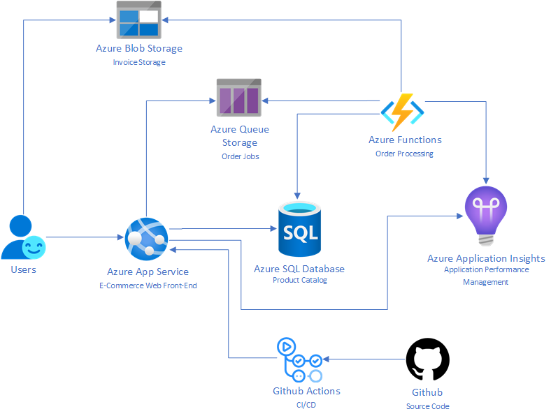

> **Note:** The solution provided is only one of many possible, viable approaches.

The solution begins with setting up Azure Migrate as the central assessment and migration hub for Parts Unlimited's E-Commerce website. Using the App Service Migration Assistant tool from Azure Migrate, Parts Unlimited found that their website is fully compatible with Azure App Service. As a next step, they use App Service Migration Assistant to provision an Azure App Service environment and deploy their application to Azure. Following the success in moving the web application, Parts Unlimited uses the Data Migration Assistant (DMA) assessment to determine that they can migrate into a fully-managed SQL Database service in Azure. The assessment reveals no compatibility issues or unsupported features that would prevent them from using Azure SQL Database.

Next, Parts Unlimited sets up a private GitHub repository and pushes their codebase to GitHub. They set up deployment slots to have a staging environment to test functionality before releasing to production. As a CI/CD solution, they decide to use GitHub Actions and Workflows.

Finally, Parts Unlimited decides to decouple its order processing system and move to an event-driven serverless compute platform. Following a [web-queue-worker architecture](https://docs.microsoft.com/en-us/azure/architecture/guide/architecture-styles/web-queue-worker), they build an Azure Function and use Azure Storage Queue to process orders and create invoices asynchronously. When new orders come in, the web front end adds jobs into the queue consumed by Azure Functions. The Functions App scales independently based on the number of jobs in the queue, helping Parts Unlimited elastically handle a variable amount of orders.

## Requirements

- Microsoft Azure subscription must be pay-as-you-go or MSDN.
  - Trial subscriptions will _not_ work.
  - **IMPORTANT:** To complete this lab, you must have sufficient rights within your Azure AD tenant to register resource providers in your Azure Subscription.
- An active GitHub Account.
  
## Exercise 1: Setting up Azure Migrate

Duration: 10 minutes

Azure Migrate provides a centralized hub to assess and migrate on-premises servers, infrastructure, applications, and data to Azure. It provides a single portal to start, run, and track your migration to Azure. Azure Migrate comes with a range of assessment tools and migration that we will use during our lab. We will use Azure Migrate as the central location for our assessment and migration efforts.

1. In the [Azure portal](https://portal.azure.com), navigate to your lab resource group. Select **Add** to add a new resource.

    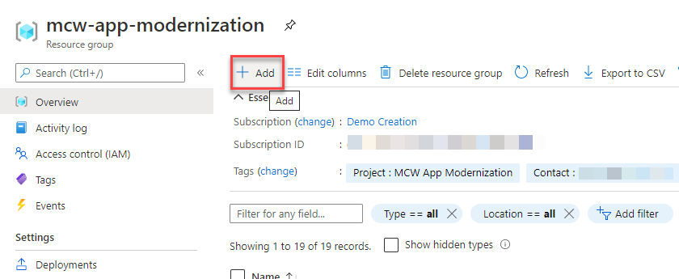

2. Type **Azure Migrate** into the search box and hit **Enter** to start the search.

    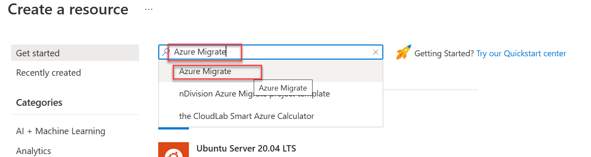

3. Select **Create** to continue.

    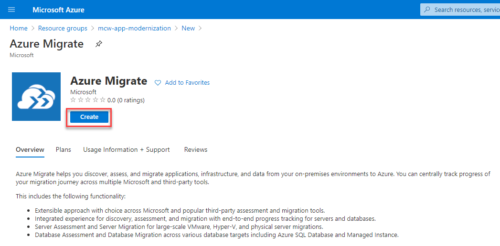

4. As part of our migration project for Parts Unlimited, we will first assess and migrate their Web Application living on IIS, on a VM. Select **Web Apps** to continue.

    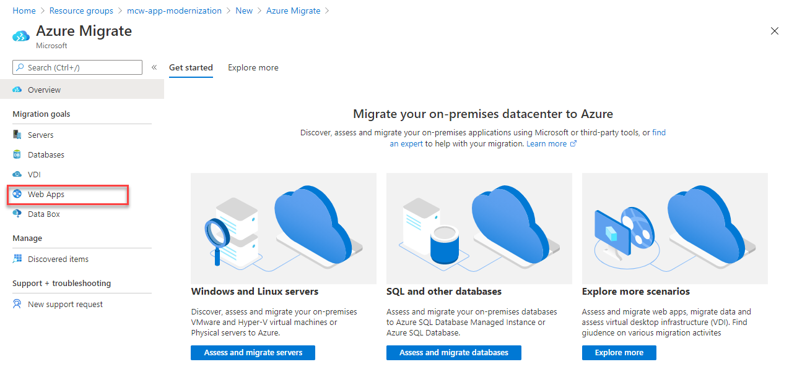

5. Select **Create project**.

    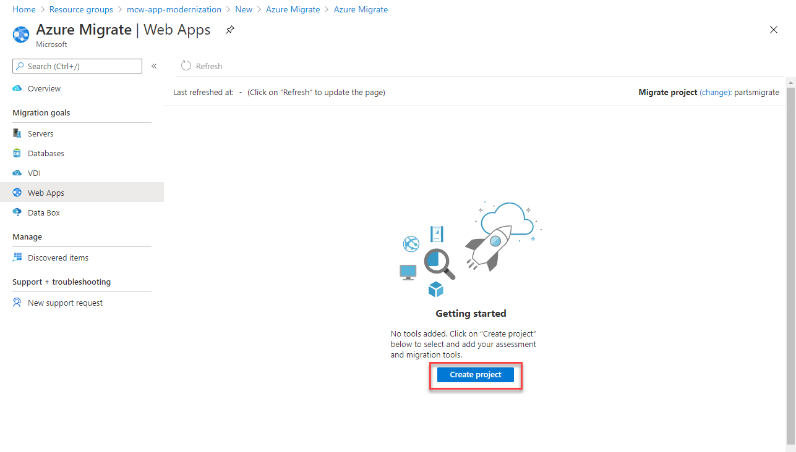

6. Type **partsunlimitedweb** as your project name. Select **Create** to continue.

    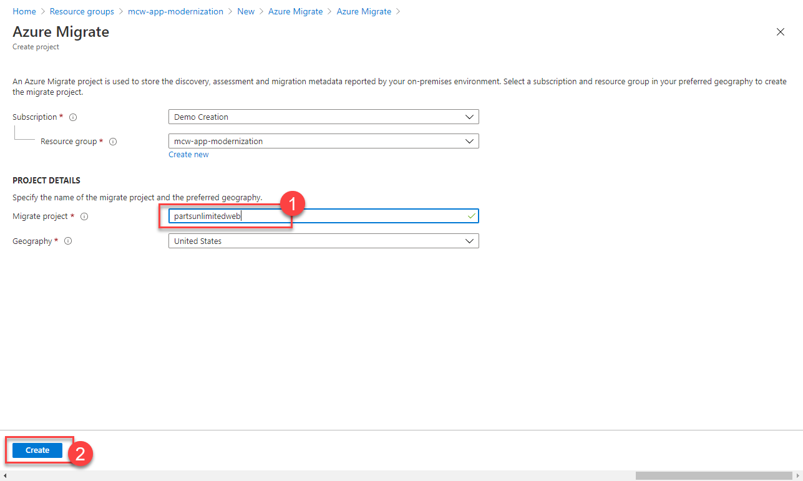

7. Once your project is created **Azure Migrate** will show you default **Web App Assessment** and **Web App Migration** tools (You might need to refresh your browser). For the Parts Unlimited web site, **App Service Migration Assistant** is the one we have to use. Download links are presented on Azure Migrate's Web Apps page. In our case, our lab environment comes with App Service Migration Assistant pre-installed on Parts Unlimited's web server.

    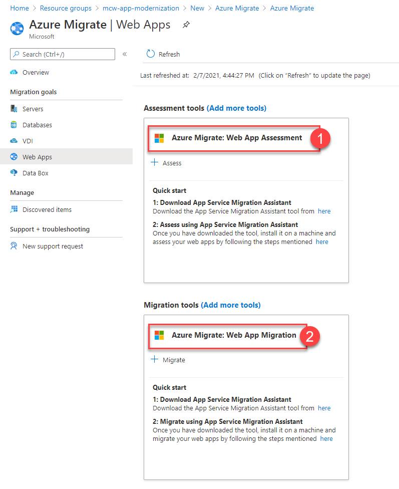

8. Another aspect of our migration project will be the database for Parts Unlimited's website. We will have to assess the database's compatibility and migrate to Azure SQL Database. Let's switch to the **SQL Server (only)** section in Azure Migrate. Select **Click here** hyperlink for Assessment tools.

    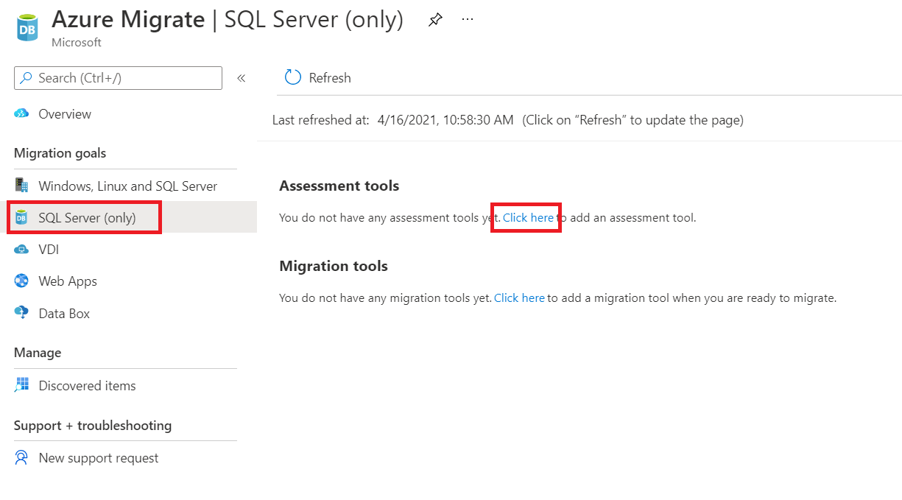

9. We will use **Azure Migrate: Database Assessment** to assess Parts Unlimited's database hosted on a SQL Server 2008 R2 server. Pick **Azure Migrate: Database Assessment (1)** and select **Add tool (2)**.

    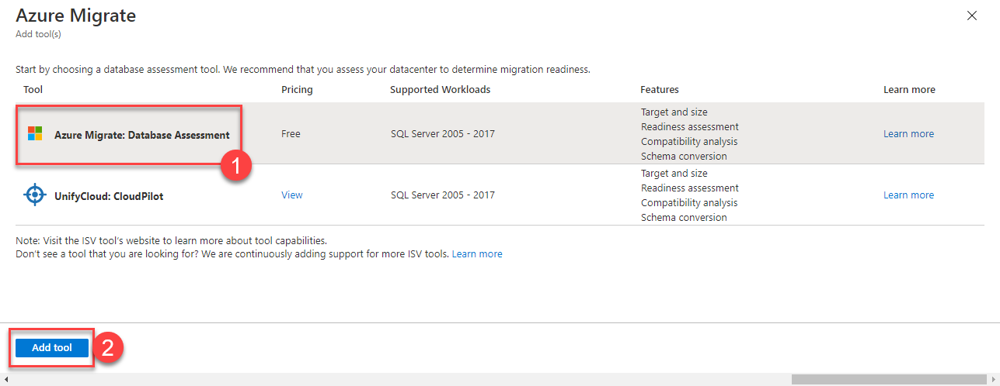

10. Now, we can see a download link for the **Data Migration Assessment (1)** tool under assessment tools in Azure Migrate. In our case, our lab environment comes with the Data Migration Assessment pre-installed on Parts Unlimited's database server. Select **Click here (2)** under the **Migration Tools** section to continue.

    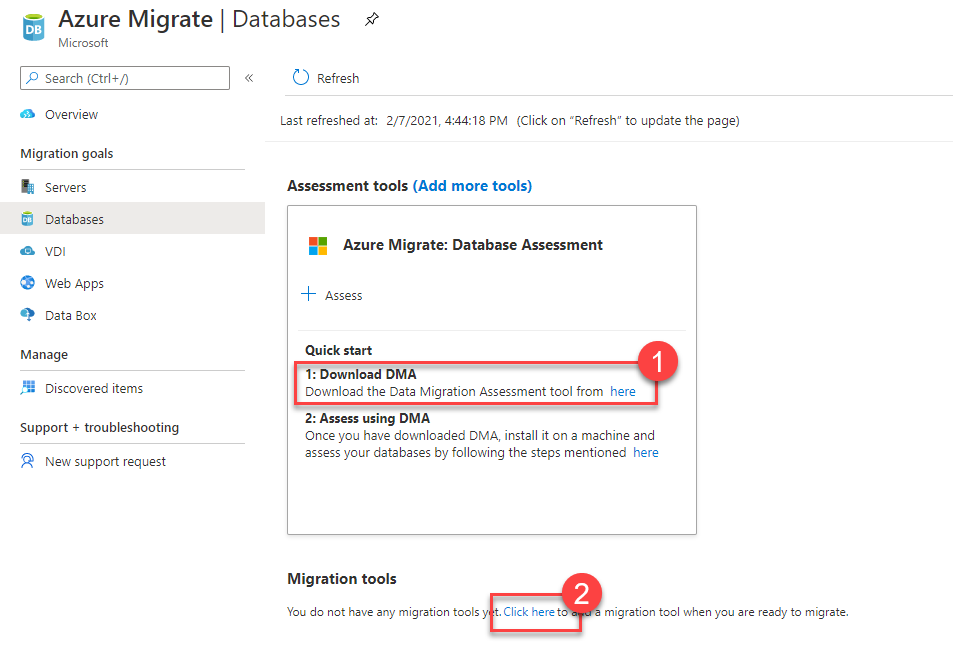

11. We will use **Azure Migrate: Database Migration** to migrate Parts Unlimited's database to an Azure SQL Database. Pick **Azure Migrate: Database Assessment (1)** and select **Add tool (2)**.

    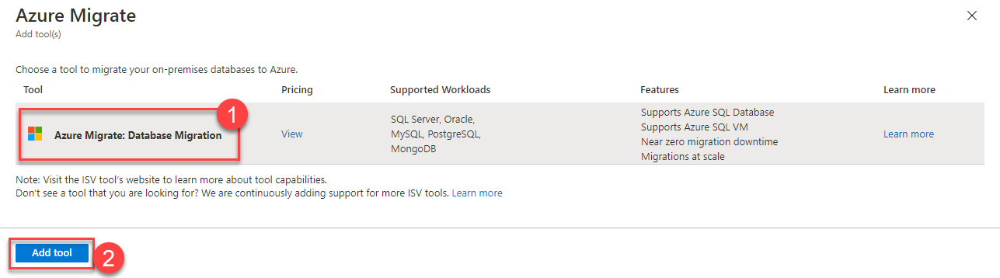

12. Now, we have all the assessment and migration tools/services we need for Parts Unlimited ready to go under the Azure Migrate umbrella.

    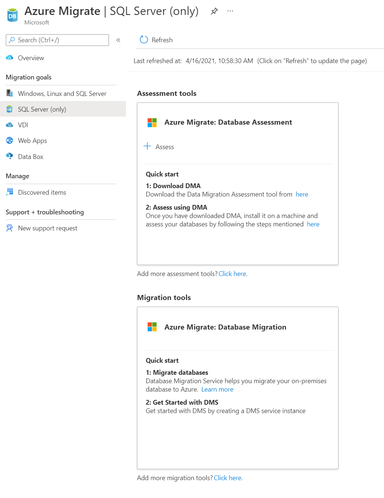

## Exercise 2: Migrate your application with App Service Migration Assistant

Duration: 20 minutes

The first step for Parts Unlimited is to assess whether their apps have dependencies on unsupported features on Azure App Service. In this exercise, you use an **Azure Migrate** tool called the [App Service migration assistant](https://appmigration.microsoft.com/) to evaluate Parts Unlimited's website for a migration to Azure App Service. The assessment runs readiness checks and provides potential remediation steps for common issues. Once the assessment succeeds, we will proceed with the migration as well. You will use a simulated on-premises environment hosted in virtual machines running on Azure.

### Task 1: Perform assessment for migration to Azure App Service

Parts Unlimited would like an assessment to see what potential issues they might need to address in moving their application to Azure App Service. You will use the [App Service migration assistant](https://appmigration.microsoft.com/) to assess the application and run various readiness checks.

1. In the [Azure portal](https://portal.azure.com), navigate to your **WebVM** VM by selecting **Resource groups** from Azure services list, selecting the **hands-on-lab-SUFFIX** resource group, and selecting the **WebVM** VM from the list of resources.

    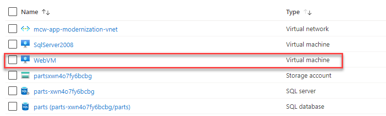

2. On the WebVM Virtual Machine's **Overview (1)** blade, copy the **Public IP address (2)**.

    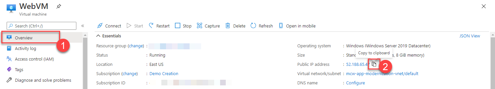

3. Open a new browser window and navigate to the IP Address you copied.

    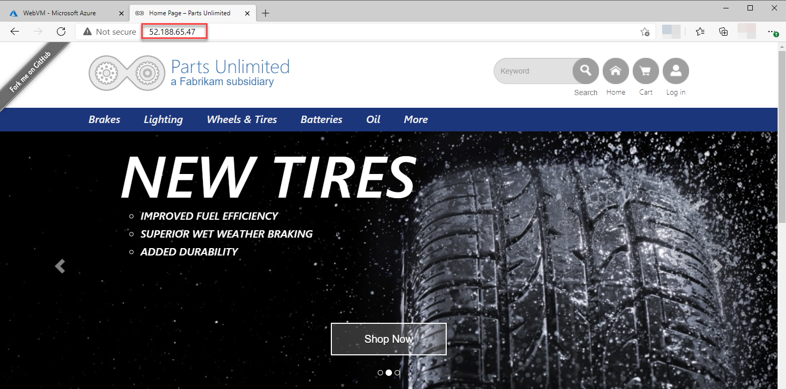

    > For testing purposes, you might want to create yourself an account on the Parts Unlimited website and purchase some products. Use the coupon code **FREE** to buy everything for free.

4. Go back to the Azure Portal. On the WebVM Virtual Machine's **Overview** blade, select **Connect (1)** and **RDP (2)** on the top menu.

   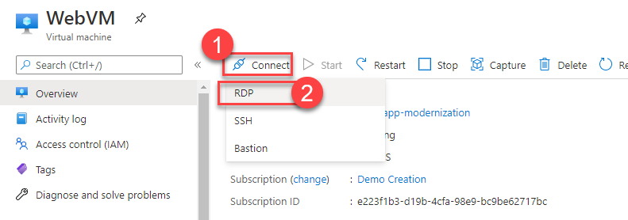

5. Select **Download RDP File** on the next page, and open the downloaded file.

    > **Note**: The first time you connect to the WebVM Virtual Machine, you will see a blue pop-up terminal dialog taking you through a couple of software installs. Don't be alarmed, and wait until the installs are complete.

    

6. Select **Connect** on the Remote Desktop Connection dialog.

    

7. Enter the following credentials with your password when prompted, and then select **OK**:

   - **Username**: demouser
   - **Password**: {YOUR-ADMIN-PASSWORD}
  
    > **Note**: default password is `Password.1!!`

    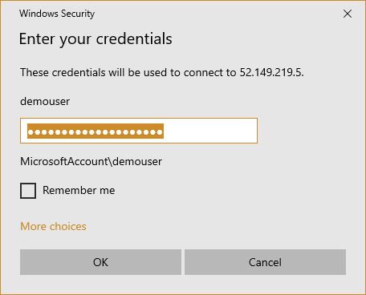

8. Select **Yes** to connect, if prompted that the identity of the remote computer cannot be verified.

    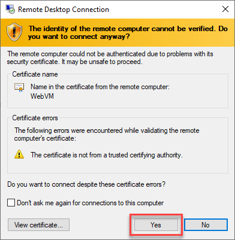

9. Once logged into the WebVM VM, a script will execute to install the various items needed for the remaining lab steps.
10. Once the script completes, open **AppServiceMigrationAssistant** that is located on the desktop.

    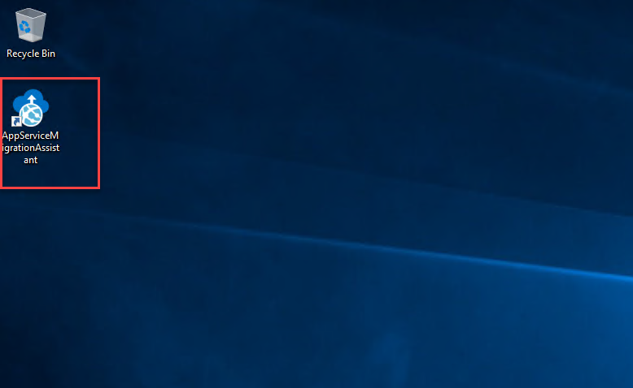

11. Once App Service Migration Assistant discovers the websites available on the server, choose **Default Web Site (1)** for migration and select **Next (2)** to start the assessment.

    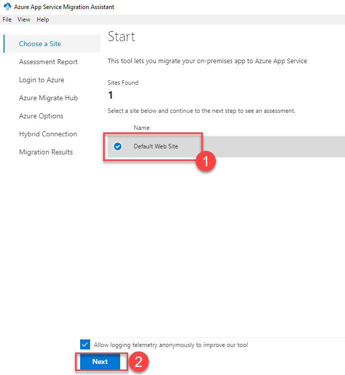

12. Observe the result of the assessment report. In our case, our application has successfully passed 13 tests **(1)** with no additional actions needed. Now that our assessment is complete, select **Next (2)** to proceed to the migration.

   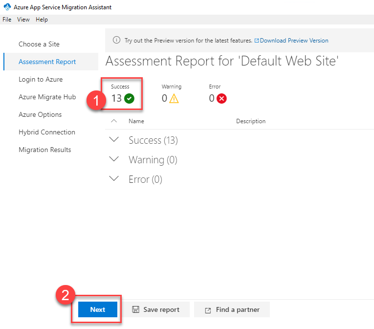

   > For the details of the readiness checks, see [App Service Migration Assistant documentation](https://github.com/Azure/App-Service-Migration-Assistant/wiki/Readiness-Checks).

### Task 2: Migrate the web application to Azure App Service

After reviewing the assessment results, you have ensured the web application is a good candidate for migration to Azure App Service. Now, we will continue the process with the migration of the application.

1. In order to continue with the migration of our website Azure App Service Migration Assistant needs access to our Azure Subscription. Select **Copy Code & Open Browser** button to be redirected to the Azure Portal.

   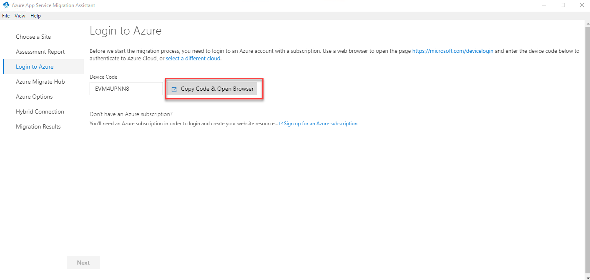

2. At its first launch, you will be asked to choose a browser. Select **Microsoft Edge (1)**  and check **Always use this app (2)** checkbox. Select **OK (2)** to move to the next step.

    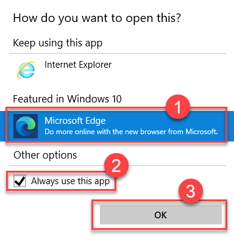

3. Right-click the text box and select **Paste (1)** to paste your login code. Select **Next** to give subscription access to App Service Migration Assistant.

    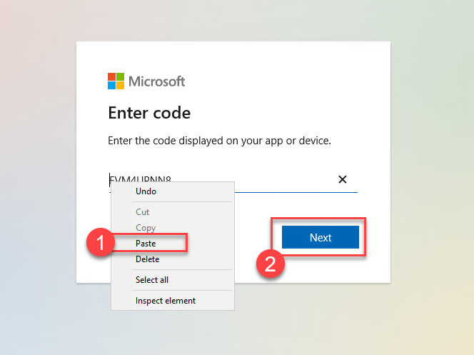

4. Continue the login process with your Azure Subscription credentials. When you see the message that says **You have signed in to the Azure App Service Migration Assistant application on your device** close the browser window and return to the App Service Migration Assistant.

    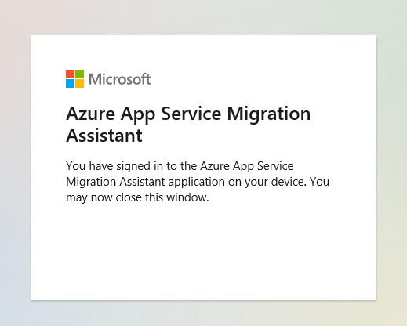

5. Select the Azure Migrate project we created **(1)** in the previous exercise to submit our migration results. Select **Next** to continue.

    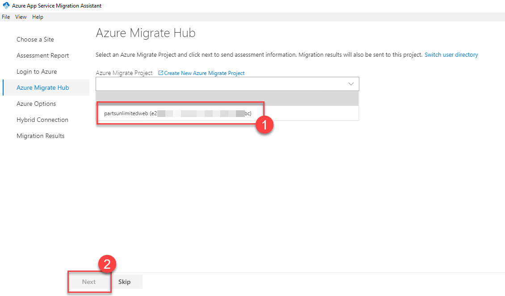

6. In order to migrate Parts Unlimited website, we have to create an App Service Plan. The Azure App Service Migration Assistant will take care of all the requirements needed. Select **Use existing (1)** and select the lab resource group as your deployment target. App Service requires a globally unique Site Name. We suggest using a pattern that matches `partsunlimited-web-{uniquesuffix}` **(2)**. Select **Migrate** to start the migration process.

    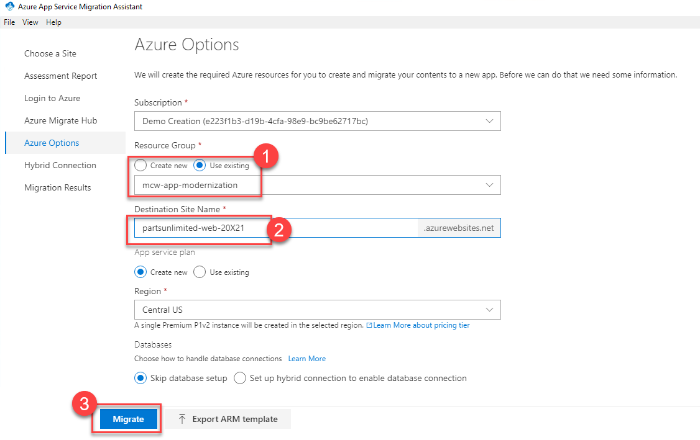

    > **WARNING:** If your migration fails with a **WindowsWorkersNotAllowedInLinuxResourceGroup (1)** try the migration process again, but this time selecting a different Resource Group for your deployment. If that is not possible, select a different Region.  
    >
    > 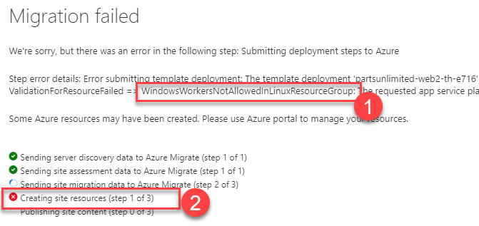

7. We have just completed the Parts Unlimited website's migration from IIS on a Virtual Machine to Azure App Service. Congratulations. Let's go back to the Azure Portal and look into Azure Migrate. Search for `migrate` **(1)** on the Azure Portal and select **Azure Migrate (2)**.

    

8. Switch to the **Web Apps (1)** section. See the number of discovered web servers, assessed websites **(2)** and migrated websites change **(3)**. Keep in mind that you might need to wait for 5 to 10 minutes for results to show up. You can use the **Refresh** button on the page to see the latest status.

    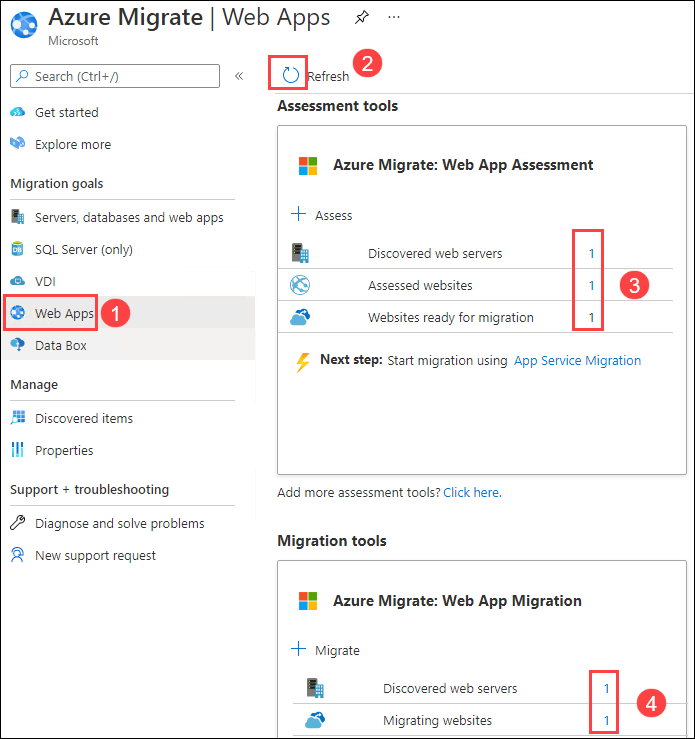

## Exercise 3: Migrate the on-premises database to Azure SQL Database

Duration: 55 minutes

The next step of Part Unlimited's migration project is the assessment and migration of its database. Currently, the database lives on a SQL Server 2008 R2 on a virtual machine. You will use an **Azure Migrate: Database Assessment** tool called **Microsoft Data Migration Assistant (DMA)** to assess the `PartsUnlimited` database for a migration to Azure SQL Database. The assessment generates a report detailing any feature parity and compatibility issues between the on-premises database and Azure SQL Database. After the assessment, you will use an **Azure Migrate: Database Migration** service called **Azure Database Migration Service (DMS)**. During the exercise, you will use a simulated on-premises environment hosted in virtual machines running on Azure.

### Task 1: Perform assessment for migration to Azure SQL Database

Parts Unlimited would like an assessment to see what potential issues they might need to address in moving their database to Azure SQL Database. In this task, you will use the [Microsoft Data Migration Assistant](https://docs.microsoft.com/sql/dma/dma-overview?view=sql-server-2017) (DMA) to assess the `PartsUnlimited` database against Azure SQL Database (Azure SQL DB). Data Migration Assistant (DMA) enables you to upgrade to a modern data platform by detecting compatibility issues that can impact database functionality on your new version of SQL Server or Azure SQL Database. It recommends performance and reliability improvements for your target environment. The assessment generates a report detailing any feature parity and compatibility issues between the on-premises database and the Azure SQL DB service.

> **Note**: The Database Migration Assistant is already installed on your SqlServer2008 VM. It can be downloaded through Azure Migrate or from the [Microsoft Download Center](https://go.microsoft.com/fwlink/?linkid=2090807) as well.

1. Connect to your SqlServer2008 VM with RDP. Your credentials are the same as the WebVM , `demouser` with `Password.1!!` password.

   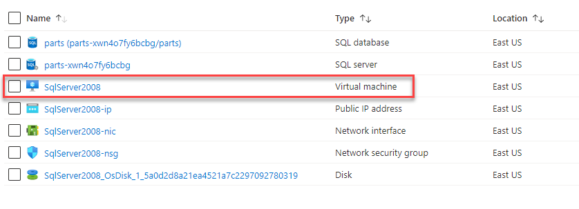

2. Launch DMA from the Windows Start menu by typing "data migration" into the search bar and then selecting **Microsoft Data Migration Assistant** in the search results.

    > **Note**: If you do not see the migration assistant, install it from the `c:\DataMigrationAssistant.msi` file.

    > **Note**: There is a known issue with screen resolution when using an RDP connection to Windows Server 2008 R2, which may affect some users. This issue presents itself as very small, hard-to-read text on the screen. The workaround for this is to use a second monitor for the RDP display, allowing you to scale up the resolution to make the text larger.

   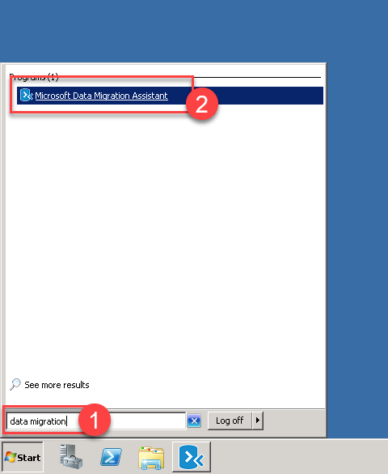

3. In the DMA dialog, select **+** from the left-hand menu to create a new project.

   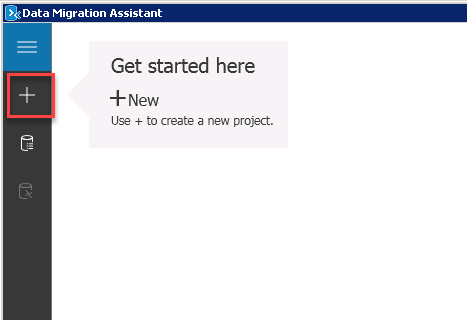

4. In the New project pane, set the name of the project **(1)** and make sure the following value are selected:

   - **Project type**: Select Assessment.
   - **Project name (1)**: Enter **Assessment**.
   - **Assessment type**: Select Database Engine.
   - **Source server type**: Select SQL Server.
   - **Target server type**: Select Azure SQL Database.

   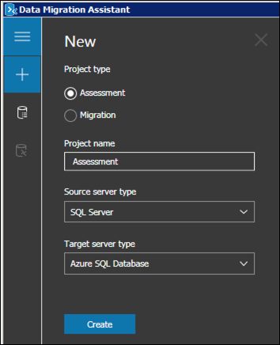

5. Select **Create (2)**.

6. On the **Options** screen, ensure **Check database compatibility (1)** and **Check feature parity (1)** are both checked, and then select **Next (2)**.

   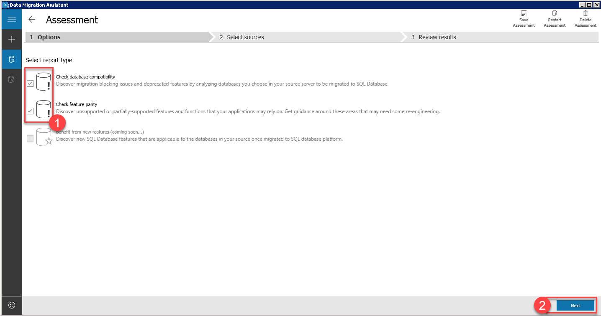

7. On the **Sources** screen, select **Add sources**.
8. 
9. Enter the following into the **Connect to a server** dialog that appears on the right-hand side:

    - **Server name (1)**: Enter **SQLSERVER2008**.
    - **Authentication type (2)**: Select **SQL Server Authentication**.
    - **Username (3)**: Enter **PUWebSite**
    - **Password (4)**: Enter **{YOUR-ADMIN-PASSWORD}** `Password.1!!`
    - **Encrypt connection**: Check this box if not checked.
    - **Trust server certificate (5)**: Check this box.

    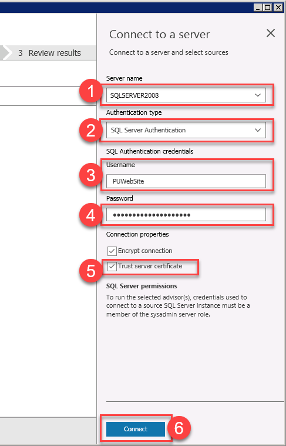

9. Select **Connect (6)**.

10. On the **Add sources** dialog that appears next, check the box for `PartsUnlimited` **(1)** and select **Add (2)**.

    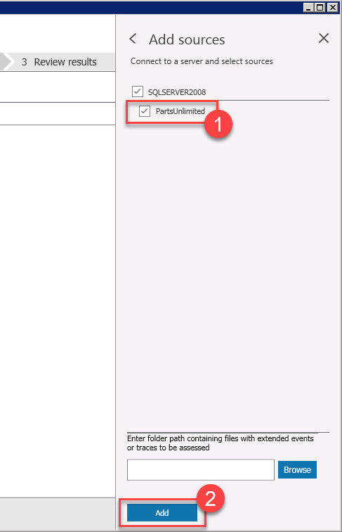

11. Select **Start Assessment**.

    

12. Take a moment to review the assessment for migrating to Azure SQL DB. The SQL Server feature parity report **(1)** shows that Analysis Services and SQL Server Reporting Services are unsupported **(2)**, but these do not affect any objects in the `PartsUnlimited` database, so they won't block a migration.

    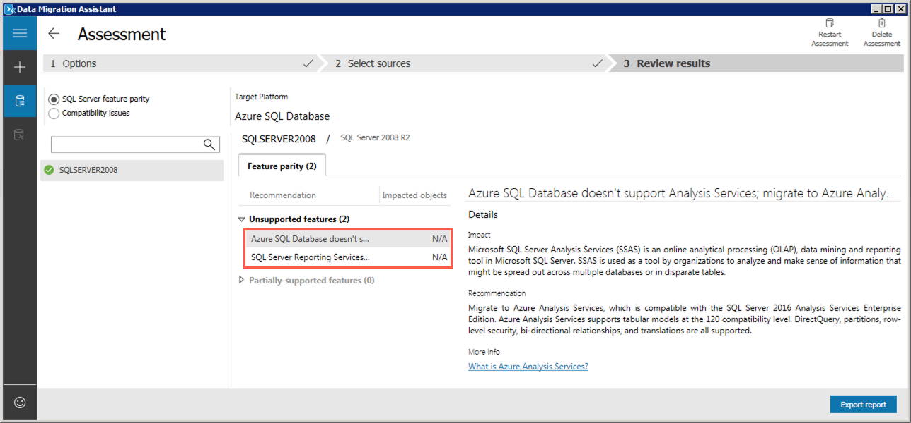

13. Now, select **Compatibility issues (1)** so you can review that report as well.

    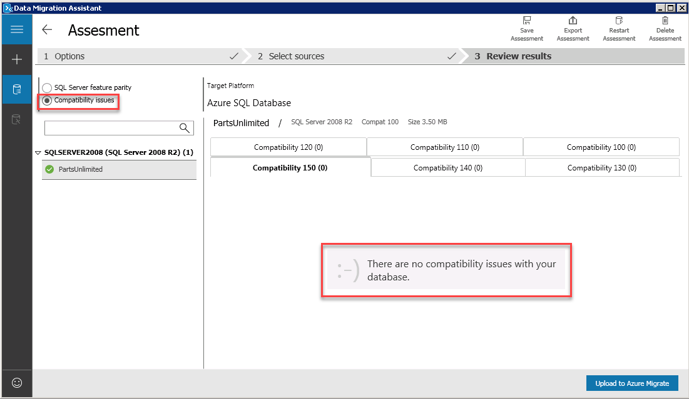

    The DMA assessment for migrating the `PartsUnlimited` database to a target platform of Azure SQL DB reveals that no issues or features are preventing Parts Unlimited from migrating their database to Azure SQL DB.

14. Select **Upload to Azure Migrate** to upload assessment results to Azure.

    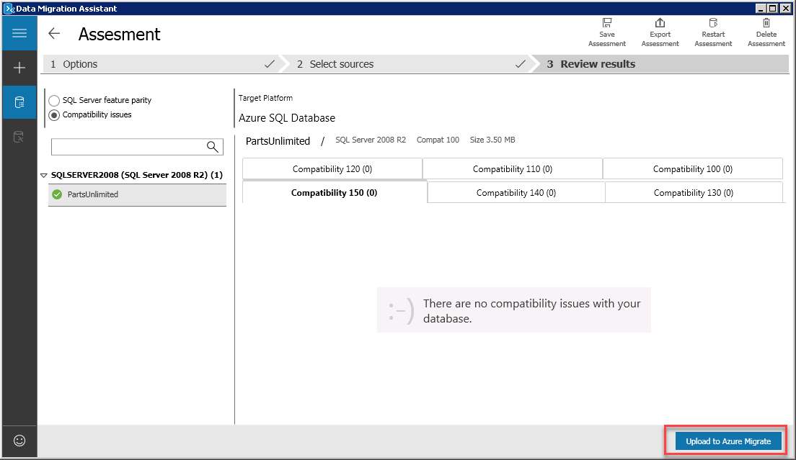

15. Select the right Azure environment **(1)** your subscription lives. Select **Connect (2)** to proceed to the Azure login screen.

    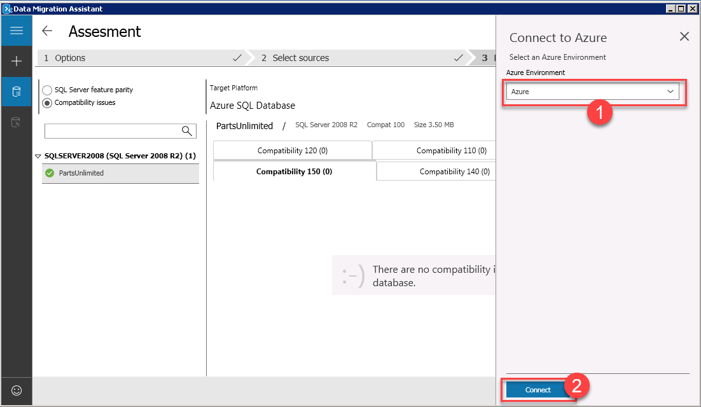

16. Select your subscription **(2)** and the `partsunlimited` Azure Migrate project **(3)**. Select **Upload (4)** to start the upload to Azure.

    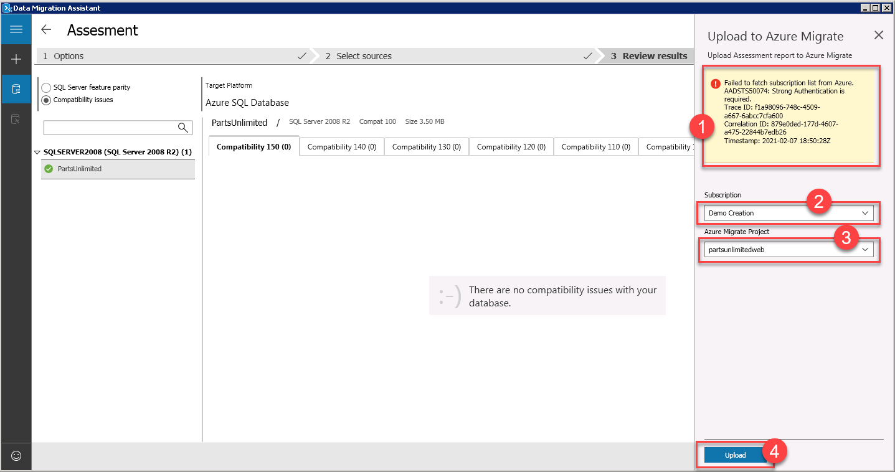

    > **Note**: If you encounter **Failed to fetch subscription list from Azure, Strong Authentication required (1)** you might not see some of your subscriptions because of MFA limitations. You should still be able to see your lab subscription.

17. Once the upload is complete select **OK** and navigate to the Azure Migrate page on the Azure Portal.

    

18. Select the **Databases (1)** page on Azure Migrate. Observe the number of assessed database instances **(2)** and the number of databases ready for Azure SQL DB **(2)**. Keep in mind that you might need to wait for 5 to 10 minutes for results to show up. You can use the **Refresh** button on the page to see the latest status.

    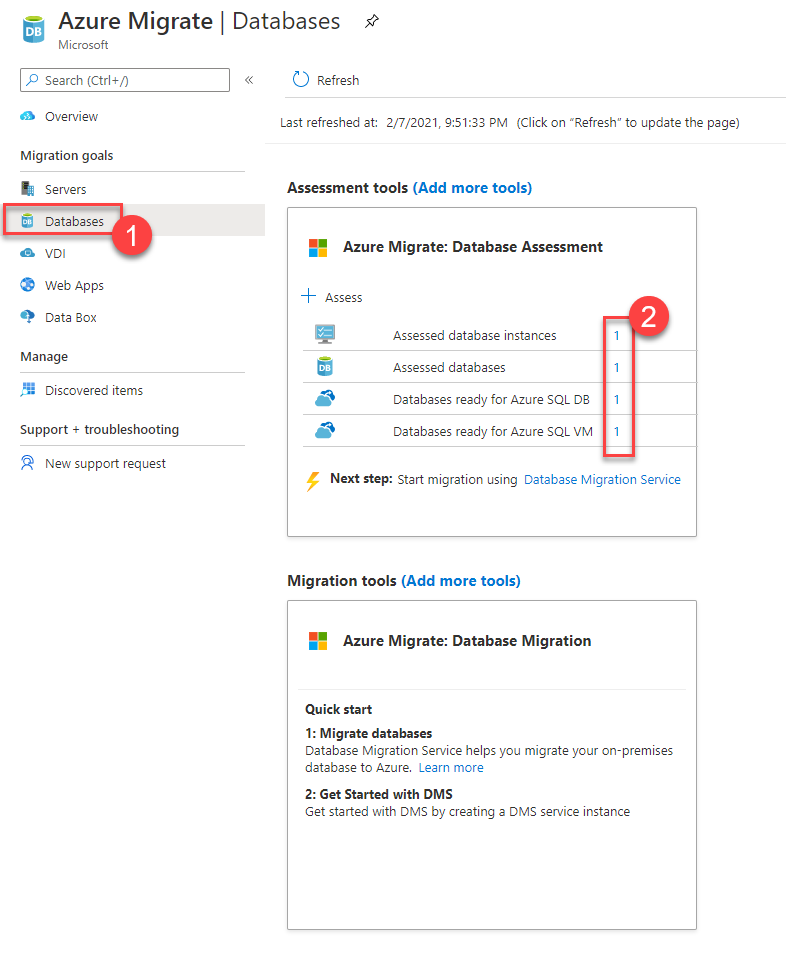

### Task 2: Retrieve connection information for SQL Databases

In this task, you will retrieve the IP address of the SqlServer2008 VM and the Fully Qualified Domain Name for the Azure SQL Database. This information is needed to connect to your SqlServer2008 VM and Azure SQL Database from Azure Data Migration Service and Azure Data Migration Assistant.

1. In the [Azure portal](https://portal.azure.com), navigate to your **SqlServer2008-ip** resource by selecting **Resource groups** from the Azure services list, selecting the **hands-on-lab-SUFFIX** resource group, and selecting the **SqlServer2008-ip** Public IP address from the list of resources.

    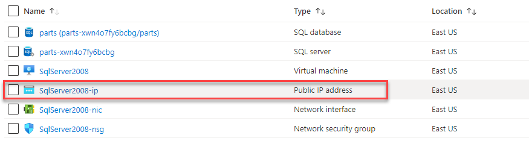

2. In the **Overview** blade, select **Copy** to copy the public IP address and paste the value into a text editor, such as Notepad.exe, for later reference.

    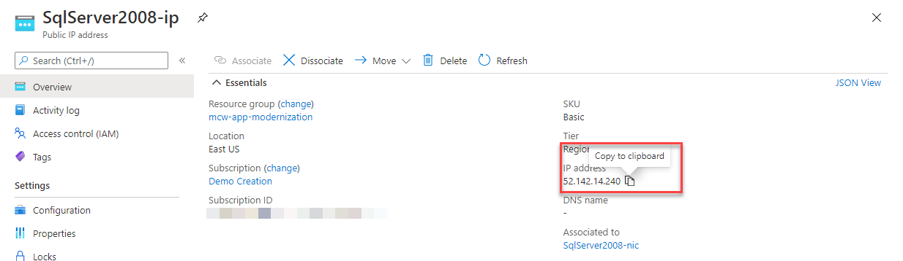

3. Go back to the resource list and navigate to your **SQL database** resource by selecting the **parts** SQL database resource from the resources list.

    > **Note**: If you do not see the database resource, navigate to the SQL Server resource, then select **SQL Databases** and then the **parts** database.

   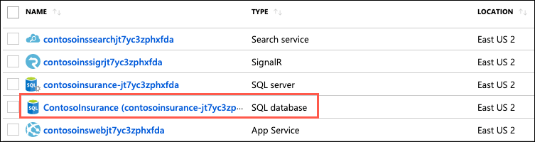

4. On the Overview blade of your SQL database, copy the **Server name** and paste the value into a text editor, such as Notepad.exe, for later reference.

   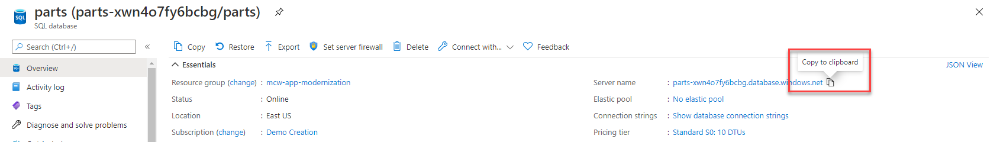

### Task 3: Migrate the database schema using the Data Migration Assistant

After reviewing the assessment results and ensuring the database is a candidate for migration to Azure SQL Database, use the Data Migration Assistant to migrate the schema to Azure SQL Database.

1. On the SqlServer2008 VM, return to the Data Migration Assistant and select the New **(+)** icon in the left-hand menu.

2. In the New project dialog, enter the following:

   - **Project type (1)**: Select Migration.
   - **Project name (2)**: Enter Migration.
   - **Source server type**: Select SQL Server.
   - **Target server type**: Select Azure SQL Database.
   - **Migration scope (3)**: Select Schema only.

   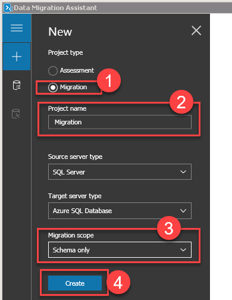

3. Select **Create (4)**.

4. On the **Select source** tab, enter the following:

   - **Server name (1)**: Enter **SQLSERVER2008**.
   - **Authentication type (2)**: Select **SQL Server Authentication**.
   - **Username (3)**: Enter **PUWebSite**
   - **Password (4)**: Enter **{YOUR-ADMIN-PASSWORD}** `Password.1!!`
   - **Encrypt connection**: Check this box.
   - **Trust server certificate (5)**: Check this box.
   - Select **Connect (6)**, and then ensure the `PartsUnlimited` database is selected **(7)** from the list of databases.

   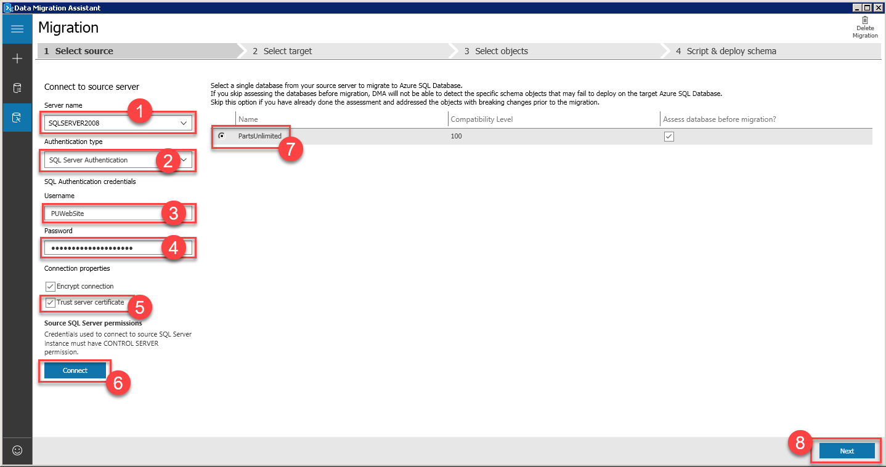

5. Select **Next (7)**.

6. On the **Select target** tab, enter the following:

   - **Server name (1)**: Paste the server name of your Azure SQL Database you copied into a text editor in the previous task.
   - **Authentication type (2)**: Select SQL Server Authentication.
   - **Username (3)**: Enter **demouser**
   - **Password (4)**: Enter **{YOUR-ADMIN-PASSWORD}** `Password.1!!`
   - **Encrypt connection**: Check this box.
   - **Trust server certificate (5)**: Check this box.
   - Select **Connect (6)**, and then ensure the `parts` database is selected **(7)** from the list of databases.

   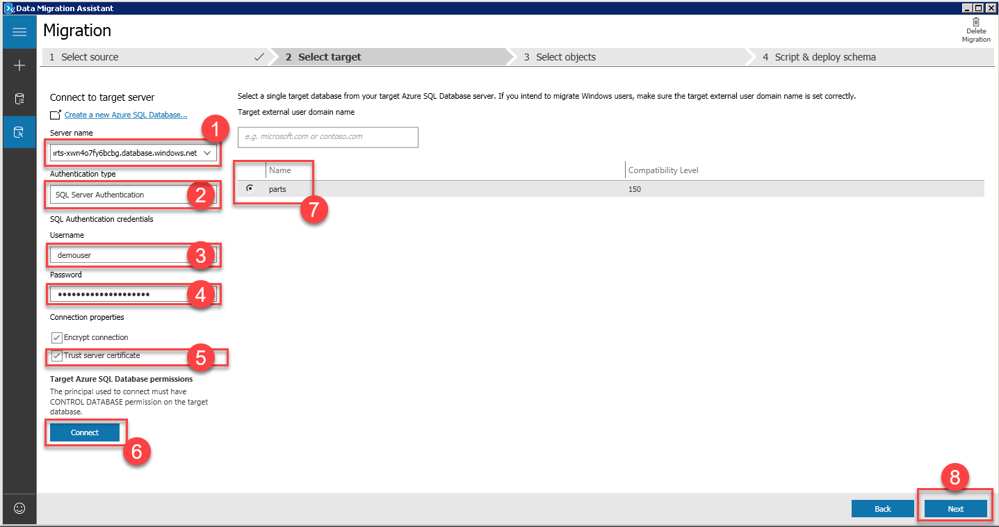

7. Select **Next (8)**.

8. On the **Select objects** tab, leave all the objects checked **(1)**, and select **Generate SQL script (2)**.

    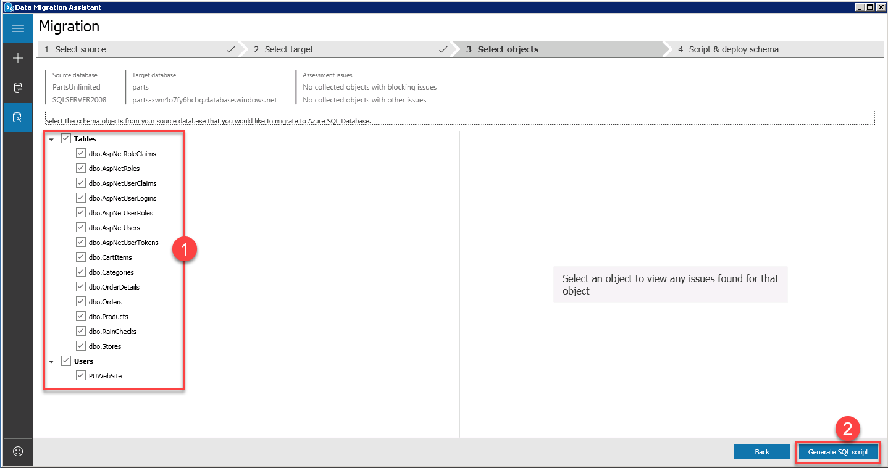

9. On the **Script & deploy schema** tab, review the script. Notice the view also provides a note that there are no blocking issues **(1)**.

    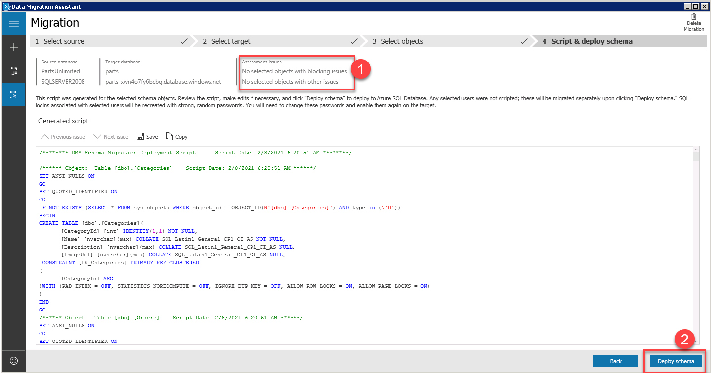

10. Select **Deploy schema (2)**.

11. After the schema is deployed, review the deployment results, and ensure there were no errors.

    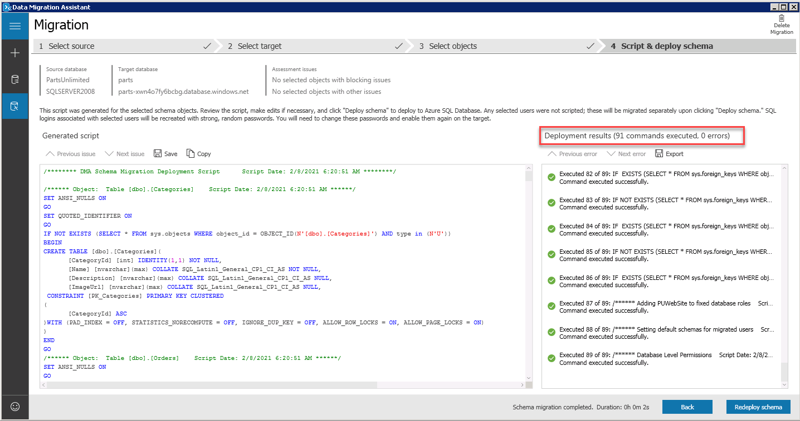

12. Launch SQL Server Management Studio (SSMS) on the SqlServer2008 VM from the Windows Start menu by typing "sql server management" **(1)** into the search bar and then selecting **SQL Server Management Studio 17 (2)** in the search results.

    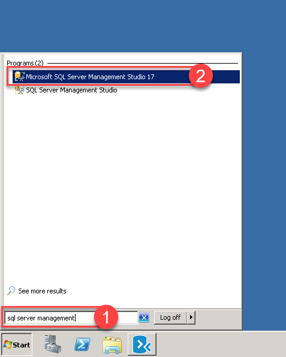

13. Connect to your Azure SQL Database by selecting **Connect->Database Engine** in the Object Explorer and then entering the following into the Connect to server dialog:

    - **Server name (1)**: Paste the server name of your Azure SQL Database you copied above.
    - **Authentication type (2)**: Select SQL Server Authentication.
    - **Username (3)**: Enter **demouser**
    - **Password (4)**: Enter **{YOUR-ADMIN-PASSWORD}** `Password.1!!`
    - **Remember password (5)**: Check this box.

    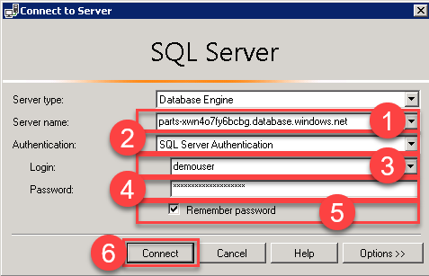

14. Select **Connect (6)**.

15. Once connected, expand **Databases**, and expand **parts**, then expand **Tables**, and observe the schema has been created **(1)**. Expand **Security > Users** to observe that the database user is migrated as well **(2)**.

    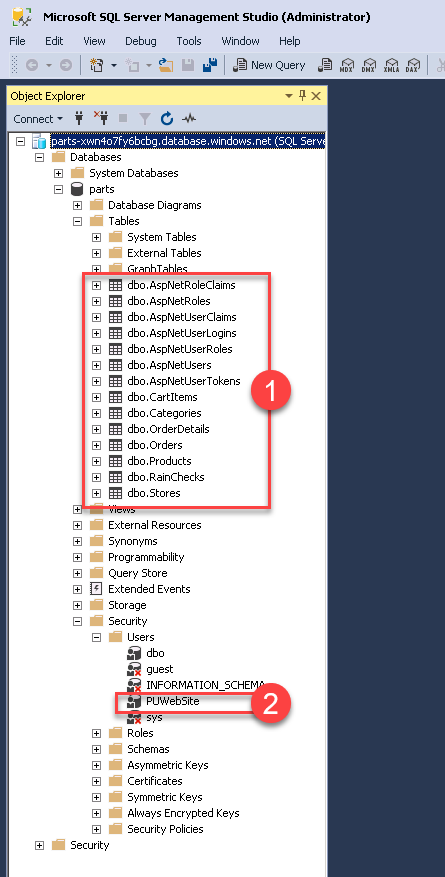

### Task 4: Migrate the database using the Azure Database Migration Service

At this point, you have migrated the database schema using DMA. In this task, you migrate the data from the `PartsUnlimited` database into the latest Azure SQL Database using the Azure Database Migration Service.

> The [Azure Database Migration Service](https://docs.microsoft.com/azure/dms/dms-overview) integrates some of the functionality of Microsoft's existing tools and services to provide customers with a comprehensive, highly available database migration solution. The service uses the Data Migration Assistant to generate assessment reports that provide recommendations to guide you through the changes required before performing a migration. When you're ready to begin the migration process, Azure Database Migration Service conducts all necessary steps.

1. In the [Azure portal](https://portal.azure.com), navigate to your Azure Database Migration Service by selecting **Resource groups** from the Azure services list, selecting the **hands-on-lab-SUFFIX** resource group, and then selecting the **contoso-dms-UniqueId** Azure Database Migration Service in the list of resources.

   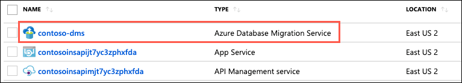

2. On the Azure Database Migration Service blade, select **+New Migration Project**.

   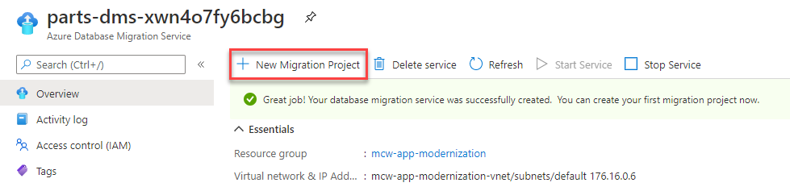

3. On the New migration project blade, enter the following:

   - **Project name (1)**: Enter DataMigration.
   - **Source server type**: Select SQL Server.
   - **Target server type**: Select Azure SQL Database.
   - **Choose type of activity**: Select **Offline data migration** and select **Save**.

   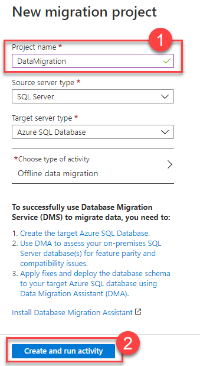

4. Select **Create and run activity (2)**.

5. On the Migration Wizard **Select source** blade, enter the following:

   - **Source SQL Server instance name (1)**: Enter the IP address of your SqlServer2008 VM that you copied into a text editor in the previous task. For example, `51.143.12.114`.
   - **Authentication type (2)**: Select SQL Authentication.
   - **Username (3)**: Enter **PUWebSite**
   - **Password (4)**: Enter **{YOUR-ADMIN-PASSWORD}** `Password.1!!`
   - **Connection properties (5)**: Check both Encrypt connection and Trust server certificate.

   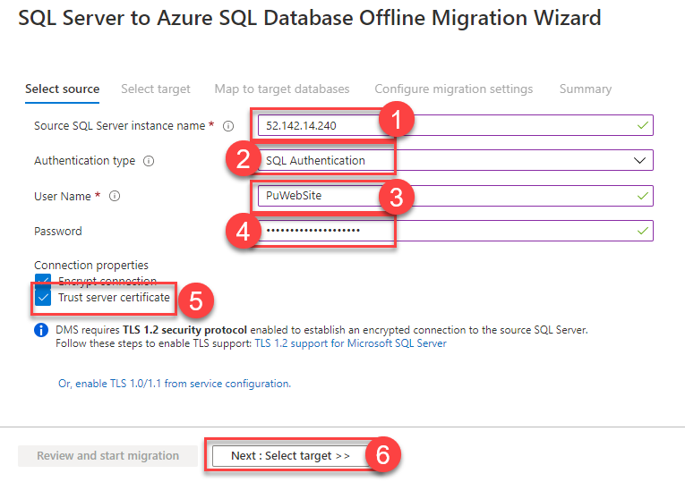

6. Select **Next: Select databases >> (6)**.

7. PartsUnlimited database comes preselected. Select **Next: Select target >>** to continue.

    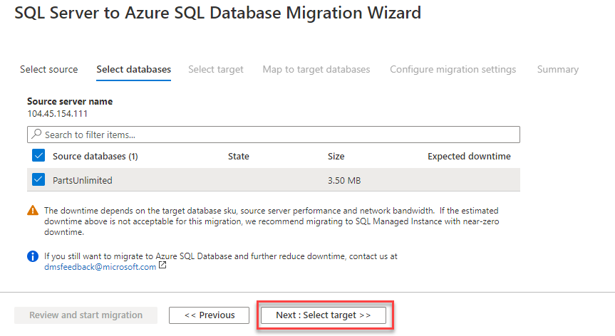

8. On the Migration Wizard **Select target** blade, enter the following:

   - **Target server name (1)**: Enter the `fullyQualifiedDomainName` value of your Azure SQL Database (e.g., parts-xwn4o7fy6bcbg.database.windows.net), which you copied in the previous task.
   - **Authentication type (2)**: Select SQL Authentication.
   - **Username (3)**: Enter **demouser**
   - **Password (4)**: Enter **{YOUR-ADMIN-PASSWORD}** `Password.1!!`
   - **Connection properties**: Check Encrypt connection.

   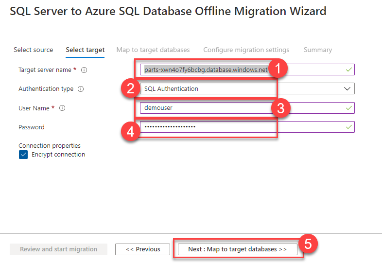

9. Select **Next: Map to target databases >> (5)**.

10. On the Migration Wizard **Map to target databases** blade, confirm that **PartsUnlimited (1)** is checked as the source database, and **parts (2)** is the target database on the same line, then select **Next: Configuration migration settings >> (3)**.

    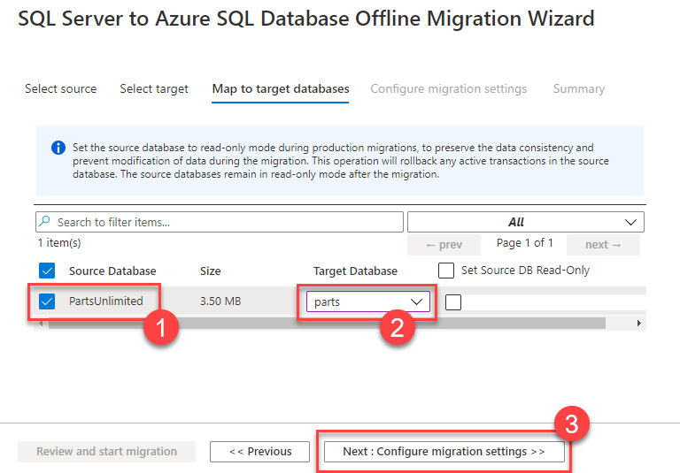

11. On the Migration Wizard **Configure migration settings** blade, expand the **PartsUnlimited (1)** database and verify all the tables are selected **(2)**.

    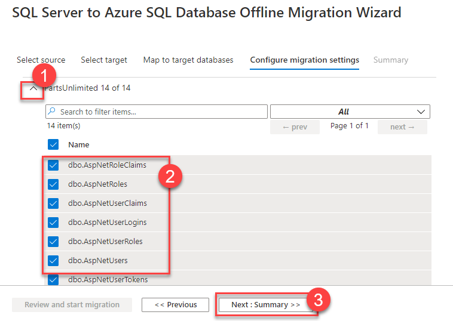

12. Select **Next: Summary >> (3)**.

13. On the Migration Wizard **Summary** blade, enter the following:

    - **Activity name**: Enter PartsUnlimitedDataMigration.

    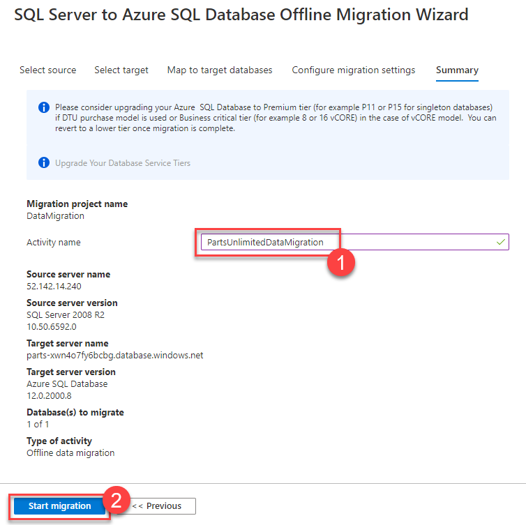

14. Select **Start migration**.

15. Monitor the migration on the status screen that appears. Select the refresh icon in the toolbar to retrieve the latest status.

    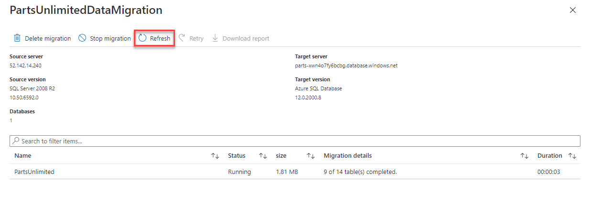

    > The migration takes approximately 2 - 3 minutes to complete.

16. When the migration is complete, you should see the status as **Completed**.

    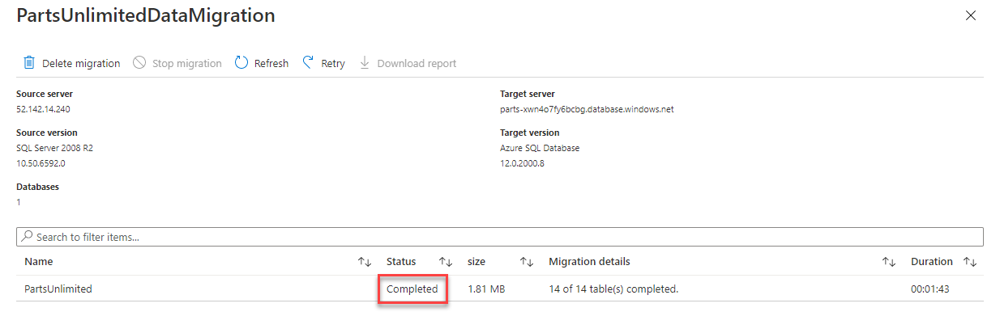

17. When the migration is complete, select the **PartsUnlimited** migration item.

    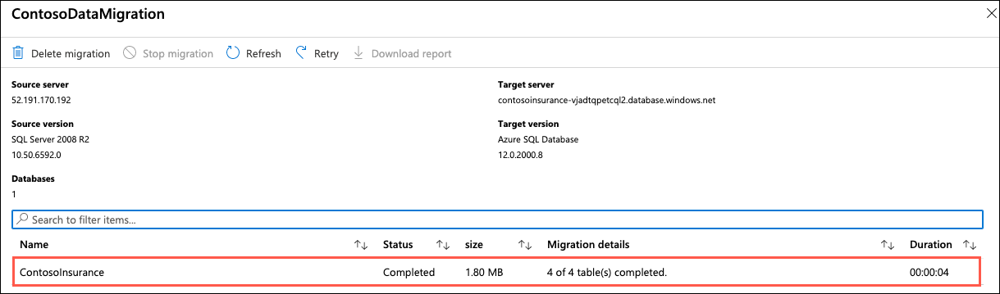

18. Review the database migration details.

    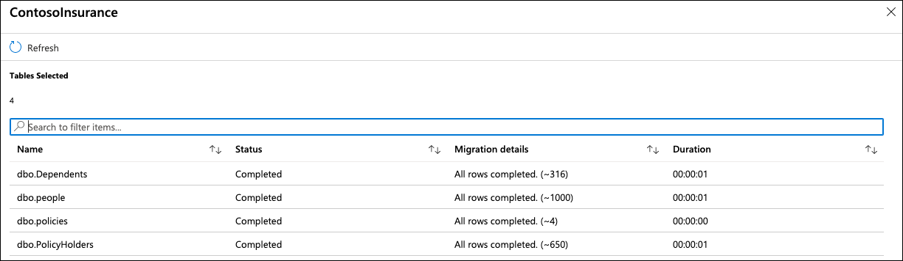

19. If you received a status of "Warning" for your migration, you can find more details by selecting **Download report** from the ContosoDataMigration screen.

    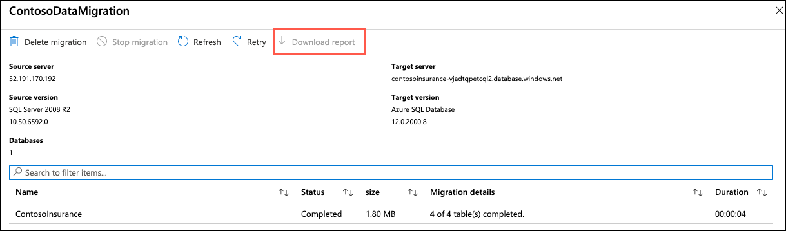

    > **Note**: The **Download report** button will be disabled if the migration is completed without warnings or errors.

20. The reason for the warning can be found in the Validation Summary section. In the report below, you can see that a storage object schema difference triggered a warning. However, the report also reveals that everything was migrated successfully.

    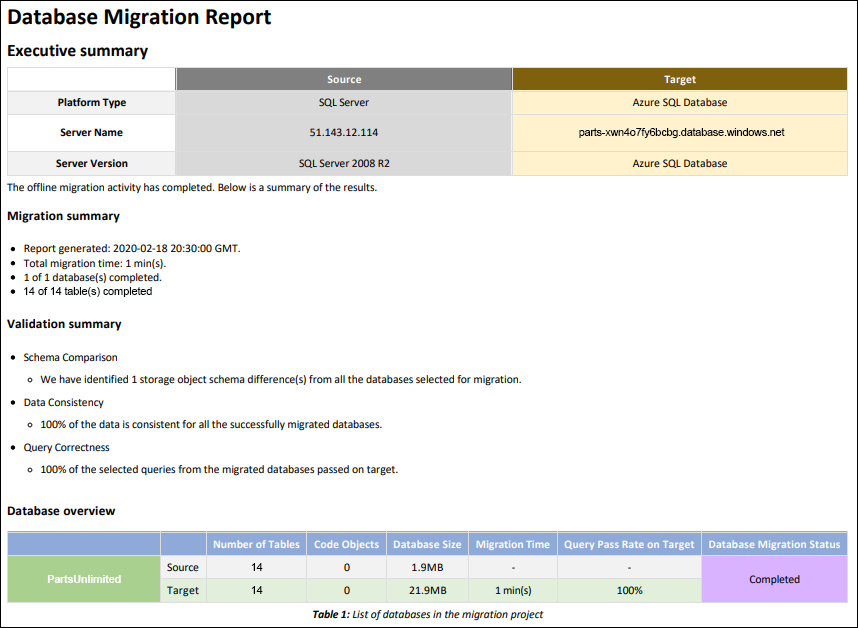

### Task 5: Configure the application connection to SQL Azure Database

Now that we have both our application and database migrated to Azure. It is time to configure our application to use the SQL Azure Database.

1. In the [Azure portal](https://portal.azure.com), navigate to your `parts` SQL Database resource by selecting **Resource groups** from Azure services list, selecting the **hands-on-lab-SUFFIX** resource group, and selecting the `parts` SQL Database from the list of resources.

   

2. Switch to the **Connection strings (1)** blade, and copy the connection string by selecting the copy button **(2)**.

   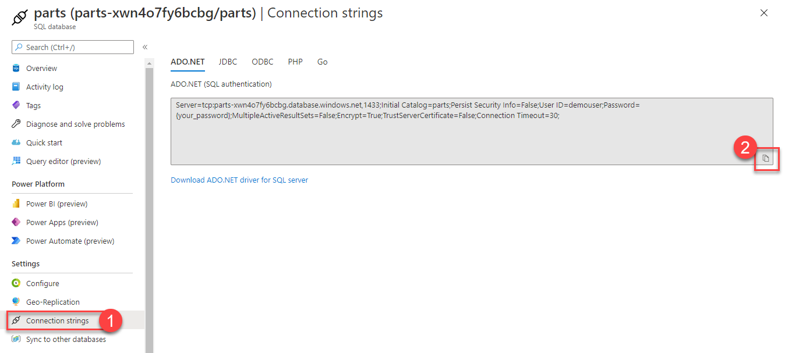

3. Paste the value into a text editor, such as Notepad.exe, to replace the Password placeholder. Replace the `{your_password}` section with your admin password. Copy the entire connection string with the replaced password for later use.

    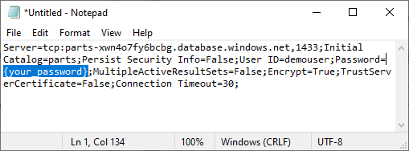

4. Go back to the resource list, navigate to your `partsunlimited-web-{uniquesuffix}` **(2)** App Service resource. You can search for `partsunlimited-web` **(1)** to find your Web App and App Service Plan.

   

5. Switch to the **Configuration (1)** blade, and select **+New connection string (2)**.

    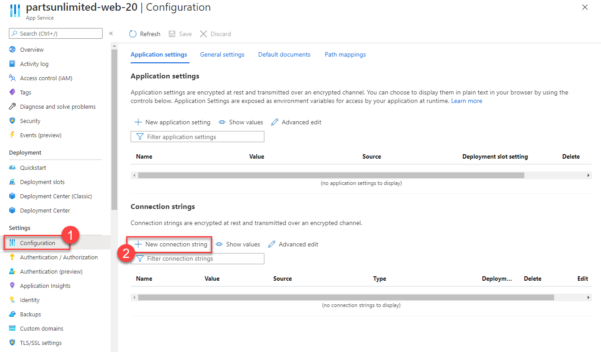

6. On the **Add/Edit connection string** panel, enter the following:

   - **Name(1)**: Enter `DefaultConnectionString`.
   - **Value**: Enter SQL Connection String you copied in Step 3.
   - **Type (3)**: Select **SQLAzure**
   - **Deployment slot setting (4)**: Check this option to make sure connection strings stick to a deployment slot. This will be helpful when we add additional deployment slots during the next exercises.

    

7. Select **OK (5)**.

8. Select **Save** and **Continue** for the following confirmation dialog.

    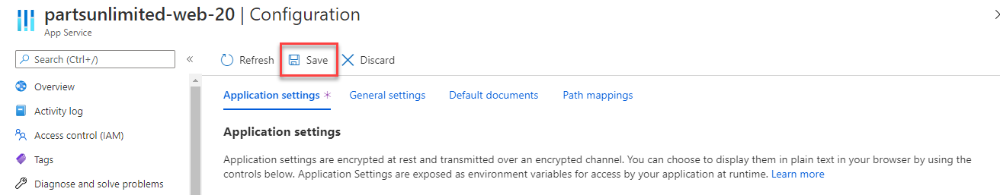

9. Switch to the **Overview (1)** blade, and select **URL (2)** to navigate to the Parts Unlimited website hosted in our Azure App Service using Azure SQL Database.

    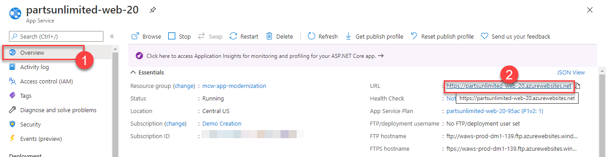

## Exercise 4: Setup CI/CD pipeline with GitHub Actions for the web app

Duration: 55 minutes

In this exercise, you will move the codebase to a GitHub Repo, create a staging environment in Azure App Service using App Service Deployment Slots, and finally connect the pieces with a CI/CD Pipeline built on GitHub Actions.

### Task 1: Moving the codebase to a GitHub repo

1. Log in to [GitHub](https://github.com) with your account. Select the New button positioned on top of the repositories list. As an alternative, you can [navigate to the new repository site here](https://github.com/new).

    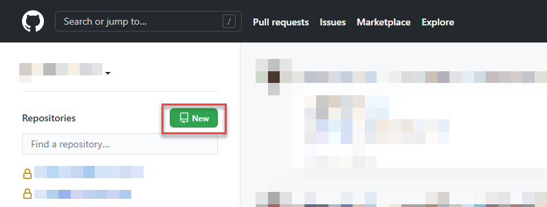

2. Type in `partsunlimited` **(1)** as your repository name. Select **Private (2)** to prevent public access to the repository. Select **Create repository (3)** to continue.

    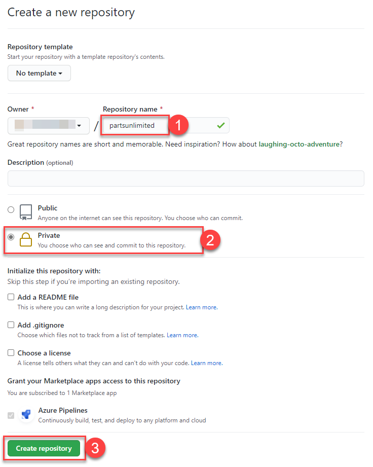

3. Select the **clipboard copy command** to copy the Git endpoint for your repository and paste the value into a text editor, such as Notepad.exe, for later reference.

    

    So far, we have used the WebVM virtual machine to simulate Parts Unlimited's On-Premises IIS server. Now that we are done with the migration of Parts Unlimited's website. We will use the VM to execute some development tasks.

4. Connect to your WebVM VM with RDP.

   

5. Right-click on the Windows Start Menu and select **Windows PowerShell (Admin)** to launch a terminal window.

    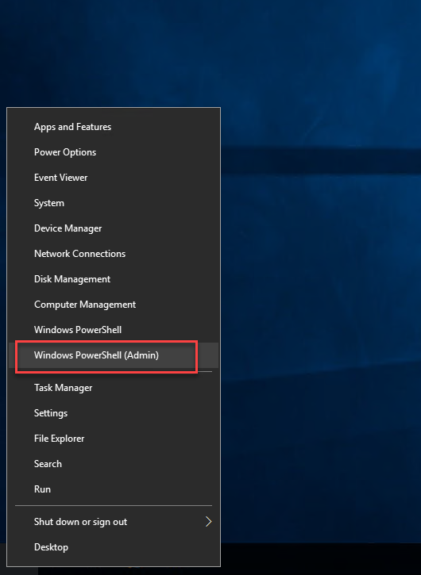

6. The Parts Unlimited website's source code is already copied into the VM as part of the **Before the hands-on lab exercises**. Run the command below to navigate to the source code folder.

    ```powershell
    cd "C:\MCW\MCW-App-modernization-main\Hands-on lab\lab-files\src"
    ```

7. Run the following command to initialize a local Git repository.

    ```powershell
    git init
    ```

    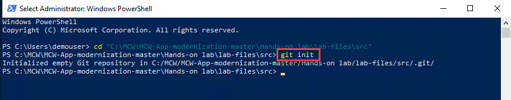

8. Next, we will define the remote endpoint as an origin to our local repository. Replace `{YourEndpointURL}` with the endpoint URL you copied previously from GitHub. Run the final command in your PowerShell terminal.

    ```powershell
    git remote add origin {YourEndpointURL}
    ```

    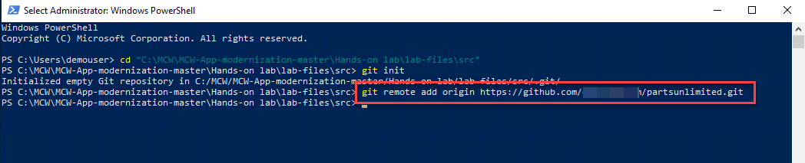

9. Run the following commands to rename the current branch to **Main** and stage all the files for a git commit.

    ```powershell
    git branch -M main
    git add .
    ```

10. Before we commit our changes, we have to identify our git user name and e-mail. In the following command, replace `John Doe` with your name and `johndoe@example.com` with your e-mail address. Once ready, run the command in your PowerShell terminal.

    ```powershell
    git config --global user.name "John Doe"
    git config --global user.email johndoe@example.com
    ```

11. We are ready to commit the source code to our local Git repository. Run the following command to continue.

    ```powershell
    git commit -m "Initial Commit"
    ```

12. Let's push our code to GitHub. Run the following command in your PowerShell terminal.

    ```powershell
    git push -u origin main
    ```

13. GitHub authentication screen will pop up. Select **Sign in with your browser (2)**. A new browser pop-up will appear with the GitHub login page.

    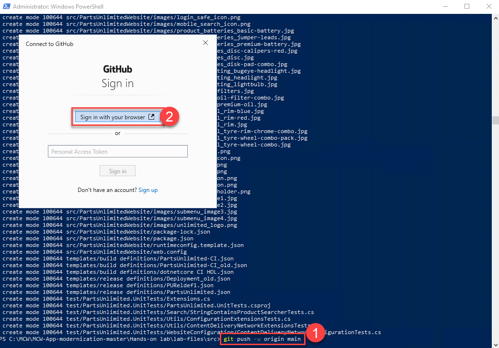

14. Fill-in your GitHub account credentials on the browser window to Sign-In.

15. On the **Authorize Git Credential Manager** screen, select **Authorize GotCredentialManager**. This will give your local environment permission to push the code to GitHub.

    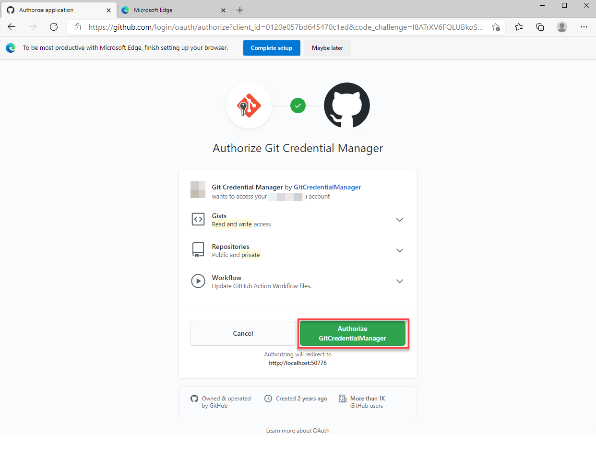

16. Close the browser.

17. Go back to GitHub and observe the repository with the source code uploaded.

    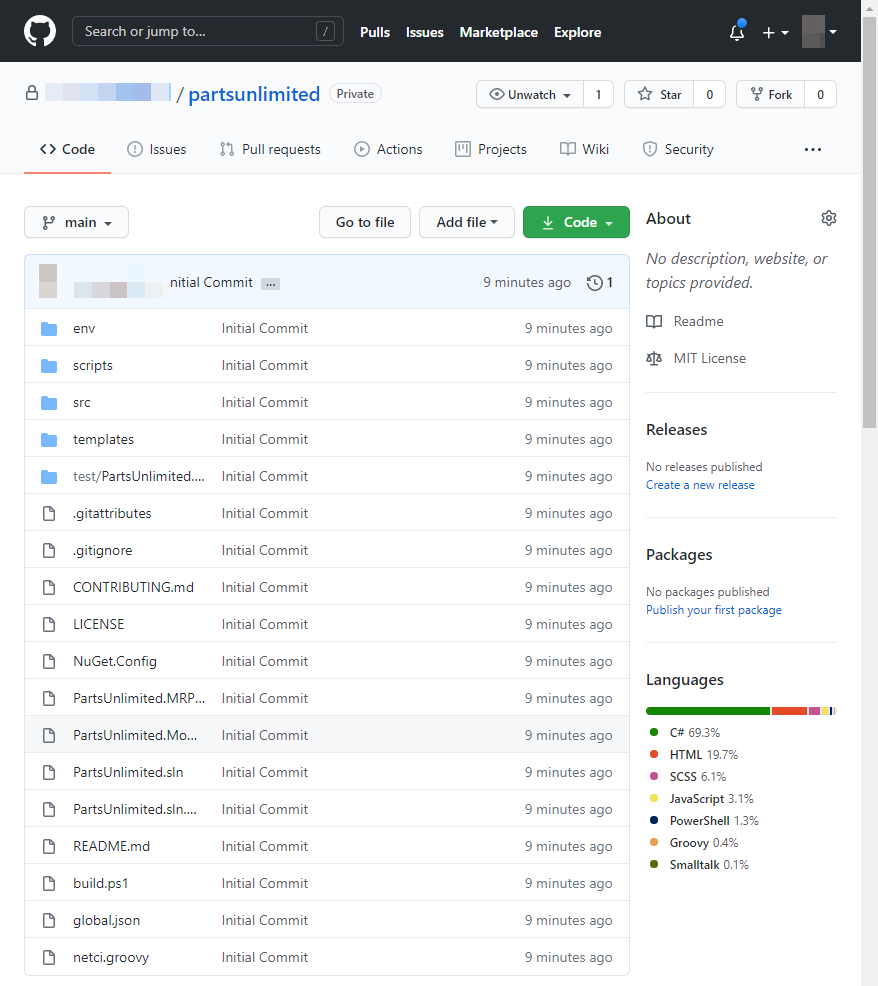

### Task 2: Creating a staging deployment slot

1. Go back to your lab resource group, navigate to your `partsunlimited-web-{uniquesuffix}` **(2)** App Service resource. You can search for `partsunlimited-web` **(1)** to find your Web App and App Service Plan

   

2. Switch to the **Deployment slots (1)** tab and select **Add Slot (2)**.

    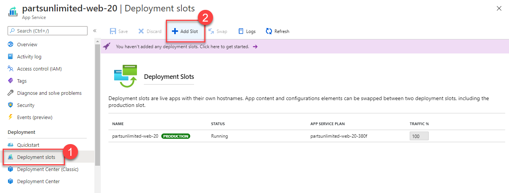

3. Type in **staging** as the name **(1)** of the new slot. Select your app service name from the **Clone settings from (2)** dropdown list. This will ensure our website configurations for the production environment are copied over to the staging environment as a starting point. Select **Add (3)** to add the new slot.

    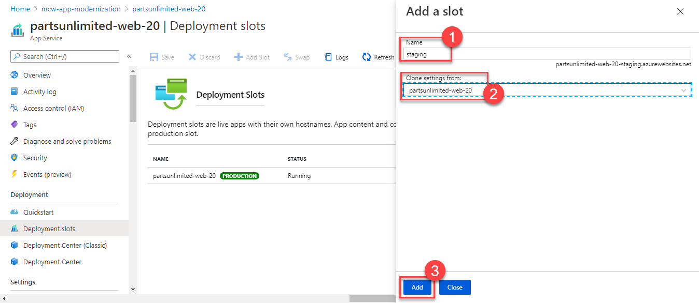

4. Once you receive the success message, close **(1)** the panel. Observe **(2)** the two environments we have for the App Service in the deployment slots list.

    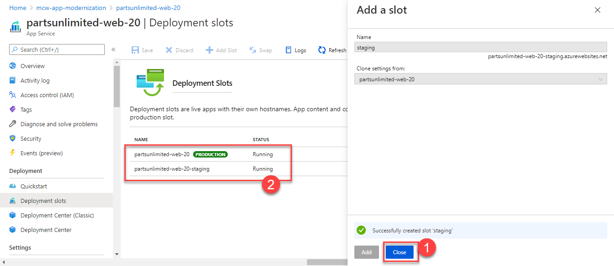

### Task 3: Setting up CI/CD with GitHub Actions

1. Select your staging slot from the list of deployment slots.

    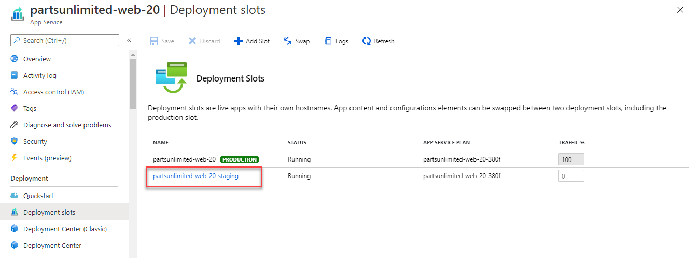

2. Switch to the **Deployment Center (1)** tab. Select **Go to Settings (2)**.

    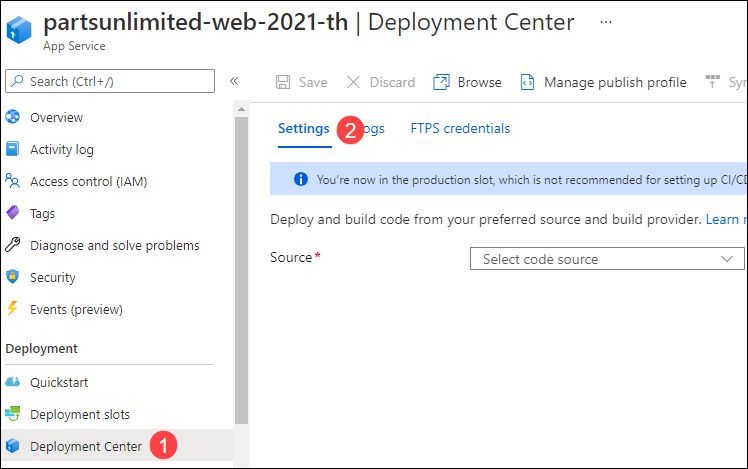

3. Select **GitHub (1)** as your source; **.NET Core (2)** as the runtime stack and **.NET Core 2.1 (LTS) (3)** for version. Select **Authorize** to create the connection between the App Service deployment slot and the GitHub repository we previously prepared.

    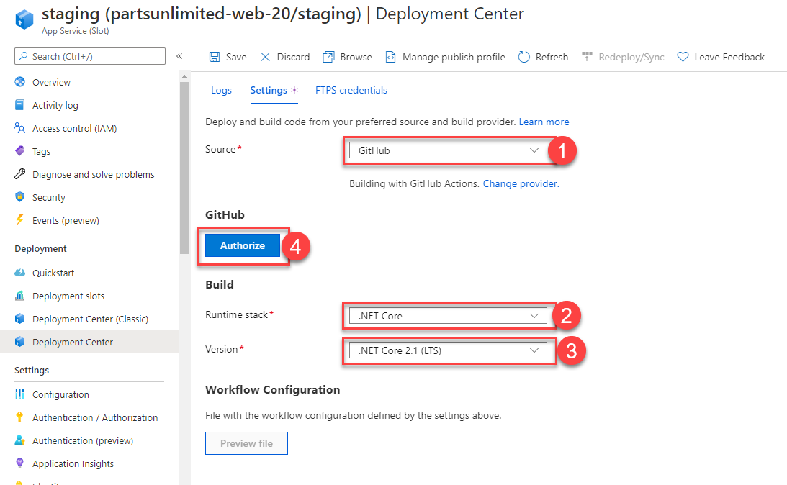

4. Login with your GitHub credentials and provide authorization to App Service to access the repository by selecting **Authorize AzureAppService**.

    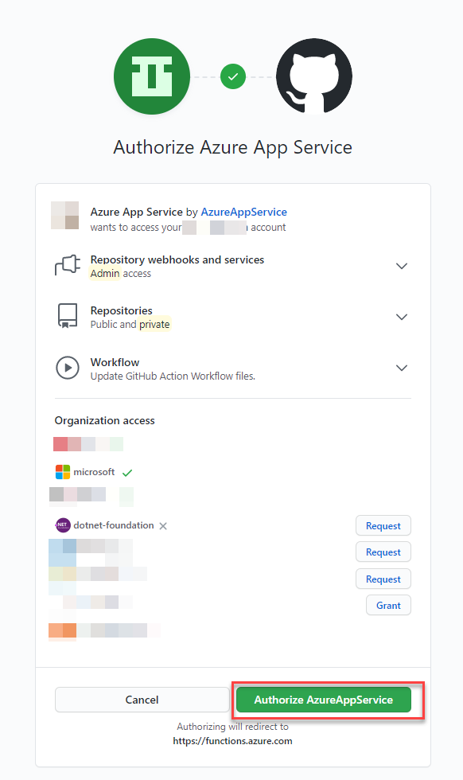

5. Once GitHub authorization is complete, go back to the browser with the Azure Portal. Select the GitHub **Organization (1)** where you created the GitHub repository. This might be your personal account name if that is where you created the repository. Select the repository **partsunlimited (2)** and the branch **main (3)** as the source for the CI/CD pipeline. Select **Save (4)** to create CI/CD pipeline.

    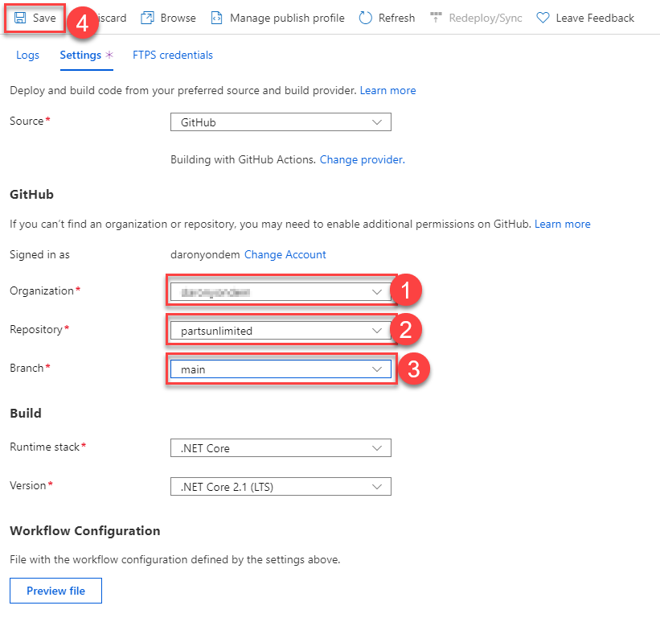

    Once you select **Save**, the portal will add your App Service publishing profile as a secret to your GitHub repository. This will allow GitHub Actions to publish the Parts Unlimited website to the staging deployment slot. Additionally, the portal will create a YAML file that describes the steps required to build and publish the code in the partsunlimited repository.

6. Visit your GitHub repository on GitHub.com to look for changes. Navigate to `.github/workflows` **(1)** to see the **YAML file (2)** and the commit **(3)** made to the repository on your behalf.

    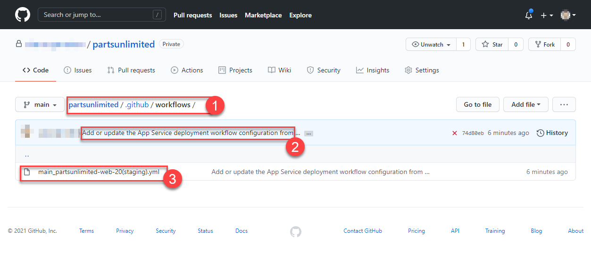

7. Select **Actions (1)** to navigate to the Actions page where you can see the list of workflow runs on the repository. Noticed that the latest run has failed **(2)**. Select the failed run (2) to investigate the issue.

    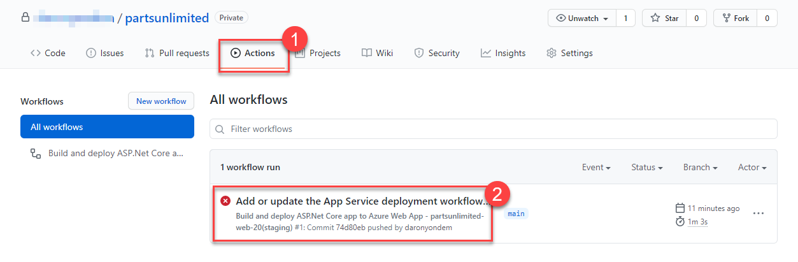

8. Select the failed job to dig deeper.

    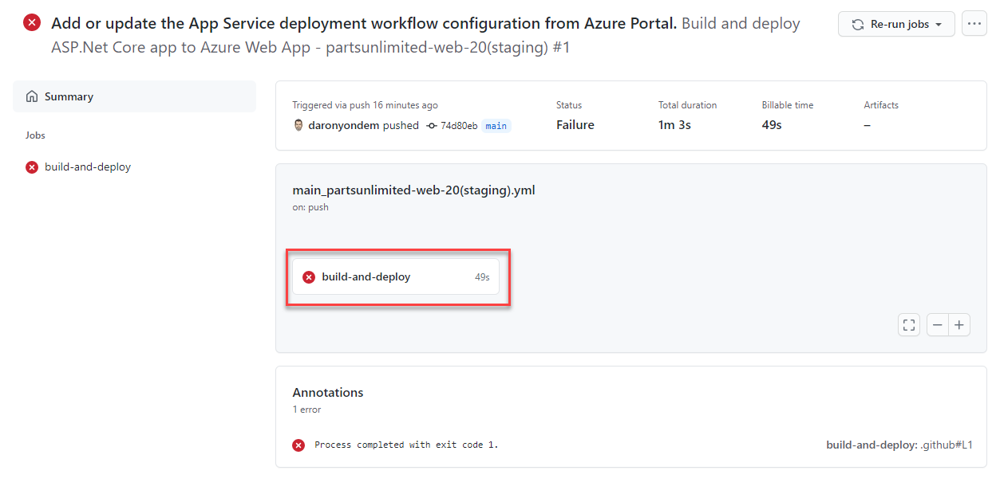

9. In the error message, we can see a mismatch between the .NET Core version the build job is using and the one the project is built against. When we set up our CI/CD pipeline, the Azure Portal listed .NET Core LTS (Long Term Support) versions only. Unfortunately, Parts Unlimited uses a .NET Core version that hit the end of life on December 23, 2019. We will have to change our pipeline setup manually to accommodate project requirements.

    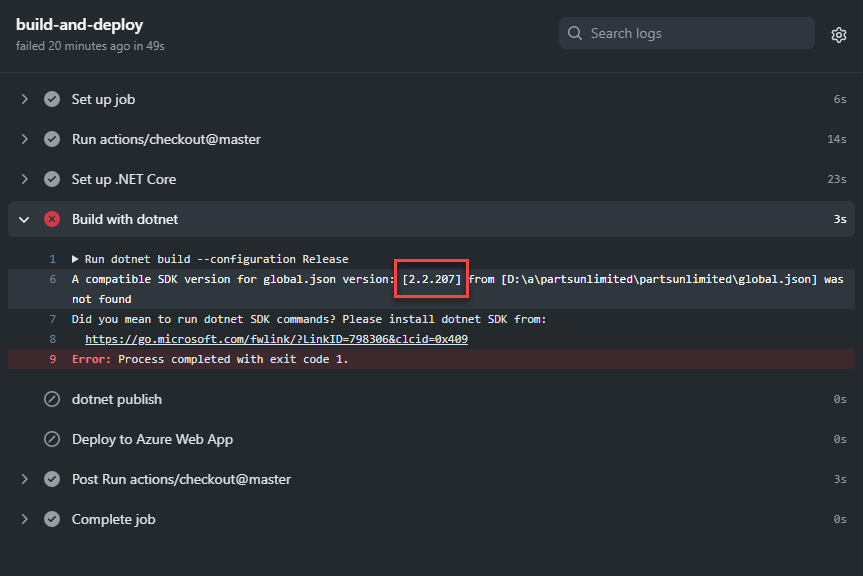

10. Select **Code (1)** to switch back to the repository code view. Select **.github/workflows (2)** to navigate to the location where the workflow YAML code is stored.

    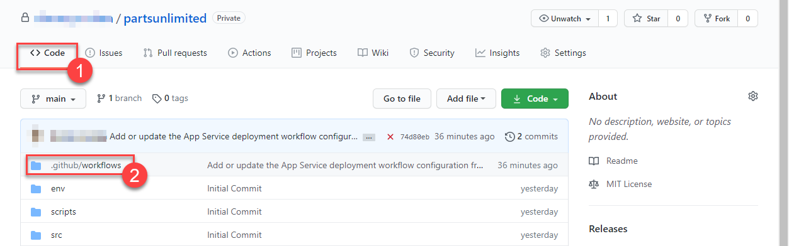

11. Select the YAML file name `main_partsunlimited-web-20(staging).yml`.

    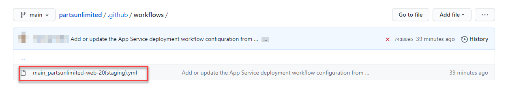

12. Select the **Edit this file (1)** button to modify the YAML file.

    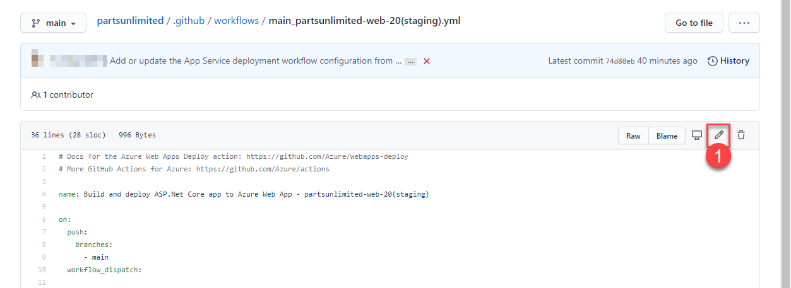

13. We have to change the **dotnet-version (1)** number to `2.2.207`. Additionally, we have to add the solution file name **(2)** and the project file name **(3)** to dotnet build and publish commands. The reason behind this change is the fact that Parts Unlimited has multiple solutions and projects in its codebase.

    

    Here is the final YAML file that you can use if needed.

    ```yaml
    
    # Docs for the Azure Web Apps Deploy action: https://github.com/Azure/webapps-deploy
    # More GitHub Actions for Azure: https://github.com/Azure/actions
    
    name: Build and deploy ASP.Net Core app to Azure Web App - partsunlimited-web-20(staging)
    
    on:
    push:
        branches:
        - main
    workflow_dispatch:
    
    jobs:
    build-and-deploy:
        runs-on: windows-latest
    
        steps:
        - uses: actions/checkout@main
    
        - name: Set up .NET Core
        uses: actions/setup-dotnet@v1
        with:
            dotnet-version: '2.2.207'
    
        - name: Build with dotnet
        run: dotnet build PartsUnlimited.sln --configuration Release
    
        - name: dotnet publish
        run: dotnet publish src/PartsUnlimitedWebsite/PartsUnlimitedWebsite.csproj -c Release -o ${{env.DOTNET_ROOT}}/myapp
    
        - name: Deploy to Azure Web App
        uses: azure/webapps-deploy@v2
        with:
            app-name: 'partsunlimited-web-20'
            slot-name: 'staging'
            publish-profile: ${{ secrets.AzureAppService_PublishProfile_a00d49c7adc84a028ccc74ff431024d5 }}
            package: ${{env.DOTNET_ROOT}}/myapp
    ```

14. Once all changes are complete, select **Start commit (4)**. Type a commit message **(5)**. Select **Commit changes (6)** to submit your changes to the repository.

15. Select **Actions (1)** to switch to the workflows page. Notice the latest successful run **(2)** of our workflow.

    

16. Go back to your lab resource group on the Azure Portal, navigate to your `staging (partsunlimited-web-{uniquesuffix}/staging)` **(2)** App Service resource. You can search for `staging` **(1)** to find your App Service (Slot) for staging.

    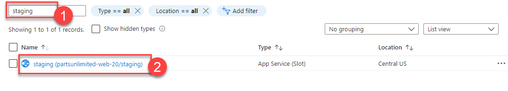

17. Notice the dedicated web link for your staging slot. Select to navigate to the website to see the result of your successful deployment through the CI/CD pipeline.

    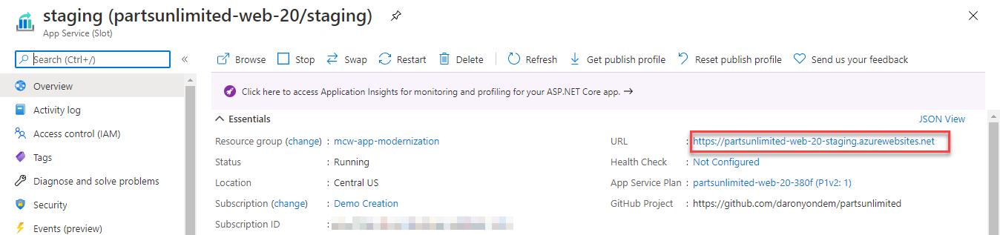

### Task 4: Pushing code changes to staging and production

1. Connect to your WebVM VM with RDP.

   

2. Select the Start menu and search for **Visual Studio Code**. Select **Visual Studio Code** to run it.

    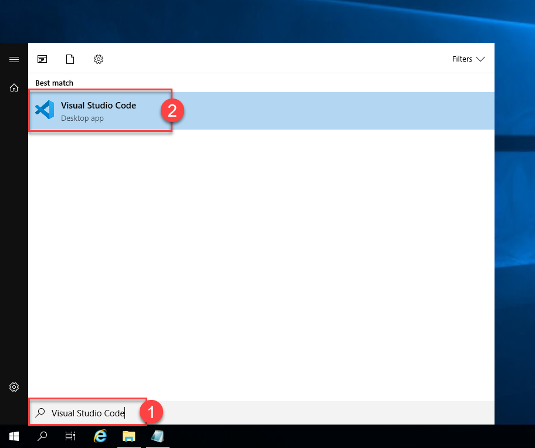

3. Open the **File (1)** menu and select **Open Folder... (2)**.

    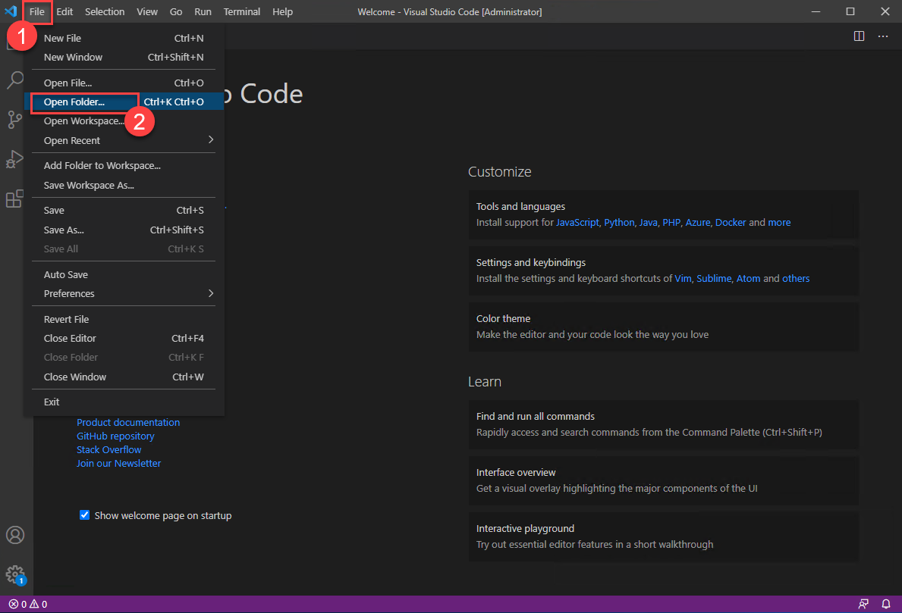

4. Navigate to `C:\MCW\MCW-App-modernization-main\Hands-on lab\lab-files\src` and select **Select Folder (1)**.

    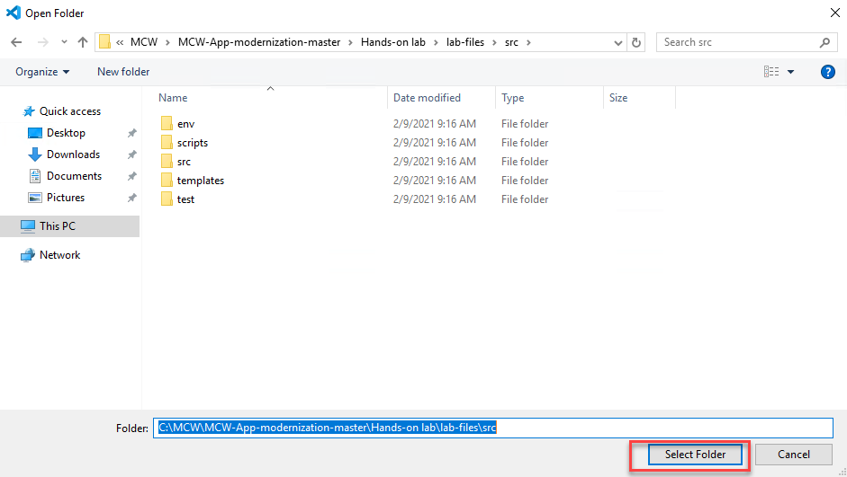

5. We are going to introduce a brand new change to Parts Unlimited's website. In the Explorer window navigate to **src > PartsUnlimitedWebSite > Views > Home** and select **Index.cshtml (4)** for editing. Change the Title of the page **(5)** and save the file by using going to the File menu and selecting **Save**. Notice the underlying git repository detecting a change (6) in the codebase.

    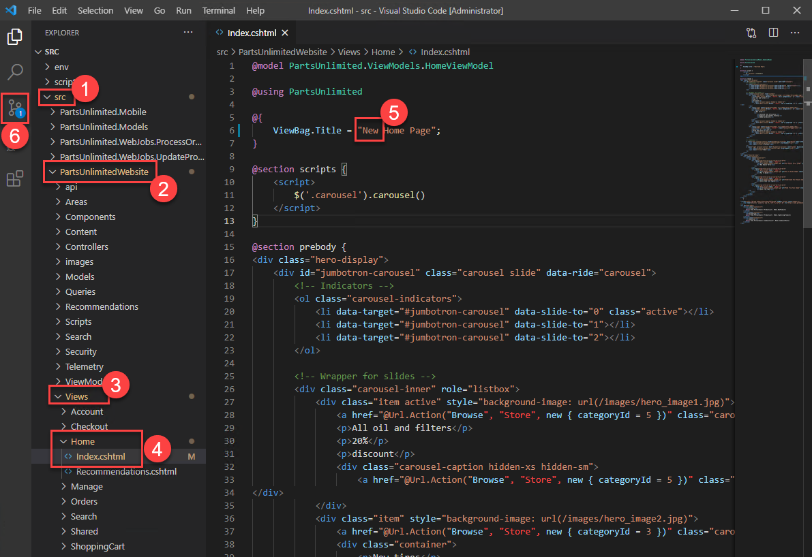

6. Select **Source Control (1)** tab in Visual Studio Code. Since we worked on the codebase in our repo in the virtual machine, the codebase in the repo on GitHub has changed. Open the **Views and more actions... (2)** menu and select **Pull (3)** to get the latest from the remote repository.

    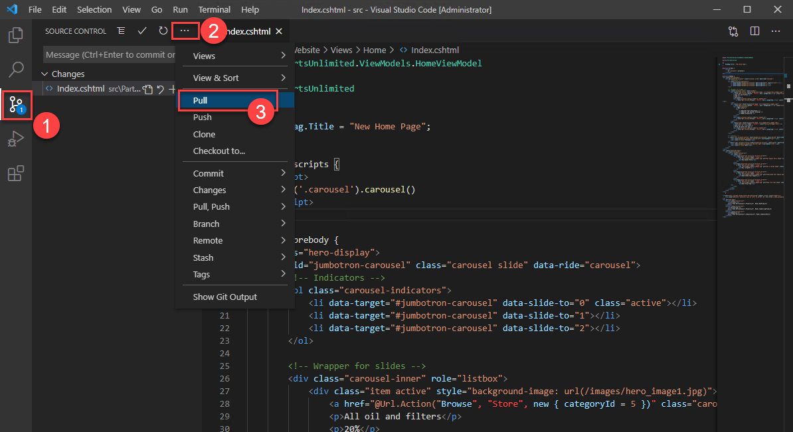

7. Select **Stage Changes (1)**. Type in a commit message **(2)** for the changes. Select **Commit (3)**.

    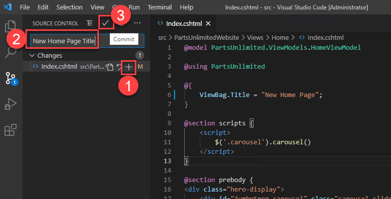

8. Open the **Views and more actions... (1)** menu and select **Push (2)** to push the changes to GitHub.

    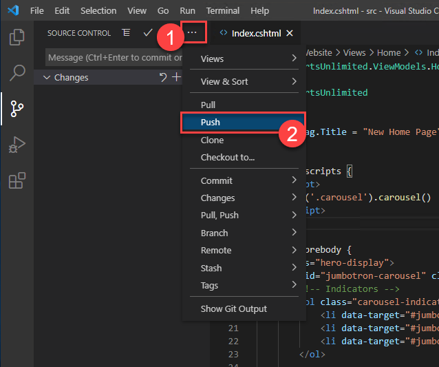

9. Open the GitHub repository and observe the Actions page for the latest execution of the CI/CD Pipeline.

    

10. Navigate to the staging environment endpoint in your browser and observe the Title change.

    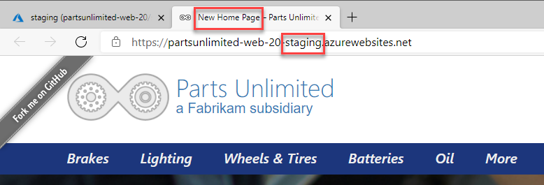

Now that Parts Unlimited has a separate staging environment for their e-commerce site, they can push new source code and functionality to the repo that will automatically be built and deployed to their staging for testing.

### Task 5: Swap deployment slots to move changes in staging to production

Once Parts Unlimited is happy with the changes tested in their staging environment, they can swap the two environments and have changes go to production. Environment Swap happens very fast and can help Parts Unlimited pull back changes by switching back if needed.

1. Go back to your lab resource group, navigate to your `partsunlimited-web-{uniquesuffix}` **(2)** App Service resource. You can search for `partsunlimited-web` **(1)** to find your app service.

   

2. Switch to the **Deployment slots (1)** tab and select **Swap (2)**.

    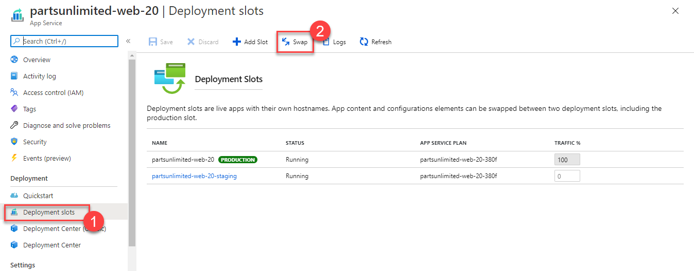

3. Select the **Swap** button to swap the staging slot with the production slow.

    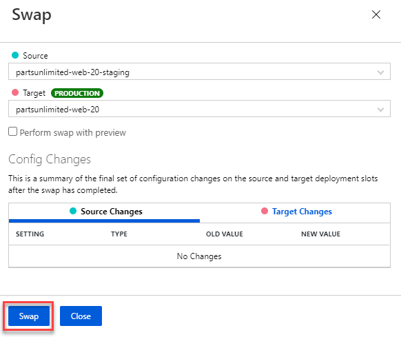

4. Once you receive the success message, close the swap panel.

5. Visit both production and staging slot endpoints and observe how the Title change is moved to production.

    > Once you move your staging slot to production, your production slot is moved to staging as well. This means that your current staging slot does not have the latest changes you have pushed to the repo. You can trigger a manual CI/CD workflow execution to push the latest changes to staging.
    >
    > To run a CI/CD workflow manually, go to GitHub actions page **(1)** in your repository. Select the workflow **(2)** to run. Open the **Run workflow (3)** menu and select **Run workflow (4)**.
    >
    > 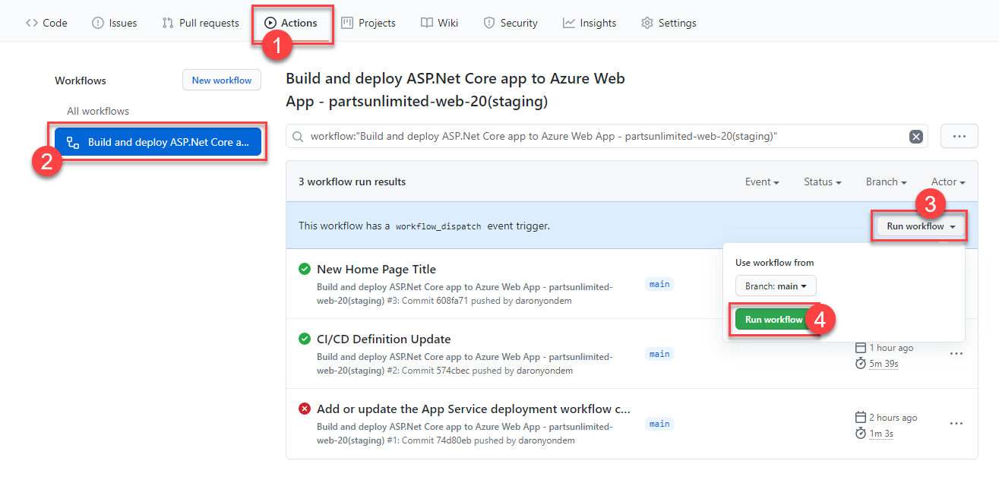

## Exercise 5: Using serverless Azure Functions to process orders

Duration: 30 minutes

With its migration to Azure, Parts Unlimited plans to launch a series of campaigns to increase its sales. Their current architecture is processing purchase orders synchronously and is coupled with their front end. Parts Unlimited is looking for ways to decouple its order processing system and make sure it can scale independently from the web front end when orders increase.

You suggest a serverless approach that can handle order processing and the creation of invoices for processed orders. In this exercise, you will deploy a serverless Azure Function that will listen to an Azure Storage Queue and process orders as they come. Parts Unlimited has already implemented the changes required to push the jobs into a queue of your choice.

### Task 1: Deploying Azure Functions

1. Connect to your WebVM VM with RDP.

   

2. Select the Start menu and search for **Visual Studio Code**. Select **Visual Studio Code** to run it.

    

3. Open the **File (1)** menu and select **Open Folder... (2)**.

    

4. Navigate to `C:\MCW\MCW-App-modernization-main\Hands-on lab\lab-files\src-invoicing-functions\FunctionApp` and select **Select Folder**.

5. Select **Install** to install extensions required for your Azure Functions project. This will install C# for Visual Studio Code and Azure Functions Extension for Visual Studio Code.

    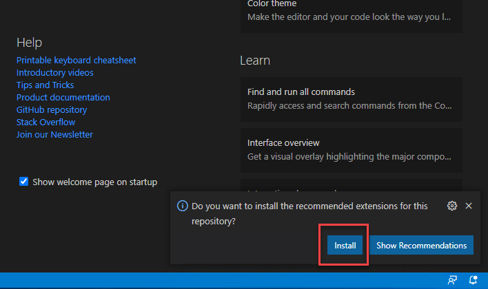

6. Once install is **Finished (1)** select **Restore (2)** to download dependencies for the project.

    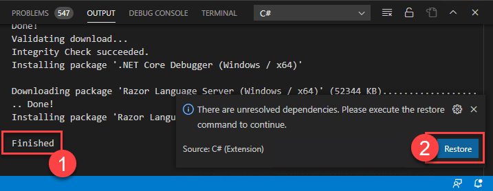

7. When restore is complete close the tabs titled **Extension (1) (2)** and the **welcome tab (3)**. Select **Azure (4)** from the left menu and select **Sign into Azure (5)**. Select **Edge** as your browser if requested.

    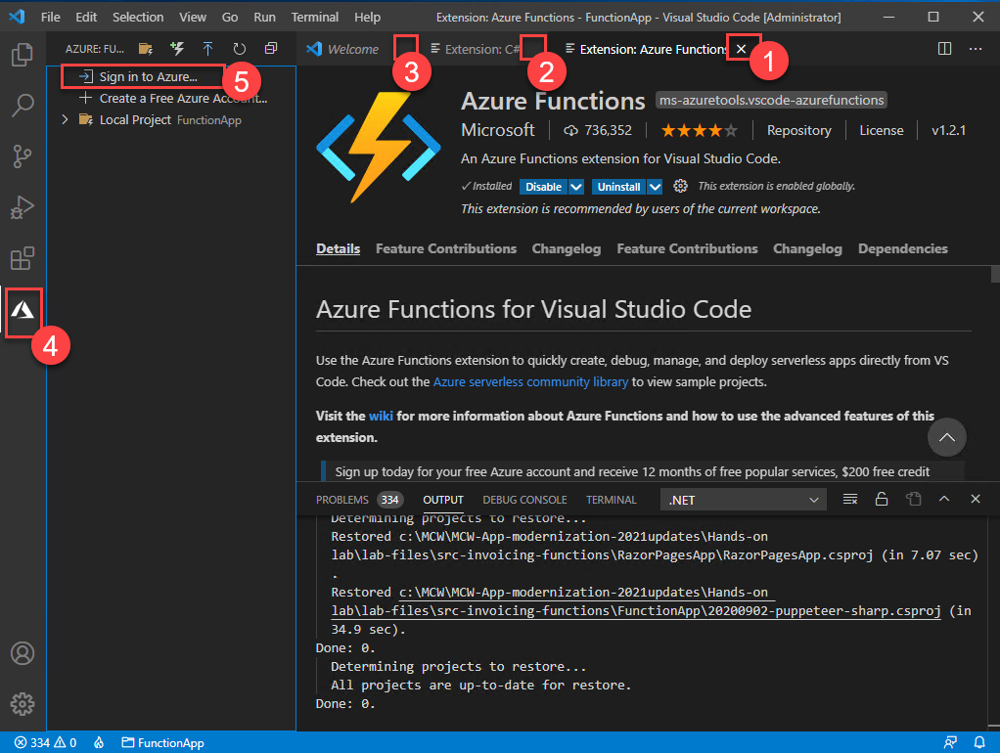

8. Enter your Azure credentials and Sign In.

9. Close the browser window once your sign-in is complete.

10. Drill down **(1)** the resource in your subscription. Right-click on your Azure Function named **parts-func-{uniquesuffix} (2)** and select **Deploy to Azure Function App... (3)**.

    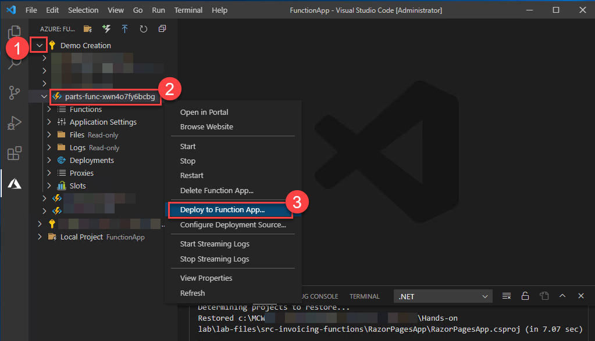

11. Select **Deploy**.

    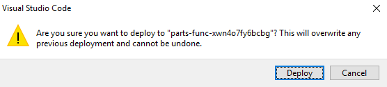

### Task 2: Connecting Function App and App Service

1. In the [Azure portal](https://portal.azure.com), navigate to your `parts` Storage Account resource by selecting **Resource groups** from Azure services list, selecting the **hands-on-lab-SUFFIX** resource group, and selecting the `parts{uniquesuffix}` Storage Account from the list of resources.

    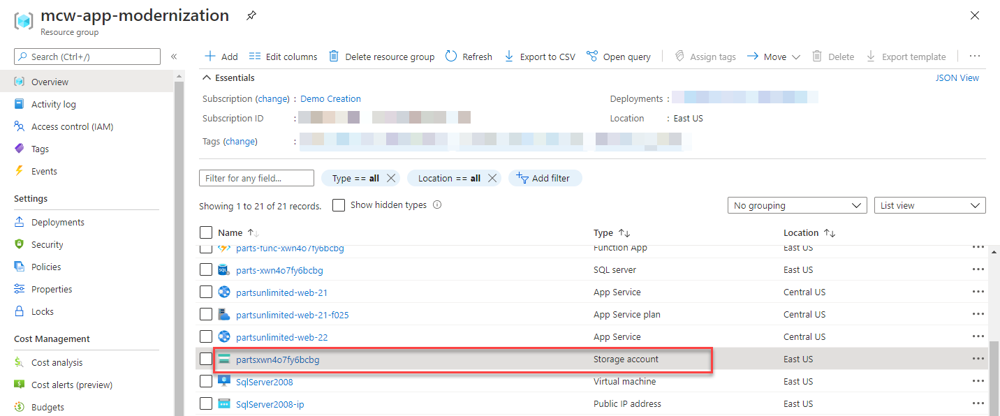

2. Switch to the **Access keys (1)** blade, and select **Show keys (2)**. Select the copy button for the first connection string **(3)**. Paste the value into a text editor, such as Notepad.exe, for later reference.

    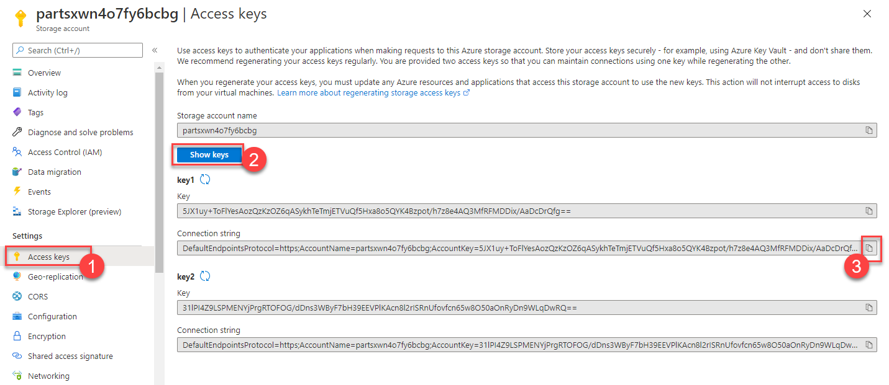

3. Go back to the resource list and navigate to your `partsunlimited-web-{uniquesuffix}` **(2)** App Service resource. You can search for `partsunlimited-web` **(1)** to find your Web App and App Service Plan

   

4. Switch to the **Configuration (1)** blade, and select **+New connection string (2)**.

    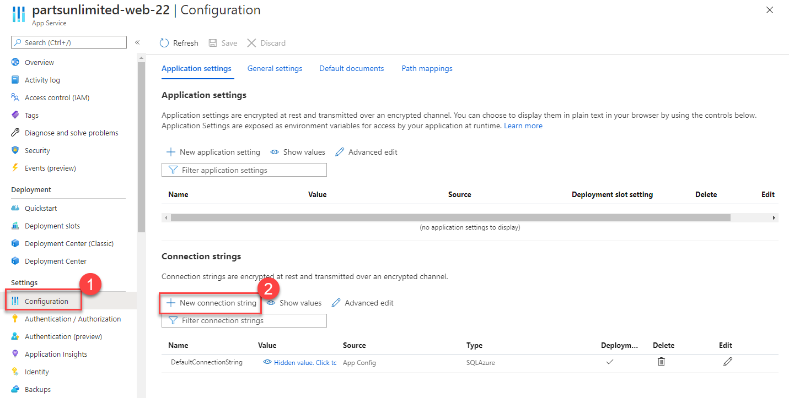

5. On the **Add/Edit connection string** panel, enter the following:

   - **Name(1)**: Enter `StorageConnectionString`.
   - **Value**: Enter Storage Connection String you copied in Step 2.
   - **Type (3)**: Select **Custom**
   - **Deployment slot setting (4)**: Check this option to make sure connection strings stick to a deployment slot. This will make sure you can have different settings for staging and production.

    

6. Select **OK (5)**.

7. Select **Save** and **Continue** for the following confirmation dialog.

    

8. Go back to the resource list and navigate to your `parts-func-{uniquesuffix}` **(2)** Function App resource. You can search for `func` **(1)** to find your function app.

   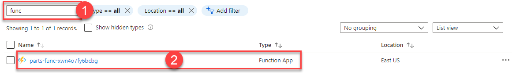

9. Switch to the **Configuration (1)** blade, and select **+New application setting (2)**.

    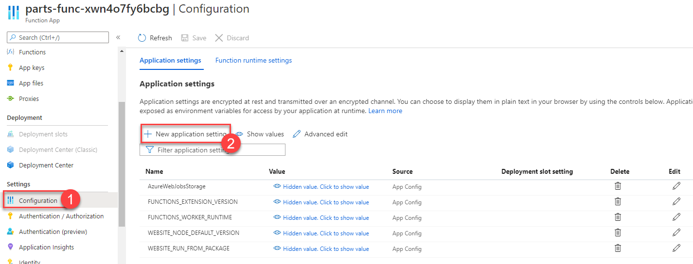

10. On the **Add/Edit connection string** panel, enter the following:

    - **Name(1)**: Enter `DefaultConnection`.
    - **Value**: Enter SQL Connection String you copied in Exercise 3, Task 5, Step 3.

    

11. Select **OK (3)**.

12. Select **Save** and **Continue** for the following confirmation dialog.

    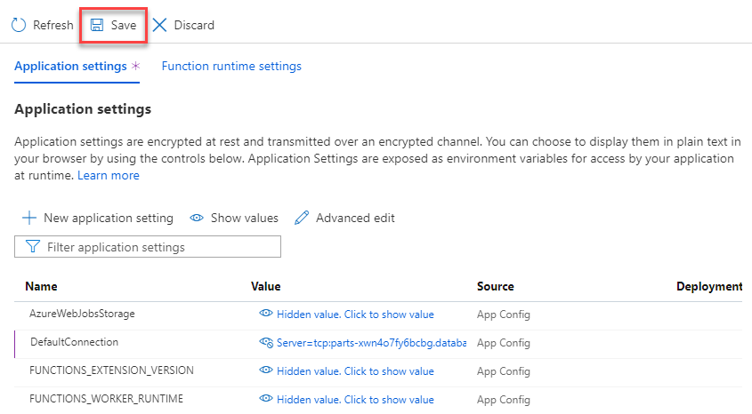

### Task 3: Testing serverless order processing

In this task, we will submit a new order on the Parts Unlimited website and observe the order's processing on the order details page. Once the order is submitted, the web front-end will put a job into an Azure Storage Queue. The Function App that we previously deployed is set to listen to the queue and pull jobs for processing. Once order processing is done, a PDF file will be created, and the link for the PDF file will be accessible on the order details page.

1. Go back to the resource list and navigate to your `partsunlimited-web-{uniquesuffix}` **(2)** App Service resource. You can search for `partsunlimited-web` **(1)** to find your Web App and App Service Plan.

   

2. Select **URL** and navigate to the Parts Unlimited website hosted in Azure App Service.

    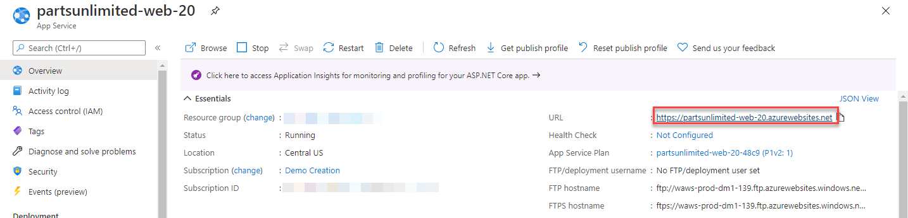

3. Select **Login (1)** and select **Register as a new user? (2)**.

    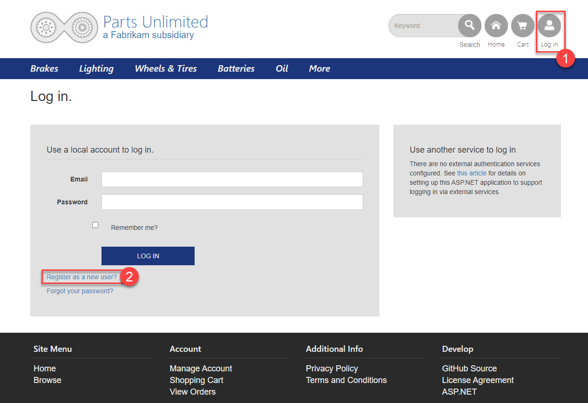

4. Type in `test@test.com` for the email **(1)** and `Password.1!!` **(2)** for the password. Select **Register (3)**.

    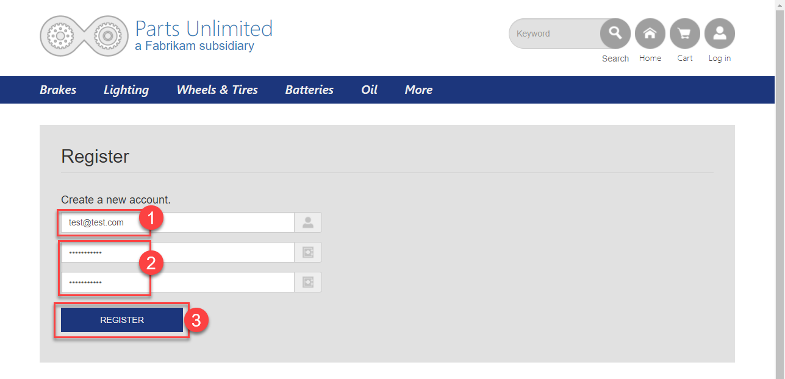

5. On the next screen, select **Click here to confirm your e-mail** to confirm your e-mail.

6. Select **Login (1)** and type the credentials listed below.

    - **Email (2):** test@test.com
    - **Password (3):** Password.1!!

    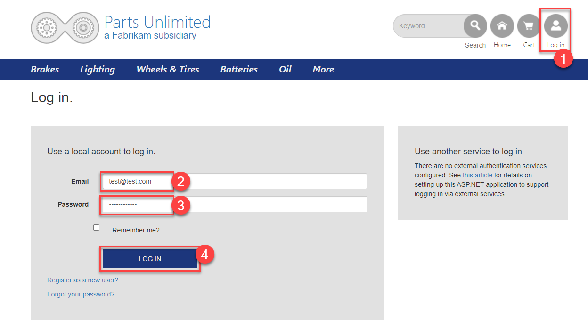

7. Select **Login (4)**.

8. Select a product from the home page, and select **Add to Card** once you are on the product detail page.

    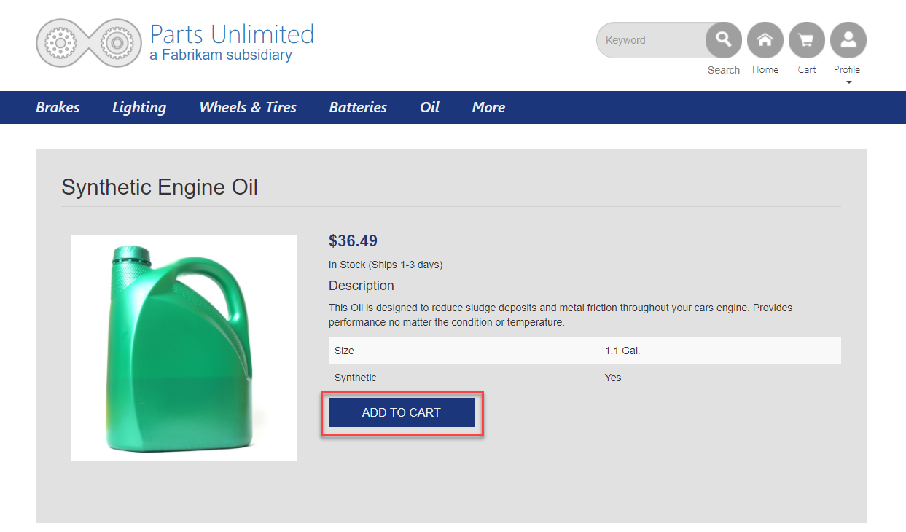

9. Select **Checkout** on the next screen.

10. Fill in sample shipping information **(1)** for testing purposes. Use coupon code **FREE (2)** and select **Submit Order (3)**.

    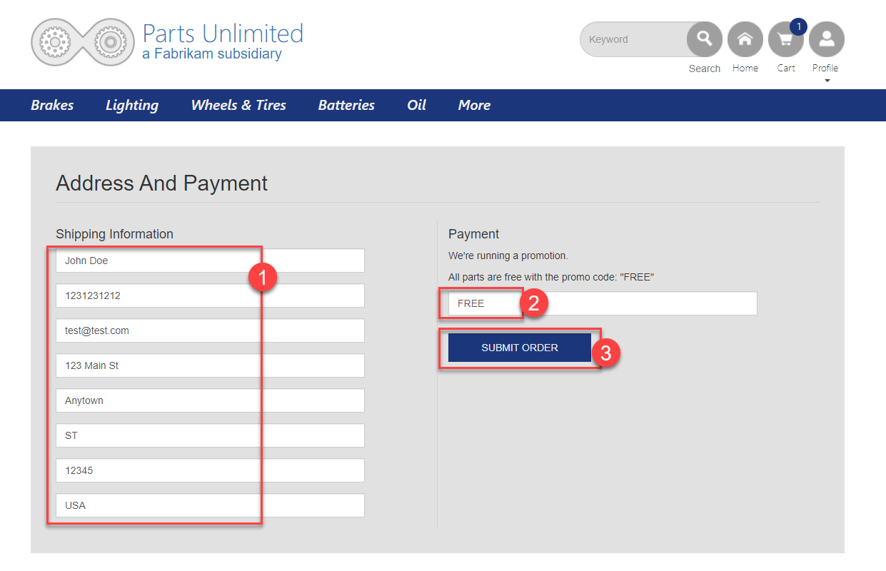

11. Once checkout is complete select **view your order** to see order details.

    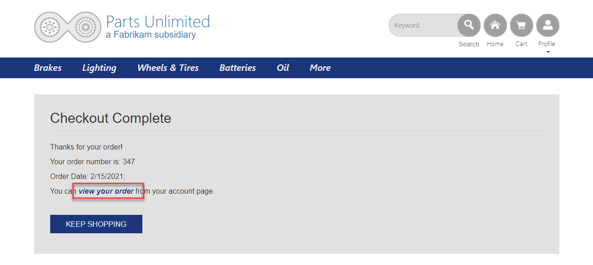

12. Observe the invoice field. Right now, your order is flagged as in processing. An order job is submitted to the Azure Storage Queue to be processed by Azure Functions. Refresh the page every 15 seconds to see if anything changes about your order.

    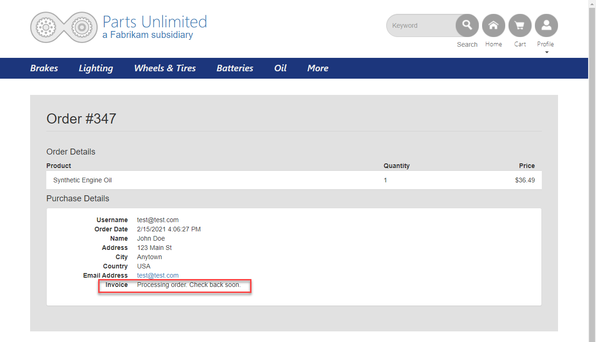

13. Once your order has been processed, an invoice will be created, and a download link will appear. Select the download link to download the PDF invoice created for your order by Azure Functions.

    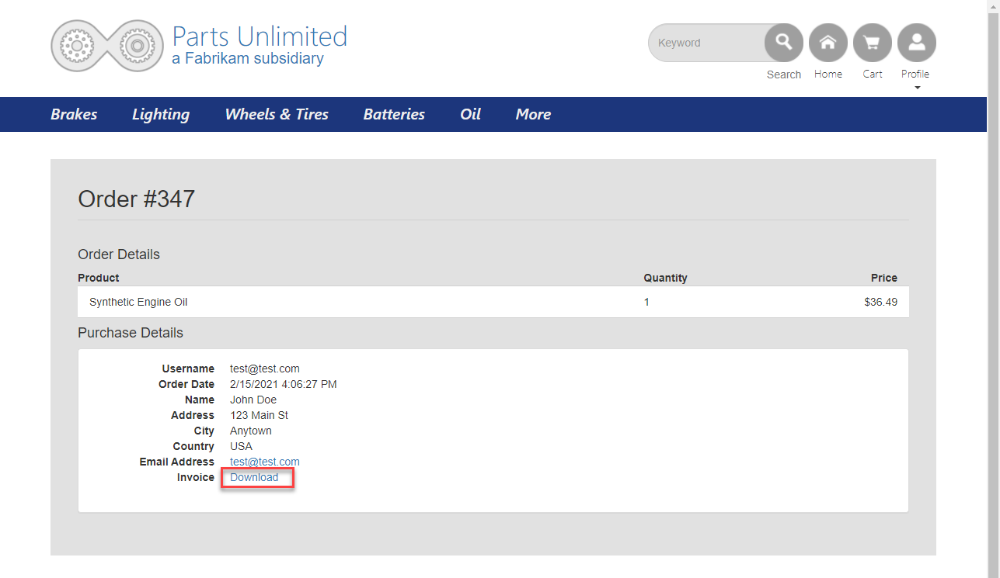

    Here is your invoice.

    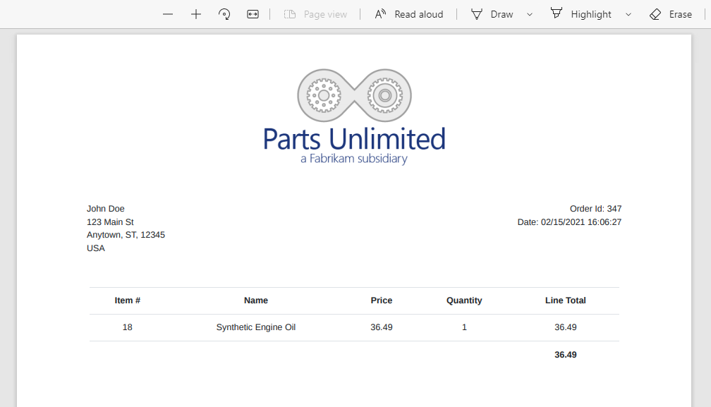

### Task 4: Enable Application Insights on the Function App

In this task, you add Application Insights to your Function App in the Azure Portal to be able to collect insights related to Function executions.

1. In the [Azure portal](https://portal.azure.com), navigate to your **Function App** by selecting **Resource groups** from Azure services list, selecting the **hands-on-lab-SUFFIX** resource group, and selecting the **parts-func-{uniquesuffix}** App service from the list of resources.

   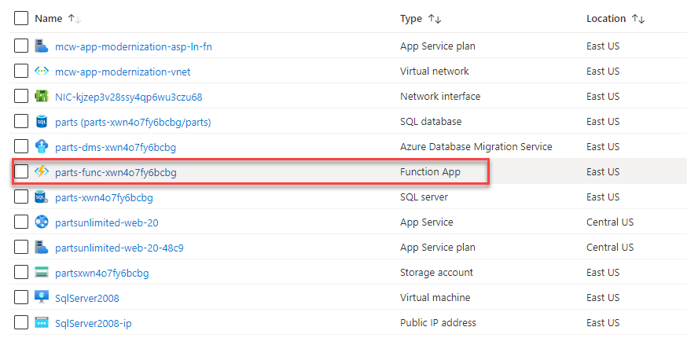

2. On the Function App blade, select **Application Insights (1)** under Settings from the left-hand menu. On the Application Insights blade, select **Turn on Application Insights (2)**.

   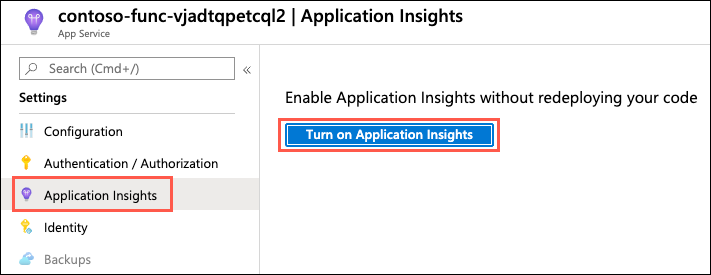

3. On the Application Insights blade, select **Create new resource (1)**, accept the default name provided, and then select **Apply (2)**. Select **Yes (3)** when prompted about restarting the Function App to apply monitoring settings.

   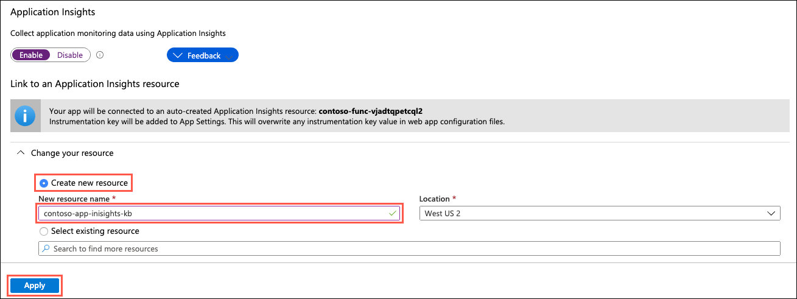

4. After the Function App restarts, select **View Application Insights data**.

   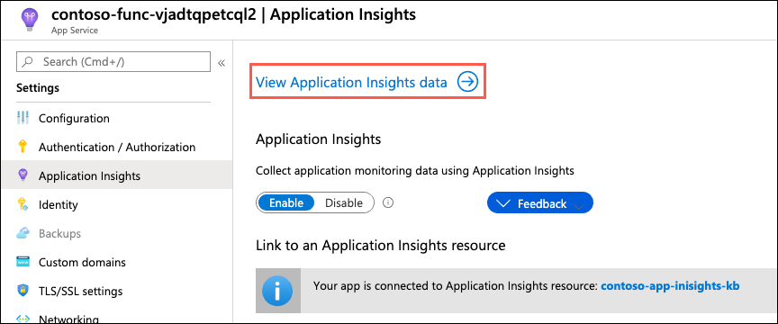

5. On the Application Insights blade, select **Live Metrics Stream (1)** from the left-hand menu.

   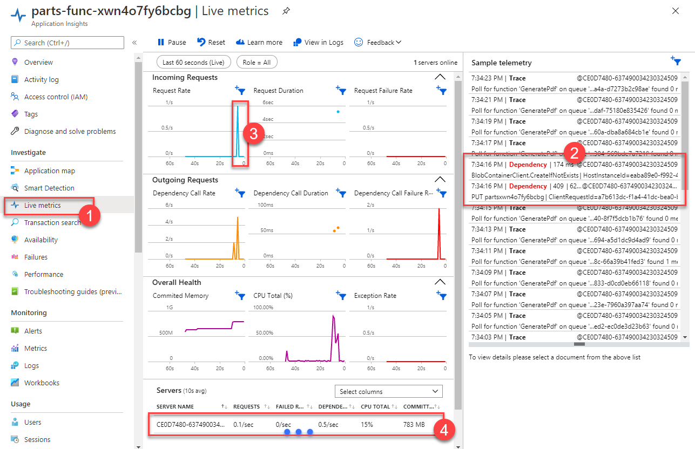

   > While having Live Metric up, try submitting a new order on the Parts Unlimited website. You will see access to blob storage in the telemetry to upload the PDF **(2)** and execution count on the graph **(3)**.

## After the hands-on lab

Duration: 15 minutes

In this exercise, you will de-provision all Azure resources created in support of this hands-on lab.

### Task 1: Delete Azure resource groups

1. In the Azure portal, select **Resource groups** from the Azure services list and locate and delete the **hands-on-lab-SUFFIX** resource group.

### Task 2: Delete GitHub repository

1. From your GitHub account, find your `partsunlimited` repository by searching for `parts` **(1)** and selecting the repository **(2)**.

    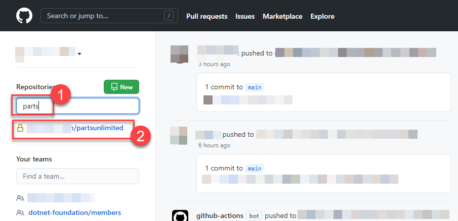

2. When you are on the repository page, select **Settings**.

    

3. Scroll down on the Settings page and select the **Delete this repository** button in the Danger Zone.

    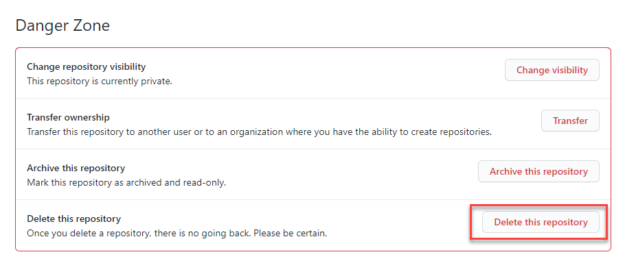

4. Type in the entire repository name **(2)** as displayed **(1)** and confirm the deletion by selection **I understand the consequences, delete this repository** button.

    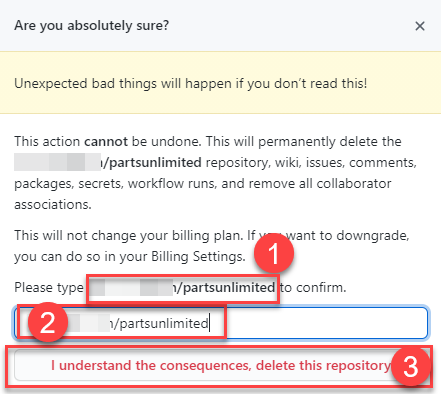

    > You might be asked for your GitHub password for the second round of approval.

### Task 3: Remove GitHub Authorized Apps

1. Log in to GitHub with your account.

2. Navigate to [https://github.com/settings/applications](https://github.com/settings/applications) in the same browser window/tab.

3. From the list of authorized app **Revoke (1)** access to applications listed below.

    > **WARNING:** Revoking the permissions listed above will disconnect these applications from your GitHub Account. If you have been using these applications before this lab, you might want to keep the permissions. Otherwise, other environments that you control and have access to your GitHub account might lose access as well.

    - Azure App Service
    - GitHub for VSCode
    - Git Credential Manager

    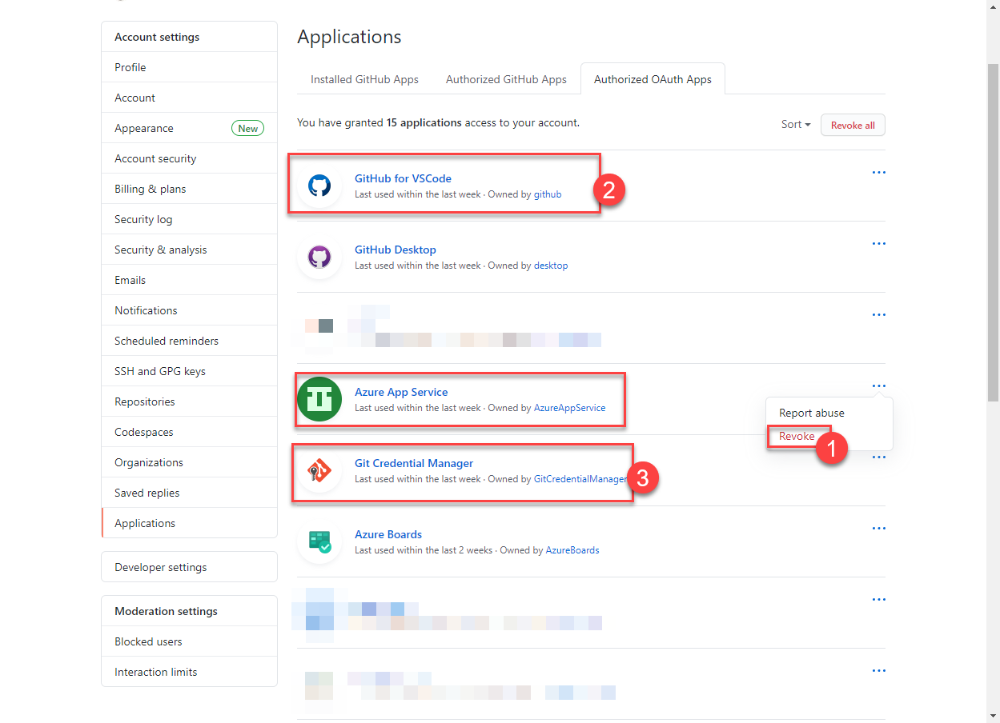

You should follow all steps provided *after* attending the Hands-on lab.
