# Manual resource setup guide

This guide provides step-by-step instructions to manually provision and configure the resources created by the ARM template used before the hands-on lab guide.

> **IMPORTANT**: Many Azure resources require globally unique names. Throughout these steps, the word "SUFFIX" appears as part of resource names. You should replace this with your Microsoft alias, initials, or another value to ensure resources are uniquely named.

February 2021

**Contents**:

- [Manual resource setup guide](#manual-resource-setup-guide)
  - [Task 1: Create an Azure Storage Account](#task-1-create-an-azure-storage-account)
  - [Task 2: Create the WebVM](#task-2-create-the-webvm)
  - [Task 3: Create SQL Server 2008 R2 Virtual Machine](#task-3-create-sql-server-2008-r2-virtual-machine)
  - [Task 4: Provision an Azure SQL Database](#task-4-provision-an-azure-sql-database)
  - [Task 5: Create Azure Database Migration Service](#task-5-create-azure-database-migration-service)
  - [Task 6: Provision a Function App](#task-6-provision-a-function-app)
  - [Task 7: Connect to the Web VM](#task-7-connect-to-the-web-vm)
  - [Task 8: Setting Up the WebVM](#task-8-setting-up-the-webvm)
  - [Task 9: Connect to SqlServer2008 VM](#task-9-connect-to-sqlserver2008-vm)
  - [Task 10: Setting Up the SqlServer2008 VM](#task-10-setting-up-the-sqlserver2008-vm)

## Task 1: Create an Azure Storage Account

In this task, you provision an Azure Storage account, which is used by the Azure Function App used to process orders.

1. In the [Azure portal](https://portal.azure.com/), go to your hands-on-lab-SUFFIX resource group and select **+Add (1)** from the menu.

   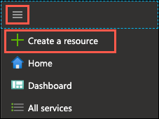

2. Enter "storage account **(1)**" into the Search the Marketplace box, and select **Storage account** from the results, and then select **Create (2)**.

   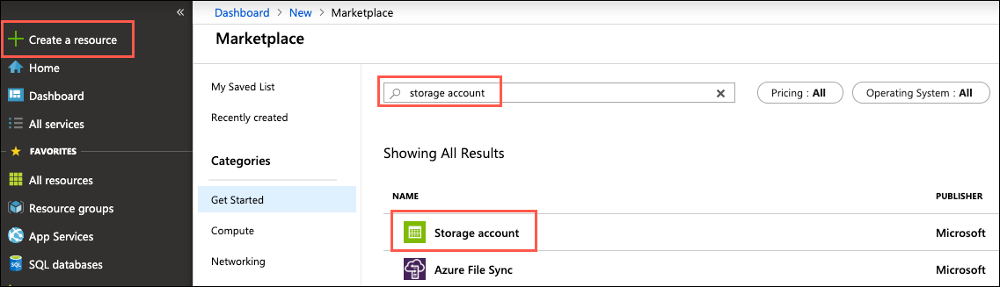

3. On the Create storage account **Basics** tab, enter the following:

   - Project Details:

     - **Subscription (1)**: Select the subscription you are using for this hands-on lab.
     - **Resource Group (2)**: Select the hands-on-lab-SUFFIX resource group from the list of existing resource groups.

   - Instance Details:

     - **Storage account name (3)**: Enter partsSUFFIX.
     - **Location (4)**: Select the location you are using for resources in this hands-on lab.
     - **Performance (5)**: Choose **Standard**.
     - **Account kind (6)**: Select **StorageV2 (general purpose v2)**.
     - **Replication (7)**: Select **Locally-redundant storage (LRS)**.
     - **Access tier (8)**: Choose **Hot**.

   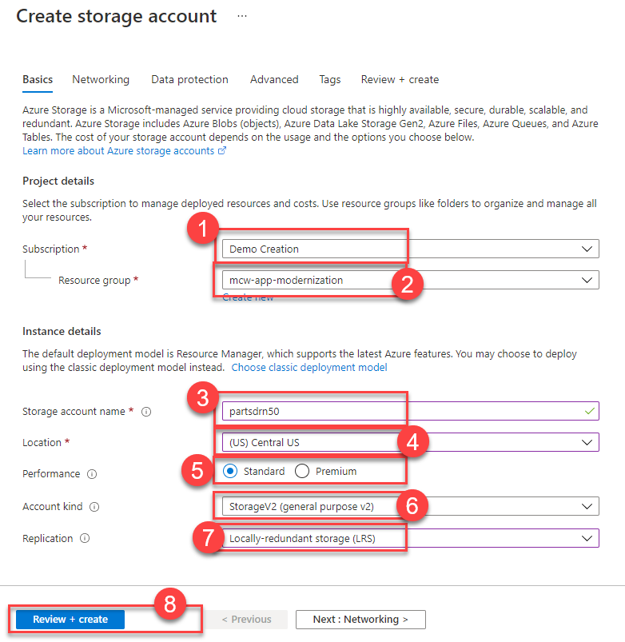

4. Select **Review + create**.

5. On the **Review + create** blade, ensure the Validation passed message is displayed and then select **Create**.

## Task 2: Create the WebVM

In this task, you provision a virtual machine (VM) in Azure. The VM is used to host Parts Unlimited's website and simulate the on-premises environment. The VM will be repurposed as a development machine once the website is migrated to Azure.

1. In the [Azure portal](https://portal.azure.com/), go to your hands-on-lab-SUFFIX resource group and select **+Add (1)** from the menu.

   

2. Enter "Windows Server **(1)**" into the Search the Marketplace box and then select **Windows Server (2)** from the results.

   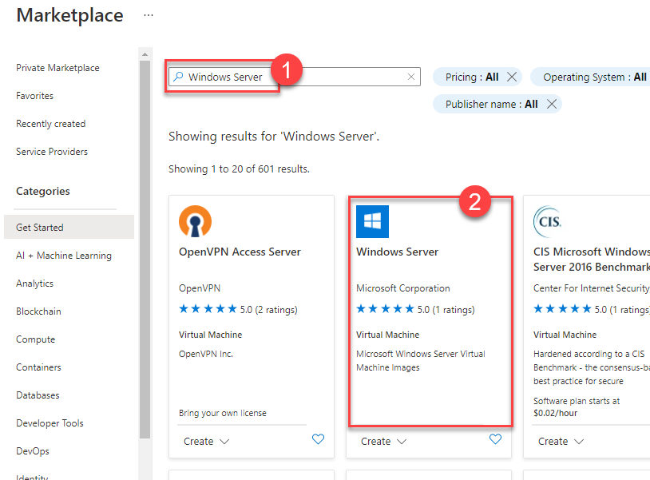

3. On the Create a virtual machine **Basics** tab, set the following configuration:

   - Project Details:

     - **Subscription (1)**: Select the subscription you are using for this hands-on lab.
     - **Resource Group (2)**: Select the **hands-on-lab-SUFFIX** resource group from the list of existing resource groups.

   - Instance Details:

     - **Virtual machine name (3)**: Enter WebVM.
     - **Region (4)**: Select the region you are using for resources in this hands-on lab.
     - **Availability options**: Select no infrastructure redundancy required.
     - **Image (5)**: Select **Windows Server 2019 Datacenter - Gen1**.
     - **Azure Spot instance**: Select No.
     - **Size (6)**: Select Standard_D2s_v3.

   - Administrator Account:

     - **Username (7)**: Enter **demouser**.
     - **Password (8)**: Enter **Password.1!!**

   - Inbound Port Rules:

     - **Public inbound ports (9)**: Choose Allow selected ports.
     - **Select inbound ports**: Select RDP (3389) in the list.

   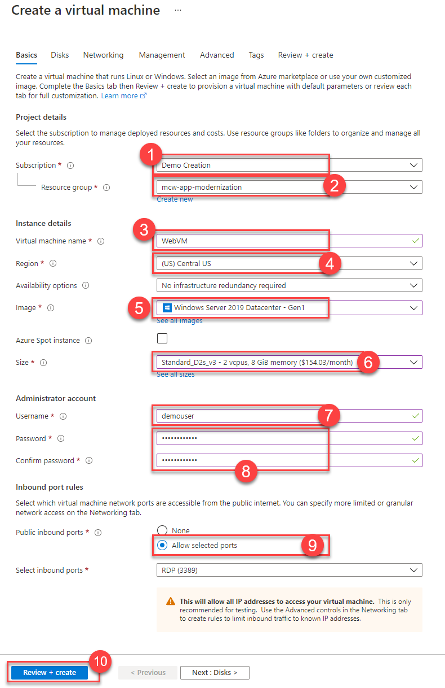

   > **Note**: Default settings are used for the remaining tabs so that they can be skipped.

4. Select **Review + create (10)** to validate the configuration.

5. On the **Review + create** tab, ensure the Validation passed message is displayed, and then select **Create** to provision the virtual machine.

6. It takes approximately 10 minutes for the VM to finish provisioning. You can move on to the next task while you wait.

## Task 3: Create SQL Server 2008 R2 Virtual Machine

In this task, you provision another Azure virtual machine (VM) to host your "on-premises" instance of SQL Server 2008 R2. The VM uses the SQL Server 2008 R2 SP3 Standard on Windows Server 2008 R2 image.

> **Note**: An older version of Windows Server is being used because SQL Server 2008 R2 is not supported on Windows Server 2016.

1. In the [Azure portal](https://portal.azure.com/), go to your hands-on-lab-SUFFIX resource group and select **+Add (1)** from the menu.

   

2. Enter "SQL Server 2008 R2 SP3 on Windows Server 2008 R2" into the Search the Marketplace box.

   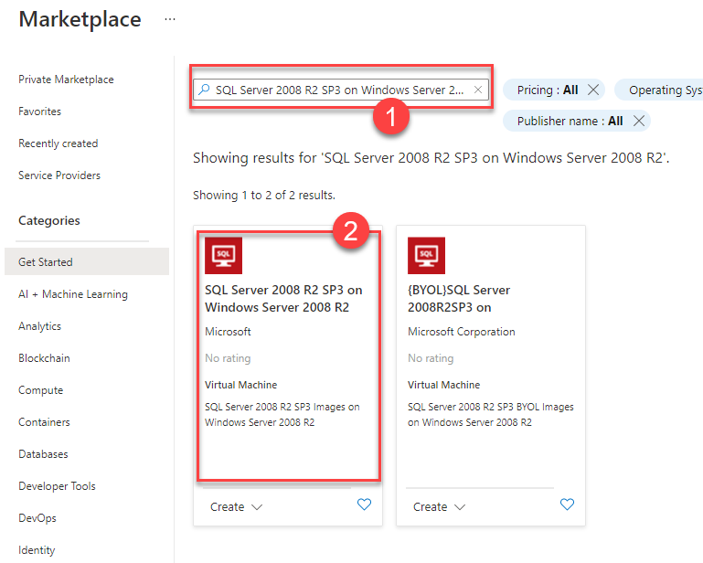

3. On the **SQL Server 2008 R2 SP3 Standard on Windows Server 2008 R2** blade, select **SQL Server R2 SP3 Standard on Windows Server 2008 R2 (1)** for the software plan and then select **Create (2)**.

   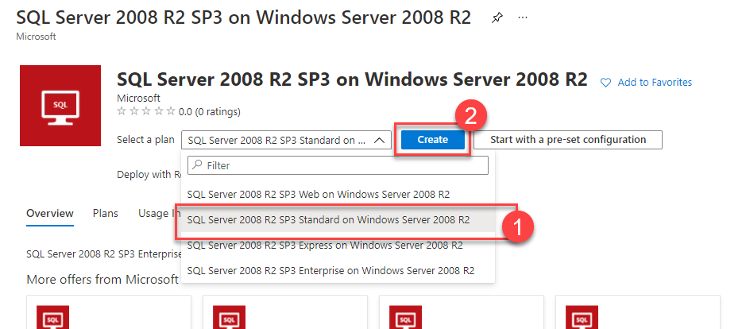

4. On the Create a virtual machine Basics tab, set the following configuration:

   - Project Details:

     - **Subscription (1)**: Select the subscription you are using for this hands-on lab.
     - **Resource Group (2)**: Select the hands-on-lab-SUFFIX resource group from the list of existing resource groups.

   - Instance Details:

     - **Virtual machine name (3)**: Enter SqlServer2008.
     - **Region (4)**: Select the region you are using for resources in this hands-on lab.
     - **Availability options**: Select no infrastructure redundancy required.
     - **Image (5)**: Leave SQL Server 2008 R2 SP3 Standard on Windows Server 2008 R2 selected.
     - **Azure Spot instance**: Select No.
     - **Size (6)**: Accept the default size of Standard_D2s_v3.

   - Administrator Account:

     - **Username (7)**: Enter **demouser**.
     - **Password (8)**: Enter **Password.1!!**

   - Inbound Port Rules:

     - **Public inbound ports (9)**: Choose Allow selected ports.
     - **Select inbound ports**: Select RDP (3389) in the list.

   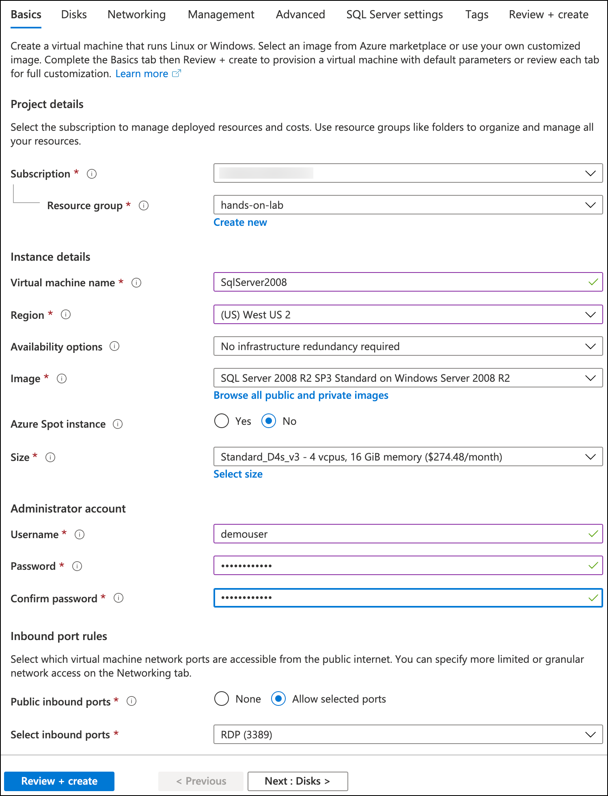

   Select the **SQL Server settings (10)** tab from the top menu. Default values are used for Disks, Networking, Management, and Advanced tabs, so you don't need to do anything on those tabs.

5. On the **SQL Server settings** tab, set the following properties:

   - Security & Networking:

     - **SQL connectivity (1)**: Select Public (Internet).
     - **Port**: Leave set to 1433.

   - SQL Authentication:

     - **SQL Authentication (2)**: Select Enable.
     - **Login name (3)**: Enter demouser.
     - **Password (3)**: Enter **Password.1!!**

   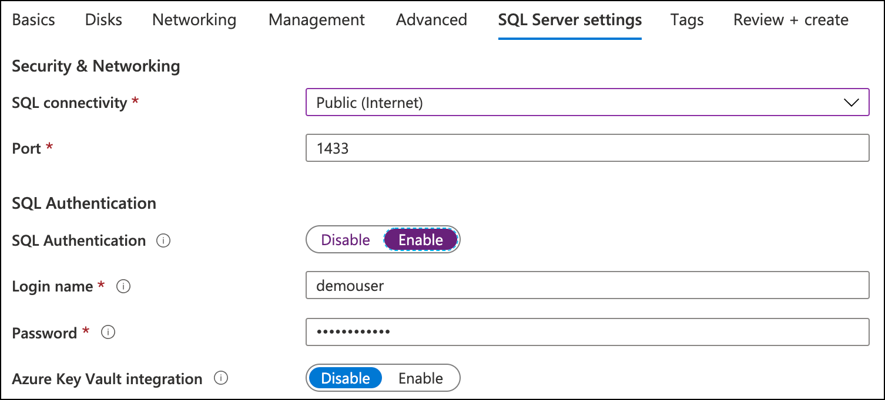

6. Select **Review + create** to review the VM configuration.

7. On the **Review + create** tab, ensure the Validation passed message is displayed, and then select **Create** to provision the virtual machine.

8. It may take 10+ minutes for the virtual machine to complete provisioning. You can move on to the next task while waiting for the SqlServer2008 VM to provision.

## Task 4: Provision an Azure SQL Database

In this task, you provision an Azure SQL Database (Azure SQL DB).

1. In the [Azure portal](https://portal.azure.com/), go to your hands-on-lab-SUFFIX resource group and select **+Add (1)** from the menu.

   

2. Enter "sql database **(1)**" into the Search the Marketplace box, find **SQL Database (2)** from the results, and then select **Create (2)**.

   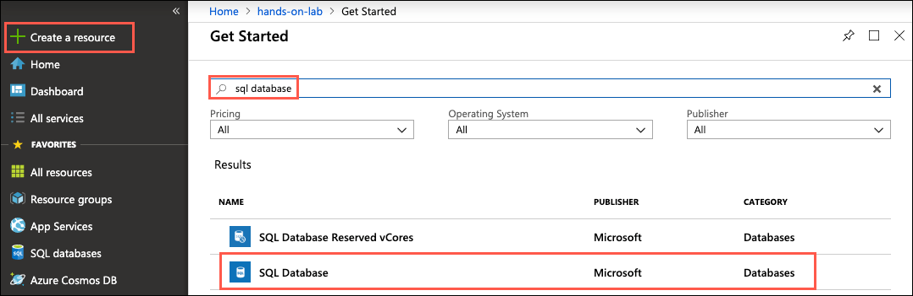

3. On the Create SQL Database **Basics** tab, enter the following:

   - Project Details:

     - **Subscription (1)**: Select the subscription you are using for this hands-on lab.
     - **Resource Group (2)**: Select the hands-on-lab-SUFFIX resource group from the list of existing resource groups.

   - Database Details:

     - **Database name (3)**: Enter `parts`.
     - **Server**: Select **Create new (4)**, and on the New server blade enter the following:
       - **Server name (5)**: Enter parts-SUFFIX.
       - **Server admin login (6)**: Enter demouser.
       - **Password (7)**: Enter Password.1!!
       - **Location (8)**: Select the region you are using for resources in this hands-on lab.
       - Select **OK (9)**.
     - **Want to use SQL elastic pool**: Choose No.
     - **Compute + storage**: Accept the default, General Purpose, Gen5, 2 vCores, 32 GB storage.

   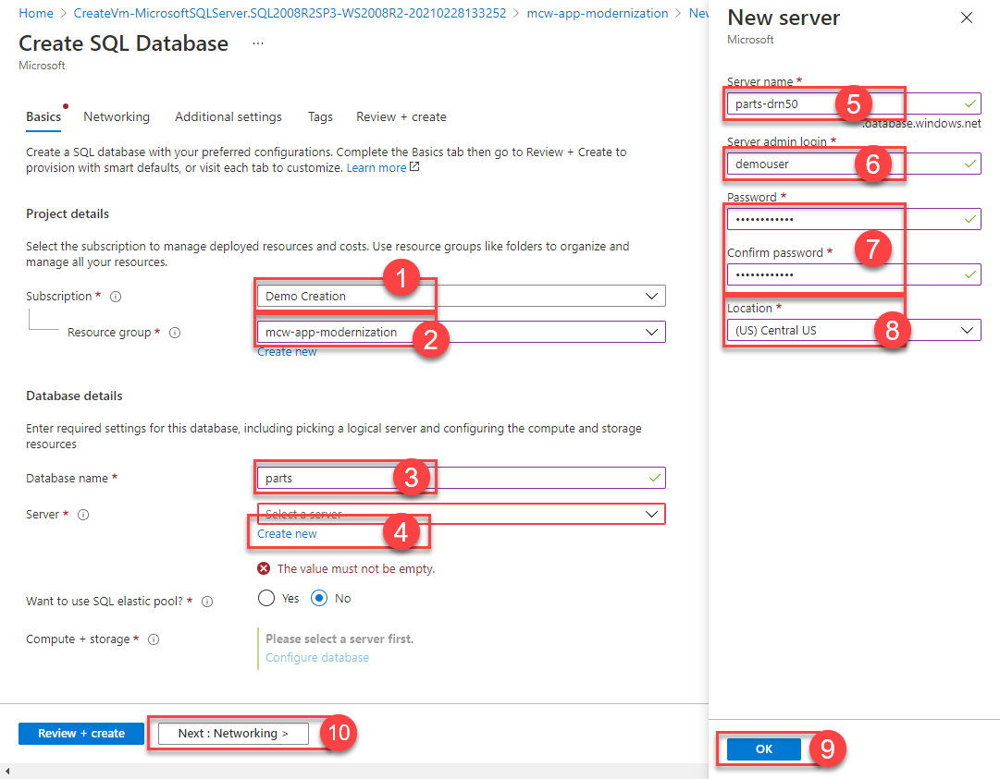

   Select **Next: Networking (10)**.

4. On the **Networking** tab, set the following:

   - **Connectivity method (1)**: Choose Public endpoint.
   - **Allow Azure services and resources to access this server (2)**: Select Yes.
   - **Add current client IP address**: Select No. If you would like to be able to access the Azure SQL database directly from your workstation, you can choose Yes for this.

   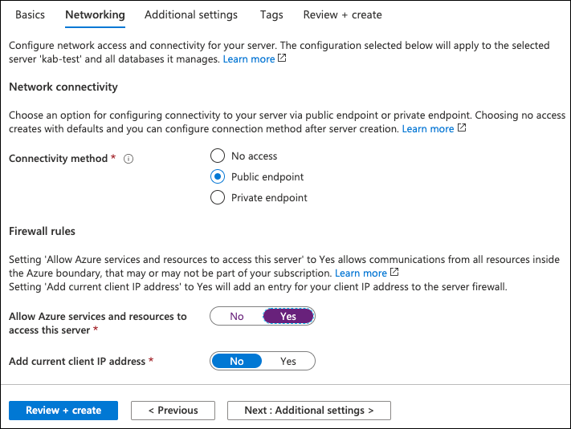

   Select **Review + create**.

5. On the **Review + create** tab, select **Create** to provision the SQL Database.

## Task 5: Create Azure Database Migration Service

In this task, you provision an instance of the Azure Database Migration Service (DMS).

1. In the [Azure portal](https://portal.azure.com/), go to your hands-on-lab-SUFFIX resource group and select **+Add (1)** from the menu.

   

2. Enter "azure database migration service **(1)**" into the Search the Marketplace box, select **Azure Database Migration Service** from the results, and select **Create (2)**.

   

3. On the Create Migration Service **Basics** tab, enter the following:

   > **Note**: If you see the message, `Your subscription doesn't have proper access to Microsoft.DataMigration`, refresh the browser window before proceeding. If the message persists, verify you successfully registered the resource provider, and then you can safely ignore this message.

   - Project Details:

     - **Subscription (1)**: Select the subscription you are using for this hands-on lab.
     - **Resource Group (2)**: Select the `hands-on-lab-SUFFIX` resource group from the list of existing resource groups.

   - Instance Details:

     - **Migration service Name (3)**: Enter `parts-dms-SUFFIX`.
     - **Location (4)**: Select the location you are using for resources in this hands-on lab.
     - **Service mode**: Select Azure.
     - **Pricing tier (5)**: Select Configure tier and then select Premium: 4 vCores and select Apply.

   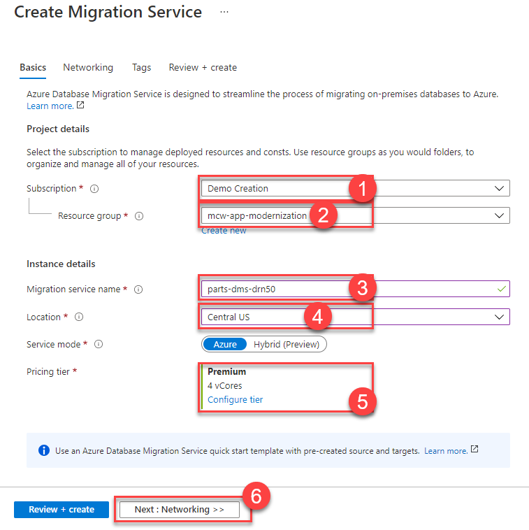

   Select **Next: Networking (6)**.

4. On the **Networking** tab, select the **hands-on-lab-SUFFIX-vnet/default (1)** virtual network by checking the box next to it in the list of existing virtual networks. This places the DMS instance into the same VNet as your WebVM and SqlServer2008 virtual machines.

   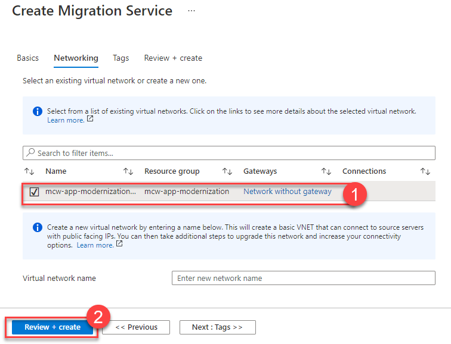

   Select **Review + create**.

5. Select **Create**. It can take 15 minutes to deploy the Azure Data Migration Service. You can move on to the next task while you wait.

## Task 6: Provision a Function App

In this task, you provision a Function App, which is used for processing orders and creating invoice files for Parts Unlimited.

1. In the [Azure portal](https://portal.azure.com/), go to your hands-on-lab-SUFFIX resource group and select **+Add (1)** from the menu.

   

2. Enter "function app **(1)**" into the Search the Marketplace box, find **Function App** from the results, and select **Create (2)**.

   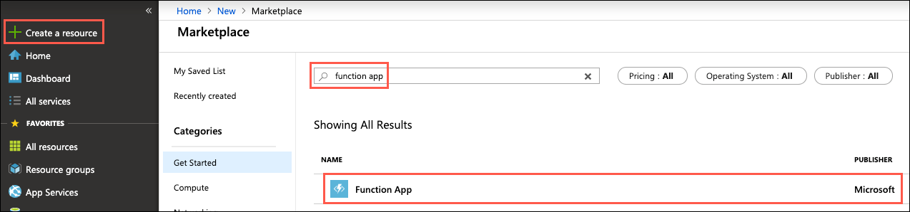

3. On the Function App blade, select **Create**.

4. On the Function App Basics blade, enter the following:

   - Project Details:

     - **Subscription (1)**: Select the subscription you are using for this hands-on lab.
     - **Resource Group (2)**: Choose Use exiting and select the hands-on-lab-SUFFIX resource group from the list of existing resource groups.

   - Instance Details:

     - **Function App name (3)**: Enter parts-func-SUFFIX.
     - **Publish (4)**: Select Code.
     - **Runtime Stack (5)**: Select .NET Core.
     - **Version (6)**: Accept the default version, which should be the latest.
     - **Region (7)**: Select the region you are using for resources in this hands-on lab.

   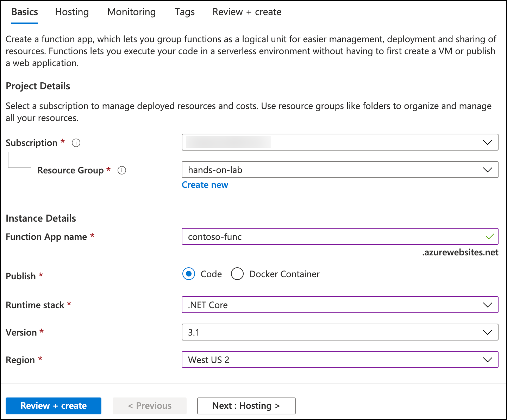

   Select **Next: Hosting (8)**.

5. On the Function App Hosting blade, enter the following:

   - **Storage Account (1)**: Select the storage account you created in Task 1, above.
   - **Operating System (2)**: Select Linux.
   - **Plan type (3)**: Select Consumption.

   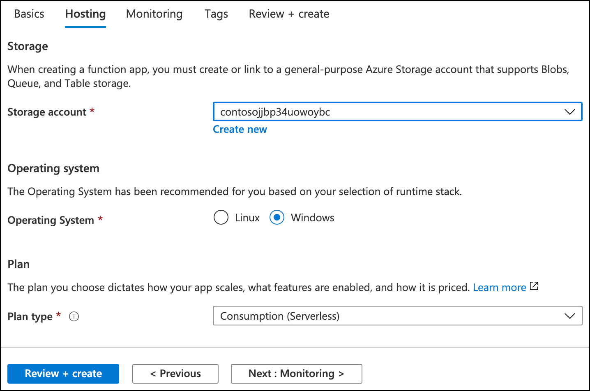

   Select **Next: Monitoring (4)**.

6. On the Function App Monitoring blade, enter the following:

   - **Enable Application Insights**: Select **No (1)**.

   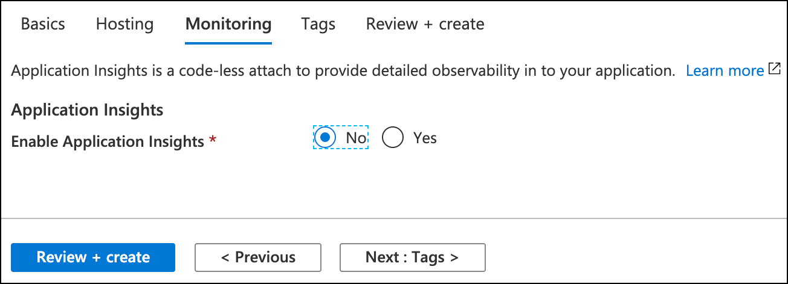

   Select **Review + create (2)**.

7. Select **Create**.

## Task 7: Connect to the Web VM

In this task, you create an RDP connection to your Web virtual machine (VM), and disable Internet Explorer Enhanced Security Configuration.

1. In the [Azure portal](https://portal.azure.com), navigate to your **WebVM** VM by selecting **Resource groups** from Azure services list, selecting the **hands-on-lab-SUFFIX** resource group, and selecting the **WebVM** VM from the list of resources.

    

2. Go back to the Azure Portal. On the WebVM Virtual Machine's **Overview** blade, select **Connect (1)** and **RDP (2)** on the top menu.

   

3. Select **Download RDP File** on the next page, and open the downloaded file.

    > The first time you connect to the WebVM Virtual Machine, you will see a blue pop-up terminal dialog taking you through a couple of software installs. Don't be alarmed, and wait until the installs are complete.

    

4. Select **Connect** on the Remote Desktop Connection dialog.

   

5. Enter the following credentials with your password when prompted, and then select **OK**:

   - **Username**: demouser
   - **Password**: Password.1!!

   

6. Select **Yes** to connect if prompted that the remote computer's identity cannot be verified.

   

7. Once logged in, launch the **Server Manager**. This should start automatically, but you can access it via the Start menu if it does not.

8. Select **Local Server (1)**, then select **On (2)** next to **IE Enhanced Security Configuration**. In the Internet Explorer Enhanced Security Configuration dialog, select **Off (3) (4)** under both Administrators and Users, and then select **OK (5)**.

    

9. Close the Server Manager, but leave the connection to the LabVM open for the next task.

## Task 8: Setting Up the WebVM

In this task, you configure the WebVM with the required software and downloads.

1. Right-click the Windows Start Menu and select **Windows PowerShell (Admin)** to start a terminal session.

   

2. Run the code below install Windows's Web Server features, including related management tools.

   ```PS
   Install-WindowsFeature -name Web-Server -IncludeManagementTools
   ```

3. Run the code below to download the lab files and extract the content into `C:\MCW` folder.

   ```PS
   New-Item -ItemType directory -Path C:\MCW
   while((Get-ChildItem -Directory C:\MCW | Measure-Object).Count -eq 0 )
   {
      (New-Object System.Net.WebClient).DownloadFile("https://github.com/microsoft/MCW-App-modernization/archive/master.zip", 'C:\MCW.zip')
      Expand-Archive -LiteralPath 'C:\MCW.zip' -DestinationPath 'C:\MCW' -Force
   }
   ```

   > **INFO**: You can copy multiline code from outside the RDP window and paste it into the terminal in the RDP session. In case of difficulty copying the content, go to the RDP terminal and right-click the top left terminal logo **(1)**. This will open a context menu where you can find Edit > Paste **(3)** command. After you paste the code, hit **Enter** to execute the final line.

   

4. Run the code below to copy Parts Unlimited website files to the wwwroot folder targeted by the local webserver.

   ```PS
   Expand-Archive -LiteralPath "C:\MCW\MCW-App-modernization-master\Hands-on lab\lab-files\web-site-publish.zip" -DestinationPath 'C:\inetpub\wwwroot' -Force
   ```

5. In the [Azure portal](https://portal.azure.com), navigate to your **SqlServer2008-ip** resource by selecting **Resource groups** from the Azure services list, selecting the **hands-on-lab-SUFFIX** resource group, and selecting the **SqlServer2008-ip** Public IP address from the list of resources.

    

6. In the **Overview** blade, select **Copy** to copy the public IP address and paste the value into a text editor, such as Notepad.exe, for later reference.

    

7. Replace the `<YourIP>` section in the code below and run it on the Windows PowerShell terminal in the WebVM.

   ```PS
   ((Get-Content -path C:\inetpub\wwwroot\config.release.json -Raw) -replace 'SETCONNECTIONSTRING',"Server=<YourIP>;Database=PartsUnlimited;User Id=PUWebSite;Password=Password.1!!;") | Set-Content -Path C:\inetpub\wwwroot\config.json

   ```

8. Download and install the setup files listed below into the WebVM. Use default settings during installations.

   | Name                            | Download Link                                                                                                                                                            |
   |---------------------------------|--------------------------------------------------------------------------------------------------------------------------------------------------------------------------|
   | .NET Core 2.2                   | [Download](https://download.visualstudio.microsoft.com/download/pr/ba001109-03c6-45ef-832c-c4dbfdb36e00/e3413f9e47e13f1e4b1b9cf2998bc613/dotnet-hosting-2.2.8-win.exe)   |
   | SQL Server Management Studio    | [Download](https://aka.ms/ssmsfullsetup)                                                                                                                                 |
   | Git                             | [Download](https://github.com/git-for-windows/git/releases/download/v2.30.0.windows.2/Git-2.30.0.2-64-bit.exe)                                                           |
   | VS Code                         | [Download](https://go.microsoft.com/fwlink/?LinkID=623230)                                                                                                               |
   | App Service Migration Assistant | [Download](https://appmigration.microsoft.com/api/download/windows/AppServiceMigrationAssistant.msi)                                                                     |
   | Edge                            | [Download](https://msedge.sf.dl.delivery.mp.microsoft.com/filestreamingservice/files/e2d06b69-9e44-45e1-bdf5-b3b827fe06b2/MicrosoftEdgeEnterpriseX64.msi)                |
   | .NET Core 3.1 SDK               | [Download](https://download.visualstudio.microsoft.com/download/pr/cc28204e-58d7-4f2e-9539-aad3e71945d9/d4da77c35a04346cc08b0cacbc6611d5/dotnet-sdk-3.1.406-win-x64.exe) |

## Task 9: Connect to SqlServer2008 VM

In this task, you open an RDP connection to the SqlServer2008 VM, disable Internet Explorer Enhanced Security Configuration, and add a firewall rule to open port 1433 to inbound TCP traffic.

> **Note**: There is a known issue with screen resolution when using an RDP connection to Windows Server 2008 R2, which may affect some users. This issue presents itself as very small, hard-to-read text on the screen. The workaround for this is to use a second monitor for the RDP display, allowing you to scale up the resolution to make the text larger.

1. As you did for the LabVM, connect to the SqlServer2008 VM with a Remote Desktop Connection. Enter the following credentials when prompted:

   - **Username**: demouser
   - **Password**: Password.1!!

2. Once logged in, launch the **Server Manager**. This should start automatically, but you can access it via the Start menu if it does not.

3. On the **Server Manager** view, select **Configure IE ESC (1)** under Security Information. In the Internet Explorer Enhanced Security Configuration dialog, select **Off (2) (3)** under both Administrators and Users, and then select **OK (4)**.

   

## Task 10: Setting Up the SqlServer2008 VM

In this task, you install the Microsoft Data Migration Assistant (DMA) on the SqlServer2008 VM.

1. Install the Microsoft Data Migration Assistant v5.x by downloading it to <https://www.microsoft.com/en-us/download/details.aspx?id=53595> in a web browser on the SqlServer2008 VM.

2. Open the Start Menu and search for `sql` **(1)**. Launch **Microsoft SQL Server Management Studio 17 (2)**.

   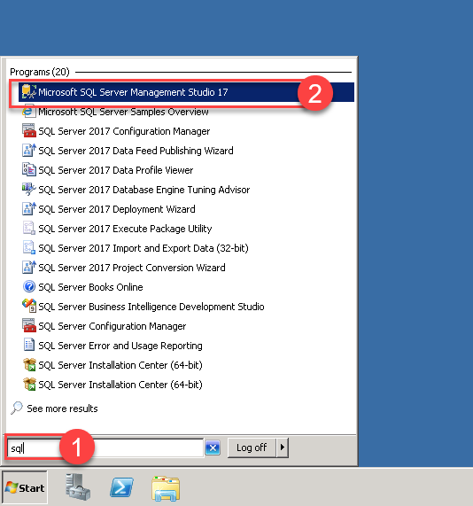

3. Select **Connect** to continue.

   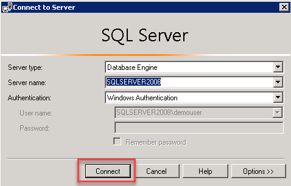

4. Select **New Query (1)** from the toolbar to lunch a new query window. Copy and paste the code **(2)** below and select **Execute (3)** to run it.

   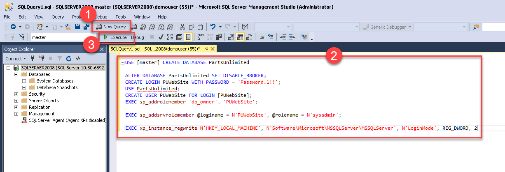

   ```sql
   USE [master];
   CREATE DATABASE [PartsUnlimited]; 
   GO

   ALTER DATABASE PartsUnlimited SET DISABLE_BROKER;
   CREATE LOGIN PUWebSite WITH PASSWORD = 'Password.1!!';
   USE PartsUnlimited;
   GO
   CREATE USER PUWebSite FOR LOGIN [PUWebSite];
   EXEC sp_addrolemember 'db_owner', 'PUWebSite';

   EXEC sp_addsrvrolemember @loginame = N'PUWebSite', @rolename = N'sysadmin';

   EXEC xp_instance_regwrite N'HKEY_LOCAL_MACHINE', N'Software\Microsoft\MSSQLServer\MSSQLServer', N'LoginMode', REG_DWORD, 2
   ```
