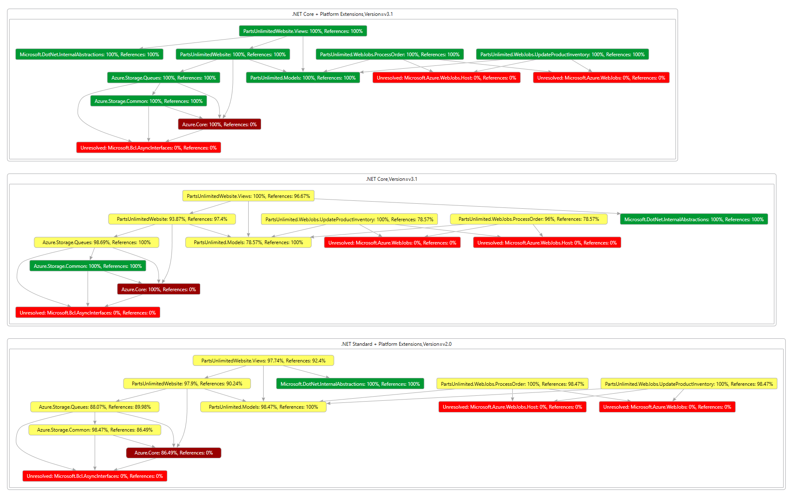

App modernization

Whiteboard design session trainer guide

October 2021

Information in this document, including URL and other Internet Web site references, is subject to change without notice. Unless otherwise noted, the example companies, organizations, products, domain names, e-mail addresses, logos, people, places, and events depicted herein are fictitious, and no association with any real company, organization, product, domain name, e-mail address, logo, person, place or event is intended or should be inferred. Complying with all applicable copyright laws is the responsibility of the user. Without limiting the rights under copyright, no part of this document may be reproduced, stored in or introduced into a retrieval system, or transmitted in any form or by any means (electronic, mechanical, photocopying, recording, or otherwise), or for any purpose, without the express written permission of Microsoft Corporation.

Microsoft may have patents, patent applications, trademarks, copyrights, or other intellectual property rights covering subject matter in this document. Except as expressly provided in any written license agreement from Microsoft, the furnishing of this document does not give you any license to these patents, trademarks, copyrights, or other intellectual property.

The names of manufacturers, products, or URLs are provided for informational purposes only and Microsoft makes no representations and warranties, either expressed, implied, or statutory, regarding these manufacturers or the use of the products with any Microsoft technologies. The inclusion of a manufacturer or product does not imply endorsement of Microsoft of the manufacturer or product. Links may be provided to third party sites. Such sites are not under the control of Microsoft and Microsoft is not responsible for the contents of any linked site or any link contained in a linked site, or any changes or updates to such sites. Microsoft is not responsible for webcasting or any other form of transmission received from any linked site. Microsoft is providing these links to you only as a convenience, and the inclusion of any link does not imply endorsement of Microsoft of the site or the products contained therein.

© 2021 Microsoft Corporation. All rights reserved.

Microsoft and the trademarks listed at <https://www.microsoft.com/legal/intellectualproperty/Trademarks/Usage/General.aspx> are trademarks of the Microsoft group of companies. All other trademarks are property of their respective owners.

**Contents**

<!-- TOC -->

- [Trainer information](#trainer-information)
  - [Role of the trainer](#role-of-the-trainer)
  - [Whiteboard design session flow](#whiteboard-design-session-flow)
  - [Before the whiteboard design session: How to prepare](#before-the-whiteboard-design-session-how-to-prepare)
  - [During the whiteboard design session: Tips for an effective whiteboard design session](#during-the-whiteboard-design-session-tips-for-an-effective-whiteboard-design-session)
- [App modernization whiteboard design session student guide](#app-modernization-whiteboard-design-session-student-guide)
  - [Abstract and learning objectives](#abstract-and-learning-objectives)
  - [Step 1: Review the customer case study](#step-1-review-the-customer-case-study)
    - [Customer situation](#customer-situation)
    - [Customer needs](#customer-needs)
    - [Customer objections](#customer-objections)
  - [Step 2: Design a proof of concept solution](#step-2-design-a-proof-of-concept-solution)
  - [Step 3: Present the solution](#step-3-present-the-solution)
  - [Wrap-up](#wrap-up)
  - [Additional references](#additional-references)
- [App modernization whiteboard design session trainer guide](#app-modernization-whiteboard-design-session-trainer-guide)
  - [Step 1: Review the customer case study](#step-1-review-the-customer-case-study-1)
  - [Step 2: Design a proof of concept solution](#step-2-design-a-proof-of-concept-solution-1)
  - [Step 3: Present the solution](#step-3-present-the-solution-1)
  - [Wrap-up](#wrap-up-1)
  - [Preferred target audience](#preferred-target-audience)
  - [Preferred solution](#preferred-solution)
  - [Checklist of preferred objection handling](#checklist-of-preferred-objection-handling)
  - [Customer quote (to be read back to the attendees at the end)](#customer-quote-to-be-read-back-to-the-attendees-at-the-end)

<!-- /TOC -->

# Trainer information

Thank you for taking the time to support the whiteboard design sessions as a trainer!

## Role of the trainer

An amazing trainer:

- Creates a safe environment in which learning can take place.

- Stimulates the participant's thinking.

- Involves the participant in the learning process.

- Manages the learning process (on time, on topic, and adjusting to benefit participants).

- Ensures individual participant accountability.

- Ties it all together for the participant.

- Provides insight and experience to the learning process.

- Effectively leads the whiteboard design session discussion.

- Monitors quality and appropriateness of participant deliverables.

- Effectively leads the feedback process.

## Whiteboard design session flow

Each whiteboard design session uses the following flow:

**Step 1: Review the customer case study (15 minutes)**

**Outcome**

Analyze your customer's needs.

- Customer's background, situation, needs, and technical requirements

- Current customer infrastructure and architecture

- Potential issues, objectives, and blockers

**Step 2: Design a proof of concept solution (60 minutes)**

**Outcome**

Design a solution and prepare to present the solution to the target customer audience in a 15-minute chalk-talk format.

- Determine your target customer audience.

- Determine customer's business needs to address your solution.

- Design and diagram your solution.

- Prepare to present your solution.

**Step 3: Present the solution (30 minutes)**

**Outcome**

Present solution to your customer:

- Present solution

- Respond to customer objections

- Receive feedback

**Wrap-up (15 minutes)**

- Review preferred solution

## Before the whiteboard design session: How to prepare

Before conducting your first whiteboard design session:

- Read the Student guide (including the case study) and Trainer guide.

- Become familiar with all key points and activities.

- Plan the point you want to stress, which questions you want to drive, transitions, and be ready to answer questions.

- Before the whiteboard design session, discuss the case study to pick up more ideas.

- Make notes for later.

## During the whiteboard design session: Tips for an effective whiteboard design session

**Refer to the Trainer guide** to stay on track and observe the timings.

**Do not expect to memorize every detail** of the whiteboard design session.

When participants are doing activities, you can **look ahead to refresh your memory**.

- **Adjust activity and whiteboard design session pace** as needed to allow time for presenting, feedback, and sharing.

- **Add examples, points, and stories** from your own experience. Think about stories you can share that help you make your points clearly and effectively.

- **Consider creating a "parking lot"** to record issues or questions raised that are outside the scope of the whiteboard design session or can be answered later. Decide how you will address these issues, so you can acknowledge them without being derailed by them.

***Have fun**! Encourage participants to have fun and share!*

**Involve your participants.** Talk and share your knowledge but always involve your participants, even while you are the one speaking.

**Ask questions** and get them to share to involve your group in the learning process fully.

**Ask first**, whenever possible. Before launching into a topic, learn your audience's opinions about it and experiences with it. Asking first enables you to assess their level of knowledge and experience and leaves them more open to what you are presenting.

**Wait for responses**. If you ask a question such as, "What's your experience with (fill in the blank)?" then wait. Do not be afraid of a little silence. If you leap into the silence, your participants will feel you are not serious about involving them and will become passive. Give participants a chance to think, and if no one answers, patiently ask again. You will usually get a response.

# App modernization whiteboard design session student guide

## Abstract and learning objectives

In this whiteboard design session, you work with a group to analyze and design a solution for moving legacy on-premises applications and infrastructure to cloud services. As part of the modernization effort, you will discuss modern concepts such as Serverless.

At the end of this workshop, your ability to design and implement a modernization plan for organizations looking to move services from on-premises to the cloud will be improved.

## Step 1: Review the customer case study 

**Outcome**

Analyze your customer's needs.

Timeframe: 15 minutes

Directions: With all participants in the session, the facilitator/SME presents an overview of the customer case study along with technical tips.

1. Meet your team members and trainer.

2. Read all directions for steps 1-3 in the student guide.

3. As a team, review the following customer case study.

### Customer situation  

Parts Unlimited is an online auto parts store. Founded in Spokane, WA, in 2008, they are providing both genuine OEM and aftermarket parts for cars, sport utility vehicles, vans, and trucks, including new and remanufactured complex parts, maintenance items, and accessories. Its mission is to make buying vehicle replacement parts easy for consumers and professionals.

In its first year, Parts Unlimited opened fourteen stores in three states: Washington, Idaho, and Oregon. The company established a 12,000 square foot distribution center to serve customers in the area. In two years, annual sales volume rose to $11 million. Parts Unlimited saw its business come from 40% professional and 60% do-it-yourself (DIY) omnichannel customers. With the situation surrounding COVID-19, the company saw a surge in online orders from professional and DIY customers. Unfortunately, their infrastructure and their team were not ready for the spike in e-commerce transactions.

Parts Unlimited has a hosted web application on its internal infrastructure and using a Windows Server, Internet Information Services (IIS), and Microsoft SQL Server to host the solution. All servers are located in an onsite server room in their distribution center. The office for their IT staff is just across the server room. Their IT staff includes a hardware technician, a system/network administrator, two software engineers. Their technical support is outsourced to a third-party service provider in Indonesia.

The web server that hosts the e-commerce website is recently updated to Windows Server 2019 Datacenter. The e-commerce application is tailor-made by a software development company that is now out of business. The application is built on .NET Core 2.2.207 that hit the end of life on December 23, 2019. Their team tried to change the version number in a configuration file to a recent version, but it crashed the website. They rolled back and left it as it is. They understand that they have to migrate to a more recent version of .NET Core, but they do not have the resources internally to make it happen. "We have to fix our scaling problems first. Then we can think of updating to something new," says Casey Jensen, Parts Unlimited's CEO. The source code left from the vendor has many solution files and codes that the team does not know if they are used.  They open the primary solution file named PartsUnlimited.sln and deploy from Visual Studio into a folder on the server.  

The team at Parts Unlimited is terrified to touch anything on the servers as long as it works. When they have to introduce new functionality or a bug fix, they schedule overnight deployments at 2 AM. This strategy has worked well so far, but it is not ideal. When a fix is ready, the team has to schedule deployment for 2 AM and wait. The scheduling of overnight shifts puts too much stress on the team and increases turnover in IT staff.

The SQL database used by Parts Unlimited e-commerce site is deployed on a separate server that has been there since the company was founded. It is a SQL Server 2008 R2 SP3 deployed on a Windows Server 2008 R2 SP1.
The e-commerce application incurs ongoing maintenance costs in hardware, operating system updates, and licensing fees. These maintenance costs make Microsoft Azure App Service an attractive alternative. Their team is looking to migrate Microsoft ASP.NET applications and any SQL Server database to Azure App Service and Azure SQL Database. However, they are worried that their application might not be supported because of its .NET Core version being at the end of life. They wonder if they can move to the cloud now and migrate their application later or if the old version will be a show stopper.

Parts Unlimited has plans to increase its marketing investment, currently on hold because of scaling issues. The company is stuck and cannot grow without increasing its infrastructure footprint. Casey wants to finalize their cloud vs. on-premises decision based on the current migration effort's success. CFO Jára Cimrman says, "We have to drive and scale our e-Commerce presence forward while controlling costs."

The engineering team is worried about their order processing subsystem. Currently, they have a strongly coupled order processing system that runs synchronously during checkout. When moved to the cloud, they do not want to be worried about their order processing system's scalability. They are looking for a modern approach with the least migration effort possible. They want to keep the changes and their investment into the current code base at a minimum.

Finally, Parts Unlimited is looking to invest in DevOps practices to decrease human error in deployments. They are looking for options to have a staging environment to test functionality before shipping to production. However, their team does not have any experience in building CI/CD pipelines. They are not sure if this goal is achievable in the short term, and they do not want it to hold up their migration to the cloud.

### Customer needs

1. Parts Unlimited wants to assess its current environment to see if it can move its e-commerce site to the cloud as it is.

2. Parts Unlimited wants to move to the cloud and be able to scale its e-commerce solution.

3. They want to migrate their SQL Server 2008 R2 database to a fully-managed SQL database in Azure. They are not sure how to manage SQL resources during unexpected peak times.

4. Parts Unlimited wants to find a solution for their testing in production problem. They want to be able to test functionality before pushing it to their servers.

5. They want to minimize human errors in deployments. They heard about DevOps practices and that publishing from developer machines is not ideal.

6. Parts Unlimited is looking to separate its order processing subsystem and scale it independently to accommodate a large number of orders.

### Customer objections

1. Our developers were not able to migrate our .NET Core 2.2 application to a more recent version. Should we expect a steep upgrade path with every new version?

2. When a .NET Core version is EoL (End-of-Life), does that mean we cannot host our solution in Azure?

3. We hear a lot about Kubernetes. What is the difference between App Services and Kubernetes?

4. We have plans to scale to Mexico and Brazil. Anything we should be worried about while moving to Azure?

## Step 2: Design a proof of concept solution

**Outcome**

Design a solution and prepare to present the solution to the target customer audience in a 15-minute chalk-talk format.

Timeframe: 60 minutes

**Business needs**

Directions: With your team, answer the following questions and be prepared to present your solution to others:

1. Who will you present this solution to? Who is your target customer audience? Who are the decision makers?

2. What customer business needs do you need to address with your solution?

**Design**

Directions: With your team, respond to the following questions:

_High-level architecture_

1. Without getting into the details, which you address below, diagram your initial vision for handling the top-level requirements for the e-commerce site, database, DevOps, and order processing.

_Assessment and Migration_

1. Where should Parts Unlimited start its assessment and migration journey? Is there a single place to start and find all the tools and services?

2. What tools would you recommend Parts Unlimited use to assess and migrate its web application? How would you use these?

3. What tools would you recommend Parts Unlimited use to migrate its database? How would you use these? Be specific.

4. What Azure service would host the website?

5. Would there be any problems with the .NET Core version being EoL (End-of-Life)?

_Modernization_

1. What Azure service would provide a scalable, serverless solution for order processing that handles unexpected spikes and can be implemented with the least amount of code change required in the web application?

2. Parts Unlimited wants to create PDF invoices. What would be a serverless way of implementing it?

3. How can Parts Unlimited monitor its application performance in the cloud?

4. How can Parts Unlimited make sure their SQL Database in the cloud always has the right amount of resources to accommodate unexpected spikes in load?

_DevOps_

1. Parts Unlimited wants to test new functionality and bugfixes before shipping to production. What would you suggest?

2. Parts Unlimited team is familiar with GitHub. How would you suggest them to set up a CI/CD pipeline?

**Prepare**

Directions: As a team:

1. Identify any customer needs that are not addressed with the proposed solution.

2. Identify the benefits of your solution.

3. Determine how you will respond to the customer's objections.

Prepare a 15-minute chalk-talk style presentation to the customer.

## Step 3: Present the solution

**Outcome**

Present a solution to the target customer audience in a 15-minute chalk-talk format.

Timeframe: 30 minutes

**Presentation**

Directions:

1. Pair with another team.

2. One group is the Microsoft team and the other is the customer.

3. The Microsoft team presents their proposed solution to the customer.

4. The customer makes one of the objections from the list of objections.

5. The Microsoft team responds to the objection.

6. The customer team gives feedback to the Microsoft team.

7. Switch roles and repeat Steps 2-6.

##  Wrap-up 

Timeframe: 15 minutes

Directions: Reconvene with the larger group to hear the facilitator/SME share the preferred solution for the case study.

## Additional references

|                                                       |                                                                                                    |
| ----------------------------------------------------- | -------------------------------------------------------------------------------------------------- |
| **Description**                                       | **Links**                                                                                          |
| Azure SQL Database serverless                         | <https://docs.microsoft.com/en-us/azure/azure-sql/database/serverless-tier-overview>               |
| The .NET Portability Analyzer                         | <https://docs.microsoft.com/en-us/dotnet/standard/analyzers/portability-analyzer>                  |
| Choosing Azure compute platforms for container-based applications | <https://docs.microsoft.com/en-us/dotnet/architecture/modernize-with-azure-containers/modernize-existing-apps-to-cloud-optimized/choosing-azure-compute-options-for-container-based-applications> |
| Azure Monitor Application Insights documentation | <https://docs.microsoft.com/en-us/azure/azure-monitor/azure-monitor-app-hub> |
| Azure Functions hosting options | <https://docs.microsoft.com/en-us/azure/azure-functions/functions-scale> |
| Azure Migrate documentation | <https://docs.microsoft.com/en-us/azure/migrate/> |
| GitHub Actions documentation | <https://docs.github.com/en/actions> |

# App modernization whiteboard design session trainer guide

## Step 1: Review the customer case study

- Check in with your participants to introduce yourself as the trainer.

- Ask, "What questions do you have about the customer case study?"

- Briefly review the steps and timeframes of the whiteboard design session.

- Ready, set, go! Let participants begin.

## Step 2: Design a proof of concept solution

- Check in with your teams to ensure that they are transitioning from step to step on time.

- Provide feedback on their responses to the business needs and design.

  - Try asking questions first that will lead the participants to discover the answers on their own.

- Provide feedback for their responses to the customer's objections.

  - Try asking questions first that will lead the participants to discover the answers on their own.

## Step 3: Present the solution

- Determine which groups will be paired together before Step 3 begins.

- For the first round, assign one group as the presenting team and the other as the customer.

- Have the presenting team present their solution to the customer team.

  - Have the customer team provide one objection for the presenting team to respond to.

  - The presentation, objections, and feedback should take no longer than 15 minutes.

  - If needed, the trainer may also provide feedback.

## Wrap-up

- Have participants reconvene with the larger session group to hear the facilitator/SME share the following preferred solution.

## Preferred target audience

Casey Jensen, CEO, Parts Unlimited, Ltd.

The primary audience is business and technology decision-makers. From the case study scenario, it would include the CEO, Casey Jensen. Usually, we talk to the infrastructure managers who report to the chief information officer (CIO), or to application sponsors, such as a line of business (LOB) vice president (VP), chief marketing officer (CMO), or to those who represent the business unit IT or developers who report to application sponsors.

## Preferred solution

After lawyers affirmed that Parts Unlimited, Ltd. could legally store customer data in the cloud, Contoso created a strategy that capitalized on Microsoft Azure's capabilities.

_High-level architecture_

1. Without getting into the details, which you address below, diagram your initial vision for handling the top-level requirements for the e-commerce site, database, DevOps, and order processing.

   

The solution begins with assessing Parts Unlimited's E-Commerce application with App Service Migration Assistant. Once the assessment succeeds, Parts Unlimited can migrate their e-commerce site to App Service with the App Service Migration Assistant's help. In the case of Parts Unlimited, despite their fears of using an EoL (End-of-Life) .NET Core version, the assessment does not show any blockers. After using the App Service Migration Assistant to provision an App Service plan and migrate their application, Parts Unlimited is happy to have the front-end moved to the cloud.

The next step is to migrate Parts Unlimited's SQL Server 2008 R2 database to Azure SQL Database using the Azure Database Migration Service (DMS). Using the Data Migration Assistant (DMA) assessment, Parts Unlimited determines that they can migrate into a fully-managed SQL Database service in Azure. The assessment revealed no compatibility issues or unsupported features that would prevent them from using Azure SQL Database.

For order processing, Parts Unlimited will modify its e-commerce site to submit order jobs into an Azure Storage Queue. The code change will be minimal. An Azure Function will be implemented to take the jobs from the queue and process orders, create PDF invoices for each order, and finally upload invoices into an Azure Storage Blob to be served to customers through the e-commerce site directly from blobs using SAS links.

For DevOps, Parts Unlimited will use a git repository on GitHub to host its codebase. A CI/CD pipeline will be hosted on top of GitHub Actions building and deploying the solution to a staging deployment slot in the Azure App Service. Parts Unlimited can swap slots once they are happy with the changes deployed to staging.

   > **Note:** The preferred solution is only one of many possible, viable approaches.

_Assessment and Migration_

1. Where should Parts Unlimited start its assessment and migration journey? Is there a single place to start and find all the tools and services?

   Azure Migrate provides a centralized hub to assess and migrate on-premises servers, infrastructure, applications, and data to Azure. It provides a single portal to start, run, and track your migration to Azure. Azure Migrate comes with a range of tools for assessment and migration. Parts Unlimited can use Azure Migrate as the central location for their assessment and migration efforts.

2. What tools would you recommend Parts Unlimited use to assess and migrate its web application? How would you use these?

   Azure App Service is the best solution for running ASP.NET web apps on Azure. The App Service Migration Assistant can be used to assess whether their apps have dependencies on unsupported features on Azure App Service. App Service Migration Assistant can run readiness checks and get potential remediation steps for common issues. The assistant provides step-by-step guidance for moving a web app to App Service. Parts Unlimited can use Azure Migrate to consolidate all assessment and migration projects.

3. What tools would you recommend Parts Unlimited use to migrate its database? How would you use these? Be specific.

   The database migration should be handled using the [Azure Database Migration Service's](https://docs.microsoft.com/azure/dms/dms-overview) (DMS) that is part of Azure Migrate. DMS is a fully managed service designed to enable seamless migrations from multiple database sources to Azure Data platforms with minimal downtime. It provides customers with a comprehensive, highly available migration solution. The service uses the Data Migration Assistant to generate assessment reports that provide recommendations to guide you through the changes required before performing a migration. When you're ready to begin the migration process, the Azure Database Migration Service executes all of the steps necessary, following best practices as determined by Microsoft.

   > In addition to SQL database migrations, DMS can also be used for migrating other database types, such as MongoDB to Cosmos DB and MySQL and PostgreSQL migrations to the Azure Data Platform.

   Parts Unlimited should use the online data migration capabilities of DMS to migrate their on-premises database into Azure SQL Database with minimal to no downtime. Data platform migrations should be approached with the same rigor and processes as a complete software or hardware project, meaning a robust methodology is required for success.

   In planning their migration project, they should consider the process similar to that shown in the following graphic:

   

   _Pre-migration_:

   - **Discover**: Inventory your source database assets and perform an application stack discovery.
   - **Assess**: Assess source workloads and fix recommendations.
   - **Convert**: Convert the source schema to work in the target environment. This is only relevant for heterogeneous migrations.

   _Migration_:

   - **Migrate schema, data, and objects**: Migrate the source schema and then migrate the source data to the target.
   - **Sync data**: Sync your target schema and data with the source. This is only relevant for minimal-downtime migrations.
   - **Cutover**: Cutover from the source to the target environment. This is only relevant for minimal-downtime migrations.

   _Post-migration_:

   - **Remediate applications**: Iteratively make any necessary changes to your applications.
   - **Perform Tests**: Iteratively run functional and performance tests.
   - **Optimize**: Based on the tests you performed, address any performance issues, and then retest to confirm the performance improvements.

   In addition to DMS, Microsoft provides multiple tools for assisting with cloud migrations and upgrades of databases.

   _Database Migration Assistant (DMA)_

   The Data Migration Assistant (DMA) enables you to upgrade to a modern data platform by detecting compatibility and feature parity issues that can impact an upgrade or migration to your target version of SQL Server or Azure SQL Database. DMA also provides recommendations on performance and reliability improvements you can make once your databases have been migrated to your target environment. It allows you to move your schema, data, and uncontained objects (SQL Agent jobs, SSIS packages, roles, users, and logins) from your source server to your target server.

   _Database Experimentation Assistant (DEA)_

   The Database Experimentation Assistant (DEA) is an A/B testing solution for SQL Server upgrades. It assists in evaluating specific workloads against a targeted version of SQL Server or SQL Database. DEA is not a migration tool but can be used to help determine the appropriate target version of SQL Server or SQL Database for migrations.

   DEA guides you through running A/B testing by completing three steps:

   1. **Capture**: The first step of SQL Server A/B testing is to capture your source server's trace. Trace files capture the entire query workload on that server.

   2. **Replay**: The second step of SQL Server A/B testing is to replay the trace file captured on your target servers and then collect extensive traces from the replay for analysis.
   3. **Analysis**: The final step is to generate an analysis report using the replay traces. The analysis report can help you gain insight into the implications of the proposed change.

   Using the DEA analysis metrics, customers who are upgrading from an earlier version of SQL Server (starting with 2005) to a more recent version can identify compatibility errors, degraded queries and query plans, and other workload comparison data. The comparison data can lead to a higher confidence level and a more successful upgrade experience.

4. What Azure service would host the website?

   Azure App Service.

5. Would there be any problems with the .NET Core version being EoL (End-of-Life)?

   No, the App Service Migration Assistant indicates no issues. However, it is strongly suggested to move to a supported version post-migration. [The .NET Portability Analyzer](https://docs.microsoft.com/en-us/dotnet/standard/analyzers/portability-analyzer) can be used to assess how much work is required for a migration.

   Here is [the Excel report of Portability Analyzer](media/ApiPortAnalysis.xlsx) and the DGML file showing dependencies in Parts Unlimited web application.

   

_Modernization_

1. What Azure service would provide a scalable, serverless solution for order processing that handles unexpected spikes and can be implemented with the least amount of code change required in the web application?

   Azure Functions can be used to develop a solution that can ingest order jobs from an Azure Storage Queue and process orders at scale. The only code change required on the web application would relate to adding jobs into the queue.

2. Parts Unlimited wants to create PDF invoices. What would be a serverless way of implementing it?

   Azure Functions consumption plan provides instances of the Functions host that are dynamically added and removed based on incoming events. The consumption plan is aligned with Parts Unlimited's requirements. Parts Unlimited pays only when the functions are running, and the platform scales automatically, even during periods of high load. For PDF generation Function will be using headless Chromium that only works on Linux. Parts Unlimited can deploy their function to Linux Consumption Plans to make their solution work.

3. How can Parts Unlimited monitor its application performance in the cloud?

   Application Insights, a feature of Azure Monitor, is an extensible Application Performance Management (APM) service for developers and DevOps professionals. Parts Unlimited can use it to monitor their e-commerce application live. Application Insights will automatically detect performance anomalies and include powerful analytics tools to help developers diagnose issues and understand what users actually do with their app. It's designed to help developers continuously improve performance and usability. Application Insights works for apps on various platforms, including .NET, Node.js, Java, and Python hosted on-premises, hybrid, or any public cloud. It can monitor and analyze telemetry from both web applications and serverless Azure Functions.

4. How can Parts Unlimited make sure their SQL Database in the cloud always has the right amount of resources to accommodate unexpected spikes in load?

   Serverless is a compute tier for single databases in Azure SQL Database that automatically scales compute based on workload demand and bills for the amount of compute used per second. The serverless compute tier also automatically pauses databases during inactive periods when only storage is billed and automatically resumes databases when activity returns. The serverless compute tier for single databases in Azure SQL Database is parameterized by a compute autoscaling range and an auto-pause delay. The configuration of these parameters shapes the database performance experience and compute cost.

_DevOps_

1. Parts Unlimited wants to test new functionality and bugfixes before shipping to production. What would you suggest?

   When you deploy your web app to Azure App Service, you can use a separate deployment slot instead of the default production slot. Deployment slots are live apps with their hostnames. App content and configuration elements can be swapped between two deployment slots, including the production slot. Deploying your application to a non-production slot helps you validate app changes in a staging deployment slot before swapping it with the production slot. After a swap, the slot with the previously staged app now has the previous production app. If the changes swapped into the production slot aren't as you expect, you can immediately perform the same swap to get your "last known good site" back.

2. Parts Unlimited team is familiar with GitHub. How would you suggest them to set up a CI/CD pipeline?

   GitHub Actions is an excellent place to automate, customize, and execute your software development workflows right in your repository with. Developers can build, test, and deploy their code right from GitHub. App Service comes with a Deployment Center functionality that streamlines GitHub integration. Parts Unlimited can use the Deployment Center to create a CI/CD pipeline targeting a staging App Service Deployment Slot.

## Checklist of preferred objection handling

1. Our developers were not able to migrate our .NET Core 2.2 application to a more recent version. Should we expect a steep upgrade path with every new version?

   We have [The .NET Portability Analyzer](https://docs.microsoft.com/en-us/dotnet/standard/analyzers/portability-analyzer) that can be used to assess how much work is required for a migration. We know projects that can migrate with a single configuration change and others who had to do some work based on the application's complexity and code dependencies. The .NET Portability Analyzer can give you a good idea of how much effort is required to migrate to a more recent version, including an assessment of all your code dependencies.

2. When a .NET Core version is EoL (End-of-Life), does that mean we cannot host our solution in Azure?

   After the End-Of-Lime time, .NET Core patch updates will no longer be available for .NET Core 2.2. Your application will still run. .NET Core 2.2 was released as a non-LTS (Long Term Support) release. A non-LTS ("Current") release is supported for three months after the next release. For hosting applications that you do not intend to update often, we suggest LTS releases. LTS releases include features and components that have been stabilized, requiring few updates over a longer support release lifetime. The supported upgrade path from .NET Core 2.2 is via .NET Core 3.1. .NET Core 3.1 is released December 3, 2019, as a long-term support release.

3. We hear a lot about Kubernetes. What is the difference between App Services and Kubernetes?

   Azure is an open cloud that offers multiple choices. We suggest App Service for web apps or back-end services in an N-Tier architecture. Azure Kubernetes Services is a better fit for Cloud-Native (Microservices) design.

4. We have plans to scale to Mexico and Brazil. Anything we should be worried about while moving to Azure?

   Azure has 60+ regions, more than any other cloud provider. Our physical infrastructure comprises 160+ physical datacenters arranged into regions and linked by one of the world's largest interconnected networks. We have services such as Azure Traffic Manager for DNS-based traffic load balancing, Azure Front Door, a global, scalable entry-point that uses the Microsoft global edge network to create fast, secure, and widely scalable web applications, and Azure CosmosDB, a globally-distributed planet-scale database service. All these services are ready for implementation and used by millions of customers every day. We would be more than happy to help Parts Unlimited scale its operations globally.

## Customer quote (to be read back to the attendees at the end)

"Microsoft has done a brilliant job with the technology they have put into the cloud. We are confident that our Azure-hosted applications are now scalable and resilient, and our team has all the tools they need to be more productive in modernizing our e-commerce platform. We could not be happier running Parts Unlimited on Azure."

-- Casey Jensen, CEO, Parts Unlimited, Ltd.
